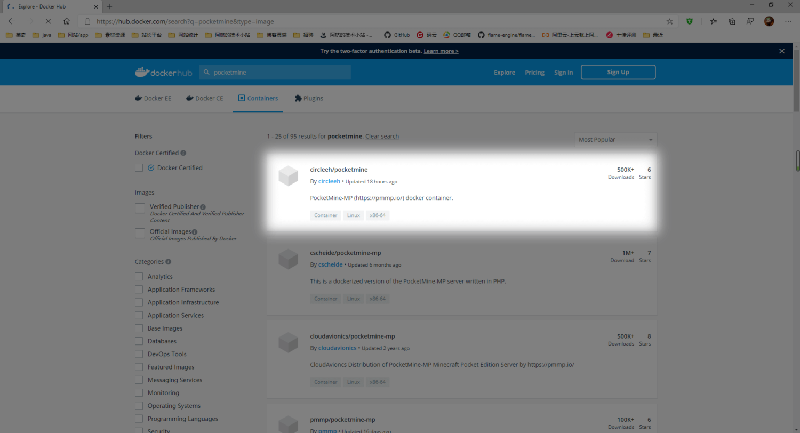
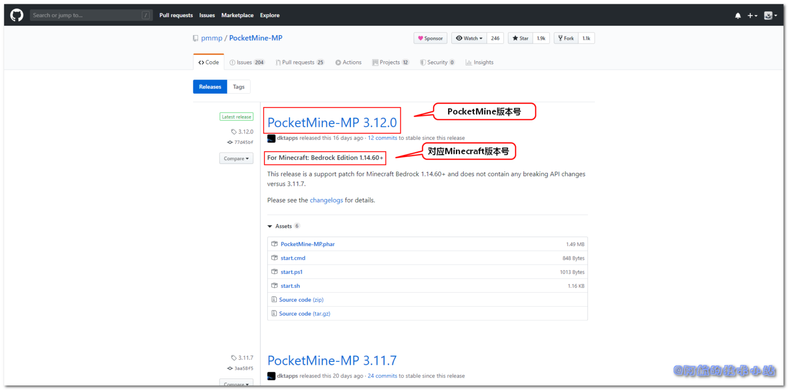
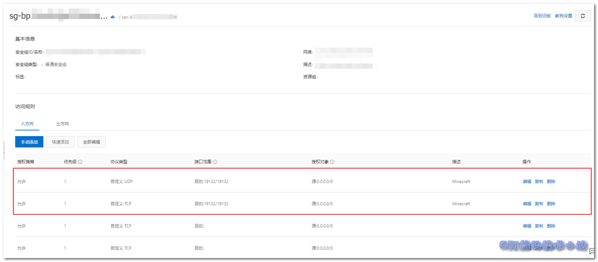

国内的某易代理简直是太好(la)用(ji)了. 这不最近想重拾一下青春.. 下载, 并打开国服 我的世界 Minecraft , 好家伙, 占了1g多的手机存储, 材质光影资源短缺, 界面卡到爆😓  
回头一看官方版, 包大小只有98m.. 作为一个7年的MC老玩家简直不能忍! 回想起很久之前自己开服, 现在又掌握了Docker容器技术, 尝试一下自己开服.

## 需具备的条件

本篇教程针对于以下人群:

- 愿意为Minecraft而折腾的人.
- 了解Docker基本用法, 如果你对Docker还不太熟悉, 可以阅读[Docker官方文档](https://www.docker.com/)、[Docker菜鸟教程](https://www.runoob.com/docker/docker-tutorial.html)等.
- 拥有自己的云服务器(阿里云等).
- 了解常见终端语法.

## 使用PocketMine

在[Docker Hub](https://hub.docker.com/)中搜索关键字: `pocketmine`, 可以看到有好多相关镜像.

> 在选型中, 我们一般会选用活跃度高一些的镜像. 也就是"没凉"的镜像. 长时间不维护的镜像可能出现无法快速解决的Bug等!

途中最新的镜像距文章编写时间只有18个小时, 已经非常活跃了, 所以选用这个!



点击, 进入[circleeh/pocketmine详情页](https://hub.docker.com/r/circleeh/pocketmine).

## 拉取镜像

### 选取版本

这里一定要注意选择合适的版本, 若版本不兼容则会无法加入至服务器, 先来看一下自己的Minecraft版本号, 再去[这个Github网址](https://github.com/pmmp/PocketMine-MP/releases)对照自己的版本!

打开[官方Github Release网址](https://github.com/pmmp/PocketMine-MP/releases), 可以看到:



如你所见, 大标题后面的是PocketMine版本号, 下面的副标题是对应的Minecraft版本号.

回到[circleeh/pocketmine详情页](https://hub.docker.com/r/circleeh/pocketmine), 点击Tags:


看到这个页面:


如图所示, Image标签包含版本号, 后面对应了其拉取镜像的命令.

### 拉取镜像

**确认版本号后**, 进行拉取. 本文以`3.11.7-1792`版本为例, 在终端中输入:

```
docker pull circleeh/pocketmine:3.11.7-1792
```

等待拉取完毕.

### 启动容器

接下来就是启动容器了, 先来看一下命令(下方有对应的说明):

```
docker run --name=pocketmine \
  -v /usr/local/PocketMine-Docker/config:/config \
  -e PGID=0 -e PUID=0 \
  -e TZ=Asia/Shanghai \
  -p 19132:19132 \
  -p 19132:19132/udp \
  -p 25575:25575 \
  circleeh/pocketmine:3.11.7-1792
```

| 命令 | 解释 |
| --- | --- |
| \--name=pocketmine | 为容器起名 |
| \-v /usr/local/PocketMine-Docker/config:/config | 将配置文件映射至宿主机(也就是你运行docker的主机) |
| \-e PGID=0 -e PUID=0 | 在终端中输入`id <运行docker的用户>`, 比如你使用root运行的docker, 那么就输入`id root`. 终端会展示你的`PGID`以及`PUID` |
| \-e TZ=Asia/Shanghai \\ | 时区, 中国一般选`Asia/Shanghai`. 若你在其他地区就改为你的所在地! |
| \-p 19132:19132 \\  
\-p 19132:19132/udp \\  
\-p 25575:25575 \\ | 映射端口, Minecraft通常为19132, 下面的udp映射也不要落下! |
| circleeh/pocketmine:3.11.7-1792 | 我们所使用的镜像名 |

修改为自己的配置后, 启动.

## 开启云服务器外部端口

别急, 还没完呢! 你还需要去云服务器开启你的端口! 这里以阿里云为例:

开启两个端口:  
1\. UDP 19132/19132 (也就是你docker开启映射的端口)  
2\. TCP 19132/19132 (同上)



## 关闭白名单

因为容器默认开启了白名单限制, 不在白名单内的IP将会被禁止进入. 所以我们来进入上面的配置映射目录`/usr/local/PocketMine-Docker/config`(如果你和文章不一致则修改为你自己设置的):

```
cd /usr/local/PocketMine-Docker/config
```

输入命令, 修改服务参数:

```
vim etc/server.properties
```

找到:

```
white-list=on
```

改为:

```
white-list=off
```

重启容器.

## 开始游戏

如果上述操作没有问题, 就可以打开我的世界, 输入云服务器IP及端口, 开始愉快的游戏了!

## 更多的服务器参数

因为服务器可以控制的参数过多且PocketMine更新过快, 所以请大家访问[官方配置文档](https://pmmp.readthedocs.io/en/rtfd/configuration.html)以进行额外的配置!

## 感谢

- [**PocketMine官方**](http://www.pocketmine.net/)
- **Docker上[circleeh](https://hub.docker.com/u/circleeh)的[pocketmine镜像](https://hub.docker.com/r/circleeh/pocketmine)**
- **[Pexels](https://www.pexels.com/zh-cn/photo/3815722/?utm_content=attributionCopyText&utm_medium=referral&utm_source=pexels) 上的 [bongkarn thanyakij](https://www.pexels.com/zh-cn/@bongkarn-thanyakij-683719?utm_content=attributionCopyText&utm_medium=referral&utm_source=pexels) 拍摄的照片**
