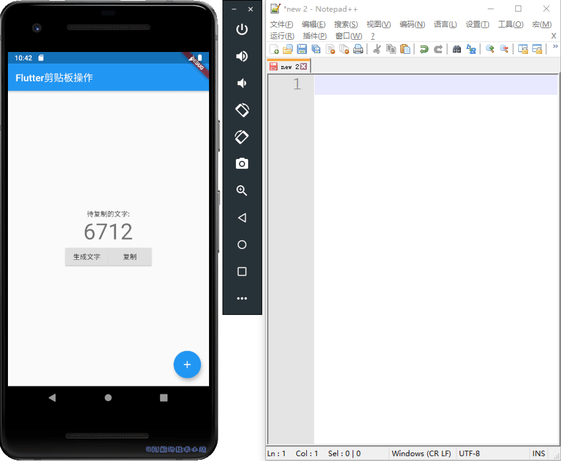
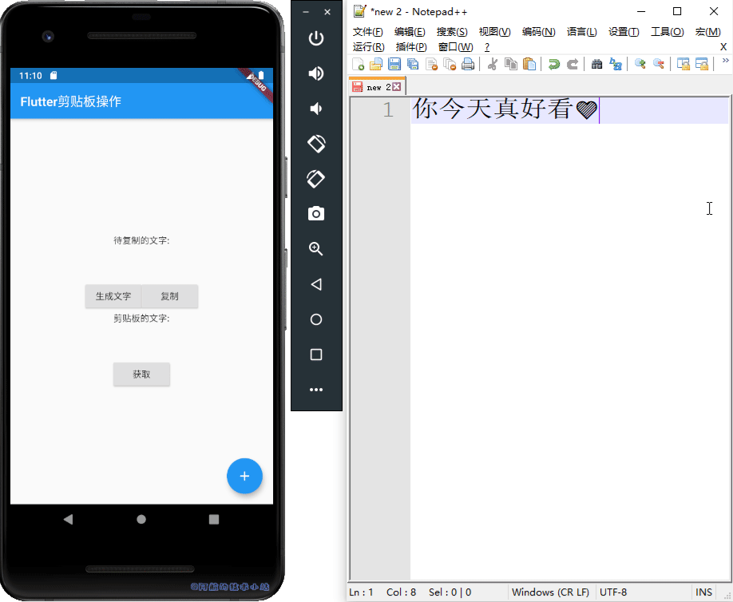
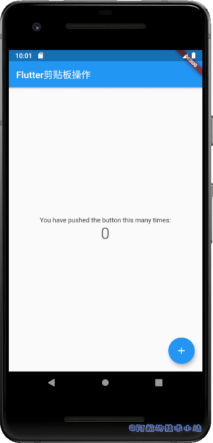
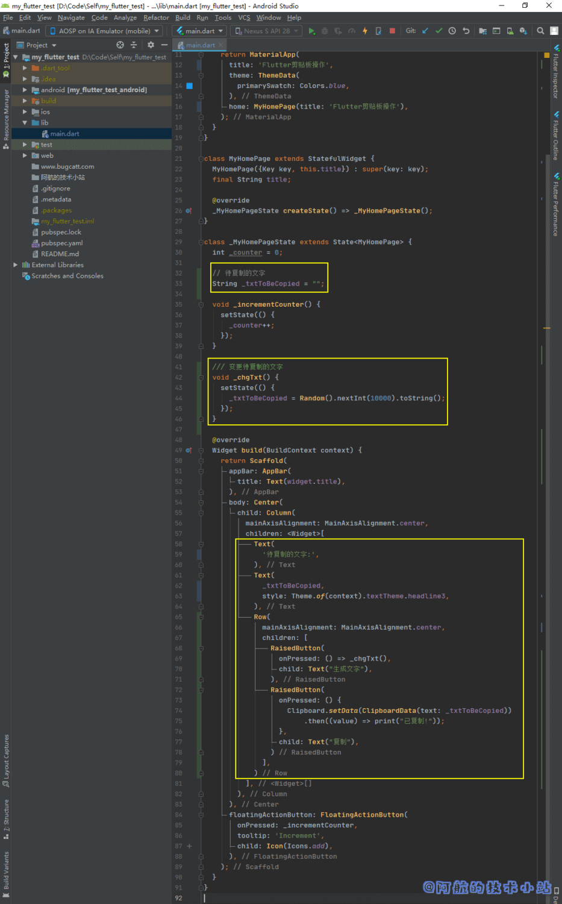

我们在使用Flutter进行开发时, 有时会使用类似"复制本段文字"的功能. 为了提升用户体验, 我们不希望用户长按文字, 再自行复制, 我们希望提供一个按钮直接点击复制, 甚至自动复制! 反之从剪贴板获取也一样.

## 效果

有图有真相, 不说废话, 直接展示最终效果:

#### 复制到剪贴板



#### 从剪贴板获取(粘贴)



\[epcl\_box type="information"\]如果你了解阿航的技术小站, 应该会知悉每篇文章都会提供相当详细且完整的源码. \[/epcl\_box\]

## 应用场景

### 复制到剪贴板

1. 生成了运单号, 需要用户进行保存;
2. 某些微商APP需要复制文案, 发布朋友圈;
3. 文学类APP中, 发现一段非常好的句子, 想发给好友.

### 从剪贴板中获取

1. 直接填入用户复制的短信验证码.
2. 淘宝分享的东西, 复制后打开淘宝APP.

\[epcl\_box type="information"\]当然, 以上只是举了几种例子, 还有更多可以提升用户操作体验的实例在此不过多举例了, 直接开始.\[/epcl\_box\]

## 实战开始

### 初始化Flutter项目

创建Flutter项目, 清理一下`./lib/main.dart`:

```
import 'package:flutter/material.dart';

void main() => runApp(MyApp());

class MyApp extends StatelessWidget {
  @override
  Widget build(BuildContext context) {
    return MaterialApp(
      title: 'Flutter剪贴板操作',
      theme: ThemeData(
        primarySwatch: Colors.blue,
      ),
      home: MyHomePage(title: 'Flutter剪贴板操作'),
    );
  }
}

class MyHomePage extends StatefulWidget {
  MyHomePage({Key key, this.title}) : super(key: key);
  final String title;

  @override
  _MyHomePageState createState() => _MyHomePageState();
}

class _MyHomePageState extends State {
  int _counter = 0;

  void _incrementCounter() {
    setState(() {
      _counter++;
    });
  }

  @override
  Widget build(BuildContext context) {
    return Scaffold(
      appBar: AppBar(
        title: Text(widget.title),
      ),
      body: Center(
        child: Column(
          mainAxisAlignment: MainAxisAlignment.center,
          children: [
            Text(
              'You have pushed the button this many times:',
            ),
            Text(
              '$_counter',
              style: Theme.of(context).textTheme.headline4,
            ),
          ],
        ),
      ),
      floatingActionButton: FloatingActionButton(
        onPressed: _incrementCounter,
        tooltip: 'Increment',
        child: Icon(Icons.add),
      ),
    );
  }
}
```

运行下项目, 应该空空如也:



### 复制到剪贴板

先来做"复制到剪贴板"的功能.

在`_MyHomePageState`中定义一个实例变量`_txtToBeCopied`:

```
// 待复制的文字
String _txtToBeCopied = "";
```

> 💡 该变量用于存储待复制的文字

为了更直观的展现, 我们来定义一个函数`_chgTxt()`, 用于替换待复制的文字, 先导入:

```
import 'dart:math';
```

再在`_MyHomePageState`定义函数:

```
/// 变更待复制的文字
void _chgTxt() {
  _txtToBeCopied = Random().nextInt(10000).toString();
}
```

> 💡 代码解析: 我们使用了`dart:math`库中的`Random`对象, 并生成10000以内的随机数. 这样每次调用该函数时, 待复制的文字都会被替换为新的数字!

我们要把待复制的文字显示出来, 替换:

```
Text(
  'You have pushed the button this many times:',
),
Text(
  '$_counter',
  style: Theme.of(context).textTheme.headline4,
),,
```

为:

```
Text(
  '待复制的文字:',
),
Text(
  _txtToBeCopied,
  style: Theme.of(context).textTheme.headline3,
),
```

> 💡 我们在第一个`Text`中给出了文字提示, 在第二个`Text`中展示了待复制的文字`_txtToBeCopied`变量值.

导入:

```
import 'package:flutter/services.dart';
```

紧接着我们来定义一个按钮, 分别用于"生成文字"和"复制". 在第二个`Text`下面添加:

```
Row(
  mainAxisAlignment: MainAxisAlignment.center,
  children: [
    RaisedButton(
      onPressed: () => _chgTxt(),
      child: Text("生成文字"),
    ),
    RaisedButton(
      onPressed: () {
        Clipboard.setData(ClipboardData(text: _txtToBeCopied))
            .then((value) => print("已复制!"));
      },
      child: Text("复制"),
    )
  ],
),
```

> 💡 代码解析: 这段代码我们添加了两个按钮, 第一个"生成文字"按钮用于调用`_chgTxt()`, 用于生成随机的数字.  
> 第二个"复制"按钮就是我们的重点, 将生成的文字复制.

代码截图:



\[epcl\_box type="success"\]运行项目, 如果代码没有问题, 你应该可以成功复制! 效果:\[/epcl\_box\]


### 获取剪贴板内容(粘贴)

做完了复制到剪贴板, 我们来做相反的操作, 那就是从剪贴板中获取.

定义一个实例变量`_txtToBePaste`(在`_txtToBeCopied`下方), 用于保存粘贴的文字方便后续展示:

```
// 用于展示粘贴的文字
String _txtToBePaste = "";
```

在刚才的两个按钮下面(`Row`下面)添加几个widget:

```
Text(
  '剪贴板的文字:',
),
Text(
  _txtToBePaste,
  style: Theme.of(context).textTheme.headline3,
),
RaisedButton(
  onPressed: () {
    Clipboard.getData(Clipboard.kTextPlain).then((value) {
      if (value != null) {
        _txtToBePaste = value.text;
        setState(() {});
      }
    });
  },
  child: Text("获取"),
),
```

> 💡 代码解析: 我们的重点是在`Clipboard.getData()`上, 我们通过此函数就可以获取剪贴板的内容. 并通过`value.text`获取其`String`类型的值.

\[epcl\_box type="success"\]再次运行项目, 如果代码没有问题, 应该可以达到我们的效果了!\[/epcl\_box\]


### 源码下载

本篇文章的全部源码:

```
import 'dart:math';

import 'package:flutter/material.dart';
import 'package:flutter/services.dart';

void main() => runApp(MyApp());

class MyApp extends StatelessWidget {
  @override
  Widget build(BuildContext context) {
    return MaterialApp(
      title: 'Flutter剪贴板操作',
      theme: ThemeData(
        primarySwatch: Colors.blue,
      ),
      home: MyHomePage(title: 'Flutter剪贴板操作'),
    );
  }
}

class MyHomePage extends StatefulWidget {
  MyHomePage({Key key, this.title}) : super(key: key);
  final String title;

  @override
  _MyHomePageState createState() => _MyHomePageState();
}

class _MyHomePageState extends State {
  int _counter = 0;

  // 待复制的文字
  String _txtToBeCopied = "";

  // 保存粘贴的文字
  String _txtToBePaste = "";

  void _incrementCounter() {
    setState(() {
      _counter++;
    });
  }

  /// 变更待复制的文字
  void _chgTxt() {
    setState(() {
      _txtToBeCopied = Random().nextInt(10000).toString();
    });
  }

  @override
  Widget build(BuildContext context) {
    return Scaffold(
      appBar: AppBar(
        title: Text(widget.title),
      ),
      body: Center(
        child: Column(
          mainAxisAlignment: MainAxisAlignment.center,
          children: [
            Text(
              '待复制的文字:',
            ),
            Text(
              _txtToBeCopied,
              style: Theme.of(context).textTheme.headline3,
            ),
            Row(
              mainAxisAlignment: MainAxisAlignment.center,
              children: [
                RaisedButton(
                  onPressed: () => _chgTxt(),
                  child: Text("生成文字"),
                ),
                RaisedButton(
                  onPressed: () {
                    Clipboard.setData(ClipboardData(text: _txtToBeCopied))
                        .then((value) => print("已复制!"));
                  },
                  child: Text("复制"),
                )
              ],
            ),
            Text(
              '剪贴板的文字:',
            ),
            Text(
              _txtToBePaste,
              style: Theme.of(context).textTheme.headline3,
            ),
            RaisedButton(
              onPressed: () {
                Clipboard.getData(Clipboard.kTextPlain).then((value) {
                  if (value != null) {
                    _txtToBePaste = value.text;
                    setState(() {});
                  }
                });
              },
              child: Text("获取"),
            ),
          ],
        ),
      ),
      floatingActionButton: FloatingActionButton(
        onPressed: _incrementCounter,
        tooltip: 'Increment',
        child: Icon(Icons.add),
      ),
    );
  }
}
```

## 核心代码

### 复制到剪贴板

```
Clipboard.setData(ClipboardData(text: "你要复制的文字"))
    .then((value) => print("已复制!"));
```

这里要注意的是这个是个异步函数, 需要你进行妥善处理.

### 从剪贴板获取

```
Clipboard.getData(Clipboard.kTextPlain).then((value) {
  print(value.text);
});
```

同样是个异步函数, 一定要注意运行顺序的问题哦!

## 问题&解决方案

\[epcl\_toggle show="opened" title="问: 在**导出为Web**项目时, 调用复制功能, 浏览器报错."\]  
答: 一般是浏览器限制的原因, 由**Http更换为Https**试一下.  
\[/epcl\_toggle\]
