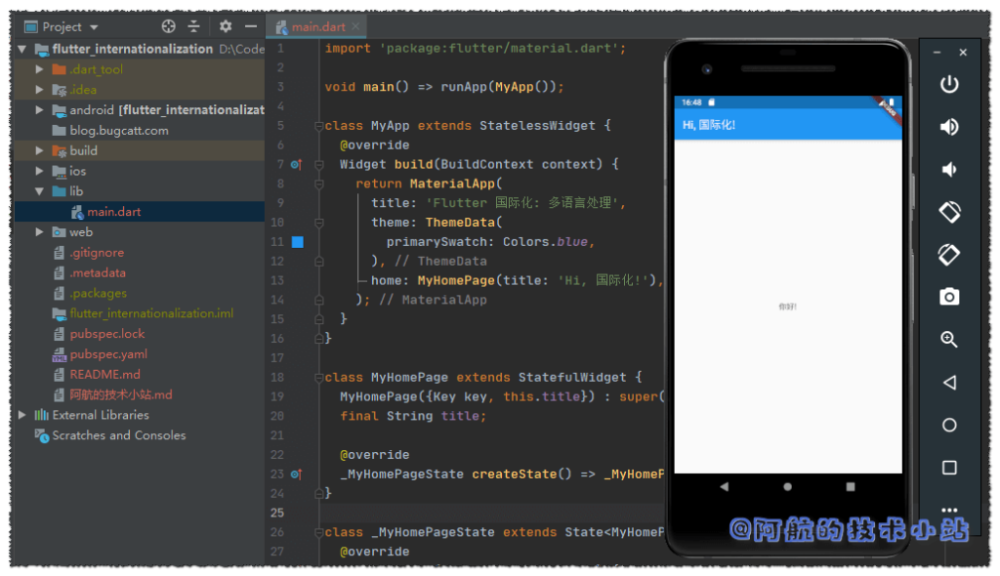
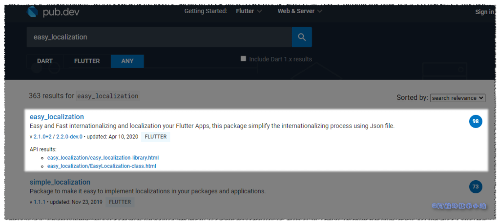
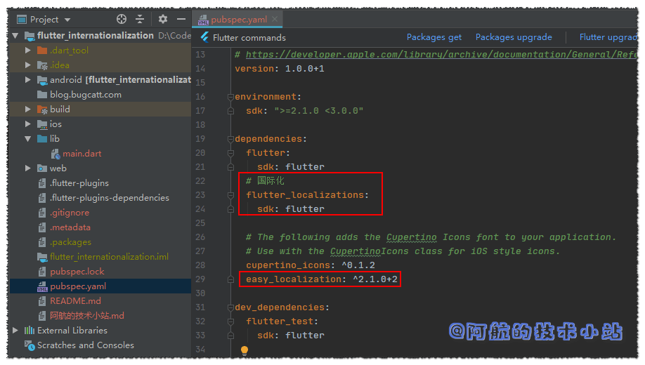
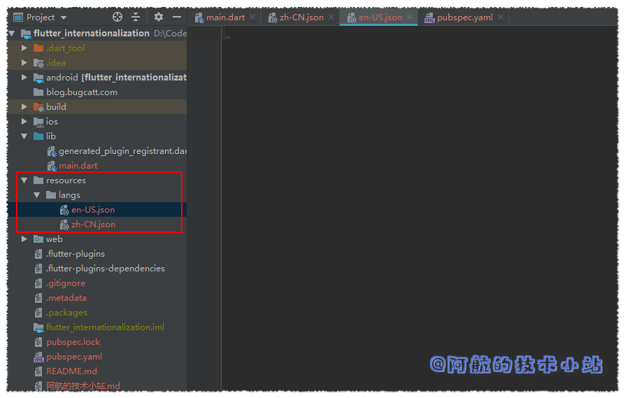
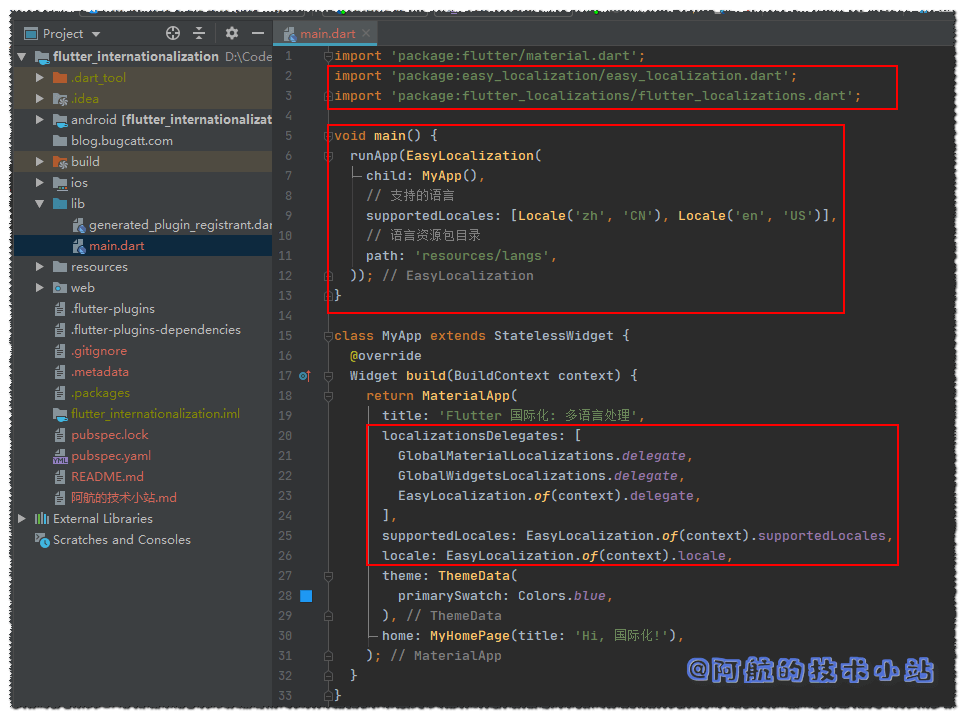
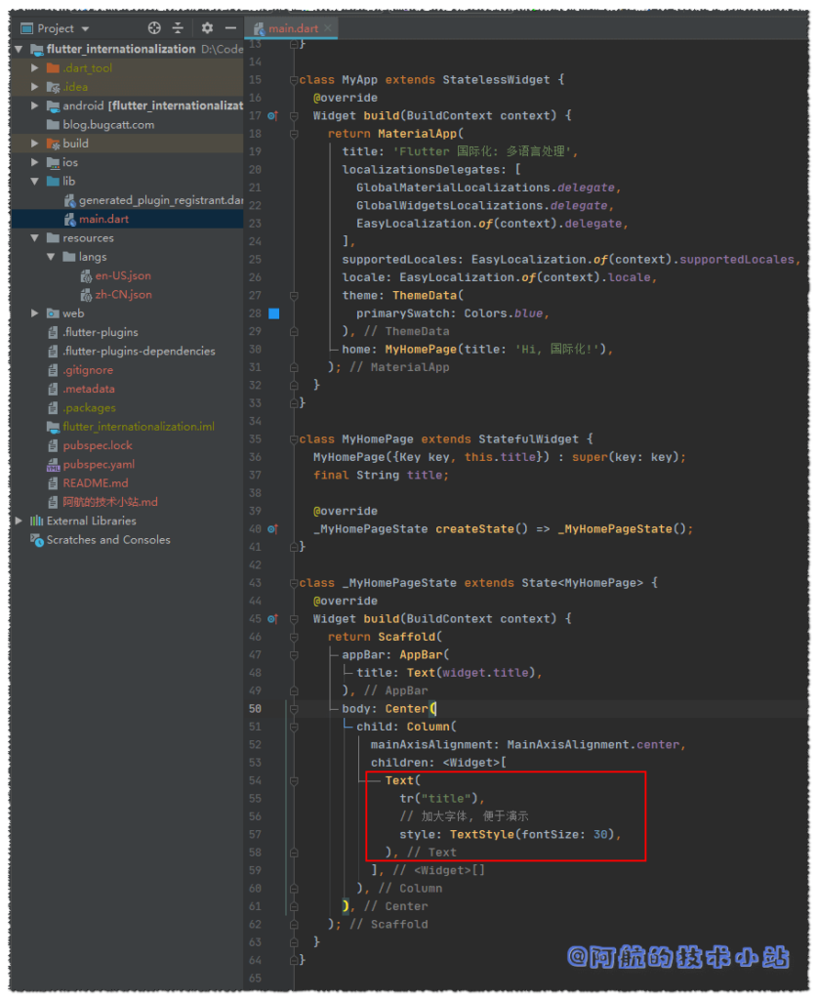
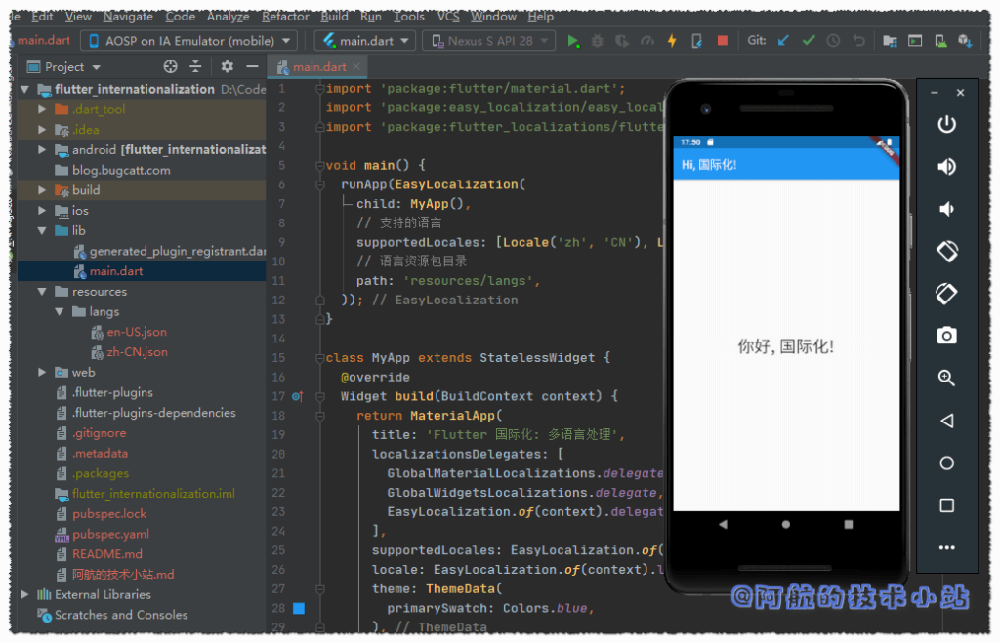

语言不互通是困扰了人类几千年的大难题🤐. 许多国外优秀的文学作品、 APP因为没有进行多国语言的处理, 导致发展缓慢甚至停滞. 虽然现在的各大翻译软件已经非常强大了. 但是想象一下: 一个用户一边拿着翻译机一边使用某个软件. 这样恐怕会逼疯用户, 可能会很快的放弃😭😭.

如果你的APP有相当一部分用户是来自全球各地, 那么对APP的国际化就是刚需💪.

对APP的国际化可以直线提升外国友人用户体验, 顺便会提高你的APP的"逼格", 用最简单的方式给用户一种"你们的APP很大很强"的感觉😏😏😏.

## 最终效果

老规矩, 有图有真相. 先来看看我们最终会实现的效果:


## 需求

在做一个事情之前, 我们先来简单的规划一下, 我们的目标是什么, 我们要怎么做:

1. 提供多种语言处理, 对每部分文本进行单独的翻译.
2. 用户可以随时切换语言

## 开始

### 第一步: 创建Flutter APP

这一步不再赘述, 相当基础的东西啦!

### 第二步: 清理项目

#### 删除测试目录

删除`./lib/test`目录, 因为我们暂时用不上.

#### 清理main.dart

因为新的Flutter项目中的main会给我们很多用不上的代码, 所以进行替换`./lib/main.dart`为:

```
import 'package:flutter/material.dart';

void main() => runApp(MyApp());

class MyApp extends StatelessWidget {
  @override
  Widget build(BuildContext context) {
    return MaterialApp(
      title: 'Flutter 国际化: 多语言处理',
      theme: ThemeData(
        primarySwatch: Colors.blue,
      ),
      home: MyHomePage(title: 'Hi, 国际化!'),
    );
  }
}

class MyHomePage extends StatefulWidget {
  MyHomePage({Key key, this.title}) : super(key: key);
  final String title;

  @override
  _MyHomePageState createState() => _MyHomePageState();
}

class _MyHomePageState extends State {
  @override
  Widget build(BuildContext context) {
    return Scaffold(
      appBar: AppBar(
        title: Text(widget.title),
      ),
      body: Center(
        child: Column(
          mainAxisAlignment: MainAxisAlignment.center,
          children: [
            Text(
              '你好!',
            ),
          ],
        ),
      ),
    );
  }
}
```

🟢 运行项目, 应该如图所示:



### Easy localization

在pub仓库中寻觅了许久, 最终本篇博客选用了**Easy localization** 作为我们的国际化库.

先来看一下它在pub的评分:



嗯...高达98分. 在严格的pub评分下获得这样的分数🧐, 说明这个框架在各方面都相当优秀.

#### 修改pubspec.yaml

为flutter加入国际化支持, 并引入我们上面说的第三方库`easy_localization`. 添加高亮的代码:

```
dependencies:
  flutter:
    sdk: flutter
  # 国际化
  flutter_localizations:
    sdk: flutter

  # The following adds the Cupertino Icons font to your application.
  # Use with the CupertinoIcons class for iOS style icons.
  cupertino_icons: ^0.1.2
  easy_localization: ^2.1.0+2
```

代码截图:



别忘了要运行一下`Packages get`以更新依赖!

### 创建翻译文件

我们必须为翻译文件提供一个目录(文件夹). 比如:

```
/assets/langs
/assets/i18n
/assets/locale
/resources/langs
/resources/i18n
/resources/locale
...
```

我们来创建目录`./resources/langs`

文件的命名规则必须是:

```
目录/${语言码}-${国家码}.json
```

> [点击这里](https://api.flutter-io.cn/flutter/flutter_localizations/GlobalMaterialLocalizations-class.html)查看所有的国家码

在里面创建两个json文件: `zh-CN.json`以及`en-US.json`. 两个文件将分别存储中文及英文的语言包.



为了让Flutter识别到这两个文件, 修改`pubspec.yaml`, 在下面添加资源文件:

```
flutter:
  assets:
    - resources/langs/zh-CN.json
    - resources/langs/en-US.json
```

运行`Packages get`.

> 🟡 提示: 如果报错, 请检查格式、文件目录、文件名是否有误!


回到`./lib/main.dart`, 先导入:

```
import 'package:easy_localization/easy_localization.dart';
```

替换`main()`为:

```
void main() {
  runApp(EasyLocalization(
    child: MyApp(),
    // 支持的语言
    supportedLocales: [Locale('zh', 'CN'), Locale('en', 'US')],
    // 语言资源包目录
    path: 'resources/langs',
  ));
}
```

仍然在`./lib/main.dart`, 导入:

```
import 'package:flutter_localizations/flutter_localizations.dart';
```

在`MyApp`类的`build`函数的return中, title参数下方添加:

```
  localizationsDelegates: [
    GlobalMaterialLocalizations.delegate,
    GlobalWidgetsLocalizations.delegate,
    EasyLocalization.of(context).delegate,
  ],
  supportedLocales: EasyLocalization.of(context).supportedLocales,
  locale: EasyLocalization.of(context).locale,
```

这部分的代码截图:



我们已经准备好使用多语言了! 是不是很快? 我们来添加翻译条目:

修改`zh-CN.json`:

```
{
    "title":"你好, 国际化!"
}
```

修改`en-US.json`:

```
{
    "title":"Hello, internationalization!"
}
```

接下来就是使用了, 回到`./lib/main.dart`,

修改

```
Text(
  '你好!',
),
```

为:

```
Text(
  tr("title"),
  // 加大字体, 便于演示
  style: TextStyle(fontSize: 30),
),
```

代码截图:



> 💡 代码解析: 可能聪明的你已经猜到了: `tr()`传入的字符串刚好对应我们的翻译文件的json. 我们在json中定义了`title`, 后面的翻译将会被`tr()`所返回.



接下来就是处理修改语言了.

在`build()`内定义函数:

```
/// 修改语言函数
void showChangeLanguageDialog(){
  showDialog(context: context, builder: (BuildContext context){
    return SimpleDialog(
      title: Text("Language"),
      children: [
        SimpleDialogOption(
          child: Text("中文"),
          onPressed: (){
            EasyLocalization.of(context).locale = Locale('zh', 'CN');
            Navigator.pop(context);
          },
        ),
        SimpleDialogOption(
          child: Text("English"),
          onPressed: (){
            EasyLocalization.of(context).locale = Locale('en', 'US');
            Navigator.pop(context);
          },
        )
      ],
    );
  });
}
```

> 💡 代码解析: 这里使用了Flutter的`showDialog`函数, 它可以弹出一个窗口并提供几个按钮供用户点击. 我们在其中有两个选项, 一个为中文, 一个为英文.
> 
> 通过变更`EasyLocalization.of(context).locale`的值从而修改语言.  
>   
> 修改语言后使用`Navigator.pop(context);`来退出弹框.

我们还需定义一个按钮, 用来触发弹窗. 在`Scaffold`的`AppBar`中添加:

```
    return Scaffold(
      appBar: AppBar(
        title: Text(widget.title),
        actions: [
          IconButton(icon: Icon(Icons.language), onPressed: ()=>showChangeLanguageDialog(),)
        ],
      ),
```

> 💡 代码解析: 在操作区添加一个`IconButton`, 点击后触发上面定义的弹窗函数`showChangeLanguageDialog`

## 搞定!

🟢 运行项目, 效果应该是这样的:


## 感谢

- pub.dev [官方地址](https://pub.flutter-io.cn/packages/easy_localization#-readme-tab-)
- [Easy Localization官方Github](https://github.com/aissat/easy_localization)
- **[Pexels](https://www.pexels.com/zh-cn/photo/87009/?utm_content=attributionCopyText&utm_medium=referral&utm_source=pexels)** 上的 **[Pixabay](https://www.pexels.com/zh-cn/@pixabay?utm_content=attributionCopyText&utm_medium=referral&utm_source=pexels)** 拍摄的照片
