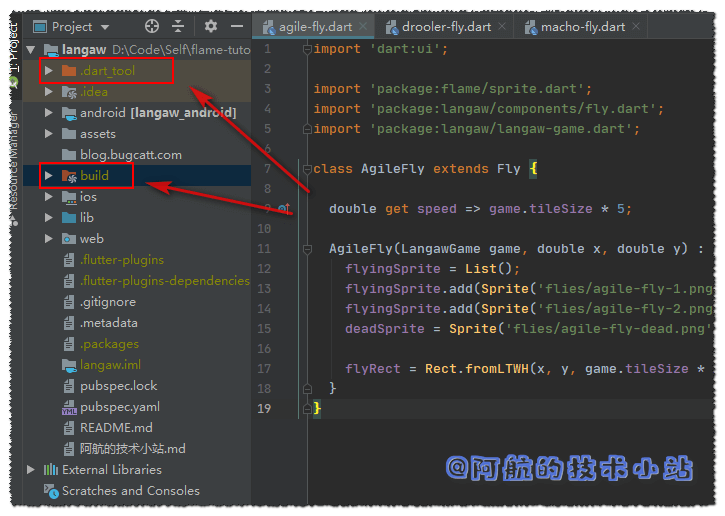
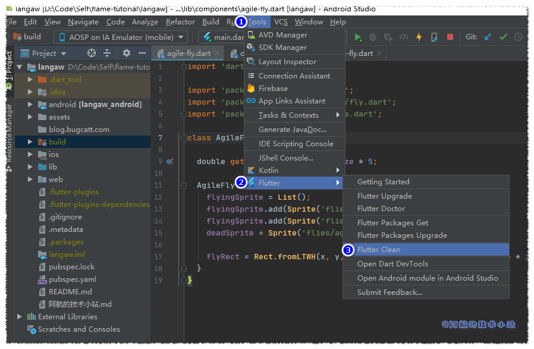

在使用Flutter进行开发时, 经常会产生很多的编译缓存文件, 比如:



这样可以加快下次的编译速度. 但有时会出现一些我们神奇的报错, 很有可能是缓存不兼容所造成的! 有时出现的无解bug, 重启一下IDE或模拟器, 清理一下缓存就会被解决... 别问, 问就是阿航踩过好几次坑😢😢😢😢

这一篇就会讲如何清理flutter的编译缓存. (不是APP的数据缓存, 别弄混!)

## 方法一: IDE自带清理按钮

这里拿官方推荐的`Android Studio`举例:



## 方法二: 使用命令行清理

使用终端(cmd)进入项目目录.

输入清理命令:

```
flutter clean
```

## 清理完成

清理完成后, 可以看到之前的`.dart_tool`以及`build`目录被清理干净, 下次编译会从0开始. 也可能顺便解决你的一些未知bug😜

## 结语

本篇文章来自[阿航的技术小站](/)

对文章有任何问题, 欢迎在下方评论区进行讨论. 阿航会尽力回复.
