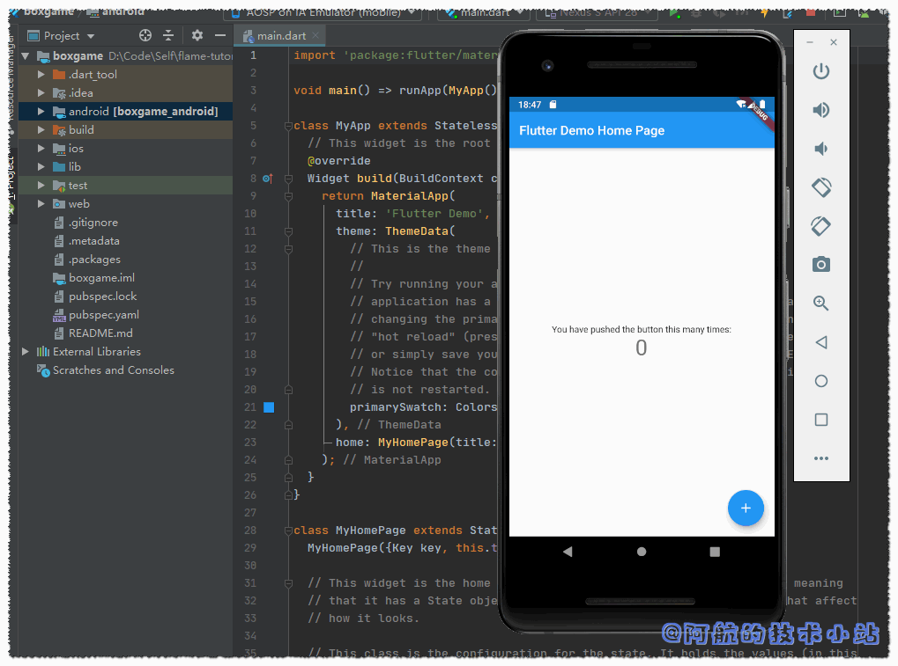
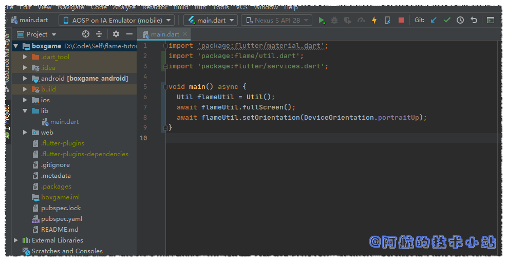
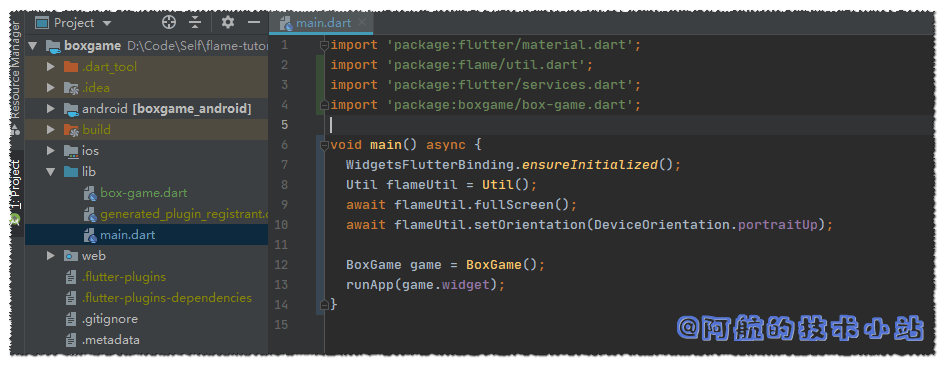
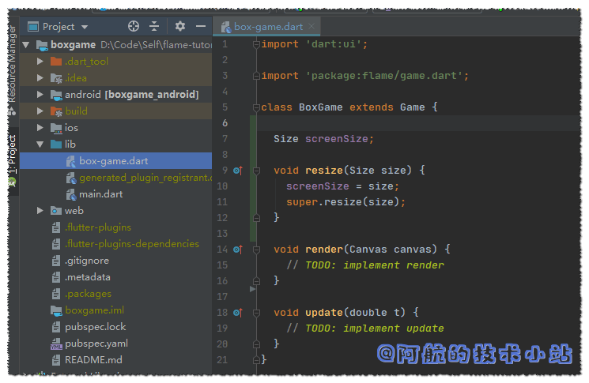
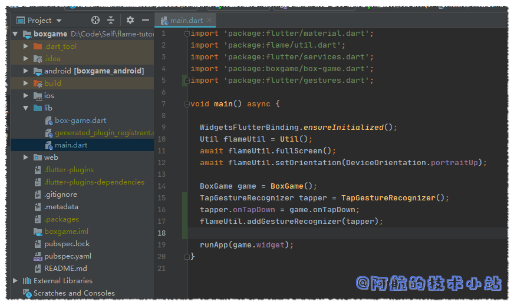
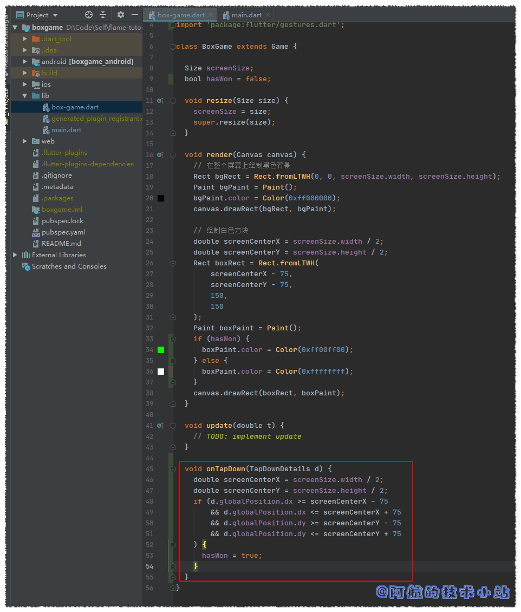

如果你对Flutter有一定的了解, 那么应该知道它可以同时转为Android、IOS APP. 并且会在后续的版本支持Web、Mac以及Windows设备.

那么, 用Flutter开发游戏似乎是一件很棒的事情😝😝.

> 我在《[Flutter可以开发游戏啦! Flame游戏开发框架测评](https://www.bugcatt.com/archives/4)》中简单的对Flutter的Flame框架进行了测评.

有些朋友希望进一步在Flutter上发展, 并且创建属于自己的游戏. 若你是这一类人, 那么本博客应该是你不错的选择. 本教程将会把重心放在概念上, 而不是立刻制作一个精美、可上线的游戏.

如果对博客有任何问题, 欢迎在下方留言, 阿航会尽力、尽快回复🙂.

## 开发环境

本博客的环境一览:

| 环境 | 版本号 |
| --- | --- |
| Flutter | 1.14.6 beta |
| Dart | 2.8.0-dev.5.0 |
| Android Studio | 3.5.2 |

🔴注意: 检查你的环境和文中的差异, 以避免出现不兼容的情况

## 需具备的条件

本文将假设您已是一名有一定经验的开发人员, 且拥有了"程序员思维". 如果你是小白, 没关系! 本篇教程非常入门. 只要兴趣足够, 你也将成为一名"游戏开发者".

你也需要一个配置足够的电脑, 可以运行IDE、编译并运行Android模拟器. 如果你的电脑配置不够高, 你也可以直接连接Android手机, 在真机上运行和调试.

Flutter可以同时构建Android和IOS APP. 本文将围绕Android进行开发. 开发完成后, 你可以运行不同的build, 使你也可以在IOS上玩游戏.

要顺利阅读本文, 假定您已经具备以下条件:

1. IDE (Android Studio 或者 Microsoft Visual Studio), 以及其所需的Flutter和dart插件
2. Android SDK. 这是开发Android应用的必备条件.
3. Flutter SDK. 本篇将使用Flutter以及Flame进行游戏开发. 请阅读[Flutter官方文档](https://flutterchina.club/get-started/install/), 完成圈内的教程

<figure>


<figcaption>

条件3: 完成Flutter官方文档中的前三步

</figcaption>

</figure>

* * *

## 手游制作开始

我们将会从入门开始教学(非常简单). 我们要制作的游戏为黑色背景, 中间有一个白色方块, 点击方块, 方块颜色将变为绿色并获得游戏胜利.

我们不会为此游戏使用任何外部的资源文件(图片)

本教程的全部代码都将存储在Github以及Gitee上, 你可以随时查看和下载.

## 创建一个Flutter APP

### 创建Flutter项目:boxgame

打开终端(CMD/命令提示符), 输入:

```
flutter create boxgame
```

你也可以使用除boxgame外其他的名称. 但确保将所有boxgame替换为你自己的名称.

### 运行boxgame

使用你的IDE打开刚生成的boxgame目录, 或者输入以下命令立刻运行你的APP:

```
cd boxgame
```

```
flutter run
```

首次运行新创建的应用可能需要一段时间, 当APP运行时, 应该看到如下内容:



> 🟡提示: 你需要使用安卓模拟器, 或者启用了USB调试的安卓设备运行APP

### 本步骤代码(创建Flutter APP)

在[Github](https://github.com/HarrisonQi/flame-tutorial-boxgame/tree/6d6d957f6a412e62a3571546315fdda91c62ee4f)或[码云](https://gitee.com/HarrisonQI/flame-tutorial-boxgame/tree/6d6d957f6a412e62a3571546315fdda91c62ee4f)查看本阶段的代码.

## 安装Flame插件, 清理代码

> 🟡提示: 从现在开始, 我们将项目目录称为 `./`.  
> 比如你的项目目录为`/home/handsomeme/boxgame`,  
> `./lib/main.dart`则是指`/home/handsomeme/boxgame/lib/main.dart`

启动你的IDE, 打开我们创建的boxgame项目.

我们即将使用**Flame**插件, 所以我们需要将其添加到依赖中. 找到 `./pubspec.yaml` 在`cupertino_icons`下添加以下行(注意缩进):

```
flame: ^0.18.1
```

<figure>


<figcaption>

添加flame第三方库

</figcaption>

</figure>

🟢进行 `packages get`

> 🟡提示: 如果你的IDE是VSCode,IDE会在你保存文件时自动安装第三方库. Android Studio: 点击上方的`packages get`按钮进行包更新. 其他情况: 在终端中输入`flutter packages get`进行包更新
> 
> 后续的`packages get`将不再赘述!

我们接下来清理flutter的预设文件内容, 替换`./lib/main.dart`为:

```
import 'package:flutter/material.dart';

void main() {}
```

> 💡 可以看到我们只留了一行: void main() {}, 除此之外保留了import语句, 因为我们后面将会使用material.

代码截图:


我们同样需要删除`./test`目录, 因为我们暂时用不上.

### 本步骤代码(安装Flame及清理代码)

在[Github](https://github.com/HarrisonQi/flame-tutorial-boxgame/tree/e0dc1d271aa5f3ad4ff26a92d591d044a4e1ef86)或[码云](https://gitee.com/HarrisonQI/flame-tutorial-boxgame/tree/e0dc1d271aa5f3ad4ff26a92d591d044a4e1ef86)查看本阶段的代码.

## 创建game loop(游戏循环)

### 何为game loop?

game loop是一款游戏的本质, 一组反复运行的代码.

有一个很常见的叫法:**FPS**. 它代表每秒的帧数, 这意味着, 若你的游戏是60fps, 那么game loop将在每秒循环60次!

简而言之: 一帧 = 一次game loop

一个基本的game loop由两部分组成, `update`(更新)和`render`(渲染)

这里引用了官方的图片, 阿航对此进行了翻译, 便于各位理解:


update部分用于处理对象(比如玩家的角色, 敌人, 障碍物, 地图)和其他需要更新的东西(比如计时器)的动作. 大多数动作都会在这里发生. 比如计算敌人是否被子弹打中, 或计算敌人是否碰到了玩家角色(玩家通常会不喜欢的🤣).

### 渲染前同步执行代码

渲染部分在屏幕上绘制所有对象, 这是一个独立的进程, 因此所有内容都可以synchronized(同步/顺序)进行.

那么, 为何需要synchronized?  
如果你了解前端开发, 应该会很快了解. 前端的大部分动作都是asynchronous(异步)进行的. 但是到需要强调运行顺序(比如调用网络接口, 获取数据后再渲染)时, 就需要synchronized进行.

我们需要先计算所有需要计算的内容, 计算完成后, 再渲染屏幕.

### 使用Flame替我们处理同步✌

**Flame**框架已经有处理同步的代码, 所以我们只需要专注于update以及render的过程!

### 全屏处理/锁定屏幕旋转

在首行导入:

```
import 'package:flame/util.dart';
import 'package:flutter/services.dart';
```

在`main()`中, 创建一个`Flame`的`Util` class. 调用它的`fullscreen`和`setOrientation`函数, 并加上`await`关键字, 让其同步进行.

```
WidgetsFlutterBinding.ensureInitialized();
Util flameUtil = Util(); 
await flameUtil.fullScreen(); 
await flameUtil.setOrientation(DeviceOrientation.portraitUp);
```

> 🟡提示: Future、async和await都是你在一个进程中, 需要等待某函数完成的关键字, 但不会阻塞其他进程. 如果你想详细了解, 可以访问[Dart官网](https://www.dartlang.org/tutorials/language/futures)

除此以外, 我们还需要为main()添加asyn关键字, 使内部的函数同步进行:

```
void main() async {
```

代码截图:



### 创建game loop

若要使用Flame提供的game loop脚手架, 我们必须创建Flame的`Game`类的子类. 为此, 在 `./lib`下创建名为`box-game.dart`的文件.

创建一个名为`BoxGame`的class, 并继承`flame`的Game:

```
import 'dart:ui';

import 'package:flame/game.dart';

class BoxGame extends Game {
  void render(Canvas canvas) {
    // TODO: implement render
  }

  void update(double t) {
    // TODO: implement update
  }
}
```

> 💡 代码解析: 首先导入Dart的`ui`库, 以便使用`Canvas`类, 然后再使用`Size`类. 然后我们导入Flame的`game`库, 其中包括我们要扩展的`Game类`. 其他就是我们从父类(或超类)中继承的两个函数: `update()`和`render()`. 这些函数会覆盖同名的父类函数(也就是重写).

🟡 `@override`注解在Dart 2中不是必需的. new 关键字也是非必须的.  
所以我们在这里没有写出来.

### 完成游戏骨架

下一步就是来创建`BoxGame`的类实例, 并将其`widget`属性传递给`runApp`.

返回`./lib/main.dart`, 在文件顶部导入:

```
import 'package:boxgame/box-game.dart';
```

> 💡 代码解析: 该行确保可以在**main.dart**中使用**BoxGame**类.

接下来创建`BoxGame`的类实例, 并将其`widget`属性传递给runApp(). 在`main()`中的末尾(在"}"前)插入:

```
BoxGame game = BoxGame();
runApp(game.widget);
```

某些版本直接运行会报错`Unhandled Exception: ServicesBinding.defaultBinaryMessenger was accessed before the binding was initialized.`

所以在main()首行添加:

```
WidgetsFlutterBinding.ensureInitialized();
```

麻雀虽小, 五脏俱全. 现在**我们的项目可以称之为游戏了**.

如果你尝试运行app, 界面应该是黑色的. 因为我们还没有render任何东西呢!

main.dart代码截图:



### 本步骤代码(game loop)

在[Github](https://github.com/HarrisonQi/flame-tutorial-boxgame/tree/e974dab3d7696c45d5b3a326323c9df59a56b30a)或[码云](https://gitee.com/HarrisonQI/flame-tutorial-boxgame/tree/e974dab3d7696c45d5b3a326323c9df59a56b30a)查看本阶段的代码.

🔴 在新版的Flutter中变更了main(), 若出现问题, 我们可以变更代码行顺序解决这个问题:

```
void main() {
  BoxGame game = BoxGame();
  runApp(game.widget);

  Util flameUtil = Util();
  flameUtil.fullscreen();
  flameUtil.setOrientation(DeviceOrientation.portraitUp);
}
```

> 💡 这样, 就不需要使用await关键字了. 也可以顺便移除async关键字.

## 绘制屏幕

在绘制前, 我们需要知道屏幕的尺寸. Flutter在屏幕上绘制时会使用逻辑像素, 所以目前不必担心调整游戏对象尺寸的大小.

1英寸的设备大约包含96个逻辑像素. 多数主流手机的尺寸类似, 加上我们的游戏比较简单, 所以我们不必担心尺寸的问题.

Flame基于这个尺寸系统上. Game类提供了可供重写的调整尺寸的函数, 此函数接受Size作为参数, 我们根据此参数确定屏幕尺寸(单位是逻辑像素).

首先, 在class中声明一个变量, 此变量(也称作实例变量)将保存屏幕尺寸, 且仅在屏幕尺寸变更时重新赋值(对于我们的游戏仅发生一次). 这也是屏幕上绘制对象的基础. 此变量的类型应该为Size. 与传递给resize()的内容相似:

```
class BoxGame extends Game {
  Size screenSize;
```

> 💡 代码解析: screenSize将被初始化为null. 这么写对后续检查我们是否知道渲染期间屏幕的大小时有帮助. 后面会详细介绍.

接下来在`./lib/box-game.dart`中重写`resize()`:

```
void resize(Size size) {
  screenSize = size;
  super.resize(size);
}
```

> 💡 代码解析1: 父类的resize()实际上是空的, 如果我们不打算完全重写该功能, 需要调用一次父类的函数.

> 💡 代码解析2: 实例变量是可从该类的所有函数中访问的变量. 比如我们可以调整它的大小, 并在render时获取该值.

代码截图:



### Canvas和背景

至此, Game loop已创建完成, 可以开始进行绘制了. 如果不需要更新某些数据, 不用管update函数.

在render函数内部, 我们需要访问Canvas. Flame已经为我们提供了对Canvas的支持.

在绘制canvas时, **记住: 要一直优先绘制最底部的对象.** 后续绘制的对象将覆盖在已有的对象上面.

### 绘制背景

首先我们在屏幕上绘制一个简单的黑色背景.

`render()`中添加:

```
Rect bgRect = Rect.fromLTWH(0, 0, screenSize.width, screenSize.height);
Paint bgPaint = Paint();
bgPaint.color = Color(0xff000000);
canvas.drawRect(bgRect, bgPaint);
```

> 💡 解析: 第1行定义了一个和屏幕同等大小的矩形, 并且边距为0. 第2、3行定义了一个Paint对象, 并且为其分配了16进制且带透明度的颜色. 最后一行使用了在前几行定义的Rect和Paint实例, 并在画布上绘制.

代码截图:


🟢 尝试运行项目, 若你的代码没有问题, 会展示一个全黑的屏幕, 你也可以尝试不同的背景色!

### 绘制target box(目标方块)

仍然在`render()`中. 接下来我们在屏幕中央绘制一个目标方块:

```
double screenCenterX = screenSize.width / 2;
double screenCenterY = screenSize.height / 2;
Rect boxRect = Rect.fromLTWH(
  screenCenterX - 75,
  screenCenterY - 75,
  150,
  150
);
Paint boxPaint = Paint();
boxPaint.color = Color(0xffffffff);
canvas.drawRect(boxRect, boxPaint);
```

> 💡 解析: 前两行通过计算使坐标放在屏幕正中央. 接下来的六行只声明一个大小为150×150像素（逻辑）的矩形，其原点（左上角）位于屏幕中心，但向左偏移75像素，向上偏移75像素.

代码截图:


运行APP, 可以看到中间出现了白色小方块:


### 本步骤代码(绘制屏幕)

在[Github](https://github.com/HarrisonQi/flame-tutorial-boxgame/tree/c2fcacbd3d07be8fb75d41786840d3b947b5c965)或[码云](https://gitee.com/HarrisonQI/flame-tutorial-boxgame/tree/c2fcacbd3d07be8fb75d41786840d3b947b5c965)查看本阶段的代码.

## 处理"用户输入动作"以及"游戏胜利"条件

距完成仅剩一步, 我们只需要处理用户的输入动作. 这里要使用Flutter的gestures包.

### 定义处理用户动作函数

首先, 我们在`lib/box-game.dart`中导入:

```
import 'package:flutter/gestures.dart';
```

之后, 定义一个处理用户按下动作的函数:

```
void onTapDown(TapDownDetails d) {
  // handle taps here
}
```

### 注册GestureRecognizer

进入`lib/main.dart`, 我们需要在其中注册一个`GestureRecognizer`, 并且与我们上面定义的`onTapDown`进行关联.

导入:

```
import 'package:flutter/gestures.dart';
```

在`BoxGame`之后, 定义`TapGestureRecognizer`, 并且指定它的`onTapDown`到我们定义的`onTapDown`处理函数上

```
BoxGame game = BoxGame();
TapGestureRecognizer tapper = TapGestureRecognizer();
tapper.onTapDown = game.onTapDown;
flameUtil.addGestureRecognizer(tapper);
```

代码截图:



### 处理"游戏胜利"

返回`./lib/box-game.dart`

添加一个实例变量, 用于处理"游戏胜利". 一个简单的bool类型就可以, 默认为false:

```
bool hasWon = false;
```

在render函数中, 我们添加一个判断: 若游戏胜利, 方块变为绿色. 反之为白色

```
// 替换掉之前定义的 boxPaint.color = Color(0xffffffff);
if (hasWon) {
  boxPaint.color = Color(0xff00ff00);
} else {
  boxPaint.color = Color(0xffffffff);
}
```


我们来制定游戏规则: 如果用户点击到了方块范围, 则判定为胜利!

在`onTapDown`中添加:

```
double screenCenterX = screenSize.width / 2;
double screenCenterY = screenSize.height / 2;
if (d.globalPosition.dx >= screenCenterX - 75
  && d.globalPosition.dx <= screenCenterX + 75
  && d.globalPosition.dy >= screenCenterY - 75
  && d.globalPosition.dy <= screenCenterY + 75
) {
  hasWon = true;
}
```

> 💡 解析: 这段代码在计算点击位置是否在方格范围内

此时, 如果用户点击了方块范围内, `render`将会更新变量`hasWon`的值

`onTapDown`函数截图:



### 大功告成

我们已经成功的完成了一个游戏! 运行项目, 看看效果吧!

> 💡 觉得这个游戏太简单了? 拜托! 你还只是个新手好吧. 我们后面会有游戏玩法足够丰富的游戏. 等你学会了, 就可以随心所欲开发属于自己的游戏咯!

## 仓库地址

在[Github](https://github.com/HarrisonQi/flame-tutorial-boxgame)或[码云](https://gitee.com/HarrisonQI/flame-tutorial-boxgame)查看本篇文章的全部代码

## 结语

如果你出现了不懂的地方, 不要犹豫, 欢迎在评论区留言! 也欢迎你加入[我的Flame交流群(QQ)](https://jq.qq.com/?_wv=1027&k=5ETLFm3)

## 感谢

- 本章内容灵感部分来源于官方文档[《Create a Mobile Game with Flutter and Flame – Beginner Tutorial》](https://jap.alekhin.io/create-mobile-game-flutter-flame-beginner-tutorial)
- flame [github仓库地址](https://github.com/flame-engine/flame)
- pub.dev [官方网址](https://pub.flutter-io.cn/packages/flame)
- **[Pexels](https://www.pexels.com/zh-cn/photo/1484759/?utm_content=attributionCopyText&utm_medium=referral&utm_source=pexels)** 上的 **[Steve Johnson](https://www.pexels.com/zh-cn/@steve?utm_content=attributionCopyText&utm_medium=referral&utm_source=pexels)** 拍摄的照片

最新、更多、更好的教程/博客/资讯, 欢迎访问我的官网: [阿航的技术小站](https://blog.bugcatt.com)
