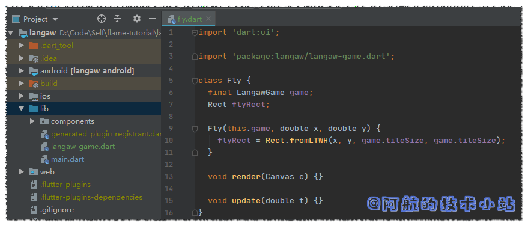
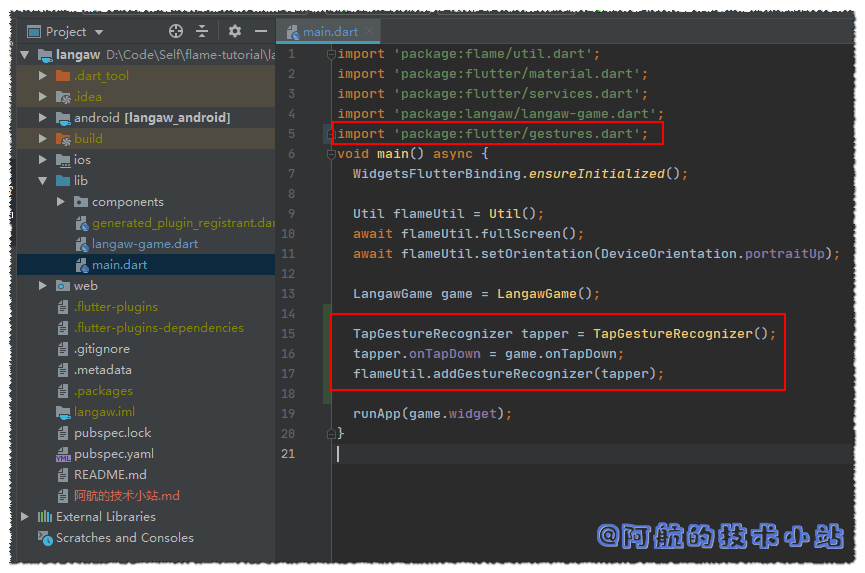
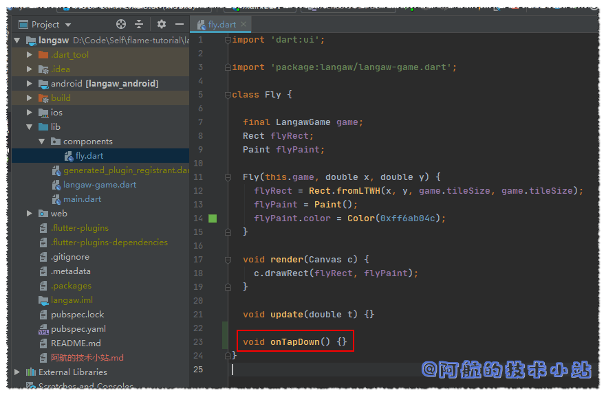
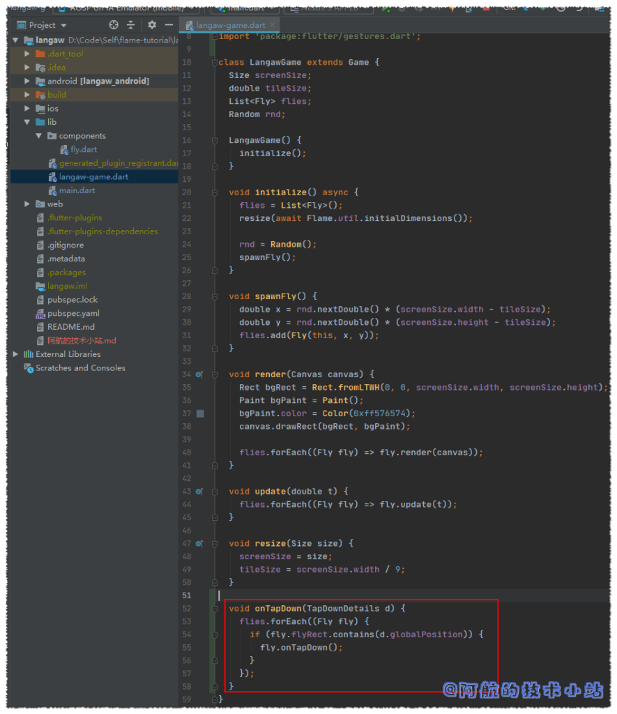
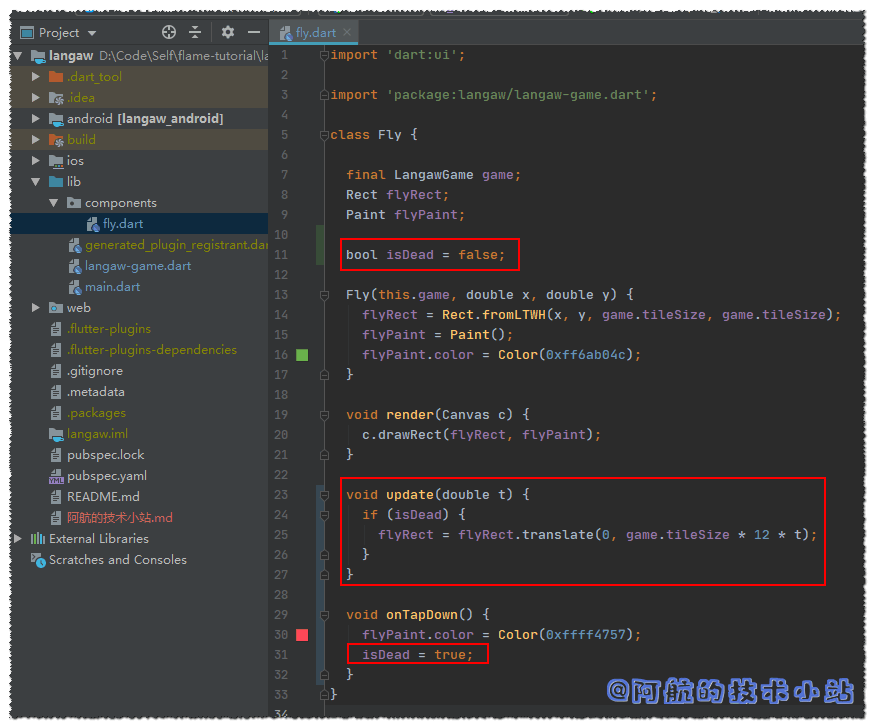
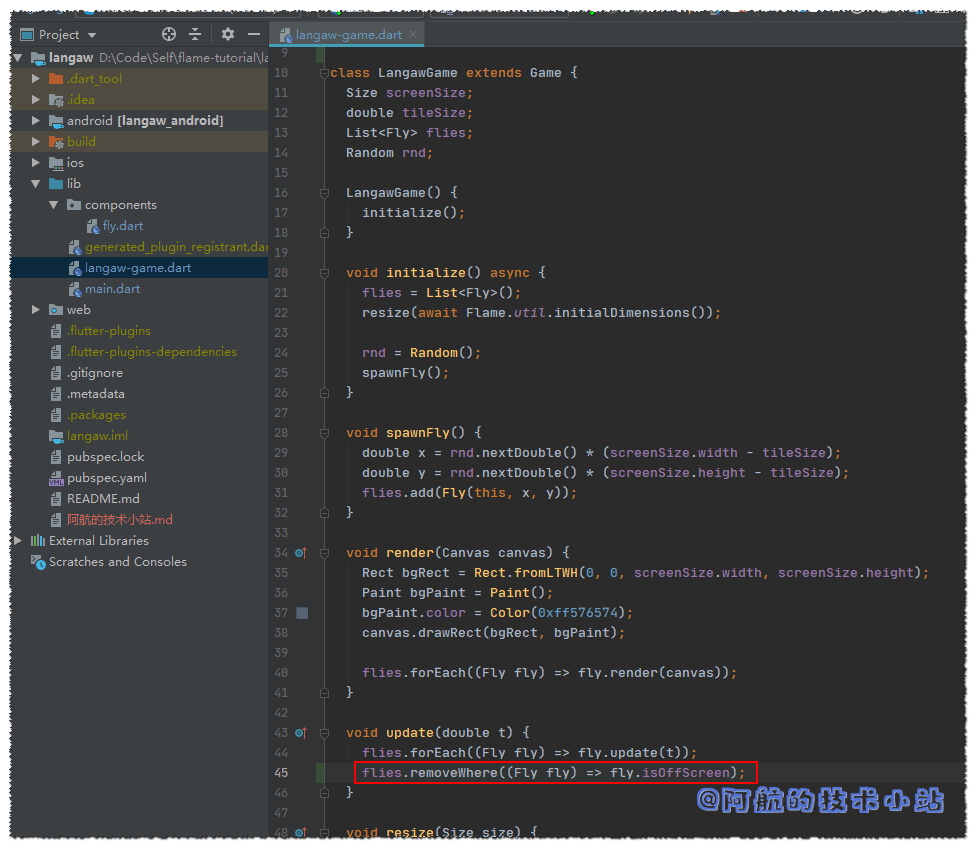

## 引言

曾想过开发一款自己的电子游戏吗? 来对地方了. 本系列教程就是教你如何开发一个属于自己的2D休闲游戏.

本教程是[第一章](/post/2020/flutter-游戏开发flame-01-开发2d休闲游戏：消灭小飞蝇1-5/)的延续, 是针对任何水平的指南. 在这一章我们将会做一个"打鸟"类型的游戏.

这个游戏起名为"**Langaw**", 翻译过来就是"小飞蝇". 玩家的任务就是在小飞蝇到达垃圾堆前尽可能的多消灭小飞蝇(阿航在这里不得不吐槽下原作者, 我们为啥要保护垃圾啊真是的😒).

玩家只需要在屏幕上简单的点击就可实现击杀的效果(别用榔头砸手机🤣).这一章中, 我们暂时不会渲染图片, 所以暂时将小飞蝇展示为绿色方块, 当击中小飞蝇后, 变为红色方块并坠落至屏幕底部.

你可以在文章底部查看效果视频.

下面是我们本系列教程的文章目录:

- [Flutter 游戏开发(flame) Flame介绍](/post/2020/flutter-游戏开发flame-01-开发2d休闲游戏：消灭小飞蝇1-5/)
- **Flutter 游戏开发(flame) 01 开发2D休闲游戏：消灭小飞蝇(1/5) 本章**
- [Flutter 游戏开发(flame) 02 图形和动画(2/5)](/post/2020/flutter-游戏开发flame-01-开发2d休闲游戏：消灭小飞蝇1-5/)
- [Flutter 游戏开发(flame) 03 界面和弹窗(3/5)](/post/2020/flutter-游戏开发flame-01-开发2d休闲游戏：消灭小飞蝇1-5/)
- [Flutter 游戏开发(flame) 04 分数, 存档和音效(4/5)](/post/2020/flutter-游戏开发flame-01-开发2d休闲游戏：消灭小飞蝇1-5/)
- [Flutter 游戏开发(flame) 05 收尾和打包(5/5)](/post/2020/flutter-游戏开发flame-01-开发2d休闲游戏：消灭小飞蝇1-5/)

## 需具备的条件

如果你完整的学习了[第一章](/post/2020/flutter-游戏开发flame-01-开发2d休闲游戏：消灭小飞蝇1-5/), 那么你应该已经准备好进行开发了🤩.

以防万一, 在这里重复一下:

本文将假设您已是一名有一定经验的开发人员, 且拥有了"程序员思维". 如果你是小白, 没关系! 本篇教程非常入门. 只要兴趣足够, 你也将成为一名"游戏开发者"✌✌.

你也需要一个配置足够的电脑, 可以运行IDE、编译并运行Android模拟器. 如果你的电脑配置不够高, 你也可以直接连接Android手机, 在真机上运行和调试.

Flutter可以同时构建Android和IOS APP. 本文将围绕Android进行开发. 开发完成后, 你可以运行不同的build, 使你也可以在IOS上玩游戏.

要顺利阅读本文, 假定您已经具备以下条件👇:

1. IDE (Android Studio 或者 Microsoft Visual Studio), 以及其所需的Flutter和dart插件
2. Android SDK. 这是开发Android应用的必备条件.
3. Flutter SDK. 本篇将使用Flutter以及Flame进行游戏开发. 请阅读[Flutter官方文档](https://flutterchina.club/get-started/install/), 完成圈内的教程:


**你可以在[Github](https://github.com/HarrisonQi/flame-tutorial-langaw/tree/af9ba77fa8bf8befc568479fd5f6406b6a6b22b9)或[码云](https://github.com/HarrisonQi/flame-tutorial-langaw/tree/af9ba77fa8bf8befc568479fd5f6406b6a6b22b9)查看本章的代码.**

## 开始

我们先来规范一些事项, 使本文更容易理解😉. 首先, 我不会赘述[第一章](/post/2020/flutter-游戏开发flame-01-开发2d休闲游戏：消灭小飞蝇1-5/)讨论的概念、步骤以及代码. **我会详细的解释, 但不会偏离**我们要制作游戏的目标. 话虽如此, 还请您仔细阅读一下[第一章](/post/2020/flutter-游戏开发flame-01-开发2d休闲游戏：消灭小飞蝇1-5/)🙏!

文件目录将会使用相对路径表示.

Linux中, 比如你项目的目录为`/home/awesomegamedev/project`.

那么`./lib/main.dart`就代表了`/home/awesomegamedev/project/lib/main.dart`.

Windows同理, 比如你的项目目录为`D:\Projects\SampleGame`.

那么`./lib/main.dart`就代表了`D:\Projects\SampleGame\lib\main.dart`

本篇教程使用了`Flutter 1.14.6 beta`版本以及`Dart 2.8.0-dev.5.0`. 现在相较于之前的版本, `@overide`以及`new`关键字是非必选的, 为了代码的简洁, 文章中也不会出现这些.

本章的全部代码随时在[Github](https://github.com/HarrisonQi/flame-tutorial-langaw)和[码云](https://github.com/HarrisonQi/flame-tutorial-langaw)上查看和下载.

### 创建一个Flame/Flutter游戏

上面讲过, 我们的游戏名称将被称为**Langaw**. 当然你也可以使用自己想用的名字, 别忘了后面替换掉所有`langaw`为你自己的.

#### 创建项目, 清理代码

你可以使用IDE自动创建项目, 也可以使用命令行:

```
flutter create langaw
```

创建完成后, 使用IDE打开项目目录.

与[第一章](/post/2020/flutter-游戏开发flame-01-开发2d休闲游戏：消灭小飞蝇1-5/)类似, 进行清理代码. 我们不会执行测试. 所以删除`./test`目录.

<figure>


<figcaption>

(删除test目录)

</figcaption>

</figure>

然后, 清空`main.dart`为:

```
import 'package:flutter/material.dart';

void main() {}
```

<figure>


<figcaption>

(清空main代码截图)

</figcaption>

</figure>

#### 导入Flame插件, 初始化游戏

##### 导入Flame插件

进入`./pubspec.yaml`, 在`cupertino_icons: ^0.1.2`后面导入:

```
flame: ^0.18.1
```

<figure>


<figcaption>

(导入Flame插件)

</figcaption>

</figure>

🟢进行 packages get

##### 初始化游戏

此时我们需要进行锁定横屏以及全屏显示.

可以直接调用Flame的`Util`库实现此效果, 导入:

```
import 'package:flame/util.dart';
import 'package:flutter/services.dart';
```

为`main`函数添加`async`关键字, 并在函数内添加:

```
Util flameUtil = Util();
await flameUtil.fullScreen();
await flameUtil.setOrientation(DeviceOrientation.portraitUp);
```

紧接着在`main`的首行添加:

```
WidgetsFlutterBinding.ensureInitialized();
```

> 🔴 某些版本不加此行运行会报错`Unhandled Exception: ServicesBinding.defaultBinaryMessenger was accessed before the binding was initialized.`

<figure>


<figcaption>

(main.dart代码截图)

</figcaption>

</figure>

运行项目, 如果你的屏幕和截图一致, 是白色且控制台没有任何错误出现就没问题:

<figure>


<figcaption>

(运行效果)

</figcaption>

</figure>

**在[Github](https://github.com/HarrisonQi/flame-tutorial-langaw/tree/b3c9b70ae9629ba7a16689cfdc41102180c57eaa)或[码云](https://github.com/HarrisonQi/flame-tutorial-langaw/tree/b3c9b70ae9629ba7a16689cfdc41102180c57eaa)查看本阶段的代码.**

### 创建Game类, 设置Game loop

我们需要一个game类, 提供了game loop的逻辑.

game loop是一个游戏的核心. 它控制了所有除玩家输入的逻辑.

#### 创建Game类并链接

##### 创建Game类

创建文件`./lib/langaw-game.dart`:

```
import 'dart:ui';
import 'package:flame/game.dart';

class LangawGame extends Game {
  Size screenSize;

  void render(Canvas canvas) {}

  void update(double t) {}

  void resize(Size size) {}
}
```

> 💡 解析: 因为需要访问`Canvas`和`Size`类, 所以导入了`dart:ui`. 我们同样需要`Flame`库. 我们创建一个类, 继承`Game`. 此类有3个函数, 重写它们. 还有一个名为`screenSize`的实例变量, 用于存储屏幕尺寸.

<figure>


<figcaption>

(langaw-game代码截图)

</figcaption>

</figure>

##### 链接并运行Game类

现在将Game类链接到main函数, 当游戏运行时, 将会创建`LangawGame`的一个实例.

回到`./lib/main.dart`, 导入:

```
import 'package:langaw/langaw-game.dart';
```

创建game类的实例, 并通过`runApp`进行调用, 入参为`LangawGame`的`widget`属性:

```
LangawGame game = LangawGame();
runApp(game.widget);
```

<figure>


<figcaption>

(代码截图: 链接并运行Game类)

</figcaption>

</figure>

#### 处理屏幕尺寸, 绘制背景

##### 处理屏幕尺寸

回到我们的游戏类`./lib/langaw-game.dart`, 我们确定屏幕的尺寸后进行绘制(以及后面的对象移动).

某些事件将会导致Flutter重新计算`Canvas`的尺寸. 当运行游戏时, 会出现一次这样的事件, 其他情况比如旋转手机, 将会使宽度和高度交换. 我们的游戏只支持纵向, 所以不必担心这一点.

某些手机支持多种分辨率, 玩家可以在玩游戏时变更. 我们来处理一下, 确保每次Flutter通知`Canvas`大小变更时, 我们进行重新计算.

在`resize()`中添加:

```
screenSize = size;
```

> 💡 解析: 这样做会将Flutter传递的大小传入实例变量`screenSize`中, 以便我们在game loop的其他部分访问它.

<figure>


<figcaption>

(代码截图: 处理屏幕尺寸)

</figcaption>

</figure>

##### 绘制背景

为了使背景不那么单调, 所以不用黑色和白色. 我们将使用**[FlatUIColors.com](https://flatuicolors.com/)**网站上[Canadian palette](https://flatuicolors.com/palette/ca)的**Fuel Town** (`#576574`) 颜色. 当然, 你也可以使用任何喜欢的颜色. 背景颜色不宜太过刺眼, (比如红色`#ff0000`).

在`render()`中添加:

```
Rect bgRect = Rect.fromLTWH(0, 0, screenSize.width, screenSize.height);
Paint bgPaint = Paint();
bgPaint.color = Color(0xff576574);
canvas.drawRect(bgRect, bgPaint);
```

> 💡 解析: 创建一个与屏幕相等尺寸的矩形, 然后为其分配颜色. 然后使用`canvas`的`drawRect`函数在画布上绘制这个句型. `bgRect`用于调整大小, `bgPaint`用于提供颜色.

<figure>


<figcaption>

(代码截图: 绘制背景)

</figcaption>

</figure>

运行项目查看模拟器, 应该会看到类似内容:

<figure>


<figcaption>

(运行模拟器截图)

</figcaption>

</figure>

#### 手机屏幕兼容性, 编写区块系统

##### 手机屏幕兼容性

创建第一个游戏`component`前, 我们首先来讨论一个重点:

**手机尺寸**.

根据[Quartz](https://qz.com/472767/there-are-now-more-than-24000-different-android-devices/)的帖子, 直至2015年, 共有24000种不同的安卓设备. 现在2020年了(此文章发布前), 这个数字应该更夸张了.

我们的游戏可能不会被所有人下载使用, 却**可能会涉及到很多的型号**. 就算没有涉及全部的型号, 也会涉及若干分辨率以及**纵横比**.

纵横比是设备的宽高之间的比例. 纵横比在你旋转屏幕时是可切换的.

有几种屏幕比例`3:2`, `4:3`, `8:5`, `5:3`, `16:9`. 长一点的甚至达到了`18.5:9`. 最常见的尺寸是`16:9`.

因为我们的游戏是纵向的, 我们宽度固定为`9`., 所以我们的纵横比设定为`9:x`.

这样我们只需要考虑手机的宽度. **它被平均分为九个区块**. 手机越高, 小飞蝇飞来飞去的空间就越多.

**更重要的是**, 无论玩家的手机大小和纵横比是多少, **小飞蝇的尺寸总是相同的**. 并排放置, 需要9只小飞蝇来填充屏幕的整个宽度.


##### 编写区块系统

为了能有一个可重用的区块尺寸, 我们需要在game类中添加一个实例变量. 在`screenSize`下方添加代码:

```
double tileSize;
```

> 💡 这个实例变量等于屏幕宽度除以9. 它是一个实例变量, 因此我们可以从game类的任意位置(和后面用到的子`component`)访问它.  

把它存储为实例变量的另一个原因是它保存上次计算时的值. 我们不需要每次都从屏幕宽度来计算区块尺寸. 当屏幕尺寸变更时, 我们再来计算它的值. 因此, 在保存屏幕尺寸下面添加:

```
tileSize = screenSize.width / 9;
```

<figure>


<figcaption>

(代码截图: 编写区块系统)

</figcaption>

</figure>

### 创建小飞蝇Component(组件)

什么是Component(组件)?

Component(或称为对象或者游戏对象), **是在游戏中做了某些事情的对象**. 比如玩家控制的角色、敌人、陆地或地形、地图、部分UI, 子弹等等. 某些Component通常和sprite(精灵, 又称图形)有关联. 比如, 用于表示敌人的Component利用它的位置在屏幕上绘制图形让玩家感知到.

并非所有的component都用于位置和绘图. 某些component没有位置的概念, 并且不会再屏幕上绘制sprite, 仅用于某些其他的功能. 这类component被称为**controller**(控制器). controller控制游戏的某些状态, 却不会在屏幕上直接展示出来.

比如敌人的"生成器". 实际上, controller只是在某个地方等待时间点生成敌人component. 时间一到, controller控制一个敌方component并将其提交给game loop. game loop拿到这个敌方component, 进行相应的update和render.

#### 为什么要使用Component

[上一章](/post/2020/flutter-游戏开发flame-01-开发2d休闲游戏：消灭小飞蝇1-5/)讲过, game loop是游戏的核心. 没有game loop就没有游戏. 那么, component呢?

回想下你玩过的大型游戏, 有好多的事件会同时发生. 想象一下, 若所有的内容都存放在同一个文件中, 那么game类(`./lib/langaw-game.dart`)将会有多乱. 我们将会有几千行代码, 如果这么写将相当不利于维护.

还有, 使用component同样遵循了面向对象. 因此, 我们只需要专注于当前编写的对象. 这也是`class`的用途.

将component视为"迷你的game loop"或者游戏循环的子类. 更佳的解释: game loop的组件. 它们也有相应的render和update函数.

回到正题, 我们实际的创建一个component.

#### 首个component

我们需要一个新的目录, 用于存储我们的component.

在`./lib`下, 创建目录`components`. 在下面创建`fly.dart`.

打开`./lib/components/fly.dart`, 编写:

```
import 'dart:ui';

class Fly {
  void render(Canvas c) {}

  void update(double t) {}
}
```

> 💡 解析: 首先我们导入`dart:ui`使我们可以访问`Canvas`类. 就像main一样. 然后我们声明class, `Fly`和两个函数`update()`和`render()`

**和game loop很相似, 对吗?**

这是因为当这个component进行update和render时, game loop将调用这些函数.

#### 位置和尺寸

fly component需要记录它的位置和储存. 因此让我们为其创建实例变量.

我们可以这么做: 分别定义`double x;`, `double y;`, `double width;`, 和 `double height`用于记录位置. 但这整整4个变量呢, 肯定有更好的方案.

还记得我们绘制背景时使用的`Rect`吗? 当构造实例时(通过`fromLTWH`工厂), 可以定义它的左(`x`), 上(`y`), 宽和高.

唯一的缺点是Rect实例是不可变的. 所以我们无法直接改变它的任何属性. 没关系, 我们可以使用`Rect`的`shift`和`translate`函数来改变矩形.

我们来添加实例变量`flyRect`.

> 💡 记住: 实例变量定义在class内部, 在定义class的下一行添加

```
Rect flyRect;
```

然后我们需要引用game类, 以便访问如`screenSize`一类的属性. 先导入:

```
import 'package:langaw/langaw-game.dart';
```

接下来, 我们添加另一个实例变量, 该变量将与父game loop连接. 在定义`flyRect`上方添加:

```
final LangawGame game;
```

> 💡 `final`关键字修饰的变量是不可变的. 因为`fly`只会存在于一个game类中, 所以我们不需要父game是动态的.

最后, 我们需要初始化这些实例变量. 我们需要为这个class添加一个构造函数.

**构造函数是在创建类实例时运行的函数.**它只运行一次, 因此最好用于初始化某些东西. 在声明实例变量的正下方编写以下代码块:

```
Fly(this.game, double x, double y) {
  flyRect = Rect.fromLTWH(x, y, game.tileSize, game.tileSize);
}
```

> 💡 解析: 在这里, 我们使用类名作为函数的名称.

此构造函数接收3个参数, 第一个参数(`this.game`) 将会把入参传递给本身的属性. 后面的两个变量 (`x` 和 `y`)用于初始化坐标.

在构造函数体内, 我们为`flyRect`赋值一个新的矩形, 并用`x`和`y`分别作为左和顶部, `game.tileSize`作为宽和高. 目前, 我们的小飞蝇仅仅是一个正方形.

<figure>



<figcaption>

(代码截图: fly.dart)

</figcaption>

</figure>

#### 绘制小飞蝇(正方形)

我们开始绘制小飞蝇, 将其加入至游戏实例中并在屏幕上显示.

我们知道绘制矩形需要一个矩形(上面写完了)和`Paint`对象. 为了防止`Paint`在`render()`中被重新初始化, 让我们将其存储在实例变量中.

在`flyRect`下方定义:

```
Paint flyPaint;
```

然后, 在构造函数中初始化`flyPaint`(在初始化`flyRect`下方). 再次从[FlatUIColors.com](https://flatuicolors.com/palette/au)选择颜色([`#6ab04c`来自Aussie palette](https://flatuicolors.com/palette/au)).

```
flyPaint = Paint();
flyPaint.color = Color(0xff6ab04c);
```

现在, 我们准备好渲染了, 在`render()`中添加:

```
c.drawRect(flyRect, flyPaint);
```

<figure>


<figcaption>

(代码截图: fly矩形及渲染)

</figcaption>

</figure>

### 生成小飞蝇

在随心所欲的召唤小飞蝇前, 我们先来讨论一些技术难点以及解决方案🤩. 当我们运行游戏时, 它不知道屏幕的尺寸, 游戏会认为它在`0×0`的屏幕上运行. 这也是为什么我们通过`resize`来让游戏指定屏幕的大小.

回到`./lib/langaw-game.dart`, 你将看到render函数运行时, 已经定义好了`screenSize`. 函数的调用顺序:

1. 类实例已被创建(运行构造函数, 但是由于我们没有定义所以跳过).
2. Flutter调用我们的resize函数, 并且为screenSize赋值.
3. Game loop(游戏循环): 开始.
4. Game loop: 调用update()
5. Game loop: 调用render()
6. Game loop: 结束. 回到第3步

各有利弊, 并且有一个"丑代码🙊". 理想情况下, 我们希望初始化代码位于内部或者从构造函数运行. 初始化代码是我们准备和创建对象的地方, 应仅执行一次.

<table class="has-subtle-pale-blue-background-color has-fixed-layout has-background"><tbody><tr><td class="has-text-align-center" data-align="center">利👍</td><td class="has-text-align-center" data-align="center">弊👎</td></tr><tr><td class="has-text-align-center" data-align="center">resize()几乎在创建对象之后立即运行。所以我们可以使用resize方法来启动初始化代码。貌似没什么毛病, 但其实不然! 因为-&gt;</td><td class="has-text-align-center" data-align="center">当手机分辨率改变(如旋转屏幕)时, Flutter将再次调用resize函数. 若我们把初始化代码放在resize中, 它可以运行多次. 假如你已经有了游戏主角. 手机旋转屏幕, resize函数被触发, 它再次运行初始化代码, 创建新的游戏主角…坑爹呀…</td></tr></tbody></table>

丑代码🙊: 我们可以用这种方式解决问题: 仍然用`resize`作为初始化代码, 声明一个boolean变量, 命名为isInitialized, 默认false. `resize`函数中, 检查isInitialized是否为false, 如果是, 运行初始化代码并将isInitialized变为true

很明显, 上述的方法很low. 别担心, Flame提供了实用的解决方案✌✌✌!

#### 等待size后进行初始化

打开`./lib/langaw-game.dart`, 在`LangawGame`类中定义名为`initialize`的构造函数.

构造函数中只包含一行: 调用`initialize()`, 使用异步函数等待屏幕Size.  
**因为Dart不支持构造函数中使用异步**, 所以通过这种方式"曲线救国".

class内, 声明实例变量下方添加:

```
LangawGame() {
  initialize();
}

void initialize() async {}
```

接下来, 我们需要调用Flame工具类中的`initialDimensions`函数, 所以需要导入flame:

```
import 'package:flame/flame.dart';
```

在`initialize()`中添加:

```
resize(await Flame.util.initialDimensions());
```

> 💡 解析: 如果你是新手, 这行可能比较难理解. 和数学类似, 表达式从内到外进行计算.

我们的`resize()`接收Size类型的函数. Flame的`util`的`initialDimensions`函数返回`Future<Size>`, 所以我们需要进行`await`, 等待`Future`完成后给我们返回`Size`.

`screenSize`直接赋值, **但是必须重新计算`tileSize`**😕. 另外, 我们后面还要其他需要计算的东西, 所以最好将其封装在`resize()`中, 我们只需调用它进行重新计算所有内容😜.

<figure>


<figcaption>

(代码截图: langaw-game.dart)

</figcaption>

</figure>

#### 准备小飞蝇

还记得**Controller(控制器)**吗? 不需要渲染和指定位置的Component. 我们的教程中, 生成小飞蝇的逻辑相当简单. 所以我们不需要单独创建一个component. 我们的生成控制器之间嵌入至game类中.

为了使game类能访问和创建类的实例, 我们首先进行导入:

```
import 'package:langaw/components/fly.dart';
```

在Dart中没有array类型, 但是我们有`List`类型, 和array几乎一样甚至更强. 添加一个实例变量命名为`flies`:

```
List flies;
```

现在`flies`的值为`null`. 所以在`initialize()`中对其进行初始化:

```
flies = List();
```

看看当前的代码截图吧:

<figure>


<figcaption>

(代码截图: langaw-game.dart)

</figcaption>

</figure>

即使我们现在没有小飞蝇, 我们也先要保证有了之后能够被render()和update().

这也是为什么我们需要尽早初始化`flies`变量的原因, 若`files`为`null`, 我们就无法进行`forEach`(遍历).

记住, 调用`render`的顺序直接影响在游戏上的外观. "小飞蝇"间的顺序没什么要求, 但是"小飞蝇"们一定要在背景之后绘制. 在`render()`中添加:

```
flies.forEach((Fly fly) => fly.render(canvas));
```

`update()`中添加:

```
flies.forEach((Fly fly) => fly.update(t));
```

> 💡 解析: 上面的两个`flies.forEach`会循环`files`中的每个`fly`, 并且进行操作. 箭头函数是Dart的语法.

最终, 代码截图:

<figure>


<figcaption>

(代码截图: langaw-game)

</figcaption>

</figure>

#### 召唤小飞蝇

因为我们的游戏会周期性的生成小飞蝇, 所以我们来定义一个可重用的、 生成小飞蝇的函数: `spawnFly()`  
在`./lib/langaw-game.dart`中添加函数:

```
void spawnFly() {
  flies.add(Fly(this, 50, 50));
}
```

> 💡 解析: 在`flies.add()`内部, 我们创建类的新实例. 你可能记得, `Fly`的构造函数需要三个参数: `LangawGame`实例、初始坐标**X**, 初始坐标**Y**.  
>   
> 对于`LangawGame`实例, 我们将使用`this`关键字以传入所在的类. 初始坐标我们先写一个固定值`50,50`

现在我们在`initialize()`中调用上面定义的函数. 在确定屏幕尺寸(`resize`)下面添加代码:

```
spawnFly();
```

现在的代码:

<figure>


<figcaption>

(代码截图: 生成小飞蝇)

</figcaption>

</figure>

是时候看看我们努力的成果了.

🟢运行游戏, 你应该会看到这样的:


在下一步之前, 我们来升级一下我们的生成小飞蝇的方式…让它在随机位置生成.

我们需要从Dart的`math`中导入`Random`类:

```
import 'dart:math';
```

然后, 创建另一个类型为`Ramdom`的实例变量, 命名为`rnd`:

```
Random rnd;
```

在`initialize()`中, 初始化rnd:

```
rnd = Random();
```


> 🟡 提示: game类本身的实例也会传入`Fly`类. 所以我们稍后可以在那里访问`rnd`变量.

让我们开始修改小飞蝇生成器, 使**X**和**Y**坐标随机. Random包含名为`nextDouble`的函数, 将返回`0`(包括)和`1`(不包括)之间的某个浮点数.

我们要做的是调用此函数, 并将获取的随机数×屏幕宽度-小飞蝇宽度, 因为小飞蝇的坐标点位于其左上角, 并将其分配给初始的x坐标. 我们将对y坐标进行类似的操作, 使用屏幕高度-小飞蝇高度.

小飞蝇是正方形, 所以其宽度和高度相等. 最重要的是, 它们都等于`tileSize`. 因此, 我们只需从屏幕的宽度或高度减去`tileSize`就可以获取所需的最大值.

`spawnFly()`中, 创建新的`Fly`前添加代码:

```
double x = rnd.nextDouble() * (screenSize.width - tileSize);
double y = rnd.nextDouble() * (screenSize.height - tileSize);
```

> 🔴 注意: 复制粘贴形似的代码时, 很容易一不小心落下其中的变更/差异. 在游戏开发中, 会有很多方案需要复制形似的代码块. 所以, **请确保你花费部分时间来理解并仔细检查你的代码.**

接下来, 把新随机生成的`x`和`y`值加入`files`中, 替换之前的:

```
// 替换
flies.add(Fly(this, 50, 50));
// 为
flies.add(Fly(this, x, y));
```

<figure>


<figcaption>

(代码截图: spawnFly())

</figcaption>

</figure>

每次重新运行游戏, 你将会看到"小飞蝇"会出现在随机的位置:

<figure>


<figcaption>

("小飞蝇"会出现在随机的位置)

</figcaption>

</figure>

**在[Github](https://github.com/HarrisonQi/flame-tutorial-langaw/tree/b6bcbe56044c7568ec5f0b1c3802ff650e26766d)或[码云](https://github.com/HarrisonQi/flame-tutorial-langaw/tree/b6bcbe56044c7568ec5f0b1c3802ff650e26766d)查看本阶段的代码.**

### 处理小飞蝇被击落

完成这部分, 需要处理用户的点击动作👉📱. 先来讨论一下, 玩家点击小飞蝇时会发生什么. "小飞蝇"应该变红并坠落至屏幕底部. 离开屏幕范围后, 销毁它, 释放手机内存.

#### 接收点击动作

这部分在[上一章](/post/2020/flutter-游戏开发flame-01-开发2d休闲游戏：消灭小飞蝇1-5/)讲过, 所以这里不跟大家墨迹. 首先在game类中有处理函数. 我们将会处理`onTapDown`事件, 该事件接收`TapDownDetails`作为参数. 为此, 我们需要Flutter的`gesture`手势库. 所以, 进入`./lib/langaw-game.dart`, 导入:

```
import 'package:flutter/gestures.dart';
```

然后在class中, `resize()`下方添加函数:

```
void onTapDown(TapDownDetails d) {}
```

截图(我们的代码文件越来越长咯😝):

<figure>


<figcaption>

(代码截图: 添加onTapDown函数)

</figcaption>

</figure>

我们回到`./lib/main.dart`, 同样导入`gestures`:

```
import 'package:flutter/gestures.dart';
```

然后创建一个手势识别器, 将它的`onTapDown`属性与game类中的`onTapDown`处理器关联, 并使用Flame提供的`addGestureRecognizer`进行注册.

```
TapGestureRecognizer tapper = TapGestureRecognizer();
tapper.onTapDown = game.onTapDown;
flameUtil.addGestureRecognizer(tapper);
```

<figure>



<figcaption>

(代码截图: 创建手势识别器)

</figcaption>

</figure>

我们将在多个文件直接切换, 打开`./lib/components/fly.dart`, 在这里添加一个事件处理器, 仅`Fly`实例被点击时触发.

我们不需要了解过多细节`比如点击的坐标`. 我们只需要相信game类, 若此处理器被触发, 证明`Fly`实例被点击.

在`update`函数下面添加:

```
void onTapDown() {}
```

<figure>



<figcaption>

(代码截图: 添加onTapDown)

</figcaption>

</figure>

返回`./lib/langaw_game.dart`. 在`onTapDown`处理器中, 我们需要遍历所有的`flies`并检查点击位置是否在小飞蝇的范围内.

`Rect`类有一个好用的`contains`函数. 它接收`offset`(偏移量)作为参数, 若传递的`offset`在调用它的`Rect`的范围内, 返回`true`. 否则返回`false`.

这样我们就可以将`globalPosition`属性传递给`fly`的`Rect`的`contains()`, 使我们知道是否击中了小飞蝇.

在`onTapDown()`中添加代码块:

```
flies.forEach((Fly fly) {
  if (fly.flyRect.contains(d.globalPosition)) {
    fly.onTapDown();
  }
});
```

> 💡 解析: 上面的代码块通过遍历`files`中的`Fly`实例. 与`render()`和`update()`中的逻辑类似, 我们在遍历中传递了一个函数, 使其为`flies`中的每个`Fly`运行.

`Fly`类有一个名为`flyRect`的实例变量, 该实例变量是一个`Rect`, 因此有`contains`函数. 我们使用`contains`函数来检查传入的`TapDownDetails`的`globalPosition`是否在矩形范围内.

若在范围内, 我们就可以确定那个在遍历中的`Fly`实例被击中. 我们通知这个小飞蝇调用其`onTapDown`处理器.

这个game类的`onTapDown`处理器如图所示:

<figure>



<figcaption>

(代码截图: onTapDown处理器)

</figcaption>

</figure>

#### 处理被击中的小飞蝇

打开`./lib/components/fly.dart`, 我们来处理被击中的小飞蝇.

首先我们来变更它的颜色. `render`(渲染)小飞蝇时, 我们使用`Paint`类型的变量, 取名为`flyPaint`. 它有一个`Color`的属性. 若没点击小飞蝇, 颜色为苹果色. 如果我们改变这个颜色, 它应该反映下一次调用`render`的情况(人眼一秒识别60帧几乎是极限).

小飞蝇被击中后, 改为红色. 使用FlatUIColor.com的西瓜色（#ff4757）作为我们的"红色".

在`onTapDown`处理器中添加代码块:

```
flyPaint.color = Color(0xffff4757);
```

🟢运行游戏, 当你点击"小飞蝇"时, 它应变为红色.

这一部分的代码截图:

<figure>


<figcaption>

(代码截图: fly组件onTapDown处理器)

</figcaption>

</figure>

#### 处理被击落的小飞蝇

当小飞蝇被击中死掉时, 它们应该因为重力而坠落, 而不是停在空中. 要做到这一点, 我们必须使用到我们一直忽略的game loop的另一部分.

`update()`用于更新游戏中的内容(不包括由玩家操作造成的更改).  
目前, `fly`的`update()`已经被game loop的`update()`所调用:

<figure>


<figcaption>

(代码截图: fly的update()被调用)

</figcaption>

</figure>

对小飞蝇进行动画处理, 使其看起来像是在坠落. 这是需要更新的逻辑之一. 但是我们不能把动画放在这里, 因为只有小飞蝇挂掉才会坠落. 我们来定义一个实例变量用于存储此信息.

在`./lib/components/fly.dart`中添加实例变量:

```
bool isDead = false;
```

现在我们需要改动`Fly`类的`update()`. 我们检查小飞蝇是否死掉, 如果死掉了, 我们改变它的边界矩形, 在它的`top`属性中添加一个特定的值, 使其向下移动.

> 🟡 提示: `Fly`的边界矩形实际上是一个**不可变**的`Rect`, 因此它的属性是不可变的. 使用`Rect`的`shift`以及`translate`函数重构`Rect`.

在`onTapDown`处理器上, 因为小飞蝇被点击后会死掉, 所以翻转`isDead`的值为`true`:

```
isDead = true;
```

制作下降的动画, 添加以下代码块到`update()`中:

```
if (isDead) {
  flyRect = flyRect.translate(0, game.tileSize * 12 * t);
}
```

> 💡 解析: 每次`update`被调用时(约每秒60次), 小飞蝇将检查`isDead`参数是否为`true`. 如果为`true`, 我们通过调用其`translation`函数构建一个新的`Rect`并将其分配回`flyRect`.  

对于这些值, 由于小飞蝇是垂直坠落, 所以`x`为0, 至于`y`..

这个变量实际上应被称作`timeDelta`. 但脚手架代码将其命名为`t`, 所以我们直接使用即可(你也可以按需更改). 从现在开始, 我们将其称为"时间增量"或时间变化.

当我们提到60帧时, 就好像说每帧花费的时间跨度等于16.66666..毫秒. 可以基于此固定的数字进行计算.

**世间不是完美的**, **事实并非如此**😶

运行游戏的设备不仅仅运行游戏, 还运行着操作系统, 甚至还有其他后台运行的APP. 这些APP可能都在做不同的事情. CPU尝试提供所有运行的进程相同的配额, 但是有些需要多一点, 有些需要少一点.

这就是时间增量的用处. 它包含字上次运行`update`经过的时间, 以秒为单位.

使用此值, 我们可以计算应该发生的移动量. 假设由于某种原因, 游戏正在以每秒1帧的恒定完美速度运行, 因此时间增量的值恰好为1. 如果你打算以每秒10个区块的速度移动对象, 你可以将10倍(乘以区块大小的值)乘以1(时间增量的值)乘以(或减去)要移动对象的尺寸. 这将使你1秒移动10个区块.

现在, 假设游戏以每秒4帧的恒定完美速度运行. 时间增量将始终为0.25. 使用相同的移动速度(10个区块/秒), 我们每帧将对象移动10×区块大小×0.25(等于2.5×区块大小). 假设每秒有4帧, 那么速度依然是10个区块/秒.

将这种逻辑与公式`game.tileSize * 12 * t`配合使用, 无论时间增量是多少, 我们仍然可以得到每秒12个`game.tileSizes`的恒定运动值.

> 🟡 注意: 为了得出12的值, 原作者使用了一个高度复杂的科学计算过程---"想到什么是什么"🤣🤣🤣. 随机选择的这个数字, 经测试后看起来还可以. 你也可以改动这个数字使下降速度变快/慢.

代码截图:

<figure>



<figcaption>

(代码截图: 处理小飞蝇坠落)

</figcaption>

</figure>

🟢运行游戏, 效果:

<figure>


<figcaption>

(运行游戏效果)

</figcaption>

</figure>

#### 更多小飞蝇

只有一只不够刺激. 一个可玩性十足的游戏应该每次在小飞蝇死掉后再出现一个.

在`onTapDown`处理器中添加:

```
game.spawnFly();
```

代码截图:

<figure>


<figcaption>

(代码截图: 添加spawnFly)

</figcaption>

</figure>

> 🟡 注意: 如果你发现此行有报错, 这是因为`spawnFly`尝试在遍历时变更list.

**问题不大**, 我们稍后处理这个. **如果你想练习解决问题**, 你可以随时自行修复.

🟢运行游戏, 你应该会发现每次击落后, 又生成了一只小飞蝇:

<figure>


<figcaption>

(不断生成的小飞蝇)

</figcaption>

</figure>

但是现在还有一个问题, 超出屏幕范围的下落的小飞蝇没被清理. 不多还好, 一旦小飞蝇过多, 将会出现著名的报错`Stack Overflow`(内存溢出). 虽然现代的手机都可以自行清理, 但是这不是一个好的代码习惯.

我们来处理, 删除超过屏幕的小飞蝇. 添加实例变量`isOffScreen`, 代表是否超出屏幕:

```
bool isOffScreen = false;
```

在`update()`内部, 移动小飞蝇后添加:

```
if (flyRect.top > game.screenSize.height) {
  isOffScreen = true;
}
```

> 💡 解析: 我们检查此实例的矩形顶部坐标是否超出屏幕高度, 如果是, 将`isOffScreen`的值设为`true`.

> 🟡 注意: 你也许注意到了这点. 这和和数学有区别, 屏幕的原点`(0,0)`位于屏幕的左上方. **Y**轴方向为向下.

代码截图:

<figure>


<figcaption>

(代码截图: 处理超出屏幕的小飞蝇1)

</figcaption>

</figure>

最终, 我们需要销毁`isOffScreen`为`true`的fly实例.

我们可以一行搞定此需求. 通过Dart的`List`的`removeWhere`函数. 这个和`forEach`类似但是它只返回一个`boolean`. 很幸运, `isOffScreen`也是一个`boolean`, 所以我们可以直接使用.

在`./lib/langaw-game.dart`的`update()`中添加:

```
flies.removeWhere((Fly fly) => fly.isOffScreen);
```

> 💡 解析: 我们创建一个匿名函数, 使用Fly作为入参. 然后立即返回它的`isOffScreen`属性.
> 
> 然后将该匿名函数作为参数传递给`flies`列表中的`removeWhere`函数, 该函数为List中的每个Fly实例运行传递的函数, 若该函数返回`true`则删除该实例.

<figure>



<figcaption>

(代码截图: 处理超出屏幕的小飞蝇2)

</figcaption>

</figure>

**在[Github](https://github.com/HarrisonQi/flame-tutorial-langaw/tree/af9ba77fa8bf8befc568479fd5f6406b6a6b22b9)或[码云](https://github.com/HarrisonQi/flame-tutorial-langaw/tree/af9ba77fa8bf8befc568479fd5f6406b6a6b22b9)查看本阶段的代码.**

## 测试游戏!

是时候看看我们努力的成果了. 运行我们的游戏, 你应该有了一个类似于这样的可玩的游戏:


## 结语

经过相当长的教程, 我们现在拥有了新的游戏. 这比上一章更有交互性.

通过从零开始创建游戏, game loop的概念应该更加熟悉了. 我们还介绍了游戏循环中的update功能.

我希望你喜欢DIY自己的游戏, 尝试各种不同的颜色和速度, 不要犹豫! 使你的游戏别具一格!

如果你出现了不懂的地方, 不要犹豫, 欢迎在评论区留言! 也欢迎你加入[我的Flame交流群(QQ)](https://jq.qq.com/?_wv=1027&k=5ETLFm3)

## 下一章将会干什么?

[下一章](/post/2020/flutter-游戏开发flame-01-开发2d休闲游戏：消灭小飞蝇1-5/)中, 我们将会用图片来表示对象, 并执行更多的动画!

## 感谢

- 本篇文章参考原作[《2D Casual Mobile Game Tutorial – Step by Step with Flame and Flutter (Part 1 of 5)》](https://jap.alekhin.io/2d-casual-mobile-game-tutorial-flame-flutter-part-1).
- flame [github仓库地址](https://github.com/flame-engine/flame)
- pub.dev [官方网址](https://pub.flutter-io.cn/packages/flame)
