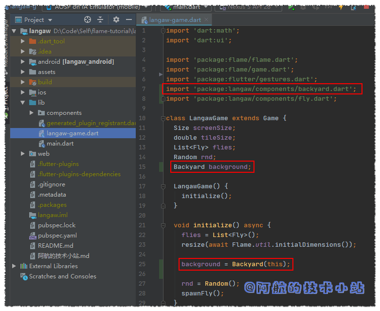

## 引言

在本系列教程的这一章, 我们将会把重心放在图形和动画上. 我们在上一章[《开发2D休闲游戏：消灭小飞蝇》](https://www.bugcatt.com/archives/292)中创建了一款拥有交互的休闲手游.

游戏的核心不变, 但是我们需要为其增加更多的位移和更好的图像.

下面是我们本系列教程的文章目录:

- [Flutter 游戏开发(flame) F](https://blog.bugcatt.com/archives/279)[l](https://www.bugcatt.com/archives/279)[ame介绍](https://blog.bugcatt.com/archives/279)
- [Flutter 游戏开发(flame) 01 开发2D休闲游戏：消灭小飞蝇(1/5)](https://www.bugcatt.com/archives/292)
- **Flutter 游戏开发(flame) 02 图形和动画(2/5) 本章**
- [Flutter 游戏开发(flame) 03 界面和弹窗(3/5)](https://www.bugcatt.com/archives/562)
- [Flutter 游戏开发(flame) 04 分数, 存档和音效(4/5)](https://www.bugcatt.com/archives/564)
- [Flutter 游戏开发(flame) 05 收尾和打包(5/5)](https://www.bugcatt.com/archives/731)

## 需具备的条件

1. 本系列教程[第一部分](https://blog.bugcatt.com/archives/292)的**全部要求**.
2. **图像资源文件**\- 图像资源可在网上的游戏资源网站找到(比如[Open Game Art](https://opengameart.org/)), 但是要确保感谢原作者.

代码的规则和此前的章节一致.

## 图像资源


正如你在上一章中看到的上图, 我们实际上已经为小飞蝇准备好了图像资源. 这是一张[来自于Open Game Art的小飞蝇图片](https://opengameart.org/content/green-fly-flying-enemy-game-character). 它被授权为`CC0`意思是可用于公共域, 也就是随便用.

但是我们不会用上面的那个, 而是用这些:


[点击下载](https://jap.alekhin.io/wp-content/uploads/2019/03/resource-pack-part-2.zip)

* * *

🔴 **注意**: 如果你遵循本教程, 则可以使用上述资源包. 本资源包是[Github上Langaw(原作者)](https://github.com/japalekhin/langaw)项目的一部分, 该项目获得`CC-BY-NC-ND`许可证的许可.

这意味着您可以共享、复制或者重新分发资源.

- 你必须在感谢中提到, 提供许可证的链接, 并标明你是否进行了更改.
- 你不得将资源用于商业目的.
- 如果混合, 转换或者构建资源, 则不能分发修改后的资源.
- 你不得应用法律条款或技术措施, 在法律上限制他人做许可证允许的任何事情.

[点击此处了解有关 CC-BY-NC-ND 许可证的更多信息](https://creativecommons.org/licenses/by-nc-nd/2.0/legalcode)

* * *

阿航在这里提醒: 目前国内的版权保护做的不够好. 希望大家能够保护资源原作者辛苦的创作🙏🙏! 不能使用未经许可且无版权的资源, 向盗版说不👋!

## 继续构建游戏

我们在上一章实现了: 点击一只小飞蝇, 其被击落并且会生成一只新的小飞蝇.

本章不会添加太多功能, 但是界面会有大突破. 一个好看的界面会直线提升一个游戏的乐趣.

### 第一步: 添加图形资源

首先, [下载图形资源包](https://jap.alekhin.io/wp-content/uploads/2019/03/resource-pack-part-2.zip). (如果没下载的话)

或者你也可以用自己的资源文件, 或者从资源网站上(比如[OpenGameArt.org](https://opengameart.org/))获取.

> 🟡 注意: 如果你打开资源包, 将会注意到有5种不同类型的小飞蝇, 且每个小飞蝇都有三个与其相关联的文件. 这是因为我们以后会有五种不同类型的、拥有不同能力的小飞蝇. 会在后面详解这部分内容.

#### 添加资源文件至Flame

在项目根目录创建目录, 命名为`assets`.

并在这个新目录`./assets`下再创建一个`images`目录.

Flame要求我们必须把资源文件放在`./assets/images`下.

基于这个规定, 我们可以将资源文件任意放置. 我们可以把它们都乱糟糟的放在那, 但这不是一个好的代码习惯👨‍🏫!

我们来整理一下, 把fly目录放在`./assets/images/flies`下, 然后把background目录放在`./assets/images/bg`下.

我们的`./assets/images`下应该存在以下文件:

```
./assets
./assets/images
./assets/images/bg
./assets/images/bg/backyard.png
./assets/images/flies
./assets/images/flies/agile-fly-1.png
./assets/images/flies/agile-fly-2.png
./assets/images/flies/agile-fly-dead.png
./assets/images/flies/drooler-fly-1.png
./assets/images/flies/drooler-fly-2.png
./assets/images/flies/drooler-fly-dead.png
./assets/images/flies/house-fly-1.png
./assets/images/flies/house-fly-2.png
./assets/images/flies/house-fly-dead.png
./assets/images/flies/hungry-fly-1.png
./assets/images/flies/hungry-fly-2.png
./assets/images/flies/hungry-fly-dead.png
./assets/images/flies/macho-fly-1.png
./assets/images/flies/macho-fly-2.png
./assets/images/flies/macho-fly-dead.png
```

#### 注册资源文件至Flutter

在我们使用这些资源文件前, 我们需要通知Flutter我们需要将这些文件打包到APP内. 所以我们需要进入

`./pubspec.yaml`, 找到`flutter`下的`assets`中添加:

```
flutter:
  uses-material-design: true
  assets:
    - assets/images/bg/backyard.png
    - assets/images/flies/agile-fly-1.png
    - assets/images/flies/agile-fly-2.png
    - assets/images/flies/agile-fly-dead.png
    - assets/images/flies/drooler-fly-1.png
    - assets/images/flies/drooler-fly-2.png
    - assets/images/flies/drooler-fly-dead.png
    - assets/images/flies/house-fly-1.png
    - assets/images/flies/house-fly-2.png
    - assets/images/flies/house-fly-dead.png
    - assets/images/flies/hungry-fly-1.png
    - assets/images/flies/hungry-fly-2.png
    - assets/images/flies/hungry-fly-dead.png
    - assets/images/flies/macho-fly-1.png
    - assets/images/flies/macho-fly-2.png
    - assets/images/flies/macho-fly-dead.png
```

> 🟡 一定要注意`pubspec.yaml`的文件格式. 每级中间会有两个空格. 最好导入文件后运行一下APP, 确保没有问题. 若有问题, 编译器则会报错.

#### 游戏开始前预加载资源文件

如果你是在开发一个大型的游戏, 玩家每进入另一个房间之前, 都要预加载一些资源文件.

我们的教程的游戏比较简单, 在游戏开始前加载所有的资源文件就可以了.

打开`./lib/main.dart`, 导入:

```
import 'package:flame/flame.dart';
```

在`main`函数中, 在设置全屏和锁定屏幕方向后面添加:

```
Flame.images.loadAll([
  'bg/backyard.png',
  'flies/agile-fly-1.png',
  'flies/agile-fly-2.png',
  'flies/agile-fly-dead.png',
  'flies/drooler-fly-1.png',
  'flies/drooler-fly-2.png',
  'flies/drooler-fly-dead.png',
  'flies/house-fly-1.png',
  'flies/house-fly-2.png',
  'flies/house-fly-dead.png',
  'flies/hungry-fly-1.png',
  'flies/hungry-fly-2.png',
  'flies/hungry-fly-dead.png',
  'flies/macho-fly-1.png',
  'flies/macho-fly-2.png',
  'flies/macho-fly-dead.png',
]);
```

> 💡 代码解析: 看起来代码很长, 实际上只有一行. 我们把资源文件作为一个List传入了`images.loadAll()`里面了.

这些资源文件将缓存在Flame的静态变量中, 便于我们后续重复使用.

👉**在[Github](https://github.com/HarrisonQi/flame-tutorial-langaw/tree/8ef72fd9c8e342bde6a46ef2dad847a08ab96082)或[码云](https://github.com/HarrisonQi/flame-tutorial-langaw/tree/8ef72fd9c8e342bde6a46ef2dad847a08ab96082)上查看这部分的代码.**

### 第二步: 修改背景图

当前的背景是很单调的纯色, 虽然颜色挺好看的, 但是游戏背景应该更绚丽多彩.

我们在这一步将把背景换成这个:


这是资源包中的`backyad.png`图片.

如你所见, 图片很高. 因为我们只关心宽度(上一章讲过). 手机会尽可能合理的安排背景铺满整个屏幕.

#### 添加背景Component

将背景的逻辑与其组件分离出来比较好.

所以, 创建一个component文件`./lib/components/backyard.dart`:

```
import 'dart:ui';
import 'package:flame/sprite.dart';
import 'package:langaw/langaw-game.dart';

class Backyard {
  final LangawGame game;
  Sprite bgSprite;

  Backyard(this.game) {
    bgSprite = Sprite('bg/backyard.png');
  }

  void render(Canvas c) {}

  void update(double t) {}
}
```

此文件声明了`Backyad`类, 该类具有构造函数和另外两个函数(和game loop以及fly component类似). 我们暂时用不到这些函数, 但也要留在那里方便后续使用.

此类包含final的`LangawGame`实例变量, 它将指向包含此component的game实例(和`./lib/components/fly.dart`十分相似).

另一个类型为`Sprite`的`bgSprite`变量用于保存等下会用到的sprite数据.

在构造函数内部, 我们通过创建一个新的`Sprite`初始化`bgSprite`变量, 并传递要使用的资源文件名. 该文件已加载至`./lib/main.dart`, 因此可以立即使用, 无需等待.

> 🟡 与项目中其他文件一样, 我们在顶部导入所需要的包. 导入`dart:ui`以使用`Canvas`类. 导入`flame`的`sprite.dart`以使用`Sprite`. 最后, 导入`langaw-game.dart`以使用我们的`LangawGame`类.

#### 尺寸说明

如果你查看了图片的详细属性, 会发现它的分辨率是`1080×2760`的.

我们在使用Flutter时, 不需要被物理像素所困扰, 甚至不用担忧逻辑像素. 我们只需要关心**我们的背景图片是9个区块的宽度**.

`1080 像素 ÷ 9 区块 = 120 像素/区块`

`2760 像素 ÷ 120 像素/区块 = 23 区块`

如上面的公式所示, 这个图像的**宽度为9个区块, 高度为23个区块**.

#### 绘制背景

是时候绘制背景了. 我们将背景图的底部的锚点定在手机屏幕的底部.

为此, 我们需要定义一个矩形, 用来保存背景的尺寸. 我们需要正确计算尺寸, 以便在渲染过程中保留背景的纵横比.

我们添加一个实例变量, 类型为`Rect`的`bgRect`:

```
Rect bgRect;
```

在构造函数中, 在初始化`bgSprite`属性的下方添加:

```
bgRect = Rect.fromLTWH(
  0,
  game.screenSize.height - (game.tileSize * 23),
  game.tileSize * 9,
  game.tileSize * 23,
);
```

> 💡 解析: 这其实也只是一行代码, 垂直排下来只是为了可读性. 4个参数分别对应左(`x`), 上(`y`), 宽和高的值.

我们以完整的宽度来绘制背景, 因此背景从左(`x`)的`0`开始, 扩展至`game.tileSize * 9`的宽度. 我们也可以用`game.screenSize.width`, 因为`game.tileSize`等于`game.screenSize.width`除以9.

我们知道背景图是`9×23`的(单位是"区块"). 因此, 要绘制整个图像, 我们只需传递`game.tileSize * 23`作为高度.


最后, 顶部(`y`)是背景图片高度减去屏幕高度的负数.

如果玩家的屏幕的纵横比为`9:16`, 屏幕的高度将会是`16 区块大小`. 我们从中减去`23 区块大小`, 就会得到`-7 区块大小`. 这意味着绘制背景时, 图片顶部要比屏幕顶部高7个区块.

通过此公式, 背景图将始终固定在屏幕底部.

我们在调用此component的`render`方法时绘制背景图像：

```
bgSprite.renderRect(c, bgRect);
```

代码截图:


#### 将背景添加至游戏

现在, 我们的背景component已经完成了, 我们来将其添加到我们的游戏逻辑中. 打开`./lib/langaw-game.dart`.

因为需要使用`Backyard`类, 导入:

```
import 'package:langaw/components/backyard.dart';
```

然后添加类型为`Backyard`的变量`background`:

```
Backyard background;
```

在`initialize()`中, 实例化一个新的`Backyard`类型的对象至`background`实例变量. 必须在确定屏幕大小之后进行:

```
background = Backyard(this);
```

就像创建小飞蝇一样, 我们通过`this`关键字来传递当前的`LangawGame`实例.

代码截图:



然后在`render`函数内部, 我们调用`background`的`render`函数, 并传入`Canvas`.

我们目前只用了四条线绘制了一个纯色的矩形. 我们需要将其替换:

```
Rect bgRect = Rect.fromLTWH(0, 0, screenSize.width, screenSize.height);
Paint bgPaint = Paint();
bgPaint.color = Color(0xff576574);
canvas.drawRect(bgRect, bgPaint);

// 替换为
background.render(canvas);
```

🟢 运行游戏, 应该可以看到背景了:


看起来蛮顺利的!😜😜

**👉在[Github](https://github.com/HarrisonQi/flame-tutorial-langaw/tree/6733fc5b1ee53a9732c534533c95159129c90f14)或[码云](https://github.com/HarrisonQi/flame-tutorial-langaw/tree/6733fc5b1ee53a9732c534533c95159129c90f14)上查看这部分的代码.**

### 第三步: 变更小飞蝇图片

我们将会有五种不同的小飞蝇. 现在我们来关注它们的图片差异, 但也要为它们的不同功能做好准备.

这里我们会用到**继承**的概念. 即创建一个子类, 扩展现有的父类(超类).

#### 调整小飞蝇sprite尺寸

在资源包中的文件的尺寸是确定的, 命中区域(`flyRect`)的矩形比整个图片小一圈.


如上图所示, sprite将会在蓝框内绘制(我们称其为sprite区域), 但若想击中需要在红框内(命中区域, 代码中为`flyRect`).

#### 准备小飞蝇父类

在创建首个子类前, 我们要保证我们的父类准备好被扩展.

我们将使用已存在的`Fly`作为父类, 所以打开`./lib/components/fly.dart`. 所有的小飞蝇将会共享在`Fly`中的通用功能.

首先删除`drawRect`, 因为我们不再绘制矩形了. 清空`render()`, 像这样:

```
void render(Canvas c) {}
```

然后, 删除所有对`flyPaint`的引用. 因为该对象只是用来绘制矩形的. 移除实例变量:

```
// 移除它!
Paint flyPaint;
```

然后在构造函数中删除:

```
// 移除这两行!
flyPaint = Paint();
flyPaint.color = Color(0xff6ab04c);
```

再然后, 删除`onTapDown`处理器的:

```
// 移除这行!
flyPaint.color = Color(0xffff4757);
```

`flyRect`留在这里, 因为我们将其作为命中矩形.

#### 添加sprites

`Fly`类中的每个实例, 我们都需要添加两组`Sprite`:

- 其中一组由2个Sprite组成, 它们将一个接一个的显示, 提供飞行动画(因为煽动翅膀的动画不止由一张图片组成). 将使用`List`类型.
- 另一组只有1个Sprite, 将显示死掉的小飞蝇.

我们还需要一个实例变量, 该变量将存储哪些Sprite将显示飞行动画.

导入Flame的`sprite.dart`:

```
import 'package:flame/sprite.dart';
```

在实例变量中添加:

```
List flyingSprite;
Sprite deadSprite;
double flyingSpriteIndex = 0;
```

> 🟡 提示: sprite变量不会在这里进行初始化, 因为每个子类都会使用不同的sprite.

在`render()`中, 我们来根据小飞蝇的状态(活着/死掉)渲染其sprite:

```
void render(Canvas c) {
  if (isDead) {
    deadSprite.renderRect(c, flyRect.inflate(2));
  } else {
    flyingSprite[flyingSpriteIndex.toInt()].renderRect(c, flyRect.inflate(2));
  }
}
```

> 💡 解析: `render`函数通过`isDead`的值来判断显示哪一个sprite. 如果死掉, 显示`deadSprite`, 若没死, 显示`flyingSprite`集合的第一项.

至于为什么要进行`flyingSpriteIndex.toInt()`, 是因为`List`的下标都是integer类型. 我们的`flyingSpriteIndex`是double类型, 所以我们要将其转换为int. 你问阿航为什么它是double类型的?因为我们将使用`update`函数中的时间增量(double类型)的值来与其相加, 等下你会看到.

最后一部分, `.inflate(2)`, 只是创建了一个矩形的副本, 该矩形被调用, 但从中心开始被放大(在本例中 × 2). 还记得上面的那张蓝框(sprite)和红框(命中区)图吗? 那就是我们使用2作为值的原因.

#### 创建首个子类

让我们创建第一个`Fly`实现类, 最简单也最常见, 我们称其为`HouseFly`(家蝇).

在`./lib/components`下创建文件`house-fly.dart`.

我们打开新创建的`./lib/components/house-fly.dart`, 创建我们的基本component类, 但是这次是**扩展`Fly`类**:

```
import 'package:flame/sprite.dart';
import 'package:langaw/components/fly.dart';
import 'package:langaw/langaw-game.dart';

class HouseFly extends Fly {
  HouseFly(LangawGame game, double x, double y) : super(game, x, y) {
    flyingSprite = List();
    flyingSprite.add(Sprite('flies/house-fly-1.png'));
    flyingSprite.add(Sprite('flies/house-fly-2.png'));
    deadSprite = Sprite('flies/house-fly-dead.png');
  }
}
```

> 💡 解析: 导入所需的依赖. 然后我们声明一个类, 并让其继承`Fly`类. 这样就有效的创建了一个子类.

子类可以方位和重写父类(超类)的变量和函数.

我们的构造函数调用`super`, 它告诉程序在运行构造函数内的代码前先运行父类的构造函数. 构造函数只是镜像了超类构造函数所需的参数, 并在调用`super`时将其转发.

在构造函数内部, 我们创建新的`List<Sprite>`初始化`flyingSprite`. 将两个`sprite`分别添加到List中, 它们分别对应飞行动画的2个帧.

然后我们把家蝇死去的图片加载至`Sprite`中, 并将其分配给`deadSprite`.

我们没有重写`render`和`update`函数, 因为这种小飞蝇没有特殊的属性. 目前, 所有功能将与其他小飞蝇一致.

#### 生成新的小飞蝇

我们来修改`spawnFly`函数, 让它生成`HouseFly`而不是父类`Fly`. 打开`./lib/langaw-game.dart`.

在`import`区域(文件顶部), 让我们导入上面创建的子类:

```
import 'package:langaw/components/house-fly.dart';
```

然后生成`HouseFly`, 替换之前的生成`Fly`:

```
// 替换
flies.add(Fly(this, x, y));

// 为
flies.add(HouseFly(this, x, y));
```

代码截图:


🟢 运行游戏, 查看效果:


**👉在[Github](https://github.com/HarrisonQi/flame-tutorial-langaw/tree/27b79bb11b74bf56079a1a44a7c914c3893f285f)或[码云](https://github.com/HarrisonQi/flame-tutorial-langaw/tree/27b79bb11b74bf56079a1a44a7c914c3893f285f)上查看这部分的代码.**

### 第四步: 创建更多类型的小飞蝇

这一部分就轻车熟路了, 我们为每个类型的小飞蝇创建相应的子类.

> 🟡 提示: 在这一部分, 不会过多的做代码解析. 因为它们与`HouseFly`基本相同. 唯一的区别就是引用不同的文件名.

#### 口水蝇🤤

创建`./lib/components/drooler-fly.dart`:

```
import 'package:flame/sprite.dart';
import 'package:langaw/components/fly.dart';
import 'package:langaw/langaw-game.dart';

class DroolerFly extends Fly {
  DroolerFly(LangawGame game, double x, double y) : super(game, x, y) {
    flyingSprite = List();
    flyingSprite.add(Sprite('flies/drooler-fly-1.png'));
    flyingSprite.add(Sprite('flies/drooler-fly-2.png'));
    deadSprite = Sprite('flies/drooler-fly-dead.png');
  }
}
```

#### 迅捷蝇🐱‍🏍

创建`./lib/components/agile-fly.dart`:

```
import 'package:flame/sprite.dart';
import 'package:langaw/components/fly.dart';
import 'package:langaw/langaw-game.dart';

class AgileFly extends Fly {
  AgileFly(LangawGame game, double x, double y) : super(game, x, y) {
    flyingSprite = List();
    flyingSprite.add(Sprite('flies/agile-fly-1.png'));
    flyingSprite.add(Sprite('flies/agile-fly-2.png'));
    deadSprite = Sprite('flies/agile-fly-dead.png');
  }
}
```

#### 肌肉蝇💪

创建`./lib/components/macho-fly.dart`:

```jscript
import 'package:flame/sprite.dart';
import 'package:langaw/components/fly.dart';
import 'package:langaw/langaw-game.dart';
class MachoFly extends Fly {
  MachoFly(LangawGame game, double x, double y) : super(game, x, y) {
    flyingSprite = List();
    flyingSprite.add(Sprite('flies/macho-fly-1.png'));
    flyingSprite.add(Sprite('flies/macho-fly-2.png'));
    deadSprite = Sprite('flies/macho-fly-dead.png');
  }
}
```

```
import 'package:flame/sprite.dart';
import 'package:langaw/components/fly.dart';
import 'package:langaw/langaw-game.dart';

class MachoFly extends Fly {
  MachoFly(LangawGame game, double x, double y) : super(game, x, y) {
    flyingSprite = List();
    flyingSprite.add(Sprite('flies/macho-fly-1.png'));
    flyingSprite.add(Sprite('flies/macho-fly-2.png'));
    deadSprite = Sprite('flies/macho-fly-dead.png');
  }
}
```

#### 饥饿蝇🥴

创建`./lib/components/hungry-fly.dart`:

```
import 'package:flame/sprite.dart';
import 'package:langaw/components/fly.dart';
import 'package:langaw/langaw-game.dart';

class HungryFly extends Fly {
  HungryFly(LangawGame game, double x, double y) : super(game, x, y) {
    flyingSprite = List();
    flyingSprite.add(Sprite('flies/hungry-fly-1.png'));
    flyingSprite.add(Sprite('flies/hungry-fly-2.png'));
    deadSprite = Sprite('flies/hungry-fly-dead.png');
  }
}
```

#### 随机生成小飞蝇

现在我们有了5种不同的小飞蝇, 我们来使每次生成小飞蝇时, 生成5种中的随机一种.

在`./lib/langaw-game.dart`中导入其他所有小飞蝇, 保证我们可以使用它们:

```
import 'package:langaw/components/agile-fly.dart';
import 'package:langaw/components/drooler-fly.dart';
import 'package:langaw/components/hungry-fly.dart';
import 'package:langaw/components/macho-fly.dart';
```

在`spawnFly`函数中, 进行替换:

替换:

```
flies.add(HouseFly(this, x, y));
```

为:

```
switch (rnd.nextInt(5)) {
  case 0:
    flies.add(HouseFly(this, x, y));
    break;
  case 1:
    flies.add(DroolerFly(this, x, y));
    break;
  case 2:
    flies.add(AgileFly(this, x, y));
    break;
  case 3:
    flies.add(MachoFly(this, x, y));
    break;
  case 4:
    flies.add(HungryFly(this, x, y));
    break;
}
```

> 💡 解析: 我们首先从`rnd`的`nextInt`函数中获取一个随机整数. `5`代表了生成的随机数在**小于五的整数**. 多数语言从0开始计数, 所以可能的数字有:`[0, 1, 2, 3, 4]`.
> 
> 然后将随机数传入到`switch`中. `switch`将根据传入的数字执行不同的行. 比如传入了`2`就会执行`flies.add(AgileFly(this, x, y));`, 生成一个`AgileFly`.
> 
> `break`关键字是为了确保程序不继续向下运行. 想学习更多有关`switch`的知识, 请翻阅: [Dart中文官方文档-switch 和 case](https://www.dartcn.com/guides/language/language-tour#switch-%E5%92%8C-case)

代码截图:


**👉在[Github](https://github.com/HarrisonQi/flame-tutorial-langaw/tree/eb302f0b420f02a2c96fecc2bda1bacbcacee004)或[码云](https://github.com/HarrisonQi/flame-tutorial-langaw/tree/eb302f0b420f02a2c96fecc2bda1bacbcacee004)上查看这部分的代码.**

### 第五步: 使小飞蝇"飞来飞去"

目前为止, 一切顺利! 我们拥有了一个具有较好的界面以及变化足够的游戏, 可以使玩家乐在其中.

但是我们还要做更多!😠😠

#### 使小飞蝇动起来

小飞蝇不应该像是被禁锢了一样静止在半空中, 应该动起来.

我们使用的资源包已经为我们提供了处理小飞蝇动画的所有帧. 我们已经加载了它们, 并为每个实例中的sprite做好了准备.

为了使小飞蝇活动, 我们需要打开`./lib/components/fly.dart`. 在`update()`中, 在`if(isDead)`末尾拼接上一个else块`else{}`.

在`else`块中添加:

```
flyingSpriteIndex += 30 * t;
if (flyingSpriteIndex >= 2) {
  flyingSpriteIndex -= 2;
}
```

**大段文字预警**! **耐心点哦!** 😜😜😜

> 💡 代码解析: 首先, 我们将`flyingSpriteIndex`的值乘以`30`乘以时间增量. 记住, 此变量在渲染过程中被转换为`int`, 且其`int`值用于确定要显示的帧(下标`0`或`1`).

我们尝试实现每秒**拍动15次**(15个动画周期). 由于每个周期有2帧动画, 所以每秒会显示30帧.

假设游戏以每秒`60`帧的速度运行. `update()`约每16.6毫秒(时间增量t的值)运行一次. `flyingSpriteIndex`的初始值为0.

对于第一帧, `30 * 0.0166`将被添加到`flyingSpriteIndex`中. `flyingSpriteIndex`的值现在为`0.498`. 若对其运行`.toInt()`, 会被取整为`0`, 显示第一张图像.

在第二帧上, `flyingSpriteIndex`又添加了`30 * 0.0166`, 使其值为`0.996`. 如果对此值进行`.toInt()`, 仍然会得到`0`, 将显示第一张图像.

在第三帧上再加`30 * 0.0166`, 该值将变为`1.494`. 在此值上运行`.toInt()`将返回`1`, 显示第二个图像.

当达到第四帧时, 再次加上`30 * 0.0166`, 该值将变为`1.992`. 进行`.toInt()`返回`1`, 因此仍显示第二张图像.

到第五帧时, 再加上`30 * 0.0166`, 得到`2.49`.

我们有一个`if`块, 当其值大于或等于`2`时, 重置`flyingSpriteIndex`值, 因为我们没有第三张图片(下标为2).

我们现在的值为`2.49`.

我们从中减2, 使其变为`0.49`, 该值`.toInt()`为0, 再次显示第一张图像.

这种情况在两个帧之间重复循环, 速度为15次/秒.

🟡 注意: 根据计算, 我们最终会有一次失误, 会出现3帧显示同一张图像. 实际上并非如此, 因为它的值并不是精确到. `1秒 ÷ 60帧/秒`不等于`0.0166`, 而是一个无限循环小数`0.016666...`. 如果乘以`30`, 总和将为`0.5`. 并且时间增量也不总是完美的`0.016666...`(上面提到过原因). 将会使整个算法真正与每秒拍动翅膀15次同步. 就算我们真的失误了, 每秒60帧的速度, 也几乎不会被注意到.

如果你对这个算法有疑问, 欢迎在评论区讨论.


🟢 运行游戏, 你会发现小飞蝇的翅膀在动!

<figure>


<figcaption>

(小飞蝇的翅膀终于动起来了)

</figcaption>

</figure>

#### 使小飞蝇尺寸一致

现在我们已经有了包含动画的小飞蝇了, 你应该注意到区块尺寸已经失效了. 那是因为这是一个"概念证明"(Poc)规则, 可以解释屏幕尺寸, 宽高比, 尺寸, 以及区块系统.

> "概念证明"(Poc)这个概念阿航不好翻译🤔, 但如果不写又怕漏掉了原作者的概念.. 大家不要纠结, 继续向下看就好了!

我们需要调整尺寸, 使小飞蝇本身具有一致的感觉和大小. 为此, 我们需要修改`./lib/components/fly.dart`, 删除对`flyRect`的初始化, 然后将其转移到每个子类中, 因为每个小飞蝇都有着自己的尺寸.

在构造函数中移除这行:

```
flyRect = Rect.fromLTWH(x, y, game.tileSize, game.tileSize);
```

在Dart中, 若你的构造函数体是空的, 那么可以省略括号, 直接以分号结束:

```
Fly(this.game, double x, double y);
```

实际上, 我们将不再使用入参`x`和`y`. 因为矩形将不在这里进行初始化, 变更我们的构造函数为:

```
Fly(this.game);
```

打开`./lib/components/house-fly.dart`, 修改`super`函数, 因为我们在父类`Fly`中移除了`x`和`y`. `HouseFly`构造函数首行改为:

```
HouseFly(LangawGame game, double x, double y) : super(game) {
```

导入下一步要用的`Rect`所需的包:

```
import 'dart:ui';
```

然后在构造函数中, 我们添加我们刚从`Fly`中移除的构造函数.

```
flyRect = Rect.fromLTWH(x, y, game.tileSize, game.tileSize);
```


家蝇, 口水蝇, 迅捷蝇的尺寸一致. 但我们确实需要放大它们.

因此, 对于这些不同的小飞蝇(`./lib/components/house-fly.dart`, `./lib/components/drooler-fly.dart`, 以及 `./lib/components/agile-fly.dart`), 我们改变它们的构造函数, 在其中初始化`flyRect`, 像这样:

```
flyRect = Rect.fromLTWH(x, y, game.tileSize * 1.5, game.tileSize * 1.5);
```

这样, 我们的命中区域和`game.tileSize`不再相同了, 现在增大了1.5倍. 这是我们的基本尺寸.

sprite框会在它后面, 因为sprite框会扩充命中区域并使其膨胀.

对于肌肉蝇MachoFly(`./lib/components/macho-fly.dart`), 是其他小飞蝇的`1.35`倍.

`1.5 × 1.35 = 2.025`

修改`flyRect`构造函数:

```
flyRect = Rect.fromLTWH(x, y, game.tileSize * 2.025, game.tileSize * 2.025);
```

为饥饿蝇`HungryFly`(`./lib/components/hungry-fly.dart`)做相同的处理, 唯一的区别是它的计算公式为`1.5 x 1.1 = 1.65`:

```
flyRect = Rect.fromLTWH(x, y, game.tileSize * 1.65, game.tileSize * 1.65);
```

我们的最大的小飞蝇是`game.tileSize`的`2.025`倍. 所以跳转至`./lib/langaw-game.dart`, 同时修改`spawnFly()`中的`x`和`y`:

```
double x = rnd.nextDouble() * (screenSize.width - (tileSize * 2.025));
double y = rnd.nextDouble() * (screenSize.height - (tileSize * 2.025));
```

🟢 运行游戏, 你应该可以注意到小飞蝇变大了!


我们已经为下一次变更做好了准备.

**尝试随意调整下大小!**

#### 动来动去的小飞蝇

现实生活中, 小飞蝇并非固定在某个位置, 而是乱飞让我们感到讨厌😡.

我们将尝试模仿这种行为, 让我们的小飞蝇飞来飞去😈.

首先我们需要添加一个

名为`speed`的属性. 它将作为小飞蝇的移动速度. 大多数小飞蝇移动速度一致, 但是总会有例外.

**属性**只是实例变量的别称. 在我们的例子里, 唯一的区别是我们如何定义和使用它们. 我们将通过定义**getter**来创建属性.

打开`./lib/components/fly.dart`. 添加`speed`属性:

```
double get speed => game.tileSize * 3;
```

> 💡 代码解析: 我们将为其的默认值设置为`game.tileSize * 3`, 这样小飞蝇可以在2秒内横跨屏幕.

你也可以尝试不同的速度哦😄😄!

在我们开始使用`update()`移动小飞蝇前, 我们需要计算它们的前进方向. 当然, 每次`update()`运行时, 我们都可以做一个随机值. 但这会使小飞蝇随机晃动.

这些小飞蝇应该有一个目标. 在更改方向之前到到达的点.

让我们添加另一个名为`targetLocation`的实例变量, 其类型为`Offset`. 使用这个类型的原因是它提供了好用的功能, 比如计算方向, 距离, 缩放等.

```
Offset targetLocation;
```

让我们来定义一个可重用的函数来变更`targetLocation`:

```
void setTargetLocation() {
  double x = game.rnd.nextDouble() * (game.screenSize.width - (game.tileSize * 2.025));
  double y = game.rnd.nextDouble() * (game.screenSize.height - (game.tileSize * 2.025));
  targetLocation = Offset(x, y);
}
```

> 💡 代码解析: 就像`./lib/langaw-game`中的`spawnFly`一样, 我们定义最大值, 生成随机数初始化两个值(`x`和`y`). 小飞蝇只能到达允许它到达的位置.

然后在构造函数中, 我们来调用此函数, 以便小飞蝇实例创建时我们有一个非`null`的`targetLocation`:

```
Fly(this.game) {
  setTargetLocation();
}
```


现在我们来处理它们的实际动作. 在`update()`中, 并且在小飞蝇没死(isDead=false)的条件下, 我们按照时间增量值将小飞蝇移动向其目标点. 若达到目标点, 调用`setTargetLocation`随机分配目标点.

在`update()`中, 在`flyingSpriteIndex`:

```
flyingSpriteIndex += 30 * t;
if (flyingSpriteIndex >= 2) {
	flyingSpriteIndex -= 2;
}
```

下添加:

```
double stepDistance = speed * t;
Offset toTarget = targetLocation - Offset(flyRect.left, flyRect.top);
if (stepDistance < toTarget.distance) {
  Offset stepToTarget = Offset.fromDirection(toTarget.direction, stepDistance);
  flyRect = flyRect.shift(stepToTarget);
} else {
  flyRect = flyRect.shift(toTarget);
  setTargetLocation();
}
```

> 💡 代码解析: 首先, 我们定义`stepDistance`变量, 该变量将存储我们应该移动的距离. 如果`speed`决定了小飞蝇在1秒钟的移动距离, 我们将其乘以时间增量(t, 也就是自`update()`运行以来的时间), 从而得出小飞蝇从那时起应移动的距离.
> 
> 然后, 我们创建一个新的`Offset`来计算从小飞蝇当前位置到目标位置的偏移量. 我们这里使用`Offset`的减法进行计算, 它内置在`Offset`类中.
> 
> 比如小飞蝇当前的位置为`50, 50`, 且目标位置为`120, 70`, 则`toTarget`的值将为`(120 - 50)`, `(70 - 50)`, 等于`70, 20`.
> 
> 然后我们检查`stepDistance`是否小于`toTarget`偏移量中的`.distance`(`Offset`的一个实用的属性, 我们可以不必手动计算所有数值). 如果是, 则表示我们离目标位置还有很远, 因此我们继续移动小飞蝇.
> 
> 为了移动小飞蝇, 我们使用`fromDirection`工厂创建一个新的`Offset`. 该工厂使用一个方向和一个可选的距离(默认为1). 对于方向, 我们只需输入`Target`的`direction`属性(`Offset`类的另一个实用属性, 因此我们不用管三角函数直接就可以计算角度). 对于距离, 我们传入已经算好的`stepDistance`值.
> 
> 若`stepDistance`大于或等于`Target`的`distance`属性, 则意味着小飞蝇离目标位置很近, 说明其到达了目标点. 因此, 我们只需使用`toTarget`的值将小飞蝇移动至目标, 该值是从小飞蝇到`targetLocation`的实际距离. 最终,我们调用`setTargetLocation()`给小飞蝇提供一个新目标

现在的`update`函数应该是这样:


🟢 运行游戏, 你应该可以看到小飞蝇的移动!


#### 不同的小飞蝇, 不同的样式

我们已经完成了这部分的大部分. 我们做一些微调, 让一些小飞蝇拥有独特的能力.

对于迅捷蝇`AgileFly`(`./lib/components/agile-fly.dart`), 重写`speed`属性, 并且赋值为5. 你问为啥速度这么快? 因为它们是迅捷蝇啊!🤪🤪🤪

```
double get speed => game.tileSize * 5;
```

代码截图:


口水蝇🤤`DroolerFly`(`./lib/components/drooler-fly.dart`)比较懒, 它的移动速度只有家蝇的一半:

```
double get speed => game.tileSize * 1.5;
```

肌肉蝇💪`MachoFly`(`./lib/components/macho-fly.dart`)有很多肌肉, 所以将其速度定为`2.5`, 略慢于家蝇:

```
double get speed => game.tileSize * 2.5;
```

**👉在[Github](https://github.com/HarrisonQi/flame-tutorial-langaw/tree/3a3e55583793f36eab2c655fcf65522ba55bee72)或[码云](https://github.com/HarrisonQi/flame-tutorial-langaw/tree/3a3e55583793f36eab2c655fcf65522ba55bee72)上查看本章全部代码.**

## 测试游戏!

是时候看看我们的成果了, 运行我们的游戏, 看看效果!


## 结语

我们成功的把"有交互但是枯燥"的游戏升级为我们可以拿得出手的游戏,

使用好看的图像, 动画, 移动和变化. 从简单的"点击时使小方块下落"到现在.

希望你可以乐在其中, 并可以开放思维, 添加一些你喜欢的元素.

如果你出现了不懂的地方, 不要犹豫, 欢迎在评论区留言! 也欢迎你加入[我的Flame交流群(QQ)](https://jq.qq.com/?_wv=1027&k=5ETLFm3)

## 下一章会干什么?

在[下一章](https://www.bugcatt.com/archives/562), 我们会有不同的界面, 比如"欢迎"界面, "游戏失败"界面和一些常见的弹窗(帮助、感谢).

我们同样会添加更多图像和品牌标志.

下一章再见!

## 感谢

- 本篇文章参考原作[《Game Graphics and Animation Tutorial – Step by Step with Flame and Flutter (Part 2 of 5)》](https://jap.alekhin.io/game-graphics-and-animation-tutorial-flame-flutter-part-2).
- flame [github仓库地址](https://github.com/flame-engine/flame)
- pub.dev [官方网址](https://pub.flutter-io.cn/packages/flame)
