## 引言

我们在这一章将为游戏编写不同的屏幕(界面)和对话框.

下面是我们本系列教程的文章目录:

- [Flutter 游戏开发(flame) Flame介绍](https://www.bugcatt.com/archives/279)
- [Flutter 游戏开发(flame) 01 开发2D休闲游戏：消灭小飞蝇(1/5)](https://www.bugcatt.com/archives/292)
- [Flutter 游戏开发(flame) 02 图形和动画(2/5)](https://bugcatt.com/archives/560)
- **Flutter 游戏开发(flame) 03 界面和弹窗(3/5) 本章**
- [Flutter 游戏开发(flame) 04 分数, 存档和音效(4/5)](https://bugcatt.com/archives/564)
- [Flutter 游戏开发(flame) 05 收尾和打包(5/5)](https://bugcatt.com/archives/731)

## 需具备的条件

1. 本系列教程之前的**全部要求**👈
2. **更多的资源包** - 本教程提供了资源包, 但你也可以使用自己的. 推荐资源网站[Open Game Art](https://opengameart.org/).

我们将使用与前一部分相同的**编码规范**👩‍🏫

如果你还没有阅读以前的部分, 你最好回顾下! 从[第一章](https://blog.bugcatt.com/archives/279)开始.

**👉在[Github](https://github.com/HarrisonQi/flame-tutorial-langaw/tree/277749ae54484b45e0ac5be6020eef463f8e4536)或[码云](https://github.com/HarrisonQi/flame-tutorial-langaw/tree/277749ae54484b45e0ac5be6020eef463f8e4536)上查看本章的代码.**

## 新资源包

我们将使用此资源包, 其中包含游戏所需的第二组图片资源.


[**点击下载资源包**](https://jap.alekhin.io/wp-content/uploads/2019/03/resource-pack-part-3.zip)

* * *

🔴 **注意**: 如果你遵循本教程, 则可以使用上述资源包. 本资源包是[Github上Langaw(原作者)](https://github.com/japalekhin/langaw)项目的一部分, 该项目获得`CC-BY-NC-ND`许可证的许可.

这意味着您可以共享、复制或者重新分发资源.

- 你必须在感谢中提到, 提供许可证的链接, 并标明你是否进行了更改.
- 你不得将资源用于商业目的.
- 如果混合, 转换或者构建资源, 则不能分发修改后的资源.
- 你不得应用法律条款或技术措施, 在法律上限制他人做许可证允许的任何事情.

[点击此处了解有关 CC-BY-NC-ND 许可证的更多信息](https://creativecommons.org/licenses/by-nc-nd/2.0/legalcode)

阿航在这里提醒: 目前国内的版权保护做的不够好. 希望大家能够保护资源原作者辛苦的创作🙏🙏! 不能使用未经许可且无版权的资源, 向盗版说不👋!

* * *

## 开始

本系列教程的[终章](https://blog.bugcatt.com/archives/731)将会完成一个具有互动性、良好的图形和动画的游戏.

现在是"勉强能玩", 我们还需要给用户提供更熟悉的游戏体验.

我们将新添加游戏的标志和图形 设置欢迎屏幕, 修改生成逻辑, 最后设置对话框, 显示"游戏指南"和致谢.

### 第一步: 新的图像资源

下载上面资源包, 放入`./assets/images`.

我们需要7张图片:

| 图片名称 | 推荐纵横比 | 区块数 |
| --- | --- | --- |
| 游戏品牌标题 | 7:4 | 7 × 4 |
| 开始按钮 | 2:1 | 6 × 3 |
| "游戏失败"涂鸦 | 7:5 | 7 × 5 |
| "得分"对话框 | 3:2 | 12 × 8 |
| "帮助"对话框 | 3:2 | 12 × 8 |
| "得分"图标 | 1:1 | 1 × 1 |
| "帮助"图标 | 1:1 | 1 × 1 |

> 🟡 提示: 我们的游戏宽度为`9个区块`, 动态的高度取决于玩家的手机屏幕纵横比. 如果你想了解更多, 请回顾[此章节](https://blog.bugcatt.com/archives/292).

需要添加的资源如下:

```
./assets/images/bg/lose-splash.png
./assets/images/branding
./assets/images/branding/title.png
./assets/images/ui
./assets/images/ui/dialog-credits.png
./assets/images/ui/dialog-help.png
./assets/images/ui/icon-credits.png
./assets/images/ui/icon-help.png
./assets/images/ui/start-button.png
```

与上一章类似, 我们需要通知Flutter在打包时添加这些资源文件.在`./pubspec.yaml`中的`assets`中添加:

```
    - assets/images/bg/lose-splash.png
    - assets/images/branding/title.png
    - assets/images/ui/dialog-credits.png
    - assets/images/ui/dialog-help.png
    - assets/images/ui/icon-credits.png
    - assets/images/ui/icon-help.png
    - assets/images/ui/start-button.png
```

> 🟡 提示: 注意`./pubspec.yaml`文件中的缩进哦!🕵️‍♂️

现在来预加载这些资源文件, 打开`./lib/main.dart`, 添加以下行在`Flame.images.loadAll`中, 加在之前预加载的后面:

```
'bg/lose-splash.png',
'branding/title.png',
'ui/dialog-credits.png',
'ui/dialog-help.png',
'ui/icon-credits.png',
'ui/icon-help.png',
'ui/start-button.png',
```

**👉在[Github](https://github.com/HarrisonQi/flame-tutorial-langaw/tree/28c41081e0551dad343bf74ef9b3d9586f20f840)或[码云](https://github.com/HarrisonQi/flame-tutorial-langaw/tree/28c41081e0551dad343bf74ef9b3d9586f20f840)上查看这部分的代码.**

### 第二步: 界面

一个良好的游戏至少需要一个欢迎界面以及游戏界面. 在玩了一段时间后(输与赢)提供一个过渡界面比较好.

玩家应该能够识别出当前屏幕或者界面是干嘛的, 为用户提供引导. 在我们的游戏中, 打小飞蝇之前应该先按下开始按钮.

#### 准备游戏界面

| 界面名称 | 说明 |
| --- | --- |
| home(主界面/欢迎界面) | 在首次打开游戏时显示, 它将在屏幕中央显示标题. |
| playing(游戏中) | 玩家在游戏中显示的界面. 将隐藏游戏标题并开始生成小飞蝇. |
| you lost(游戏结束) | 将在游戏失败时显示. 当玩家输掉游戏时, 将会在屏幕中央显示一个"You lose"的图片, 并附上开始游戏按钮供玩家重玩. |

> 🟡 提示: 对于所有的界面, 将显示相同的背景. 小飞蝇是可见的. 会使玩家觉得`playing`为主界面, `home`界面欢迎玩家进入游戏. 最后, `you lost`界面是玩家输掉时作为与`playing`界面的过渡.

游戏需要记录当前应该显示哪一个界面, 我们可以用整数0,1,2,3来编号, 也可用字符串等. 但是这些都是比较难以维护的. 所以我们使用专门干这个的: `enum` 枚举类型.

创建`./lib/view.dart`, 内容:

```
enum View {
  home,
  playing,
  lost,
}
```

现在我们需要为我们的game类添加一个实例变量. 该实例变量为我们保留当前`view`的值.

回到`./lib/langaw-game.dart`我们需要进行导入:

```
import 'package:langaw/view.dart';
```

然后添加实例变量, 命名为`activeView`, 类型为`View`(之前定义的枚举类):

```
View activeView = View.home;
```

现在我们已经准备好处理每个界面啦!😝

#### home(主界面)

已经多次提到"界面"这个概念. 那么到底什么是"界面"?😯😯

在代码中, 界面只是另一个`component`, 就像游戏逻辑可以拥有自己的`componen`t. 它可以是一个虚拟的(嵌入到游戏逻辑中), 就像"playing"界面一样, 无论玩家当前在哪一个界面上, 它总是可见的.

我们在定义主界面时将使用一个`component`. 像其他的component一样, 我们只需要从game loop中调用它的`render()` 和`update()`.

创建目录`./lib/views`.  
创建文件`./lib/views/home-view.dart`, 内容:

```
import 'dart:ui';
import 'package:flame/sprite.dart';
import 'package:langaw/langaw-game.dart';

class HomeView {
  final LangawGame game;
  Rect titleRect;
  Sprite titleSprite;

  HomeView(this.game) {}

  void render(Canvas c) {}

  void update(double t) {}
}
```

> 💡 代码解析: 如果你掌握了本系列之前的教程, 这个格式应该很熟悉了吧!😙  
>   
> 首先导入需要使用的class和文件. 定义`HomeView`类. 该类有三个实例变量, 其中一个是`final`, 在创建该类时需要传入. 该类还有一个构造函数和将被game loop调用的两个函数`update()`和`render()`

**在构造函数中**, 我们初始化`titleRect`和`titleSprite`, 使它们可在`render()`中使用:

```
titleRect = Rect.fromLTWH(
  game.tileSize,
  (game.screenSize.height / 2) - (game.tileSize * 4),
  game.tileSize * 7,
  game.tileSize * 4,
);
titleSprite = Sprite('branding/title.png');
```

> 💡 代码解析: 该代码块实际上只有两行, 分别为`titleRect`和`titleSprite`赋值.
> 
> `titleRect`使用`Rect`类型赋值, 该`Rect`垂直分布到尺寸线中. 中间的4行对应工厂构造函数`.fromLTWH`所需的参数.
> 
> 我们事先知道, 我们将在`7×4`矩形内显示标题图像. 这就是为什么我们将`game.tileSize * 7`和`game.tileSize * 4`传递到对应矩形的后两个参数`Width`和`Width`.
> 
> 对于`Left`参数, 我们从屏幕宽度(9个区块)中减去标题图像矩形宽度(7个区块), 然后剩下2个区块. 为了使图像居中, 我们将这2个额外的区块分布到每一侧(左和右), 使图像偏移1个区块. 这就是为什么我们传入`game.tileSize * 1`(也就是`game.tileSize`)的原因.
> 
> `Top`参数略有不同. 我们不希望标题图像完全居中, 只是垂直居中. 若要计算中心, 我们只需将屏幕高度除以2. 从中减去标题图像高度(4个区块)将为我们提供所需的适当偏移, 实现所需的居中效果.

在`render()`中, 添加:

```
titleSprite.renderRect(c, titleRect);
```

`HomeView`类截图:

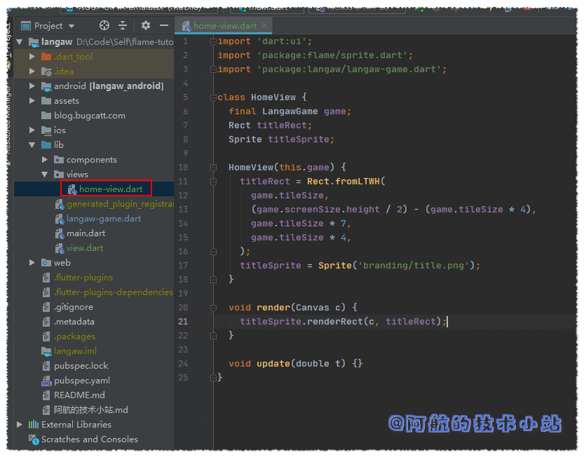

回到game类`./lib/langaw-game.dart`, 导入`HomeView`类:

```
import 'package:langaw/views/home-view.dart';
```

添加`HomeView`类型实例变量`homeView`:

```
HomeView homeView;
```

我们需要在确定屏幕尺寸后初始化此变量. 在`initialize`中, `resize`后添加:

```
homeView = HomeView(this);
```

game类代码截图:

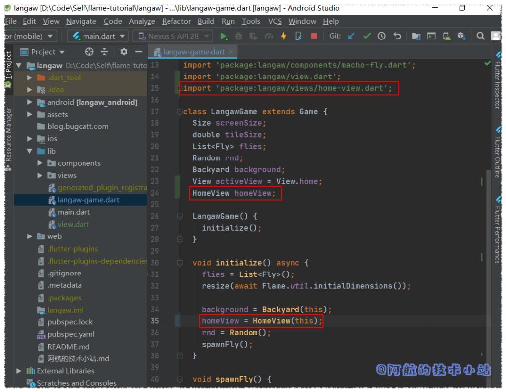

最后, 我们希望将`HomeView`渲染在屏幕上. 因此在game类的`render`函数内部, 在`render()`底部调用`HomeView`:

```
if (activeView == View.home) homeView.render(canvas);
```

> 🟡 提示: 渲染的顺序和代码顺序一致. 我们先要背景, 然后是小飞蝇, 最终是标题. 这将确保标题被置顶.

> 💡 代码解析: 我们先判断当前界面是否为home, 如果是就渲染`homeView`实例. 如果不是, `render()`就会跳过这行, `homeView`也不会被渲染.

🟢 运行游戏, 你应该会看到标题被渲染:

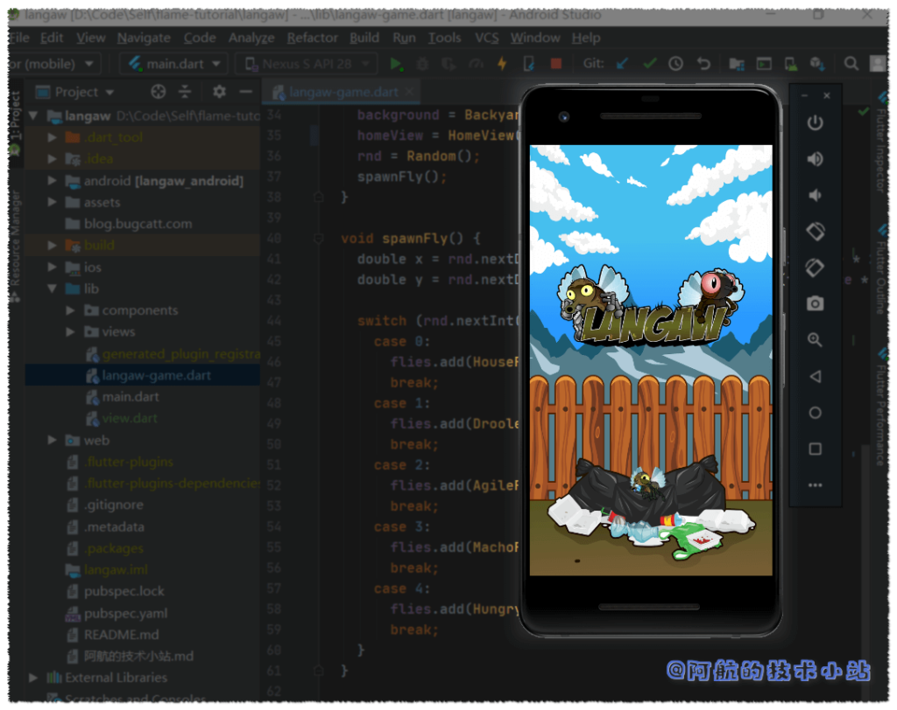

#### 开始按钮component

当进入game界面时, 玩家仍然可以击落小飞蝇. 但这对游戏没什么影响. 就像输掉比赛后小飞蝇又会重新生成. 此外, 玩家击落小飞蝇暂时不会增加分数. 后面将会讨论评分系统.

所以如果想让游戏开始, 我们必须要有一个开始按钮. 首先让我们创建另一个component, 名为`StartButton`. 创建文件`./lib/components/start-button.dart`:

```
import 'dart:ui';
import 'package:flame/sprite.dart';
import 'package:langaw/langaw-game.dart';

class StartButton {
  final LangawGame game;
  Rect rect;
  Sprite sprite;

  StartButton(this.game) {}

  void render(Canvas c) {}

  void update(double t) {}

  void onTapDown() {}
}
```

> 💡 代码解析: 类的定义和其他的一样(包括最近创建的`HomeView`). 这里需要额外关注的是`onTapDown`处理器. 这将包含"启动游戏"的代码.

进入构造函数, 初始化`rect`和`sprite`变量:

```
rect = Rect.fromLTWH(
  game.tileSize * 1.5,
  (game.screenSize.height * .75) - (game.tileSize * 1.5),
  game.tileSize * 6,
  game.tileSize * 3,
);
sprite = Sprite('ui/start-button.png');
```

> 💡 代码解析: 这几乎和`HomeView`的构造函数一样.
> 
> 最主要的区别是, 除了尺寸为`6 × 3`个区块, 还有Left和Top的偏移量.
> 
> 开始按钮的宽度是`6`个区块, 屏幕的总宽度是`9`个区块, 那么剩下`3`个区块, 两侧各剩下`1.5`个区块. 因此我们Left参数传入`game.tileSize * 1.5`.
> 
> 对于Top参数, 此计算将使按钮的垂直中心正好位于屏幕高度(从上至下)的四分之三(`0.75`). 若你对此算法有疑问, 欢迎留言.

在进行初始化`rect`和`sprite`变量后. 我们需要在`render()`中通过下面的代码来渲染图像:

```
sprite.renderRect(c, rect);
```

现在的`./lib/components/start-button.dart`代码截图:


我们现在必须添加一个`StartButton`的component实例到game类中, 打开`./lib/langaw-game.dart`, 先导入:

```
import 'package:langaw/components/start-button.dart';
```

在其他实例变量下面添加:

```
StartButton startButton;
```

在确定屏幕尺寸后, 使用新的`StartButton`初始化`startButton`变量:

```
startButton = StartButton(this);
```

将下面的代码块添加至`render()`:

```
if (activeView == View.home || activeView == View.lost) {
  startButton.render(canvas);
}
```

> 💡 代码解析: 聪明的你应该已经注意到了, 导入类、 创建该类的实例并将其存储在实例变量中, 并最终渲染该类这一套流程需要上面的四块代码. 这是渲染component的通用"套路"!🤩🤩🤩🤩

开始按钮将会同时在home界面和"you lost"界面被渲染. 这样, 玩家就可以从这两个界面开始游戏或重玩游戏.

🟢 运行游戏, 现在应该可以看到开始按钮了!

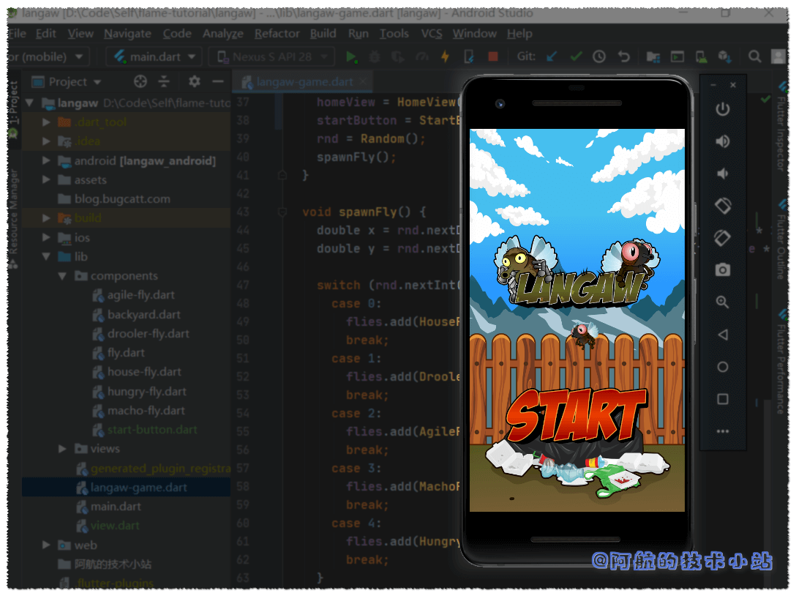

#### 绑定"开始"按钮点击

接下来我们需要让开始按钮响应玩家的点击.

首先, 我们需要确保点击不会穿过对象. 比如点击了"开始"按钮, 同一位置的小飞蝇不会收到点击事件.

在我们的game类的`onTapDown`的处理器中, 我们将创建一个变量, 该变量将保存是否调用了点击处理器.

让我们将此变量称为`isHandled`. 我们在`onTapDown`处理器的开头创建并将其默认值设置为`false`.

```
bool isHandled = false;
```

在检查点击是否击中component范围内前, 我们先要检查`isHandled`的值是否仍为`false`, 为`false`才会调用component的点击处理器.

```
if (!isHandled && startButton.rect.contains(d.globalPosition)) {
  if (activeView == View.home || activeView == View.lost) {
    startButton.onTapDown();
    isHandled = true;
  }
}
```

> 💡 代码解析: 首先, 检查`isHandled`, 确保点击事件未被处理过. 该判断还包含点击位置是否在`startButton`的`rect`内部. 如果判断通过, 再次判断玩家当前是否在home界面或lost（失败）界面.
> 
> 只有满足上述所有条件, game才会调用开始按钮的`onTapDown`处理器. 变量`isHandled`被重新赋值为`true`, 以便后面代码知道点击事件已被处理.

> 🟡 提示: 所有这些条件其实可以放在同一行`if`内进行判断, 但是为了可读性需要进行拆分. 实际上这么写代码非常丑…😑😑😑😑

下一步我们要使用`isHandled`判断来包裹当前的小飞蝇点击处理器:

```
if (!isHandled) {
  flies.forEach((Fly fly) {
    if (fly.flyRect.contains(d.globalPosition)) {
      fly.onTapDown();
      isHandled = true;
    }
  });
}
```

> 💡 代码解析: 它基本上与我们上次的代码块相同, 只有两处不同. 第一个是它被`if(isHandled)`所包住, 这样使代码块只有在点击事件还没有被处理时才允许(本例中通过start按钮, 因它是上面唯一的处理器).第二个是若至少有一只小飞蝇被击中, 则将`isHandled`变量改为true.

> 🟡 提示: 处理点击事件时, 首先检查最上面的对象. 这个与渲染的顺序截然相反. 我们应该检查最底层(首先渲染的一层)对象是否被点击. 因此, 我们首先检查最上面的对象(最后渲染的一层)的点击事件.

`onTapDown`处理器代码截图:

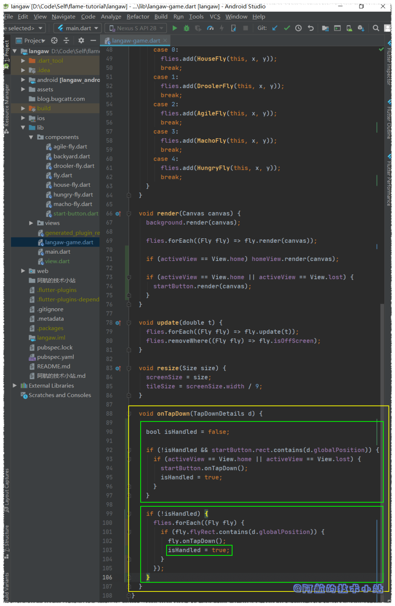

现在我们需要返回开始按钮文件(`./lib/components/start-button.dart`)

并编写可以处理实际点击的代码.

当调用开始按钮的`onTapHandler`时, 我们需要将游戏的`activeView`值设为`View.playing`. 因此, 我们需要导入`View`枚举类:

```
import 'package:langaw/view.dart';
```

在`onTapHandler()`中, 以下代码行将game的`activeView`设为正确的值:

```
game.activeView = View.playing;
```

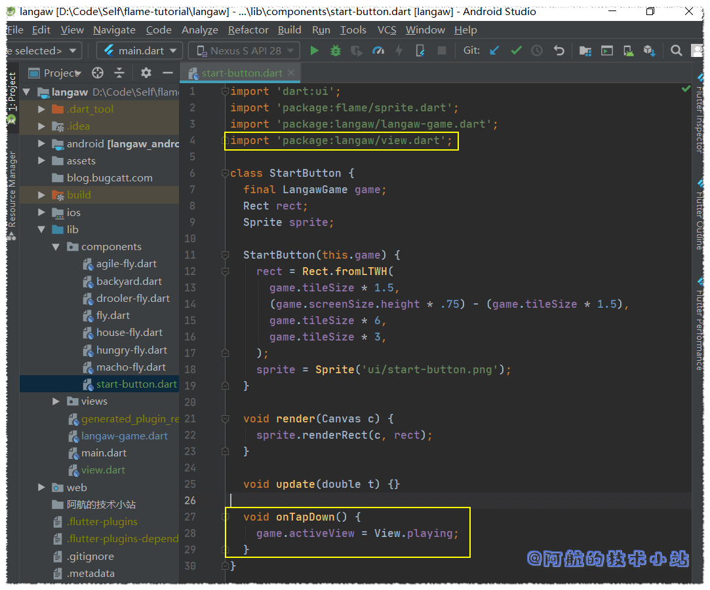

🟢 运行游戏, 测试开始游戏按钮:

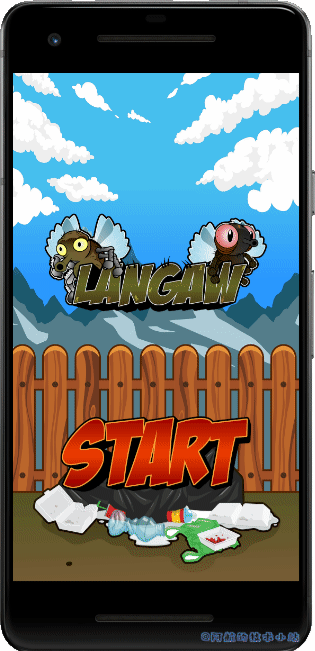

#### 游戏失败条件

在我们创建了you lost界面前, 先来讨论下玩家怎么才会输掉游戏. 有两个条件: 第一个是玩家打偏了(未击中小飞蝇). 目前我们只来处理这种情况. 下一章会来处理第二个条件以及得分系统.

若要检查是否打偏, 我们需要创建另一个布尔类型的变量, 当小飞蝇被击中时, 该变量将会作为标识. 此变量将在循环小飞蝇前定义, 便于判断命中.

打开`./lib/langaw-game.dart`并将以下变量声明放在`onTapDown`处理器中, 循环小飞蝇前:

```
bool didHitAFly = false;
```

循环小飞蝇时, 将以下行放入`if`块中, 以测试点击是否成功. 最好在将`isHandled`复制为`true`前后:

```
didHitAFly = true;
```

然后在`forEach`循环后, 我们将判断当前是否在playing界面以及点击是否击中了小飞蝇:

```
if (activeView == View.playing && !didHitAFly) {
  activeView = View.lost;
}
```

> 💡 代码解析: 在`if`中, 我们判断两件事. 第一个是当前是否在playing界面, 因为如果我们没在玩游戏就没有输赢的概念🤣🤣🤣. 另一个就是判断是否击中了小飞蝇.
> 
> 若同时满足这两个条件, 则将`activeView`的值设为`View.lost`, 该值对应you lost界面.

现在的`onTapDown`处理器截图(附注释):

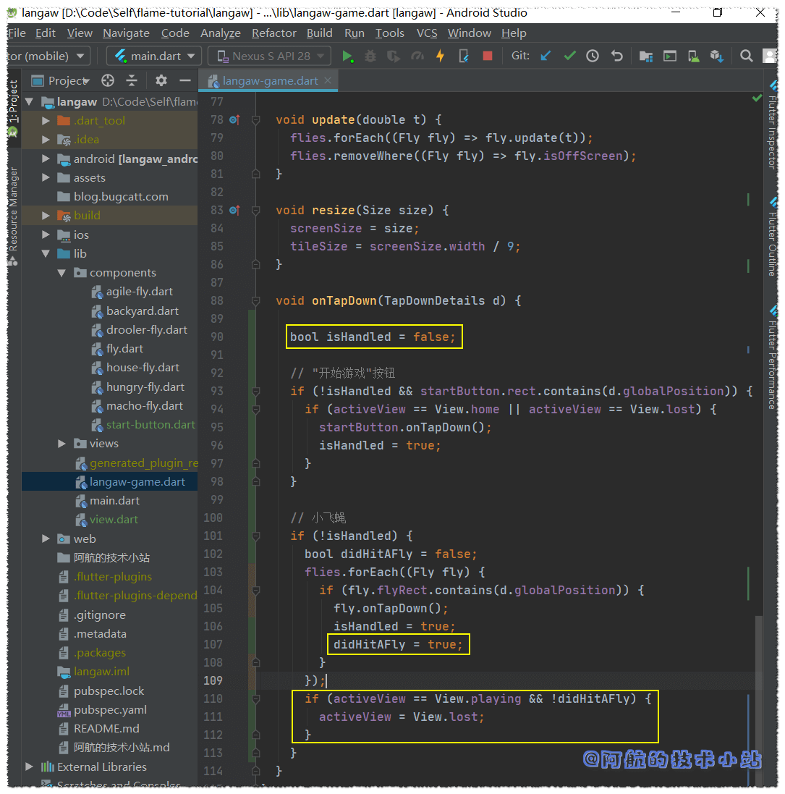

🟢 运行游戏, 若输掉游戏(打偏), 会显示开始按钮. 若你还记得render函数, "开始游戏"按钮只会在主界面和you lost界面出现:

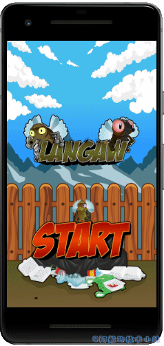

因为标题不会在输掉游戏后显示, 你可以通过此判断代码的正确性!🤓

#### you lost(游戏失败) 界面

最后一个界面几乎和主界面一模一样. 唯一的区别就是我们显示的图片不同.

在`./lib/views`创建界面文件`lost-view.dart`:

```
import 'dart:ui';
import 'package:flame/sprite.dart';
import 'package:langaw/langaw-game.dart';

class LostView {
  final LangawGame game;
  Rect rect;
  Sprite sprite;

  LostView(this.game) {
    rect = Rect.fromLTWH(
      game.tileSize,
      (game.screenSize.height / 2) - (game.tileSize * 5),
      game.tileSize * 7,
      game.tileSize * 5,
    );
    sprite = Sprite('bg/lose-splash.png');
  }

  void render(Canvas c) {
    sprite.renderRect(c, rect);
  }

  void update(double t) {}
}
```

> 💡 代码解析: 如你所见, 几乎和home界面一模一样. 区别在于`Sprite`所加载的图像文件的文件名和图像的高度是5个区块.

就像home界面一样, 我们需要回到`./lib/langaw-game.dart`, 创建`LostView`类实例, 然后进行渲染.

导入游戏失败界面:

```
import 'package:langaw/views/lost-view.dart';
```

创建实例变量:

```
LostView lostView;
```

为`lostView`实例化一个`LostView`对象, 并将其分配至`initialize()`中, 确定屏幕尺寸后:

```
lostView = LostView(this);
```

之后在`render()`中进行渲染:

```
if (activeView == View.lost) lostView.render(canvas);
```

> 💡 代码解析: 类似的, 这些代码块是将component或界面添加至game类的标配, 通用套路.

代码截图:

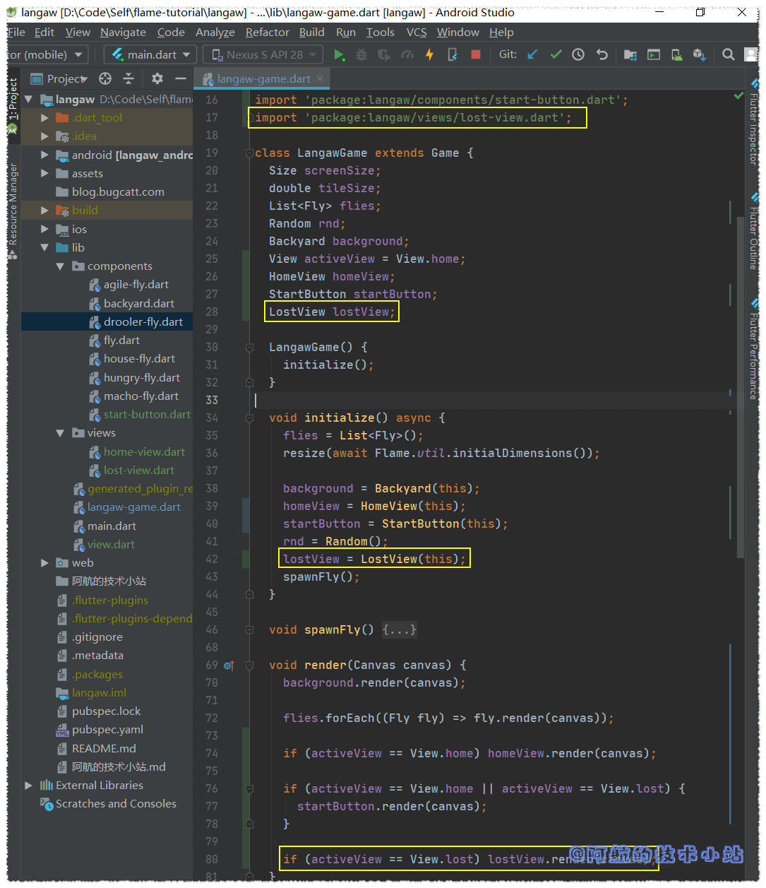

🟢 运行游戏, 点击开始按钮, 再打偏, 应该会看到`you lost`界面出现:

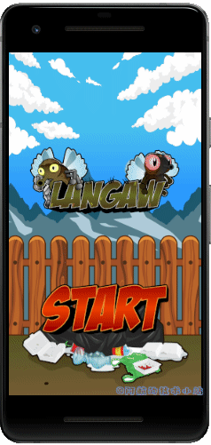

**👉在[Github](https://github.com/HarrisonQi/flame-tutorial-langaw/tree/29daf2c2d66d94a4e0169d10d73fccf94f3e49c7)或[码云](https://github.com/HarrisonQi/flame-tutorial-langaw/tree/29daf2c2d66d94a4e0169d10d73fccf94f3e49c7)上查看这部分的代码.**

### 第三步: 重构小飞蝇生成控制器

在上一部分的结尾, 我已经提到了游戏中有bug存在. 其中一个就是小飞蝇的生成方式, 有两方面:

技术层面, 使用`forEach`遍历集合时, 代码不应修改`list`(也就是添加或删除list中的项目).

实际上, 这其实不能算是传统意义的bug, 我们要直接换掉它的逻辑😅😅😅

小飞蝇的生成应该基于时间, 而不是玩家的点击!

#### 小飞蝇生成器controller

我们为此创建一个小飞蝇生成器controller. 我们最开始提到过, controller只是一个没有位置和图像的component.

在`./lib`中创建目录`controllers`. 然后在此目录中创建文件`./lib/controllers/spawner.dart`:

```
import 'package:langaw/langaw-game.dart';

class FlySpawner {
  final LangawGame game;

  FlySpawner(this.game) {}

  void start() {}

  void killAll() {}

  void update(double t) {}
}
```

> 💡 代码解析: 你现在应该很熟悉结构了. 唯一的区别就是没有`render()`函数. 因为此component(它是一个控制器)在屏幕上不会有图像展示.

像其他component和界面一样, 我们在名为game的final变量保留对`LangawGame`实例的引用, 并要求该变量的值作为构造函数的参数.

首先, 让我们编写`killAll()`, 先导入:

```
import 'package:langaw/components/fly.dart';
```

然后在`killAll()`内部, 添加此行:

```
game.flies.forEach((Fly fly) => fly.isDead = true);
```

> 💡 代码解析: 这样会循环game中所有的小飞蝇, 并将`true`赋给`isDead`, 从而让现存的全部小飞蝇死掉.

再来准备一些常量. 将如下final实例变量添加至类:

```
final int maxSpawnInterval = 3000;
final int minSpawnInterval = 250;
final int intervalChange = 3;
final int maxFliesOnScreen = 7;
```

然后在它们下面, 添加两个变量:

```
int currentInterval;
int nextSpawn;
```

等下的代码解析中会解释常量的值以及变量的用途. 现在我们来编写`start()`函数. 每当玩家点击开始按钮时, 都会调用此函数.

```
void start() {
  killAll();
  currentInterval = maxSpawnInterval;
  nextSpawn = DateTime.now().millisecondsSinceEpoch + currentInterval;
}
```

> 💡 代码解析: 从第一个常量`maxSpawnInterval`开始. 此常量是生成小飞蝇的间隔时间上限. 游戏开始时, 将`currentInterval`设置为`maxSpawnInterval`的值. 为3000毫秒(也就是3秒).
> 
> 第二个常量`minSpawnInterval`与其完全相反. 每次生成一个小飞蝇时, 都会减少`currentInterval`常量, 但只会降低到下限`250`毫秒(也就是`1/4秒`).
> 
> 第三个常量`intervalChange`是每次生成小飞蝇时从`currentInterval`减少的数量. 因此, 从第3秒开始, 小飞蝇每次生成的速率就会越来越快, 最低至`1/4`秒. 就算有总数限制, 当玩家达到了这一步, 屏幕上将会有好多小飞蝇.
> 
> 最后一个常量`maxFilesOnScreen`. 即使小飞蝇生成的速度极快, 但只要有7只小飞蝇还活着, 就不会生成更多.
> 
> `currentInterval`用于保存下一次生成时从当前时间添加的时间的量.
> 
> `nextSpawn`表示下一次生成的实际时间(时间戳).

在构造函数中, 添加如下行:

```
start();
game.spawnFly();
```

> 💡 代码解析: 第一行将计划在创建此控制器后的三秒中生成一只小飞蝇. 第二行仅用于生成小飞蝇.

这是按照顺序完成的, 因为如果我们先生成小飞蝇, 则`start()`将调用`killAll()`, 并且只会杀死第一只小飞蝇.

现在在`update()`函数内部, 我们将会拥有大量的生成逻辑. 将以下代码块放入`update()`中:

```
int nowTimestamp = DateTime.now().millisecondsSinceEpoch;

int livingFlies = 0;
game.flies.forEach((Fly fly) {
  if (!fly.isDead) livingFlies += 1;
});

if (nowTimestamp >= nextSpawn && livingFlies < maxFliesOnScreen) {
  game.spawnFly();
  if (currentInterval > minSpawnInterval) {
    currentInterval -= intervalChange;
    currentInterval -= (currentInterval * .02).toInt();
  }
  nextSpawn = nowTimestamp + currentInterval;
}
```

> 💡 代码解析: 第一行代码存储当前时间戳.
> 
> 下一块计算list中(`game.flies`)存活的小飞蝇的数量. 代码只是循环遍历list, 若小飞蝇没死掉, 则将其添加至`livingFlies`.
> 
> 接下来, 我们有一个更大的代码块, 进入`if`块, 判断当前时间是否超过`nextSpawn`值, 以及活着的小飞蝇数量是否小于`maxFliesOnScreen`常量.
> 
> 若满足条件, 我们将生成一只小飞蝇. 此后, 仅当`currentInterval`大于最小间隔(`minSpawnInterval`)时, 我们才将`interceptChange`常量中的值减去`currentInterval`值的2%来减少`currentInterval`的值.
> 
> 最后, 我们使用当前时间来安排下一个的生成, 并在其中添加`currentInterval`的值.

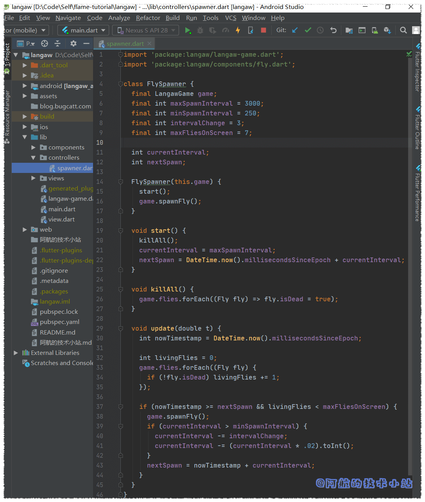

#### 将controller集成至game类

若要将生成控制器集成至game类, 首先要删除旧的对`spawnFly`的调用.

在`./lib/langaw-game.dart`中, **删除**`initialize()`中的以下行:

```
spawnFly();
```

在`./lib/components/fly.dart`中, **删除**`onTapDown`处理器的以下行:

```
game.spawnFly();
```

这样应该会解决掉上面讨论的技术错误.

返回至`./lib/langaw-game.dart`, 我们创建了生成小飞蝇controller的实例并将其存储在实例变量中. 接下来的过程应该像是S.O.P.(Standard Operating Procedures, 标准作业程序. 你也可以理解为"例行公事")

首先进行导入:

```
import 'package:langaw/controllers/spawner.dart';
```

然后创建实例变量:

```
FlySpawner spawner;
```

在`initialize()`中, 我们创建实例并将其存储在实例变量中. 在确定屏幕尺寸后添加以下行:

```
spawner = FlySpawner(this);
```

最后在`update()`内:

```
spawner.update(t);
```

在game loop中使用component和controller的主要区别在于, 我们调用的主要函数是`update`.这是因为渲染图形不是大多数controller的主要目的.

我们必须解决最后的难题: 调用生成器的`start`函数.

打开`./lib/components/start-button.dart`, 在`onTapDown`处理器中添加以下行:

```
game.spawner.start();
```

#### 测试游戏!

🟢 运行游戏, 点击"开始游戏"按钮并输掉游戏. 现在你应该有了一个**完整的游戏循环周期的游戏**: 有了开始游戏, 游戏失败和重玩游戏(这个不是game loop, 别弄混啦!)


**👉在[Github](https://github.com/HarrisonQi/flame-tutorial-langaw/tree/d908d2ead44a6c09f880eb9944deddd30d6682ef)或[码云](https://github.com/HarrisonQi/flame-tutorial-langaw/tree/d908d2ead44a6c09f880eb9944deddd30d6682ef)上查看这部分的代码.**

### 第四步: 对话框

我们的游戏进展一切顺利!🤩🤩现在我们需要让用户了解游戏并且知道游戏规则. 我们也需要添加"感谢".

我们需要使用对话框完成此操作. 实际上在幕后, 对话框只是另一种"界面".

#### 从按钮开始

我们需要创建两个按钮component并把它们放在屏幕底部. 一个在左边, 另一个在右边.

在枚举View中新增两个枚举, 分别对应教程和感谢界面:

```
enum View {
  home,
  playing,
  lost,
  help,
  credits
}
```

创建以下component:

`./lib/components/help-button.dart`

```
import 'dart:ui';
import 'package:flame/sprite.dart';
import 'package:langaw/langaw-game.dart';
import 'package:langaw/view.dart';

class HelpButton {
  final LangawGame game;
  Rect rect;
  Sprite sprite;

  HelpButton(this.game) {
    rect = Rect.fromLTWH(
      game.tileSize * .25,
      game.screenSize.height - (game.tileSize * 1.25),
      game.tileSize,
      game.tileSize,
    );
    sprite = Sprite('ui/icon-help.png');
  }

  void render(Canvas c) {
    sprite.renderRect(c, rect);
  }

  void onTapDown() {
    game.activeView = View.help;
  }
}
```

`./lib/components/credits-button.dart`

```
import 'dart:ui';
import 'package:flame/sprite.dart';
import 'package:langaw/langaw-game.dart';
import 'package:langaw/view.dart';

class CreditsButton {
  final LangawGame game;
  Rect rect;
  Sprite sprite;

  CreditsButton(this.game) {
    rect = Rect.fromLTWH(
      game.screenSize.width - (game.tileSize * 1.25),
      game.screenSize.height - (game.tileSize * 1.25),
      game.tileSize,
      game.tileSize,
    );
    sprite = Sprite('ui/icon-credits.png');
  }

  void render(Canvas c) {
    sprite.renderRect(c, rect);
  }

  void onTapDown() {
    game.activeView = View.credits;
  }
}
```

> 💡 代码解析: 又是熟悉的场景. 我们刚刚定义了相当标准的component. 这里要注意的是我们如何为每个按钮定义`Rect`.
> 
> 我们希望help(教程)按钮位于屏幕的左下角, 这就是为什么将**Left**设置为从屏幕的左边起`game.tileSize * .25`(区块大小的1/4)距离的原因. **Top**设置为屏幕高度减去`game.tileSize * 1.25`(区块大小的1又1/4). 这会将按钮的底部放置在距离屏幕底部正好1/4的位置.
> 
> 感谢按钮对**Top**和**Left**使用类似的算法. 除了**Left**使用屏幕的宽度外, 将按钮定位在屏幕的右下角.
> 
> 两个按钮的尺寸均为一个区块的正方形.
> 
> 这里要注意的另一件事是`onTapDown`处理器. 调用这些处理器后, game类的`activeView`属性的值将设置为正确的值.`View.help`(教程对话框)和`View.credits`(感谢对话框).

现在, 我们需要通过导入两个按钮类文件, 将这些按钮添加至game类(`./lib/langaw-game.dart`)中:

```
import 'package:langaw/components/credits-button.dart';
import 'package:langaw/components/help-button.dart';
```

创建实例变量:

```
HelpButton helpButton;
CreditsButton creditsButton;
```

在`initialize()`中, 为刚创建的实例变量实例化一个教程和感谢按钮:

```
helpButton = HelpButton(this);
creditsButton = CreditsButton(this);
```

我们需要渲染这些按钮, 所以在`render()`中添加下面的代码块. 必须放在`if`中, 检查`activeView`是否设为`View.home`或`View.lost`(在渲染开始按钮的上方或下方):

```
helpButton.render(canvas);
creditsButton.render(canvas);
```

最后, 通过将以下代码块放入game类的`onTapDown`处理器中, 为`onTapDown`处理器添加处理:

```
// 教程按钮
if (!isHandled && helpButton.rect.contains(d.globalPosition)) {
  if (activeView == View.home || activeView == View.lost) {
    helpButton.onTapDown();
    isHandled = true;
  }
}

// 感谢按钮
if (!isHandled && creditsButton.rect.contains(d.globalPosition)) {
  if (activeView == View.home || activeView == View.lost) {
    creditsButton.onTapDown();
    isHandled = true;
  }
}
```

> 💡 代码解析: 检查三个条件:
> 
> 1\. 尚未处理过点击事件(`!isHandled`)  
> 2\. 点击位置在按钮的`rect`范围内.  
> 3\. `activeView`必须设置为`View.help`或`View.credits`.

满足这些条件后, 我们将调用按钮的`onTapDown`处理器, 并将`isHandled`值变为true, 用以通知下个处理器该点击已被处理.

若现在运行游戏, 应该看到两个按钮了:


点击这些按钮将会展现对应的界面, 但现在这几个界面暂时不显示任何东西.

#### 对话框

显示对话框, 我们将使用类似home和you lost界面的方式.

创建以下界面:

`./lib/views/help-view.dart`

```
import 'dart:ui';
import 'package:flame/sprite.dart';
import 'package:langaw/langaw-game.dart';

class HelpView {
  final LangawGame game;
  Rect rect;
  Sprite sprite;

  HelpView(this.game) {
    rect = Rect.fromLTWH(
      game.tileSize * .5,
      (game.screenSize.height / 2) - (game.tileSize * 6),
      game.tileSize * 8,
      game.tileSize * 12,
    );
    sprite = Sprite('ui/dialog-help.png');
  }

  void render(Canvas c) {
    sprite.renderRect(c, rect);
  }
}
```

`./lib/views/credits-view.dart`

```
import 'dart:ui';
import 'package:flame/sprite.dart';
import 'package:langaw/langaw-game.dart';

class CreditsView {
  final LangawGame game;
  Rect rect;
  Sprite sprite;

  CreditsView(this.game) {
    rect = Rect.fromLTWH(
      game.tileSize * .5,
      (game.screenSize.height / 2) - (game.tileSize * 6),
      game.tileSize * 8,
      game.tileSize * 12,
    );
    sprite = Sprite('ui/dialog-credits.png');
  }

  void render(Canvas c) {
    sprite.renderRect(c, rect);
  }
}
```

> 💡 代码解析: 如你所见, 这些代码和我们在本部分开头的代码十分相似.
> 
> 两个对话框的大小均为`8 × 12`个区块. 因此为了使对话框居中, 我们将Left参数值设为半个区块. Top参数值设为屏幕高度的一半减去半个区块.

距离胜利不远啦! 我们只需要将这些view添加到game类中即可. 轻车熟路, 先导入:

```
import 'package:langaw/views/help-view.dart';
import 'package:langaw/views/credits-view.dart';
```

创建view实例变量:

```
HelpView helpView;
CreditsView creditsView;
```

在`initialize`中, 实例化上面的变量:

```
helpView = HelpView(this);
creditsView = CreditsView(this);
```

然后在`render`函数中, 添加以下代码块. 记住渲染的顺序和代码顺序一致. 对话框需要渲染在顶部, 所以将它们放在末尾:

```
if (activeView == View.help) helpView.render(canvas);
if (activeView == View.credits) creditsView.render(canvas);
```

在`onTapDown`处理器中, 我们检查点击是否尚未被处理, 然后检查是否在教程或感谢界面中, 若为是, 将界面设置为home, 并将`isHandled`变量设为`true`, 保证后续代码不会执行:

```
if (!isHandled) {
  if (activeView == View.help || activeView == View.credits) {
    activeView = View.home;
    isHandled = true;
  }
}
```

game类过长不便截图, 这里展示`./lib/langaw-game.dart`的全部代码:

```
import 'dart:math';
import 'dart:ui';

import 'package:flame/flame.dart';
import 'package:flame/game.dart';
import 'package:flutter/gestures.dart';
import 'package:langaw/components/agile-fly.dart';
import 'package:langaw/components/backyard.dart';
import 'package:langaw/components/credits-button.dart';
import 'package:langaw/components/drooler-fly.dart';
import 'package:langaw/components/fly.dart';
import 'package:langaw/components/help-button.dart';
import 'package:langaw/components/house-fly.dart';
import 'package:langaw/components/hungry-fly.dart';
import 'package:langaw/components/macho-fly.dart';
import 'package:langaw/components/start-button.dart';
import 'package:langaw/controllers/spawner.dart';
import 'package:langaw/view.dart';
import 'package:langaw/views/home-view.dart';
import 'package:langaw/views/lost-view.dart';
import 'package:langaw/views/help-view.dart';
import 'package:langaw/views/credits-view.dart';

class LangawGame extends Game {
  Size screenSize;
  double tileSize;
  List flies;
  Random rnd;
  Backyard background;
  View activeView = View.home;
  HomeView homeView;
  StartButton startButton;
  LostView lostView;
  FlySpawner spawner;
  HelpButton helpButton;
  CreditsButton creditsButton;
  HelpView helpView;
  CreditsView creditsView;

  LangawGame() {
    initialize();
  }

  void initialize() async {
    flies = List();
    resize(await Flame.util.initialDimensions());

    background = Backyard(this);
    homeView = HomeView(this);
    startButton = StartButton(this);
    rnd = Random();
    lostView = LostView(this);
    spawner = FlySpawner(this);

    helpButton = HelpButton(this);
    creditsButton = CreditsButton(this);

    helpView = HelpView(this);
    creditsView = CreditsView(this);
  }

  void spawnFly() {
    double x = rnd.nextDouble() * (screenSize.width - (tileSize * 2.025));
    double y = rnd.nextDouble() * (screenSize.height - (tileSize * 2.025));

    switch (rnd.nextInt(5)) {
      case 0:
        flies.add(HouseFly(this, x, y));
        break;
      case 1:
        flies.add(DroolerFly(this, x, y));
        break;
      case 2:
        flies.add(AgileFly(this, x, y));
        break;
      case 3:
        flies.add(MachoFly(this, x, y));
        break;
      case 4:
        flies.add(HungryFly(this, x, y));
        break;
    }
  }

  void render(Canvas canvas) {
    background.render(canvas);

    flies.forEach((Fly fly) => fly.render(canvas));

    if (activeView == View.home) homeView.render(canvas);

    if (activeView == View.home || activeView == View.lost) {
      startButton.render(canvas);
      helpButton.render(canvas);
      creditsButton.render(canvas);
    }

    if (activeView == View.lost) lostView.render(canvas);

    if (activeView == View.help) helpView.render(canvas);
    if (activeView == View.credits) creditsView.render(canvas);
  }

  void update(double t) {
    flies.forEach((Fly fly) => fly.update(t));
    flies.removeWhere((Fly fly) => fly.isOffScreen);

    spawner.update(t);
  }

  void resize(Size size) {
    screenSize = size;
    tileSize = screenSize.width / 9;
  }

  void onTapDown(TapDownDetails d) {
    bool isHandled = false;

    // 弹窗
    if (!isHandled) {
      if (activeView == View.help || activeView == View.credits) {
        activeView = View.home;
        isHandled = true;
      }
    }

    // "开始游戏"按钮
    if (!isHandled && startButton.rect.contains(d.globalPosition)) {
      if (activeView == View.home || activeView == View.lost) {
        startButton.onTapDown();
        isHandled = true;
      }
    }

    // 小飞蝇
    if (!isHandled) {
      bool didHitAFly = false;
      flies.forEach((Fly fly) {
        if (fly.flyRect.contains(d.globalPosition)) {
          fly.onTapDown();
          isHandled = true;
          didHitAFly = true;
        }
      });
      if (activeView == View.playing && !didHitAFly) {
        activeView = View.lost;
      }
    }

    // 教程按钮
    if (!isHandled && helpButton.rect.contains(d.globalPosition)) {
      if (activeView == View.home || activeView == View.lost) {
        helpButton.onTapDown();
        isHandled = true;
      }
    }

    // 感谢按钮
    if (!isHandled && creditsButton.rect.contains(d.globalPosition)) {
      if (activeView == View.home || activeView == View.lost) {
        creditsButton.onTapDown();
        isHandled = true;
      }
    }
  }
}
```

🟢 运行游戏, 看看效果:

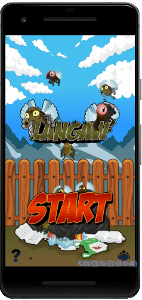

**👉在[Github](https://github.com/HarrisonQi/flame-tutorial-langaw/tree/277749ae54484b45e0ac5be6020eef463f8e4536)或[码云](https://github.com/HarrisonQi/flame-tutorial-langaw/tree/277749ae54484b45e0ac5be6020eef463f8e4536)上查看本章的代码.**

## 测试游戏!

运行你的游戏, 看看我们的成果吧!

## 结语

又经过了一个干货满满的教程, 我们随着游戏的进展, 通过几个小步骤使游戏变得更加完整了.

如果你出现了不懂的地方, 不要犹豫, 欢迎在评论区留言! 也欢迎你加入[我的Flame交流群(QQ)](https://jq.qq.com/?_wv=1027&k=5ETLFm3)

## 下一步会干什么?

在下一章,我们将会处理一些新颖的东西.

音乐和音效.

不仅如此, 我们还会添加得分机制, 一个简单的游戏积分. 当然, 还会记录最高分.

## 感谢

- 本篇文章参考原作[《Views and Dialog Boxes Tutorial – Step by Step with Flame and Flutter (Part 3 of 5)》](https://jap.alekhin.io/views-dialog-boxes-tutorial-flame-flutter-part-3).
- flame [github仓库地址](https://github.com/flame-engine/flame)
- pub.dev [官方网址](https://pub.flutter-io.cn/packages/flame)
- [Impart](http://www.ewenk.com/) 发现了文章问题
