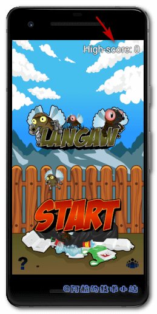
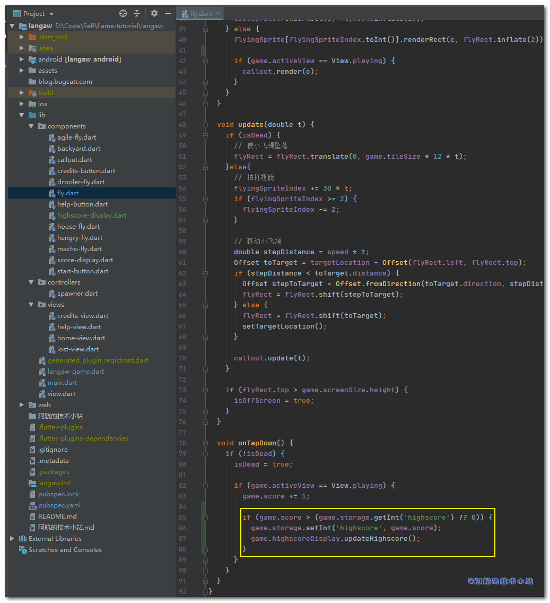
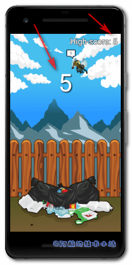

## 引言

**分数**和**高分记录**是任何游戏中不可或缺的一部分. 有些游戏根据收集的金币数量计算得分, 有些基于杀敌数, 有些则基于存活时间.

同样不能忽视**音效**和**BGM**(背景音乐). 加上它们, 游戏将会蜕变🦋.

如果一个游戏无声, 它就是不完整的.

欢迎来到Flutter+Flame系列的第四章. 如果你还没有读过之前的章节, 建议你先阅读一下哦!🤭

🔴 注意: 本教程的背景音乐有些过时. 你可以先学本章教程, 之后再替换为[这篇教程](https://jap.alekhin.io/background-music-in-a-flame-game)

下面是我们本系列教程的文章目录:

- [Flutter 游戏开发(flame) Flame介绍](/post/2020/flutter-游戏开发flame-01-初识flame/)
- [Flutter 游戏开发(flame) 01 开发2D休闲游戏：消灭小飞蝇(1/5)](/post/2020/flutter-游戏开发flame-01-开发2d休闲游戏：消灭小飞蝇1-5/)
- [Flutter 游戏开发(flame) 02 图形和动画(2/5)](/post/2020/flutter-游戏开发flame-02-图形和动画2-5/)
- [Flutter 游戏开发(flame) 03 界面和弹窗(3/5)](/post/2020/flutter-游戏开发flame-03-界面和弹窗3-5/)
- **Flutter 游戏开发(flame) 04 分数, 存档和音效(4/5) 本章**
- [Flutter 游戏开发(flame) 05 收尾和打包(5/5)](/post/2020/flutter-游戏开发flame-05-收尾和打包/)

## 需具备的条件

1. 本系列教程之前的**全部要求**👈
2. **更多的资源包** – 本教程提供了资源包, 但你也可以使用自己的. 推荐资源网站[Open Game Art](https://opengameart.org/).
3. **音效和音乐资源** - 这些也可以在游戏资源网站上找到, 比如[Open Game Art](https://opengameart.org/). 还有专门的音频资源比如[BenSound.com](https://www.bensound.com/). 同样, 你必须查看许可并在游戏中表示感谢.

我们将使用与前一部分相同的**编码规范**👩‍🏫

**👉在[Github](https://github.com/HarrisonQi/flame-tutorial-langaw/tree/e72da435c3100a1601e16e75efc62fbaea6b3fe6)或[码云](https://github.com/HarrisonQi/flame-tutorial-langaw/tree/e72da435c3100a1601e16e75efc62fbaea6b3fe6)上查看本章全部代码**

## 新的资源包

这一部分中, 我们需要另一个资源包, 包含额外的图形、背景音乐和一些音效.

[](https://jap.alekhin.io/wp-content/uploads/2019/04/resource-pack-part-4.zip)

[点击图片或此处进行下载](https://jap.alekhin.io/wp-content/uploads/2019/04/resource-pack-part-4.zip)

* * *

\[epcl\_box type="error"\]**注意**: 如果你遵循本教程, 则可以使用上述资源包. 本资源包是[Github上Langaw(原作者)](https://github.com/japalekhin/langaw)项目的一部分, 该项目获得`CC-BY-NC-ND`许可证的许可.\[/epcl\_box\]

这意味着您可以共享、复制或者重新分发资源.

- 你必须在感谢中提到, 提供许可证的链接, 并标明你是否进行了更改.
- 你不得将资源用于商业目的.
- 如果混合, 转换或者构建资源, 则不能分发修改后的资源.
- 你不得应用法律条款或技术措施, 在法律上限制他人做许可证允许的任何事情.

[点击此处了解有关 CC-BY-NC-ND 许可证的更多信息](https://creativecommons.org/licenses/by-nc-nd/2.0/legalcode)

\[epcl\_box type="notice"\]阿航在这里提醒: 目前国内的版权保护做的不够好. 希望大家能够保护资源原作者辛苦的创作🙏🙏! 不能使用未经许可且无版权的资源, 向盗版说不👋!\[/epcl\_box\]

* * *

## 继续开发

在这部分中, 我们将专注于**分数**和**音效**.

我们将使用另一个Flutter库来记录, 保存玩家的最高分.

至于音效, 我们将使用Flame中的音频库.

### 第一步: 评分

目前为止, 游戏的目标只是不停的击杀小飞蝇, 直到玩家打偏. 除此之外, 没有目标.

我们来添加一个目标. 在玩家击中小飞蝇时得一分, 并累计到当前分数中. 与其他的游戏一样, 分数将从零开始, 并在新游戏时重置.

#### 新建用于记录分数的实例变量

首先来到`./lib/langaw-game.dart`, 添加实例变量:

```
int score;
```

**小提示**: 只需要添加到其他实例变量的下方.

在`initialize()`中, 初始化`score`的值:

```
score = 0;
```

我们需要玩家每次点击开始游戏按钮时, 重置此值.

跳转至`./lib/components/start-button.dart`, 在`onTapDown`处理器中添加:

```
game.score = 0;
```

#### 显示分数

到目前为止还是蛮顺利的😏! 接下来我们把分数显示出来.

我们可以选择在game类中进行渲染. 但是由于展示的东西比较少, 我们将该逻辑封装在自己的component.

创建一个组件`./lib/components/score-display.dart`:

```
import 'dart:ui';
import 'package:flutter/painting.dart';
import 'package:langaw/langaw-game.dart';

class ScoreDisplay {
  final LangawGame game;

  ScoreDisplay(this.game) {}

  void render(Canvas c) {}

  void update(double t) {}
}
```

> 💡 代码解析: 从`import`开始, `dart:ui`使我们可以访问`Canvas`和`Offset`; `package:flutter/painting`使我们可以访问`TextPainter`; `package:langaw/langaw-game.dart`使我们可以访问game类.
> 
> 🟡 提示: 我们已经有了一个名为`game`的实例变量, 在创建此类的实例时必须传入此变量. 与我们在签名的component中定义的其他component、controller和view一致.

让我们再添加三个实例变量: `TextPainter`类型的`painter`, 用于渲染分数值; `textStyle`控制分数样式; `position`决定分数的`Offset`(偏移量):

```
TextPainter painter;
TextStyle textStyle;
Offset position;
```

然后我们来处理构造函数, 在其中初始化实例变量值:

```
ScoreDisplay(this.game) {
  painter = TextPainter(
    textAlign: TextAlign.center,
    textDirection: TextDirection.ltr,
  );

  textStyle = TextStyle(
    color: Color(0xffffffff),
    fontSize: 90,
    shadows: [
      Shadow(
        blurRadius: 7,
        color: Color(0xff000000),
        offset: Offset(3, 3),
      ),
    ],
  );

  position = Offset.zero;
}
```

> 💡 代码解析: 首先, 使用创建一个新的`TextPainter`用于初始化`painter`. 将其`textAlign`属性设置为居中, 因为我们将在屏幕上水平居中显示得分. 由于游戏是英文的(书写方向为从左至右), 我们将`textDirection`属性设置为**LTR**(Left-to-Right).
> 
> 接下来, 使用`TextStyle`初始化`textStyle`属性. 设置三个属性:`color`设置为`Color(0xffffffff)`(纯白色); 字体大小为`90 逻辑像素`; 并且将`shadows`属性设置为包含一项的类型为`Shadow`的`List`. 此项定义一个阴影, 该阴影在右侧和底部偏移3个逻辑像素. 如果分数在另一个白色对象的顶部渲染(比如白云), 通过阴影可以增加对比度, 更容易看清.
> 
> 想了解有关逻辑像素的更多信息, 请查看[Flutter官方文档(英文)](https://api.flutter.dev/flutter/dart-ui/Window/devicePixelRatio.html)

`update`函数实际上发生在渲染之前(无论是初始化还是在game loop中), 所以让我们首先来写它:

```
void update(double t) {
  if ((painter.text?.text ?? '') != game.score.toString()) {
    painter.text = TextSpan(
      text: game.score.toString(),
      style: textStyle,
    );

    painter.layout();

    position = Offset(
      (game.screenSize.width / 2) - (painter.width / 2),
      (game.screenSize.height * .25) - (painter.height / 2),
    );
  }
}
```

> 💡 代码解析: 为了避免不必要的文本布局重新计算, 若变量`painter`的(文本属性的)`text`属性与当前分数的字符串相等, 就不会发生任何事情.

通过以下判断完成:

```
(painter.text?.text ?? '') != game.score.toString()
```

这个表达式左侧看起来比较复杂, 所以在此解释一下. 此表达式使用Dart的null运算符.  
`?.`用于检查其左边的变量是否为`null`, 若为`null`则立即停止表达式并返回`null`. 我们已经知道`Painter`已经初始化且不为`null`, 因此我们不用检查它. 我们不确定的是`painter`的`text`属性是否为`null`, 因此我们使用该运算符.

使用的另一个运算符是`??.`. 若左侧不为null, 返回左侧表达式; 若为null, 返回右侧表达式.

对于整个表达式, 如果未设置`painter`的`text`属性, 则整个`painter.text?.text`返回`null`. 由于其后跟随了一个`??`, 因此if的返回值是一个空字符串. 最终的值是与`game.score.toString()`进行比较的结果. 另一方面, 如果没有设置`painter`的`text`属性, 则会返回当前的实际分数.

你可以在这篇[《Dart 中的 Null-aware (null感知运算符)》](/post/2020/dart-中的-null-aware-null感知运算符/)获取Null-aware运算符(Null感知运算符)的更多信息!

现在如果`painter`的text与当前分数不一致, 我们用一个新的`TextSpan`的实例来更新它的text属性, 该实例将获取游戏中`score`变量和可重复使用的`textStyle`变量的当前值. 然后调用`layout`函数, 以便`TextPainter`可以计算刚刚分配的新文本的尺寸.

然后, 我们用一个新的`Offset`实例并将其分配给`position`变量. 我们希望分数水平居中. 至于垂直方位, 我们将score的垂直中心放在距屏幕顶部约1/4的高度上.

若有其他问题, 欢迎加入[我的Flame交流群(QQ)](https://jq.qq.com/?_wv=1027&k=5ETLFm3).

最终在`render`函数中, 添加下面的代码块:

```
void render(Canvas c) {
  painter.paint(c, position);
}
```

> 💡 代码解析: 通过调用`painter`的`paint()`并提供所需的参数来渲染分数: 一个可以用于绘制的画布并且用`Offset`告诉painter在哪里绘制分数.

整个的`./lib/components/score-display.dart`文件应该像这样:

```
import 'dart:ui';
import 'package:flutter/painting.dart';
import 'package:langaw/langaw-game.dart';

class ScoreDisplay {
  final LangawGame game;
  TextPainter painter;
  TextStyle textStyle;
  Offset position;

  ScoreDisplay(this.game) {
    painter = TextPainter(
      textAlign: TextAlign.center,
      textDirection: TextDirection.ltr,
    );

    textStyle = TextStyle(
      color: Color(0xffffffff),
      fontSize: 90,
      shadows: [
        Shadow(
          blurRadius: 7,
          color: Color(0xff000000),
          offset: Offset(3, 3),
        ),
      ],
    );

    position = Offset.zero;
  }

  void render(Canvas c) {
    painter.paint(c, position);
  }

  void update(double t) {
    if ((painter.text?.text ?? '') != game.score.toString()) {
      painter.text = TextSpan(
        text: game.score.toString(),
        style: textStyle,
      );

      painter.layout();

      position = Offset(
        (game.screenSize.width / 2) - (painter.width / 2),
        (game.screenSize.height * .25) - (painter.height / 2),
      );
    }
  }
}
```

#### 绘制分数component

若要真正的把分数component渲染在屏幕上, 我们必须将其添加至game类, 并将其包含在game loop中.

老规矩, 打开`./lib/langaw-game.dart`, 导入刚刚创建的类:

```
import 'package:langaw/components/score-display.dart';
```

创建`ScoreDisplay`类型的实例变量:

```
ScoreDisplay scoreDisplay;
```

在`initialize()`中(调用`resize`之后)创建一个新的`ScoreDisplay`实例, 并将其赋值给`scoreDisplay`变量(注意大小写哦), 最好在初始化按钮的下方:

```
scoreDisplay = ScoreDisplay(this);
```

在`update()`内部, 判断当前的界面是否为`View.playing`, 若是, 则调用`scoreDisplay`的`update`函数. 你可以将此行放在任何地方.

在函数末尾添加:

```
if (activeView == View.playing) scoreDisplay.update(t);
```

然后在game类的`render()`中, 我们做类似的事情, 但是是调用`render()`. 记住在此函数内写入行的顺序是图形在屏幕上绘制的实际顺序.

我们希望score正好高于背景, 低于其他的所有东西. 小飞蝇可以飞越它. 因此, 在渲染背景后添加:

```
if (activeView == View.playing) scoreDisplay.render(canvas);
```


#### 处理小飞蝇加分

玩家想要加分, 必须击落小飞蝇.

要拥有这套逻辑, 打开`./lib/components/fly.dart`. 为了等下使用, 导入`View`枚举类.

```
import 'package:langaw/view.dart';
```

在`onTapDown`处理器内部, 替换已存在的那一行代码为:

```
if (!isDead) {
  isDead = true;

  if (game.activeView == View.playing) {
    game.score += 1;
  }
}
```

> 💡 代码解析: 当一只小飞蝇被点击, 我们首先要检查它是否活着(`!isDead`). 如果小飞蝇已经挂掉, 那么什么也不会发生. 如果还活着, 我们设置其`isDead`参数值为`true`让component知道小飞蝇已经死掉.
> 
> 之后, 我们将判断当前界面是否为playing. 如果玩家没有开始游戏, 那么就不需要新增分数. 若玩家在游戏中, 则增加分数. 这将更新`ScoreDisplay`实例.

运行游戏, 你应该可以看到分数了:


#### 进阶版小飞蝇

小飞蝇不仅仅是飞来飞去, 它们同时也会进食. 另外, 若玩家只是伺机而动精准击落小飞蝇, 多少有些无聊🤐🤐.

让我们再来添加一个游戏失败的条件😲.

一旦小飞蝇出现在屏幕上, 它会显示一个倒数的计数器. 这个计数器相当于小飞蝇还有多久"吃完". 当计数器归零时, 意味着小飞蝇"吃完", 游戏失败.

这样游戏就增加了挑战性, 没有之前那么无聊了.

我们必须确保玩家可以注意到计数器, 看看那些小飞蝇即将归零. 我们将使用资源包中的标注图形来显示此计数器.

让我们添加资源包中的标注图形`./assets/images/ui/callout.png`到资源目录中, 然后要把它注册进`./pubspec.yaml`中:

```
    - assets/images/ui/callout.png
```

然后打开`./lib/main.dart`并添加`ui/callout.png`到预加载的图像List中. 在`Flame.images.loadAll`中:

```
Flame.images.loadAll([
  // 其他的图片资源
  'ui/callout.png',
]);
```

然后, 创建为此标注创建一个component, `./lib/components/callout.dart`:

```
import 'dart:ui';
import 'package:flame/sprite.dart';
import 'package:flutter/material.dart';
import 'package:langaw/components/fly.dart';

class Callout {
  final Fly fly;
  Rect rect;
  Sprite sprite;
  double value;

  TextPainter tp;
  TextStyle textStyle;
  Offset textOffset;

  Callout(this.fly) {}

  void render(Canvas c) {}

  void update(double t) {}
}
```

> 💡 代码解析: 这里我们又创建了一个相当标准的component. 只不过引入的不是`game`而是fly. 就像fly component的子类一样.

此类具有其他实例变量, 这些实例变量将用于绘制标注中的值.

继续初始化构造函数的值:

```
Callout(this.fly) {
  sprite = Sprite('ui/callout.png');
  value = 1;
  tp = TextPainter(
    textAlign: TextAlign.center,
    textDirection: TextDirection.ltr,
  );
  textStyle = TextStyle(
    color: Color(0xff000000),
    fontSize: 15,
  );
}
```

> 💡 代码解析: 别头大, body实际上只有4行. 为了便于阅读才把它垂直伸展开. 在构造函数内部, 我们只为实例变量分配初始化值. 在`update`函数中, 我们将变量减少一定的值, 若降至0, 则将游戏中的当前界面改为`you lose`. 当然, 上述操作仅在界面为`playing`时才进行.

先导入:

```
import 'package:langaw/view.dart';
```

再将以下代码块放入`update`函数中:

```
if (fly.game.activeView == View.playing) {
  value = value - .5 * t;
  if (value <= 0) {
    fly.game.activeView = View.lost;
  }
}
```

> 💡 代码解析: 首先, 检查界面是否为`View.playing`, 若是则从值中减去`0.5 * t`. `t`变量包含上次调用`update`时间的1/2. 此计算可确保小飞蝇的寿命为2秒.
> 
> 然后我们判断该值是否为0. 若是则告诉玩家输掉游戏.

之后我们确保此标注的`rect`变量已更新, 以便`render()`相对于父级`fly`正确放置. 该代码块刚好在减少`value`块下方:

```
rect = Rect.fromLTWH(
  fly.flyRect.left - (fly.game.tileSize * .25),
  fly.flyRect.top - (fly.game.tileSize * .5),
  fly.game.tileSize * .75,
  fly.game.tileSize * .75,
);
```

> 💡 代码解析: 到目前为止, 与我们完成的所有其他`Rect`的初始化一致, 实际上只有一行代码. 最后两个参数是`rect`的**宽**度和**高**度, 它们都设置为区块大小的3/4. **L**eft的值与小飞蝇的`rect`减去区块大小的1/4相同. **T**op的值使用相同的逻辑, 不同的是减去区块大小的1/2.

仍然在`update`函数中, 最后的代码块将更新文本painter, 该painter在标注图形中绘制当前的值.

```
tp.text = TextSpan(
  text: (value * 10).toInt().toString(),
  style: textStyle,
);
tp.layout();
textOffset = Offset(
  rect.center.dx - (tp.width / 2),
  rect.top + (rect.height * .4) - (tp.height / 2),
);
```

> 💡 代码解析: 由于我们已经使用`TextPainter`类的实例初始化了`tp`变量, 因此我们只是将其`text`属性设置为`TextSpan`类的实例, 将当前值乘以10转换为整数, 然后转换为字符串.

该值乘以10, 就好像从9数到0一行.

然后我们调用`layout`函数, 以便`tp`知道将给文本字符串和提供给它的样式以及文本大小.

接下来, 我们使用新的`Offset`来更新`textOffset`的值, 该`Offset`会传递一个计算, 将文本居中在标注的白色区域内.

最后编写`render()`:

```
void render(Canvas c) {
    if (rect != null){
      sprite.renderRect(c, rect);
      tp.paint(c, textOffset);
    }
}
```

> 💡 代码解析: 首先我们渲染标注(现在应该比较熟悉了). 然后我们使用`TextPainter`的`paint`函数来绘制文本, 并传递我们刚刚在`update`函数中更新的`textOffset`变量.

整个的Callout类:

```
import 'dart:ui';
import 'package:flame/sprite.dart';
import 'package:flutter/material.dart';
import 'package:langaw/components/fly.dart';

import 'package:langaw/view.dart';

class Callout {
  final Fly fly;
  Rect rect;
  Sprite sprite;
  double value;

  TextPainter tp;
  TextStyle textStyle;
  Offset textOffset;

  Callout(this.fly) {
    sprite = Sprite('ui/callout.png');
    value = 1;
    tp = TextPainter(
      textAlign: TextAlign.center,
      textDirection: TextDirection.ltr,
    );
    textStyle = TextStyle(
      color: Color(0xff000000),
      fontSize: 15,
    );
  }

  void render(Canvas c) {
    if (rect != null){
      sprite.renderRect(c, rect);
      tp.paint(c, textOffset);
    }
  }

  void update(double t) {
    if (fly.game.activeView == View.playing) {
      value = value - .5 * t;
      if (value <= 0) {
        fly.game.activeView = View.lost;
      }
    }
    rect = Rect.fromLTWH(
      fly.flyRect.left - (fly.game.tileSize * .25),
      fly.flyRect.top - (fly.game.tileSize * .5),
      fly.game.tileSize * .75,
      fly.game.tileSize * .75,
    );

    tp.text = TextSpan(
      text: (value * 10).toInt().toString(),
      style: textStyle,
    );
    tp.layout();
    textOffset = Offset(
      rect.center.dx - (tp.width / 2),
      rect.top + (rect.height * .4) - (tp.height / 2),
    );
  }
}
```

现在我们只需将标注component添加至

`Fly`类中. 此过程应该也比较熟悉了, 因为我们在前面做过类似的操作. 打开`./lib/components/fly.dart`, 导入`Callout`:

```
import 'package:langaw/components/callout.dart';
```

添加实例变量用于保存callout:

```
Callout callout;
```

在`Fly`构造函数中, 初始化`callout`变量并且使用`this`关键字用于传入当前的Fly:

```
callout = Callout(this);
```

如果小飞蝇没有死掉, 那么标注就需要进行更新. 因此在`Fly`的`update`函数内, 在`else`(小飞蝇尚未死掉)代码块底部添加:

```
callout.update(t);
```

最终, 若小飞蝇还没死(`else`块内)并且当前的界面为`playing`, 则渲染标注. 添加到`render`中:

```
if (game.activeView == View.playing) {
  callout.render(c);
}
```

🟢 运行游戏, 看看效果:


**👉在[Github](https://github.com/HarrisonQi/flame-tutorial-langaw/tree/904d05b9be2293cd9dede4acfcc86c93e1097468)或[码云](https://github.com/HarrisonQi/flame-tutorial-langaw/tree/904d05b9be2293cd9dede4acfcc86c93e1097468)上查看这部分的代码.**

### 第二步: 存储最高分

如果游戏没有记录最高分, 那么获得这个宝贵的分数将是一种浪费.

让我们来记录最高分, 这样玩家就可以不断突破自己, 取得更高的分数.

记录最高分, 仅需存储一条数据. 只是一个整数.

这个简单的任务可以通过`shared_preferences`第三方库来解决. 这个库包含`SharedPreferences`, 它可以处理简单的数据(数字、字符串以及布尔值). 它还在内部处理根据不同操作系统(IOS和Android)来保存数据.

> 若想了解`SharedPreference`更多内容, 欢迎阅读阿航的这篇[《Flutter 数据存储 SharedPreferences》](/post/2020/flutter-数据存储-sharedpreferences/). 里面包含超详细讲解.

#### 准备数据存储

就像Flame一样, `shared_preferences`也是Flutter的一个插件. 若要安装此插件, 打开`./pubspec.yaml`并且添加以下行在`dependencies`中, `flame`下方:

```
    shared_preferences: ^0.5.1+2
```

> 🟡 提示: 注意缩进! 若格式有误将会出现错误哦!

运行`packages get`.

为了更轻松的读写数据, 我们需要在`game`的context中创建`SharedPreference`实例变量.

打开`./lib/langaw-game.dart`, 导入`shared_preferences`:

```
import 'package:shared_preferences/shared_preferences.dart';
```

然后在`LangawGame`类中添加`final`实例变量. 这样甚至会在创建`LangawGame`实例前就准备好`SharedPreference`实例:

```
final SharedPreferences storage;
```

标记为`final`的任何实例变量必须在声明时具有初始值, 否则必须通过构造函数将其传递给它. 因此我们来修改构造函数:

```
LangawGame(this.storage) {
  initialize();
}
```

在构造函数中, 使用以`this.`为前缀的参数时, 意味着传递给它的任何值都是其名称所代表的变量值.

在其之后, 跳转至`./lib/main.dart`文件, 以便我们可以正确初始化game类.

首先导入`shared_preferences`:

```
import 'package:shared_preferences/shared_preferences.dart';
```

接下来在`main`函数中创建`SharedPreferences`的实例:

```
SharedPreferences storage = await SharedPreferences.getInstance();
```

> 🟡 提示: `.getInstance`工厂返回一个`Future`, 因此我们必须使用`await`关键字来等待`Futrue`返回内容(需要`SharedPreferences`的一个实例). `main`函数已经为`async`, 因此我们可以等待`main`中的`Future`.

在声明`LangawGame`实例的代码部分, 传递我们刚刚声明的第一个(也是唯一一个)参数的`storage`变量:

```
LangawGame game = LangawGame(storage);
```

现在只要我们可以访问game, 就可以访问`storage`变量(LangawGame类的实例).

#### 显示最高分

我们的游戏应该始终显示最高分. 我们可以使用类似`ScoreDisplay`的另一个component来执行此操作.

创建`./lib/components/highscore-display.dart`文件, 并编写内容:

```
import 'dart:ui';
import 'package:flutter/painting.dart';
import 'package:langaw/langaw-game.dart';

class HighscoreDisplay {
  final LangawGame game;
  TextPainter painter;
  TextStyle textStyle;
  Offset position;

  HighscoreDisplay(this.game) {}

  void render(Canvas c) {}
}
```

> 💡 代码解析: 如你所见, 这是一个相当标准的不含`update`的类文件. 因为分数将会被手动更新.

实例变量必须在创建此类实例时被初始化, 因此修改构造函数为:

```
HighscoreDisplay(this.game) {
  painter = TextPainter(
    textAlign: TextAlign.center,
    textDirection: TextDirection.ltr,
  );

  Shadow shadow = Shadow(
    blurRadius: 3,
    color: Color(0xff000000),
    offset: Offset.zero,
  );

  textStyle = TextStyle(
    color: Color(0xffffffff),
    fontSize: 30,
    shadows: [shadow, shadow, shadow, shadow],
  );

  position = Offset.zero;

  updateHighscore();
}
```

> 💡 构造函数解析: 第一部分使用`TextPainter`的类实例初始化`painter`变量, 该类包含文本对齐和方向所需的值.
> 
> 接下来我们将创建一个内部的`Shadow`变量, 将其添加到下面初始化的`textStyle`时, 将有助于创建阴影效果. 我们放置了`shadow`变量的四个实例, 因此当它们重叠时, 它们包含阴影.
> 
> `position`变量设置初始化为零`(0, 0)`.
> 
> 最后, 我们调用一个名为`updateHighscore()`的函数. 这将自动更新高分值以及对painter对象绘制的文本进行处理.

接下来添加函数, 用于构建手动更新:

```
void updateHighscore() {
  int highscore = game.storage.getInt('highscore') ?? 0;

  painter.text = TextSpan(
    text: 'High-score: ' + highscore.toString(),
    style: textStyle,
  );

  painter.layout();

  position = Offset(
    game.screenSize.width - (game.tileSize * .25) - painter.width,
    game.tileSize * .25,
  );
}
```

> 💡 代码解析: 在这个函数中, 我们从保存在game类的`storage`变量中的`SharedPreference`实例中获得最高分的值. 由于我们的分数(和最高分)只是整数, 所以我们将其存储为`integer`.
> 
> 然后我们更新`painter`的`text`属性为一个新的`TextSpan`, 并传入刚刚的最高分. 这和`ScoreDisplay`中的更新过程相似.
> 
> 调用`layout`(决定绘制文本大小)后, 我们将`position`变量设置为新的`Offset`, 其值将使绘制文本的右侧位于屏幕右侧边缘约1/4处, 而其顶部位于屏幕的右边缘. 与屏幕顶部边缘的距离相同.

我们通过编写`render`函数的内容来完成该类:

```
void render(Canvas c) {
  painter.paint(c, position);
}
```

没有复杂的点, 只需在`updateHighScore`函数中预先计算的位置将最高分绘制到屏幕上即可.

整个`HighscoreDisplay`类文件:

```
import 'dart:ui';
import 'package:flutter/painting.dart';
import 'package:langaw/langaw-game.dart';

class HighscoreDisplay {
  final LangawGame game;
  TextPainter painter;
  TextStyle textStyle;
  Offset position;

  HighscoreDisplay(this.game) {
    painter = TextPainter(
      textAlign: TextAlign.center,
      textDirection: TextDirection.ltr,
    );

    Shadow shadow = Shadow(
      blurRadius: 3,
      color: Color(0xff000000),
      offset: Offset.zero,
    );

    textStyle = TextStyle(
      color: Color(0xffffffff),
      fontSize: 30,
      shadows: [shadow, shadow, shadow, shadow],
    );

    position = Offset.zero;

    updateHighscore();
  }

  void updateHighscore() {
    int highscore = game.storage.getInt('highscore') ?? 0;

    painter.text = TextSpan(
      text: 'High-score: ' + highscore.toString(),
      style: textStyle,
    );

    painter.layout();

    position = Offset(
      game.screenSize.width - (game.tileSize * .25) - painter.width,
      game.tileSize * .25,
    );
  }

  void render(Canvas c) {
    painter.paint(c, position);
  }
}
```

现在就剩把它添加至game类中了, 打开`./lib/langaw-game.dart`, 导入`HighscoreDisplay`:

```
import 'package:langaw/components/highscore-display.dart';
```

添加实例变量, 类型为`HighscoreDisplay`:

```
HighscoreDisplay highscoreDisplay;
```

在`initialize`函数内, 初始化`highscoreDisplay`(最好在`scoreDisplay`下面):

```
highscoreDisplay = HighscoreDisplay(this);
```

最后在`render`内, 渲染背景后(渲染`scoreDisplay`前), 使用以下代码渲染最高分:

```
highscoreDisplay.render(canvas);
```

尝试运行游戏, 应该可以在屏幕右上角看到分数显示(目前为0):



#### 更新最高分

目前的最高分是暂时无效的. 只要满足以下条件, 就需要更新它:

1. 玩家当前界面是"playing"
2. 当前分数高于最高分

为此我们打开`./lib/components/fly.dart`. 在`onTapDown`处理器中, 我已经有了一个`if`块, 用于判断当前界面是否为"playing".

在该块内, 我们添加`1`分下面, 插入以下代码:

```
if (game.score > (game.storage.getInt('highscore') ?? 0)) {
  game.storage.setInt('highscore', game.score);
  game.highscoreDisplay.updateHighscore();
}
```

> 💡 代码解析: 此块仅检查分数是否高于当前保存为最高分的分数. 因为经过`if`的判断, 我们已经知道玩家正在"playing".
> 
> 如果满足条件, 则首先调用`setInt`函数, 传递字符串`highscore`和新值. 此函数和`getInt`类似, 但是它传递的是引用, 而不是它的值.
> 
> 之后, 我们手动更新`HighscoreDisplay`实例, 以向玩家显示他的分数是当前最高分.

代码截图:



🟢 现在运行游戏, 你应该会看到: 每次超过当前最高分, 都会更新最高分. 开启下一局游戏时, 该最高分会被保留. 这样会不断使玩家挑战自己, 打破记录.



**👉在[Github](https://github.com/HarrisonQi/flame-tutorial-langaw/tree/09ec49172b28ec5d7b3215816618bae6c4d4c133)或[码云](https://github.com/HarrisonQi/flame-tutorial-langaw/tree/09ec49172b28ec5d7b3215816618bae6c4d4c133)上查看这部分的代码.**

### 第三步: 音效

🟡 提示: Mac和IOS设备在播放`.ogg`文件时可能出现问题. 如果您遇到类似的播放异常, 请用你喜欢的音频转换工具将`.ogg`文件转换为`.mp3`文件. 另外也请注意要把对应的`.ogg`后缀改为`.mp3`.

一个游戏没有音乐将会相当单调. 幸运的是, Flame可以很轻松的为游戏添加声音!🤪🤪

首先创建一个目录, 用于存放音效文件. 创建目录`./assets/audio/sfx`, 并把资源包中`./audio/sfx`目录下全部文件放在创建的目录中:

```
./assets
./assets/audio
./assets/audio/sfx
./assets/audio/sfx/haha1.ogg
./assets/audio/sfx/haha2.ogg
./assets/audio/sfx/haha3.ogg
./assets/audio/sfx/haha4.ogg
./assets/audio/sfx/haha5.ogg
./assets/audio/sfx/ouch1.ogg
./assets/audio/sfx/ouch2.ogg
./assets/audio/sfx/ouch3.ogg
./assets/audio/sfx/ouch4.ogg
./assets/audio/sfx/ouch5.ogg
./assets/audio/sfx/ouch6.ogg
./assets/audio/sfx/ouch7.ogg
./assets/audio/sfx/ouch8.ogg
./assets/audio/sfx/ouch9.ogg
./assets/audio/sfx/ouch10.ogg
./assets/audio/sfx/ouch11.ogg
```

下一步将它们注册进入Flutter中, 编译时将它们打包进去, 在`./pubspec.yaml`的`assets`中添加:

```
 assets:
    - assets/audio/sfx/haha1.ogg
    - assets/audio/sfx/haha2.ogg
    - assets/audio/sfx/haha3.ogg
    - assets/audio/sfx/haha4.ogg
    - assets/audio/sfx/haha5.ogg
    - assets/audio/sfx/ouch1.ogg
    - assets/audio/sfx/ouch2.ogg
    - assets/audio/sfx/ouch3.ogg
    - assets/audio/sfx/ouch4.ogg
    - assets/audio/sfx/ouch5.ogg
    - assets/audio/sfx/ouch6.ogg
    - assets/audio/sfx/ouch7.ogg
    - assets/audio/sfx/ouch8.ogg
    - assets/audio/sfx/ouch9.ogg
    - assets/audio/sfx/ouch10.ogg
    - assets/audio/sfx/ouch11.ogg
```

同样的, 一定要注意缩进.

然后进入`./lib/main.dart`, 在`main`函数中添加以下代码行:

```
Flame.audio.disableLog();
Flame.audio.loadAll([
  'sfx/haha1.ogg',
  'sfx/haha2.ogg',
  'sfx/haha3.ogg',
  'sfx/haha4.ogg',
  'sfx/haha5.ogg',
  'sfx/ouch1.ogg',
  'sfx/ouch2.ogg',
  'sfx/ouch3.ogg',
  'sfx/ouch4.ogg',
  'sfx/ouch5.ogg',
  'sfx/ouch6.ogg',
  'sfx/ouch7.ogg',
  'sfx/ouch8.ogg',
  'sfx/ouch9.ogg',
  'sfx/ouch10.ogg',
  'sfx/ouch11.ogg',
]);
```

> 💡 代码解析: 第一行禁用了debug日志, 以免在控制台中刷屏.
> 
> 接下来的几行实际上只有一行, 一个函数调用的参数为数组. 为了便于阅读, 数组被垂直展开. 这将预加载所有音效文件, 以便将它们缓存并随时可被游戏播放.
> 
> 你可能注意到了, 和预加载图片的格式是一致的.

下一步是在适当的位置播放声音.

我们基本上有两种声音效果. 一种是**"ouch"**(类似于惨叫), 另一种是**"haha"**(哈哈笑). 当玩家击落小飞蝇时, 会播放**"ouch"**, 玩家打偏的时候会播放**"haha"**.

💡 你可能想知道为什么有整整11个**"haha"**和5个**"ouch"**.

在这里分享一个游戏开发秘诀.

任何重复都是无聊的. 比如一个笑话讲了十次就不再是笑话了. 生活中大多数事情都是重复的(呼吸、 日子以及game loop), 但是我们可以通过在播放时使用多个版本的声音效果, 是游戏的声音添加一些趣味. 如果我们每次击杀小飞蝇时都播放相同的声音, 它可能会很快被玩家玩腻.

为此, 每次我们需要播放声音时, 就会从`game`的`rnd`中获取一个随机数, 并播放相应的"相同"的随机一种音效.

打开`./lib/components/fly.dart`, 导入Flame:

```
import 'package:flame/flame.dart';
```

然后在`onTapDown`处理器后, 在判断被点击的小飞蝇没有死的后面添加:

```
Flame.audio.play('sfx/ouch' + (game.rnd.nextInt(11) + 1).toString() + '.ogg');
```

> 💡 代码解析: 若要调用Flame音频库的`play`函数, 只需要传入音频文件名.
> 
> 详细介绍一下随机生成器: `(game.rnd.nextInt(11) + 1)`. 函数`nextInt()`接收一个整数作为参数, 并返回一个从0到所传参数(不包含)的随机值的整数. 因此若传递11, 则可以得到`0`到`10`之间的任意数字. 然后将其加1, 使返回的数字变为从`1`到`11`, 这样刚好匹配我们的文件名(`ouch1.ogg`, `ouch2.ogg`, …, `ouch11.ogg`).

🟢 运行游戏, 你会发现击落小飞蝇后, 小飞蝇会发出声音.

打开`./lib/langaw-game.dart`, 修改`if`块的代码, 该代码判断玩家是否"正在玩游戏"并且点击但未击中小飞蝇.  
找到:

```
if (activeView == View.playing && !didHitAFly) {
  activeView = View.lost;
}
```

改为

```
if (activeView == View.playing && !didHitAFly) {
  Flame.audio.play('sfx/haha' + (rnd.nextInt(5) + 1).toString() + '.ogg');
  activeView = View.lost;
}
```

> 💡 代码解析: 我们同样调用了`play`函数, 但是播放的是5个`haha`的变体.

我们还有另一种失败条件, 所以打开`./lib/components/callout.dart`, 导入:

```
import 'package:flame/flame.dart';
```

在`update()`内部, 修改`if`块, 该块判断`value`是否小于等于0:

找到:

```
if (value <= 0) {
  fly.game.activeView = View.lost;
}
```

改为:

```
if (value <= 0) {
  Flame.audio.play('sfx/haha' + (fly.game.rnd.nextInt(5) + 1).toString() + '.ogg');
  fly.game.activeView = View.lost;
}
```

> 💡 代码解析: 与上面的代码基本相同, 只是访问game的`rnd`对象的方式不同. 在此类中, 我们没有直接引用game实例. 我们先通过`fly`引用, 然后再通过`fly`的`game`进行引用, 然后再转到`rnd`对象.

🟢 尝试运行游戏, 看看效果!

**👉在[Github](https://github.com/HarrisonQi/flame-tutorial-langaw/tree/ad2d571fb9b5db4bb8e77434c4e0c101b101f0df)或[码云](https://github.com/HarrisonQi/flame-tutorial-langaw/tree/ad2d571fb9b5db4bb8e77434c4e0c101b101f0df)上查看这部分的代码.**

### 第四步: 背景音乐

是时候添加BGM(背景音乐)了!

背景音乐决定了游戏的气氛或者玩家当前的界面. 对于此游戏, 我们将会有两种不同的背景音乐, 一种用于play界面, 另一种用于其他.

首先, 将资源包的`./audio/bgm`内的文件复制到游戏目录中的`./lib/assets/audio/bgm`中, 结构如下:

```
./assets
./assets/audio
./assets/audio/bgm
./assets/audio/bgm/home.mp3
./assets/audio/bgm/playing.mp3
```

这些文件也同样要绑定至包中, 所以把它们加在`./pubspec.yaml`资源中:

```
  assets:
    - assets/audio/bgm/home.mp3
    - assets/audio/bgm/playing.mp3
    - assets/audio/sfx/haha1.ogg
```

BGM将会被循环播放, 因此我们使它们预加载. 打开`./lib/main.dart`, 并将BGM文件包含在传入`Flame.audio.loadAll`的数组中:

```
Flame.audio.loadAll([
  'bgm/home.mp3',
  'bgm/playing.mp3',
  'sfx/haha1.ogg',
```

使用SFX(音效), 我们可以只播放他们就放手不管, 因为他们短且只有一次. 对于BGM, 我们需要可以对它们进行控制, 比如暂停、继续播放和搜索.

我们将存储这些引用, 保留在game类的变量, 因此我们打开`./lib/langaw-game.dart`.

首先, 我们需要访问`AudioPlayer`, 因此导入:

```
import 'package:audioplayers/audioplayers.dart';
```

下一步, 我们需要实例变量, 该变量将保存每个BGM对音频播放器的引用:

```
AudioPlayer homeBGM;
AudioPlayer playingBGM;
```

在`initialize()`中的末尾, 我们添加以下代码块初始化这些变量, 暂停播放并播放主页BGM:

```
homeBGM = await Flame.audio.loop('bgm/home.mp3', volume: .25);
homeBGM.pause();
playingBGM = await Flame.audio.loop('bgm/playing.mp3', volume: .25);
playingBGM.pause();

playHomeBGM();
```

> 💡 代码解析: 第一行获取一个`AudioPlayer`的实例, 该实例加载了传递的文件名. 我们使用`loop`函数, 因此它将立即开始播放BGM. 我们通过下面的`homeBGM.pause()`来取消该效果.
> 
> 你可能会注意到我们将音量设置为0.25, 这是其原始音量的1/4. 若背景音乐声音过大, 将会盖住其他的更重要的东西. 你可以随时使用该值, 有效值为从`0`(静音)到`1`(最大音量).
> 
> 接下来两行做同样的事, 针对于正在播放的BGM.  
>   
> 最后, 我们调用`playHomeBGM()`(还没开始写)来播放home的BGM

🟡 提示: 如果你使用的是新版本的Flame(比如`0.11.0`), 你会需要使用`loopLongAudio`来代替`loop`, 并且替换掉其他需要用到`loop`的函数.  
  
也欢迎来看一下[新的管理及播放背景音乐教程](https://jap.alekhin.io/scoring-storage-sound-tutorial-flame-flutter-part-4)

现在来写`playHomeBGM()`:

```
void playHomeBGM() {
  playingBGM.pause();
  playingBGM.seek(Duration.zero);
  homeBGM.resume();
}

void playPlayingBGM() {
  homeBGM.pause();
  homeBGM.seek(Duration.zero);
  playingBGM.resume();
}
```

> 💡 代码解析: 这两个函数做了类似的事情, 但一种是用于home的BGM, 另一种用于playing的BGM. 它们基本上是对立的.
> 
> 使用`playHomeBGM`, 我们暂停`playBGM`, 并将其播放位置设为从头开始(`Duration.zero`). 另一方面, `playPlayingBGM`做了类似的事情, 只是把`homeBGM`和`playBGM`进行交换.

每当玩家输掉比赛时, 我们都应该返回到`homeBGM`, 因此在`onTapDown`处理器和未命中情况下(播放"haha"的SFX下面), 添加以下行用于暂停重置`playBGM`并播放`homeBGM`:

```
playHomeBGM();
```

然后立刻回到`./lib/components/callout.dart`, 在游戏失败条件(检查值是否小于0的`if`块)中, "haha"SFX的下方添加:

```
fly.game.playHomeBGM();
```

最后一步, 我们要在开始游戏时播放"playing"的BGM, 因此打开`./lib/components/start-button.dart`, 并在`inTapDown`函数的末尾添加:

```
game.playPlayingBGM();
```

🟢 运行游戏, 听一下我们刚刚加入的背景音乐吧!

> 🟡 提示: 如果出现音乐播放异常, 先检查代码是否有误.
> 
> 若保证代码无误, 可以尝试一下清理缓存、重新安装游戏至虚拟机. 有关清理Flutter缓存, 欢迎查看这篇[《Flutter 清理编译缓存》](/post/2020/flutter-清理编译缓存/)

**👉在[Github](https://github.com/HarrisonQi/flame-tutorial-langaw/tree/87b114b4e9bed58df986fdfbe0dd64e1fa1fd9e3)或[码云](https://github.com/HarrisonQi/flame-tutorial-langaw/tree/87b114b4e9bed58df986fdfbe0dd64e1fa1fd9e3)上查看这部分的代码.**

### 第五步: 控制BGM 和 SFX

游戏中包含音乐和音效通常体验不错, 但我们也需要考虑特殊情况. 有时玩家只想安静的玩游戏🤐🤐.

为此, 我们将为玩家提供两个开关按钮, 一个用于开启/屏蔽音乐, 另一个来开启/屏蔽音效.

#### 开关按钮

我们将要做的两个按钮分别有两种状态: 启用/禁用. 我们已经在资源包中提供了两种(4个)图片.

让我们将其余的图标从资源包的`./images/ui/`复制到`./assets/images/ui/`的assets目录, 文件结构如下:

```
./assets
./assets/images
./assets/images/ui
./assets/images/ui/icon-music-disabled.png
./assets/images/ui/icon-music-enabled.png
./assets/images/ui/icon-sound-disabled.png
./assets/images/ui/icon-sound-enabled.png
```

就像其他所有资源文件一样, 我们需要将这些文件添加至`./pubspec.yaml`的`assets`中, 使Flutter知道我们需要将这些文件打在包中:

```
    - assets/images/ui/icon-music-disabled.png
    - assets/images/ui/icon-music-enabled.png
    - assets/images/ui/icon-sound-disabled.png
    - assets/images/ui/icon-sound-enabled.png
```

> 🔴 注意: 可能是原作者的忙中出错, 检查资源包中的`icon-sound enabled.png`文件, 若有误则需要重命名为`icon-sound-enabled.png`!

打开`./lib/main.dart`来预加载这些图标. 在`Flame.images.loadAll`调用的数组中添加:

```
'ui/icon-music-disabled.png',
'ui/icon-music-enabled.png',
'ui/icon-sound-disabled.png',
'ui/icon-sound-enabled.png',
```

现在, 我们将创建按钮并将其添加到game类中. 这些按钮与"帮助"和"感谢"按钮相似.

创建`./lib/components/music-button.dart`:

```
import 'dart:ui';
import 'package:flame/sprite.dart';
import 'package:langaw/langaw-game.dart';

class MusicButton {
  final LangawGame game;
  Rect rect;
  Sprite enabledSprite;
  Sprite disabledSprite;
  bool isEnabled = true;

  MusicButton(this.game) {
    rect = Rect.fromLTWH(
      game.tileSize * .25,
      game.tileSize * .25,
      game.tileSize,
      game.tileSize,
    );
    enabledSprite = Sprite('ui/icon-music-enabled.png');
    disabledSprite = Sprite('ui/icon-music-disabled.png');
  }

  void render(Canvas c) {
    if (isEnabled) {
      enabledSprite.renderRect(c, rect);
    } else {
      disabledSprite.renderRect(c, rect);
    }
  }

  void onTapDown() {
    if (isEnabled) {
      isEnabled = false;
      game.homeBGM.setVolume(0);
      game.playingBGM.setVolume(0);
    } else {
      isEnabled = true;
      game.homeBGM.setVolume(.25);
      game.playingBGM.setVolume(.25);
    }
  }
}
```

> 💡 代码解析: 由于它和"帮助"以及"感谢"按钮非常相似, 所以重点讲一下它们的不同之处.
> 
> 我们不是1个`sprite`变量来存储按钮的sprite. 而是两个, 一个保存启用状态的sprite, 另一个则是禁用状态的sprite. 该按钮在屏幕的左上角, 其左边缘和顶部边缘分别在屏幕的左边和顶部边缘的1/4的位置.
> 
> 我们还有另一个名为`isEnabled`的变量, 它是一个布尔值, 表示它可以包含`true`和`false`. 通过操纵此变量来切换按钮的状态, 并渲染适当的sprite, 你可以在`render()`内部看到.
> 
> 不过, 最重要的区别是`onTapDown`处理器. 有一个用于检查`isEnabled`是否为`true`的`if`块. 若为`true`, 则将值改为`false`, 并且`homeBGM`和`playingBGM`的音量(在`game`实例中)设为0. 若`isEnabled`为`false`, 则将值改为`true`, 并将两个BGM的音量设置为`0.25`(初始值).

让我们来写另一个控制按钮, 创建文件`./lib/components/sound-button.dart`, :

```
import 'dart:ui';
import 'package:flame/sprite.dart';
import 'package:langaw/langaw-game.dart';

class SoundButton {
  final LangawGame game;
  Rect rect;
  Sprite enabledSprite;
  Sprite disabledSprite;
  bool isEnabled = true;

  SoundButton(this.game) {
    rect = Rect.fromLTWH(
      game.tileSize * 1.5,
      game.tileSize * .25,
      game.tileSize,
      game.tileSize,
    );
    enabledSprite = Sprite('ui/icon-sound-enabled.png');
    disabledSprite = Sprite('ui/icon-sound-disabled.png');
  }

  void render(Canvas c) {
    if (isEnabled) {
      enabledSprite.renderRect(c, rect);
    } else {
      disabledSprite.renderRect(c, rect);
    }
  }

  void onTapDown() {
    isEnabled = !isEnabled;
  }
}
```

> 💡 代码解析: 你应该能注意到, 它几乎和`MusicButton`完全一致, 其位置在屏幕的左上角, 但位置稍微偏右. 另外, `onTapDown`处理器只是布尔值的简单切换. 这是因为音效比较短, 无需使它静音.

为了将这些按钮显示在游戏中, 我们需要将它们添加至game类中. 打开`./lib/langaw-game.dart`, 导入刚刚创建的按钮:

```
import 'package:langaw/components/music-button.dart';
import 'package:langaw/components/sound-button.dart';
```

然后创建按钮的实例变量:

```
MusicButton musicButton;
SoundButton soundButton;
```

我们需要在`initialize()`中初始化这些按钮, 最好在"帮助"和"感谢"按钮下方:

```
musicButton = MusicButton(this);
soundButton = SoundButton(this);
```

接下来我们需要从game类的`render()`中调用按钮的`render()`函数. 在最上面显示这些按钮(但在对话框下面), 以便在游戏过程中任何时候都可用(除了"帮助"和"感谢"弹框在屏幕上时):

```
musicButton.render(canvas);
soundButton.render(canvas);
```

最后, 我们需要将点击事件转发到按钮的`onTapDown`处理器. 请记住, 最上面的对象应该首先接收点击事件. 由于我们的按钮将位于弹框的后面, 因此这些按钮的点击判断应在弹框的点击处理器的下方:

```
// 音乐按钮
if (!isHandled && musicButton.rect.contains(d.globalPosition)) {
  musicButton.onTapDown();
  isHandled = true;
}

// 音效按钮
if (!isHandled && soundButton.rect.contains(d.globalPosition)) {
  soundButton.onTapDown();
  isHandled = true;
}
```

`MusicButton`已经在处理BGM的音量了. 现在唯一缺少的就是让`SoundButton`的状态影响实际的SFX.

我们要做的是在尝试播放音效之前检查声音按钮的状态. 将"播放"的调用逻辑放在`if`块中, 就可以实现这个需求, 该块判断`soundButton`的`isEnabled`属性是否为`true`.

我们需要更改三个位置来实现这个功能, 首先打开`./lib/langaw-game.dart`, `onTapDown`内部.  
替换:

```
Flame.audio.play('sfx/haha' + (rnd.nextInt(5) + 1).toString() + '.ogg');
```

为:

```
if (soundButton.isEnabled) {
  Flame.audio.play('sfx/haha' + (rnd.nextInt(5) + 1).toString() + '.ogg');
}
```

第二步, 打开`./lib/components/callout.dart`, 在`update()`内部.  
替换:

```
Flame.audio.play('sfx/haha' + (fly.game.rnd.nextInt(5) + 1).toString() + '.ogg');
```

为:

```
if (fly.game.soundButton.isEnabled) {
  Flame.audio.play('sfx/haha' + (fly.game.rnd.nextInt(5) + 1).toString() + '.ogg');
}
```

最后, 打开`./lib/components/fly.dart`, 在`onTapDown()`内部.  
替换:

```
Flame.audio.play('sfx/ouch' + (game.rnd.nextInt(11) + 1).toString() + '.ogg');
```

为

```
if (game.soundButton.isEnabled) {
  Flame.audio.play('sfx/ouch' + (game.rnd.nextInt(11) + 1).toString() + '.ogg');
}
```

**👉在[Github](https://github.com/HarrisonQi/flame-tutorial-langaw/tree/368febc3eeb3adafaf1ff8a5ac400b64ec601f5e)或[码云](https://github.com/HarrisonQi/flame-tutorial-langaw/tree/368febc3eeb3adafaf1ff8a5ac400b64ec601f5e)上查看这部分的代码.**

### 测试游戏!

如果你一直跟着教程走, 那么现在应该有了一个这样的游戏:

### 结语

我们的游戏已经相当完善了: 有了积分系统、高分记录, 音效, BGM和声音控制按钮.

下一章之前, 留给大家一个挑战. 这里有一个小功能大家可以自行研究: 每次玩家启动游戏时, 音乐和音效按钮都会被重置为已启动, 看看你能否把设置状态存起来!

如果你出现了不懂的地方, 不要犹豫, 欢迎在评论区留言! 也欢迎加入[我的Flame交流群(QQ)](https://jq.qq.com/?_wv=1027&k=5ETLFm3), 进行实时沟通.

## 下一章会干什么

强烈建议看下一章前, 先来看下[新的背景音乐教程](https://jap.alekhin.io/background-music-in-a-flame-game)

下一章就是终章了! 我们将会修复一些bug, 并将我们的游戏打包, 预备好发布到各大APP平台上!

## 感谢

- 本篇文章参考原作[《Scoring, Storage, and Sound Tutorial – Step by Step with Flame and Flutter (Part 4 of 5)》](https://jap.alekhin.io/scoring-storage-sound-tutorial-flame-flutter-part-4).
- flame [github仓库地址](https://github.com/flame-engine/flame)
- pub.dev [官方网址](https://pub.flutter-io.cn/packages/flame)
- [andyli386](https://github.com/andyli386)的[PR](https://github.com/HarrisonQi/flame-tutorial-langaw/pull/2)
