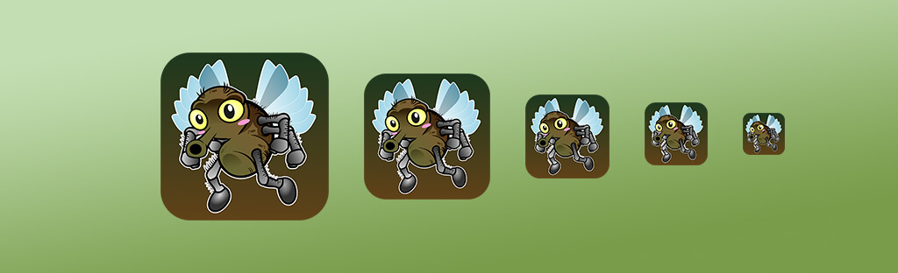
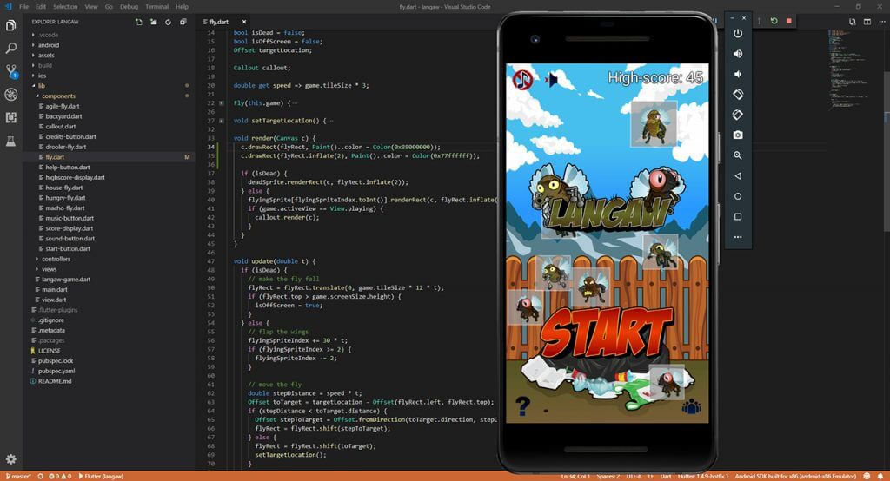
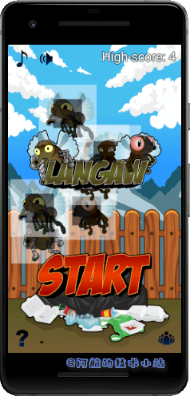
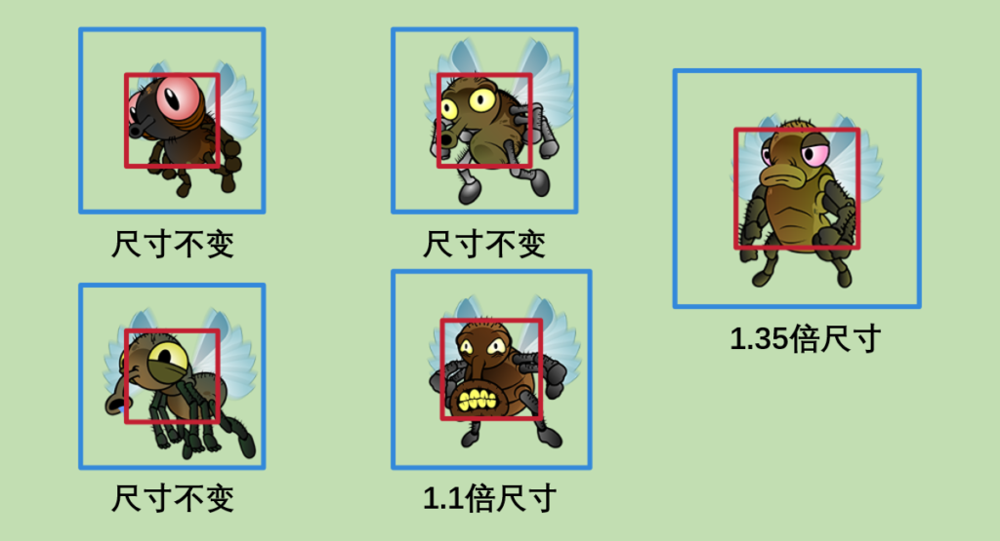
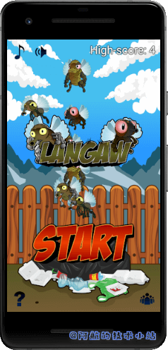
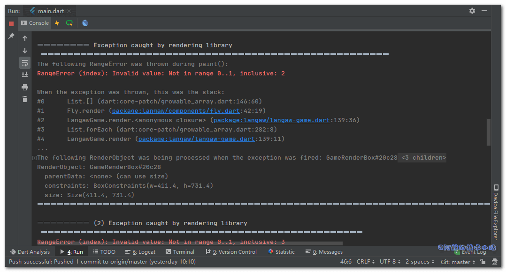
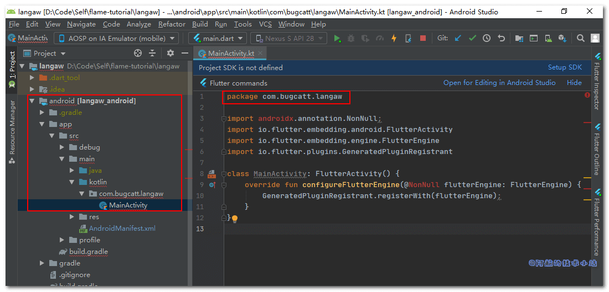
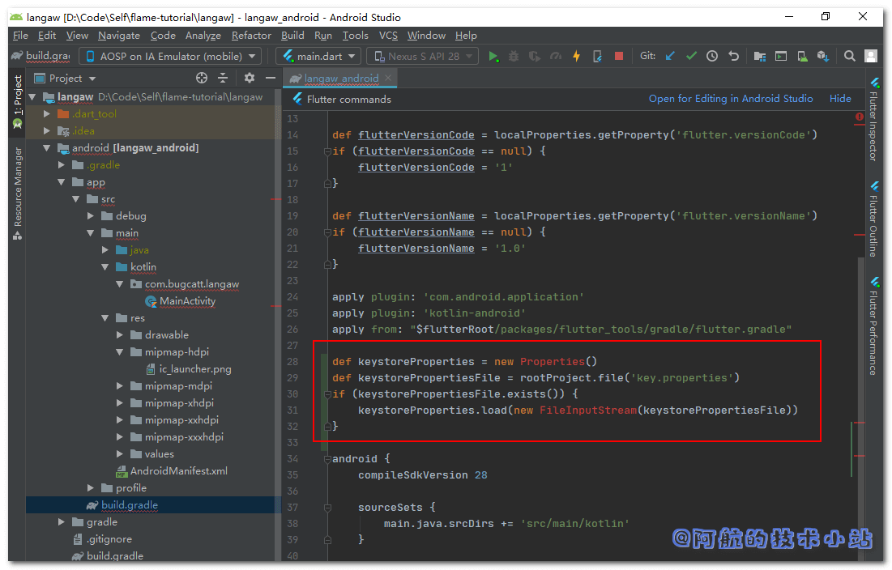
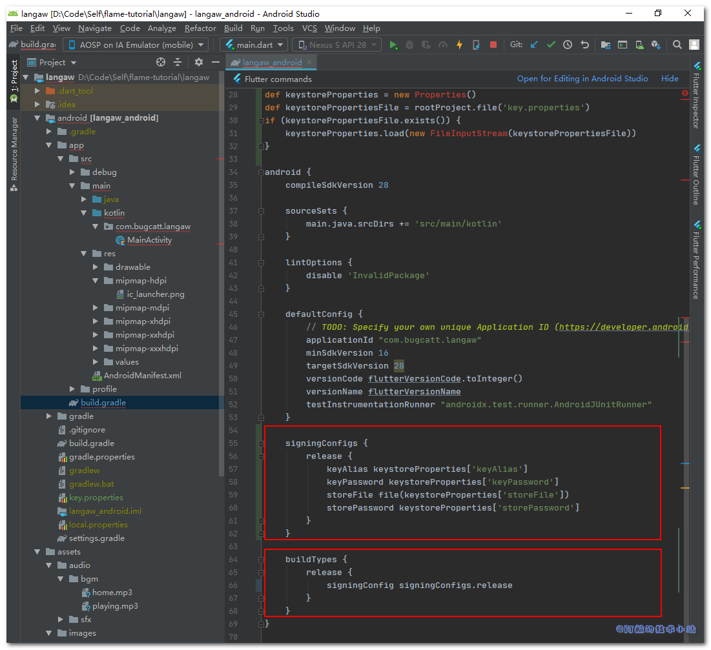

完成一个项目是世界上最爽的感觉之一. 你呕心沥血的做某件事, 最终想法变成了现实.

最后, 欢迎来到本系列的终章. 当然, 只有你一步一步跟随阿航的教程, 终章才有意义.

如果你还没有看过之前的章节, 还请你循序渐进, "一章一个脚印"!

下面是我们本系列教程的文章目录:

- [Flutter 游戏开发(flame) Flame介绍](https://www.bugcatt.com/archives/279)
- [Flutter 游戏开发(flame) 01 开发2D休闲游戏：消灭小飞蝇(1/5)](https://www.bugcatt.com/archives/292)
- [Flutter 游戏开发(flame) 02 图形和动画(2/5)](https://www.bugcatt.com/archives/560)
- [Flutter 游戏开发(flame) 03 界面和弹窗(3/5)](https://www.bugcatt.com/archives/562)
- [Flutter 游戏开发(flame) 04 分数, 存档和音效(4/5)](https://www.bugcatt.com/archives/564)
- **Flutter 游戏开发(flame) 05 收尾和打包(5/5) 本章**

## 需具备的条件

1. 本系列教程之前的**全部要求**👈
2. **更多的资源包** – 本教程提供了资源包, 但你也可以使用自己的. 推荐资源网站[Open Game Art](https://opengameart.org/).

我们将使用与前一部分相同的**编码规范**👩‍🏫

## 最终的资源包

这个最后的资源仅有一个图像, 但是它有5种不同的尺寸. 当游戏安装在设备上时, 图像将作为玩家APP目录的启动图标.

[](https://jap.alekhin.io/wp-content/uploads/2019/04/resource-pack-part-5.zip)

[点击图片或者此链接下载资源包!](https://jap.alekhin.io/wp-content/uploads/2019/04/resource-pack-part-5.zip)

* * *

🔴 **注意**: 如果你遵循本教程, 则可以使用上述资源包. 本资源包是[Github上Langaw(原作者)](https://github.com/japalekhin/langaw)项目的一部分, 该项目获得`CC-BY-NC-ND`许可证的许可.

这意味着您可以共享、复制或者重新分发资源.

- 你必须在感谢中提到, 提供许可证的链接, 并标明你是否进行了更改.
- 你不得将资源用于商业目的.
- 如果混合, 转换或者构建资源, 则不能分发修改后的资源.
- 你不得应用法律条款或技术措施, 在法律上限制他人做许可证允许的任何事情.

[点击此处了解有关 CC-BY-NC-ND 许可证的更多信息](https://creativecommons.org/licenses/by-nc-nd/2.0/legalcode)

阿航在这里提醒: 目前国内的版权保护做的不够好. 希望大家能够保护资源原作者辛苦的创作🙏🙏! 不能使用未经许可且无版权的资源, 向盗版说不👋!

* * *

## 收尾工作开始

我们目前有三项主要任务.

首先, 我们需要检查我们的项目, 解决bug🐞, 为玩家提供一个没有问题的游戏体验.

其次, 游戏必须定义自己的品牌, 增加辨识度. 使用户可以在APP列表中快速找到.

最后, 我们需要对APP进行打包, 你可以发布到各种应用商店中供大家下载.

准备好了吗?

### 第一步: 修复Bug

bug过街, 人人喊打. bug就是程序员的克星. 但是它却会常常伴在我们左右😅

不要让我们的玩家因为bug卸载我们的游戏.

#### 尺寸Bug

在**第二章**([图形和动画](https://blog.bugcatt.com/archives/560))中, 我们已经根据它们的图形调整小飞蝇的尺寸, 以便在击中小飞蝇或非常接近小飞蝇时击毙小飞蝇.

实际上并非如此.

"检测点击是否击中小飞蝇的矩形范围"与"正在渲染小飞蝇的图像矩形范围"的差值是通过`inflate`函数计算得出来的.

你可以从`./lib/components/fly.dart`的代码看出:

```
void render(Canvas c) {
  if (isDead) {
    deadSprite.renderRect(c, flyRect.inflate(2));
  } else {
    flyingSprite[flyingSpriteIndex.toInt()].renderRect(c, flyRect.inflate(2));
    if (game.activeView == View.playing) {
      callout.render(c);
    }
  }
}
```

原作者: 此前(第二章), 我认为`inflate()`接收一个百分比作为参数. 我假设`inflate(2)`会将矩形大小变为2倍(2 = 200%).

稍后检查时, [此函数的文档](https://docs.flutter.io/flutter/dart-ui/Rect/inflate.html)(和它的实际代码)虽然不是很明确, 但却说明了另一点.

返回一个新的矩形, 其边缘按给定增量向外移动.

传递的参数在文档中称为`delta`, 应该以**逻辑像素**为单位, 而不是调用该函数的矩形的百分比.

在下面的屏幕截图中, 你将看到我添加了两行代码来呈现`flyRect`矩形和它的一个"扩大版"副本.

灰色区域是`flyRect`(用于判断玩家是否击中小飞蝇), 它周围的白色区域是`flyRect`的"扩大版"副本.



这不是我们想要的.

我们希望sprite的尺寸是命中范围矩形的两倍.

要解决此问题, 打开`/lib/components/fly.dart`, 替换`render()`为:

```
void render(Canvas c) {
  c.drawRect(flyRect.inflate(flyRect.width / 2), Paint()..color = Color(0x77ffffff));

  if (isDead) {
    deadSprite.renderRect(c, flyRect.inflate(flyRect.width / 2));
  } else {
    flyingSprite[flyingSpriteIndex.toInt()].renderRect(c, flyRect.inflate(flyRect.width / 2));
    if (game.activeView == View.playing) {
      callout.render(c);
    }
  }

  c.drawRect(flyRect, Paint()..color = Color(0x88000000));
}
```

> 💡 代码解析: 首行和末行用于绘制白色和灰色矩形便于查看, 等下会删除.

其他内容几乎不变, 主要变更是传递给`inflate`函数的参数. 我们之前是传递一个固定值`2`, 现在我们改为`flyRect`的宽度除以`2`.

这回在矩形的所有边上增加一半的宽度, 从而产生一个新的矩形, 其边长是原始矩形边长的2倍.

> 🟡 提示: 由于`flyRect`实际上是一个正方形, 因此可按需在计算值时使用高度.

🟢 运行游戏, 你应该会看到类似以下内容:



有点乱, 但是你应该能看出来, 这更加符合我们第二章的计划.



让我们删除辅助的两行:

```
c.drawRect(flyRect.inflate(flyRect.width / 2), Paint()..color = Color(0x77ffffff));
```

```
c.drawRect(flyRect, Paint()..color = Color(0x88000000));
```

实际上, 我们已经成功修复了bug.

但是现在的小飞蝇太大了, 我们稍微调小一点.

打开每个小飞蝇子类, 修改它们的构造函数中它们的尺寸.

家蝇(`./lib/components/house-fly.dart`):

```
flyRect = Rect.fromLTWH(x, y, game.tileSize * 1, game.tileSize * 1);
```

口水蝇🤤(`./lib/components/drooler-fly.dart`):

```
flyRect = Rect.fromLTWH(x, y, game.tileSize * 1, game.tileSize * 1);
```

迅捷蝇🐱‍🏍(`./lib/components/agile-fly.dart`):

```
flyRect = Rect.fromLTWH(x, y, game.tileSize * 1, game.tileSize * 1);
```

饥饿蝇🥴(`./lib/components/hungry-fly.dart`):

```
flyRect = Rect.fromLTWH(x, y, game.tileSize * 1.1, game.tileSize * 1.1);
```

肌肉蝇💪(`./lib/components/macho-fly.dart`):

```
flyRect = Rect.fromLTWH(x, y, game.tileSize * 1.35, game.tileSize * 1.35);
```

🟢 运行游戏, 你会发现小飞蝇的尺寸比较合适了:



至此, 我们终于可以自信的说出: 我成功修复了这个BUG!😄😄😄😄

#### 跳帧bug

接下来, 我们来处理跳帧bug. 由于大多数手机的CPU和GPU配置较高, 所以并不明显.

它不仅很隐蔽, 并且在大多数设备上不存在.

该bug是有设备的CPU没有足够的时间运行game loop以跟上预期的60FPS引起的(通俗易懂的讲, CPU太忙了, 有时候一秒钟运行game loop不到60次).

若使用模拟器运行游戏. 模拟器和电脑共享内存资源, 当电脑其他进程占用资源时, 就会发生跳帧的现象.

不用太过担心, 因为我们的`update`会根据上次调用`update`以来经过的时间来"更新"游戏.

**但是它很重要.**

问题出现在我们的动画上面. 小飞蝇的动画仅会循环2个帧, 并带有以下代码:

```
// flap the wings
flyingSpriteIndex += 30 * t;
if (flyingSpriteIndex >= 2) {
  flyingSpriteIndex -= 2;
}
```

> 💡 快速回顾: 我们希望每秒拍打`15`此翅膀, 再乘以帧数(2个帧)得到30.

此值乘以自上次调用更新到现在的间隔时间(秒为单位)理想的情况是`0.0166`或`1/60`(60FPS)

理想条件下, 最终值始终为`0.5`. 此值添加到`flyingSpriteIndex`变量. 最后, 我们检查变量的值是否大于`2`, 若大于`2`, 则从该值中减`2`, 将其重置为`0`.

渲染时, 我们使用以下代码获取sprite的正确动画帧索引:

```
flyingSpriteIndex.toInt()
```

当CPU没有为游戏提供足够的周期时, 就会出现问题. 这会导致跳帧, 并且变量`t`(上次运行`update`以来的间隔时间)会变大.

假设某帧在半秒内没有经过处理. `t`的值就会变为`0.5`(半秒).

假设从0开始, 该行`flyingSpriteIndex += 30 * t;`的`flyingSpriteIndex`的值将等于15(30 \* 0.5).

接下来, 判断该值是否大于2. 因此我们减去2, 等于13.

在`render`函数中, 将执行`flyingSpriteIndex.toInt()`并返回值`13`(`(13).toInt()`仍等于13).

这种情况下, `flyingSprite[flyingSpriteIndex.toInt()].renderRect(...);`实际上等于`flyingSprite[13].renderRect(...);`.

我们只有两个帧(`0`和`1`), 没有第`13`!

这样就会报错`RangeError`, 使之前的渲染调用失效, 并使屏幕闪烁. 在游戏上线正式版之前, 这个可不是什么好bug.

来看看这部分的Debug控制台报错截图:



要解决此问题, 我们需要不仅仅检查一次该值是否移除, 我们必须始终判断每次运行`update`都是在一个大帧后.

仍然在`./lib/components/fly.dart`中, 让我们将"拍打翅膀"块:

```
// 拍打翅膀
flyingSpriteIndex += 30 * t;
if (flyingSpriteIndex >= 2) {
  flyingSpriteIndex -= 2;
}
```

改为以下内容:

```
// 拍打翅膀
flyingSpriteIndex += 30 * t;
while (flyingSpriteIndex >= 2) {
  flyingSpriteIndex -= 2;
}
```

> 💡 代码解析: 我们只是把`if`块替换为了`while`块. 如第一章所述, 教程假定你已经是一名开发者. 这里不会赘述`while`的用法.

它会进行判断, 若条件为`true`, 将会继续循环方法体. 方法体执行完成后, 再次判断; 若仍然为`true`将继续重新执行.

只要条件返回`true`, 就会反复的执行此操作. 因此, 若发生跳帧并在`flyingSpriteIndex`中最终得到一个较大的值(比如15), 则`while`循环将反复执行, 直到`flyingSpriteIndex`不再大于2.

在第一次循环中, `15`变为`13`, 然后`13`变为`11`不断重复直到值变为`1`. 变成`1`后将不再继续执行.

至此, 这个Bug也终于解决了!

#### 飞行区域限制

想象一下这样的场景: 你是一个玩家, 并且即将打破全球纪录7331分🤩. 屏幕上一片混乱, 小飞蝇漫天飞舞.

有一只口水蝇🤤懒洋洋的停留在屏幕的左上角, 在声音控制按钮下面, 他的数字降到了`1`.

它慢慢的向下移动时, 你点击它. 但一切都太迟了, 它发出了嘲笑的声音, 你以7329分输掉了比赛. 这一切都是因为按钮挡住了你😭😭😭😭.

**我们来搞定它!**

我们可以通过限制小飞蝇可以飞行的范围来避免这种情况.

声音控制按钮的高度为`1`个区块, 并且距离屏幕顶部边缘`1/4`块. 如果在底部再添加`1/4`格作为边距, 总计为`1.5`块.

屏幕顶部的1.5个区块应该设为禁飞区.

有两个地方可以控制小飞蝇的飞行区域. 一个地方是在生成小飞蝇时(`./lib/langaw-game.dart`的`spawnFly`), 第二个是小飞蝇选择随机目标时(`./lib/components/fly.dart`的`setTargetLocation`).

首先来处理`spawnFly`函数. 打开`./lib/langaw-game.dart`, 替换:

```
double x = rnd.nextDouble() * (screenSize.width - (tileSize * 2.025));
double y = rnd.nextDouble() * (screenSize.height - (tileSize * 2.025));
```

为:

```
double x = rnd.nextDouble() * (screenSize.width - (tileSize * 1.35));
double y = (rnd.nextDouble() * (screenSize.height - (tileSize * 2.85))) + (tileSize * 1.5);
```

> 💡 代码解析: 我们从屏幕的宽度和高度的右边缘和底部边缘分别减去的值改为`1.35`, 因为在修复上面的尺寸bug时, 最大的小飞蝇现在只有`1.35`个区块宽.
> 
> 然后, 我们从屏幕高度(现在为`2.85`)减去现在的值加上`1.5`(音效按钮高度). 这样就可以限制小飞蝇在距离屏幕底部`1.5`块的区域内飞行.
> 
> 但是我们想从顶部限制它们而不是底部. 向下计算可飞行的范围, 我们把最终值加上`1.5`个区块.

我们只需要将此变更复制到`setTargetLoacation`就可以修复这个bug啦.

打开`./lib/components/fly.dart`, 在`setTargetLocation()`中, 替换定义`x`和`y`的两行:

```
double x = game.rnd.nextDouble() * (game.screenSize.width - (game.tileSize * 2.025));
double y = game.rnd.nextDouble() * (game.screenSize.height - (game.tileSize * 2.025));
```

为:

```
double x = game.rnd.nextDouble() * (game.screenSize.width - (game.tileSize * 1.35));
double y = (game.rnd.nextDouble() * (game.screenSize.height - (game.tileSize * 2.85))) + (game.tileSize * 1.5);
```

至此, 我们已经解决了所有已知的Bug!

**👉在[Github](https://github.com/HarrisonQi/flame-tutorial-langaw/tree/a565d40637aecc3dc19df6c7d750ea4b37380cb3)或[码云](https://github.com/HarrisonQi/flame-tutorial-langaw/tree/a565d40637aecc3dc19df6c7d750ea4b37380cb3)上查看这部分的代码.**

### 第二步: 安卓打包信息

对于这一步和下一步, 其实你可以直接参照[官方文档](https://flutterchina.club/android-release/)进行操作.

但是本系列教程面向的是初学者, 所以这里直接进行实际操作.

> 🟡 注意: 本系列教程只会针对Android的发布构建, 若需要为IOS发布构建, 请查看这篇[官方教程](https://flutterchina.club/ios-release/)

#### App label (应用标签)

在正式发布我们的游戏之前, 我们必须确保它的品牌是正确的.

它还必须拥有自己的名称和唯一的应用程序ID(在我们的程序中, 也可以称为Java包名).

现在游戏的图标是这个样子的:


打开manifest(清单文件)并首先处理label(标签). 此标签是在手机上安装我们的游戏后, 在手机APP列表中显示的名称.

Android的manifest文件在`./android/app/src/main/AndroidManifest.xml`.

若要改变标签, 找到这一行:

```
android:label=""
```

然后我们改为我们的游戏名字`Langaw`:

```
android:label="Langaw"
```

#### Application ID(应用程序ID)

接下来, 我们必须给我们的游戏一个唯一的应用程序ID. 这非常重要, 因为Android系统将通过这个把我们的APP和其他APP区分开来.

[点击此处了解更多应用程序ID的规则信息](https://developer.android.com/studio/build/application-id.html).

根据Java软件包的命名规范, 为避免冲突, 程序员通过使用其所在公司的域名反写来开始对其软件包进行命名.

如果您是独立开发者, 从事的是个人项目, 可以使用个人博客的域名反写(比如阿航的`com.bugcatt`).

> 🔴 注意: 你一定要使用自己的域名! 如果你还没有域名, 则可以使用全名, 比如(zhangsanfeng.langaw).

有几个地方都需要改变应用程序ID, 且需要进行一些目录重组.

首先, 我们来修改Android manifest(`./android/app/src/main/AndroidManifest.xml`).

在文件的顶部(`manifest`标签内), 找到类似于这样的代码:

```
package="com.example.langaw"
```

在这里改为你自己的域名, 阿航这里使用`com.bugcatt.langaw`:

```
package="games.alekhin.langaw"
```

打开debug清单文件`./android/app/src/debug/AndroidManifest.xml`, 做同样的操作.

下一步, 我们需要打开`./android/app/build.gradle`找到`android`选项, 找到类似这样的代码:

```
    defaultConfig {
        applicationId "com.example.langaw"
        minSdkVersion 16
        targetSdkVersion 28
        versionCode flutterVersionCode.toInteger()
        versionName flutterVersionName
        testInstrumentationRunner "android.support.test.runner.AndroidJUnitRunner"
    }
```

修改`applicationId`的值为你自己的域名, 比如:

```
    defaultConfig {
        applicationId "com.bugcatt.langaw"
        minSdkVersion 16
        targetSdkVersion 28
        versionCode flutterVersionCode.toInteger()
        versionName flutterVersionName
        testInstrumentationRunner "androidx.test.runner.AndroidJUnitRunner"
    }
```

另一个地方就是在main activity文件(`./android/app/src/main/java/com/example/langaw/MainActivity.java`)中修改package名称为:

```
package com.bugcatt.langaw
```

> 🟡 提示: 若你为你的项目增加了kotlin支持, 那么main activity文件的路径为`./android/app/src/main/kotlin/com/example/langaw/MainActivity.kt`

如你所见, main activity文件位于与包名匹配的目录中, 为了使Java/Kotlin应用程序(我们的游戏会编译到其中)正常运行, 此目录结构必须与软件包名称匹配.

最终我们只需要重命名这些目录, 以便他们与程序包名称匹配, 并且main activity文件现在将位于(`./android/app/src/main/java/com/bugcatt/langaw/MainActivity.java`), 如图:



#### APP启动图标

最终, 也是最重要的信息. 当涉及到品牌(或具有辨识度)的就是APP启动图标.

这也是在手机上应用程序列表中显示的图标.

你可以遵循这个[启动器图标设计规范](https://material.io/design/iconography/product-icons.html#design-principles). 但是我们的教程将使用我们自己的图片.

自由的选择自己的图标, 只要他们的尺寸符合以下大小:

- `48 x 48` (mdpi)
- `72 x 72` (hdpi)
- `96 x 96` (xhdpi)
- `144 x 144` (xxhdpi)
- `192 x 192` (xxxhdpi)

由于我们将使用资源包中的图标, 因此我们可以很轻松、安全的将`android`目录从资源包中复制到项目的根目录中(`./`).

复制启动图标后, 以下文件应该被修改:

```
./android/app/src/main/res/mipmap-hdpi/ic_launcher.png
./android/app/src/main/res/mipmap-mdpi/ic_launcher.png
./android/app/src/main/res/mipmap-xhdpi/ic_launcher.png
./android/app/src/main/res/mipmap-xxhdpi/ic_launcher.png
./android/app/src/main/res/mipmap-xxxhdpi/ic_launcher.png
```

🟢 重新运行游戏(先停止再运行), 你会发现游戏图标变更了:


不同的设备可能以不同的方式显示图标(比如边框、背景色等, 和你的手机系统、主题相关), 但是始终会显示我们设置的图标.

**👉在[Github](https://github.com/HarrisonQi/flame-tutorial-langaw/tree/39d60a0d91d71a9880b496b69e6bb5ee78eaf3bd)或[码云](https://github.com/HarrisonQi/flame-tutorial-langaw/tree/39d60a0d91d71a9880b496b69e6bb5ee78eaf3bd)上查看这部分的代码.**

### 第三步: 准备发布

发布游戏之前, 还有一些活要去干. 首先我们需要创建一个签名证书, 在构建APK时, 需要通过该证书进行签名.

#### 构建证书, 生成签名

要创建密钥存储, 需要输入以下命令至终端(CMD):

```
keytool -genkey -v -keystore ~/key.jks -keyalg RSA -keysize 2048 -validity 36500 -alias key
```

> 如果你没有配置环境变量, 直接向下看, 有相应的解决方案!

该工具将询问一些将记录在证书的信息, 比如你的全名、 公司详细信息以及地址.

回答所有问题后, keytool应该在当前登录用户的主目录中创建一个名为`key.jks`的密钥存储文件.

> 🔴 注意: 该文件必须保密! 最好将其保存在项目目录之外, 且可以进行安全备份.
> 
> 如果你对项目使用了版本管理, 并且不能保留在项目目录外边. 那么请把这个文件从版本控制中移除(如`.gitignore`)

`keytool`可能未在环境变量中添加, 若想找到它, 可在[Flutter官方教程中"创建密钥库"的说明进行操作(英文)](https://flutter.dev/docs/deployment/android#create-a-keystore).

阿航的电脑是Win10, 不配置环境变量, 运行的实际命令是:

```
"C:\Program Files\Java\jre1.8.0_241\bin\keytool" -genkey -v -keystore D:\key.jks -keyalg RSA -keysize 2048 -validity 36500 -alias key
```

下一步是在我们的项目中创建一个文件, 该文件将指向我们的密钥库. 创建文件`./android/key.properties`, 文件内容:

```
storePassword=PASSWORDHERE
keyPassword=PASSWORDHERE
keyAlias=key
storeFile=D:\\key.jks
```

将`PASSWORDHERE`替换为你在创建密钥库时输入的实际密码. `storeFile`的值也替换为密钥存储文件的实际路径.

🔴 注意: 由于此文件包含密钥存储和证书的密码, 尽可能将此文件保密. 不要把该文件加入到代码管理仓库中!

最后跳回到`./android/app/build.gradle`文件. 在`android`选项前, 加载我们刚刚创建的`key.properties`.

在`android {`上方添加代码:

```
def keystoreProperties = new Properties()
def keystorePropertiesFile = rootProject.file('key.properties')
if (keystorePropertiesFile.exists()) {
    keystoreProperties.load(new FileInputStream(keystorePropertiesFile))
}
```

上面的代码只是Gradle构建配置的一部分, 不在本系列教程的范围内. 现在只需将代码复制粘贴到正确的位置, 并确保`key.properties`已被创建(参见上文).



此后, 进入`android`选项, 在`buildTypes`上方添加以下代码:

```
    signingConfigs {
        release {
            keyAlias keystoreProperties['keyAlias']
            keyPassword keystoreProperties['keyPassword']
            storeFile file(keystoreProperties['storeFile'])
            storePassword keystoreProperties['storePassword']
        }
    }
```

然后替换掉整个`buildTypes`块为:

```
buildTypes {
    release {
        signingConfig signingConfigs.release
    }
}
```



* * *

**恭喜!  
这意味着我们的开发任务全部竣工! 这是本教程中最后一次修改源代码. 我们已经完整的开发完成了一款游戏.**

* * *

**👉在[Github](https://github.com/HarrisonQi/flame-tutorial-langaw/tree/8f11403d788d4f39a06b733130224cd47ce8fd0b)或[码云](https://github.com/HarrisonQi/flame-tutorial-langaw/tree/8f11403d788d4f39a06b733130224cd47ce8fd0b)上查看这部分的代码.**

#### 构建APK

让我们现在来构建正式版APK, 以便你可以将其上传到Google Play等各大应用商店.

APK(Android Package)的缩写, 是Android的应用程序包格式. 我们的游戏需要放在APK中.

要让Google Play等商店接受APK, 必须对其进行签名. 哈哈, 我们已经完成并进行了相应配置.

发布正式版意味着该APP不再会与热重载等功能通信, 并且debug代码将不会放在APP上. 它的存储空间会尽可能的小, 并且安装到手机上也很方便.

想要生成一个正式版APK, 只需要进入项目目录()`./`, 打开终端输入:

```
flutter build apk
```

等待一会儿, 会出现类似下面的信息:

```
flutter build apk
Initializing gradle...                                              1.2s
Resolving dependencies...                                           2.4s
Running Gradle task 'assembleRelease'...
Running Gradle task 'assembleRelease'... Done                      11.2s
Built build\app\outputs\apk\release\app-release.apk (14.4MB).
```

这样, 你就可以去`./build/app/outputs/apk/release/app-release.apk`找到我们打包成功的APK.

### 发布我们的游戏

因为国内各大厂商的应用商店规则不统一, 这里仅给大家提供一些建议:

| 主流安卓应用商店 | 优点 | 缺点 |
| --- | --- | --- |
| Google Play | 1\. 安卓的官方应用商店. 最大、最强的安卓应用商店, 没有之一.  
2\. 不需要窥探你的隐私信息, 保护开发者.  
3\. 上线超快, 不从开发者那里牟利.  
4\. 自由: 你可以上传任意内容的APP.  
5\. 平等: 不需要花钱买什么"官方"标识等.  
6\. 可以上传收费的APP.  
7\. 下载统计、APP分析等一步到位. | 1\. 大陆普通网络无法连接.  
2\. 需要收取25美刀的入场费(没有二次消费).  
3\. 优秀的APP过多, 新手开发者可能前期无法获得过多下载量 |
| 华为应用市场 | 1\. 华为也许是目前国内最大的安卓群体, 用户量较大.  
2\. 免费加入.  
3\. APP大多质量较好.  
4\. 国家政策, 某些主题的APP不可以上传.  
5\. 注册不需要繁琐的步骤. | 1\. 因为APP质量较好, 审核也相当严格.  
 |
| 小米应用商店 | 除第1条外, 其他同上 |  |
| 腾讯开放平台(应用宝) | 1\. 腾讯旗下, 可在微信上方便分享下载.  
2\. 因为各种腾讯政策(如腾讯王卡、各种游戏奖励)用户量大. | 1\. 牵扯到利益, 需要上传著作权等信息(非常非常麻烦, 花钱待办也相当贵)  
2\. APP过多, 鱼龙混杂. |
| 阿里应用分发开放平台(豌豆荚、91助手等等) | 一次上传, 多个平台同时发布. | 同上 |

## 感谢

- 本篇文章参考原作[《Game Finishing and Packaging Tutorial – Step by Step with Flame and Flutter (Part 5 of 5)》](https://jap.alekhin.io/game-finishing-packaging-tutorial-flame-flutter-part-5).
- flame [github仓库地址](https://github.com/flame-engine/flame)
- pub.dev [官方网址](https://pub.flutter-io.cn/packages/flame)

## 结语

非常高兴你能来到这里! 在本系列教程中, 我们从0开始构建了一个游戏. 从Flutter项目创建到打包发布.

我希望你能喜欢本系列的教程.

即使有着参照的官方文档, 阿航写这部分教程也整整超过了一个月. 因为我真的不是很擅长翻译工作😭, 并且非常讨厌英语(这和我是程序员的身份格格不入不是吗🤣🤣). 翻译并不是简简单单的拿着Google翻译或者百度翻译复制粘贴. 很多时候, 外国人的梗拿到中国, 大家听不懂, 甚至会很懵逼. 我会尽量这些语言的差异转为国人愿意理解的意思来进行转换. 原文中也有多次的代码错误, 阿航也只能含泪踏坑前行, 力求给大家一个完整的开发体验. 也希望你能常常光顾我的网站, 我会尽心尽力发布各种技术干货. 如果你愿意, 我们也可以合作, 一起上传高质量博客.

谢谢🧡.

如果你出现了不懂的地方, 不要犹豫, 欢迎在评论区留言! 也欢迎加入[我的Flame交流群(QQ)](https://jq.qq.com/?_wv=1027&k=5ETLFm3), 进行实时沟通.

## 下一步会干什么

下一步, 到了你做决定的时候了.

**挑战自己, 制作一个属于自己的游戏.**

游戏质量和原创与否并不重要, 重要的是你掌握了开发游戏的诀窍. 当你精通了游戏开发, 也许哪一天你会找到一个很好的团队, 开发出像"超级玛丽"、"侠盗猎车"等永垂不朽的游戏.

至于阿航, 会继续在全栈开发领域上奋斗. 不断的发表技术博客, 为广大开发者铺好路.
