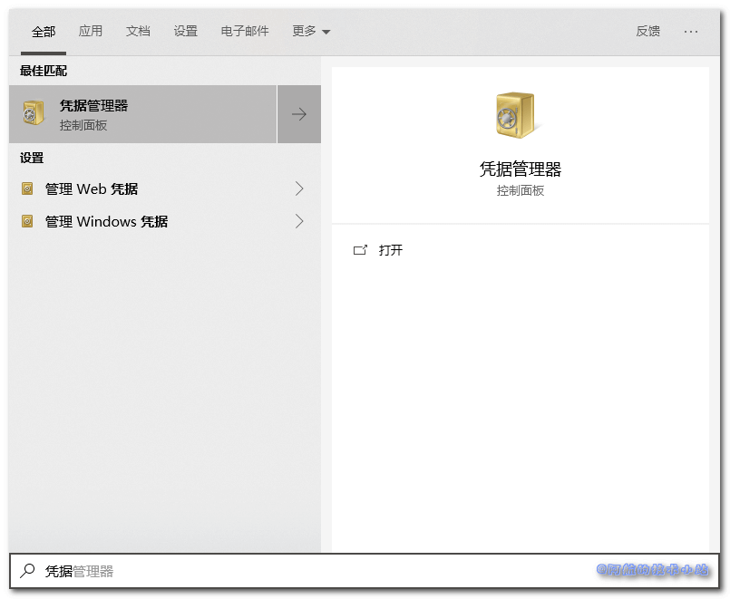
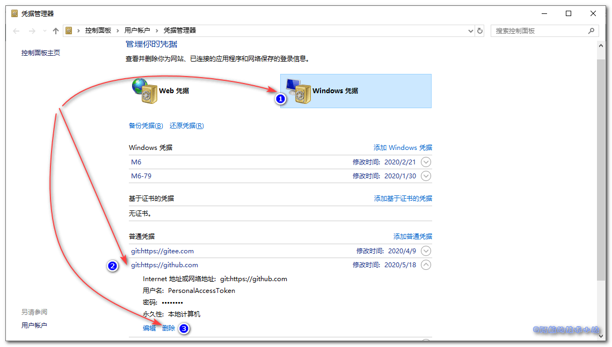

今天依旧是贡献代码的一天. 但是在使用IDEA进行Git 推送时, 右下角提示推送失败(`Push failed`). 就很纳闷, 平时好好的, 今天突然就不好使了? 一番折腾, 终于解决.

## 问题分析

先来看一下完整报错:

```
Invocation failed Server returned invalid Response. java.lang.RuntimeException: 
Invocation failed Server returned invalid Response. 
  at org.jetbrains.git4idea.http.GitAskPassXmlRpcClient.askUsername(GitAskPassXmlRpcClient.java:50) 
  at org.jetbrains.git4idea.http.GitAskPassApp.main(GitAskPassApp.java:64) Caused by: java.io.IOException: Server returned invalid Response. 
  at org.apache.xmlrpc.LiteXmlRpcTransport.sendRequest(LiteXmlRpcTransport.java:242) 
  at org.apache.xmlrpc.LiteXmlRpcTransport.sendXmlRpc(LiteXmlRpcTransport.java:90) 
  at org.apache.xmlrpc.XmlRpcClientWorker.execute(XmlRpcClientWorker.java:72) 
  at org.apache.xmlrpc.XmlRpcClient.execute(XmlRpcClient.java:194) 
  at org.apache.xmlrpc.XmlRpcClient.execute(XmlRpcClient.java:185) 
  at org.apache.xmlrpc.XmlRpcClient.execute(XmlRpcClient.java:178) 
  at org.jetbrains.git4idea.http.GitAskPassXmlRpcClient.askUsername(GitAskPassXmlRpcClient.java:47) 
... 1 more remote: No anonymous write access. 
Authentication failed for 'https://github.com/XXX'
```

可以看到关键字:

```
No anonymous write access.
```

👆这句话的字面意思是"没有匿名写入权限". 但是他也没提示我登录啊? 不清不楚

```
Authentication failed for 'https://github.com/XXX'
```

👆这句就很简单了, 鉴权失败. 也许是之前的匿名的原因.

\[epcl\_box type="information"\]可以看出, 返回的错误信息并没有什么卵用...\[/epcl\_box\]

## 可能的原因

阿航目前总结了几点原因(不代表全部):

1. 远程仓库(如Github)更换密码, 本地没有及时修改
2. 本地仓库与远程仓库数据有差异
3. 本地某些软件误删了远程仓库(如Github)的账户.

## 解决方案

### 方法一: 重置远程仓库信息

打开终端(或CMD), 依次输入以下命令:

先查看远程仓库:

```
git remote -v
```

移除远程仓库:

```
git remote remove origin
```

重新关联远程仓库:

```
git remote add origin 你的仓库地址.git
```

这也是阿航的最终解决方案. 方便快捷.

### 方法二: Windows设置远程仓库(Github)账户

点击开始键, 输入"凭据"关键字, 点击**凭据管理器**:



点击"Windows凭据", 选择你要处理的远程仓库账户(一般以`git`开头), 删除它.



下次推送时就会要求你重新输入账号和密码了.

## 感谢

[Pexels](https://www.pexels.com/zh-cn/photo/2395253/?utm_content=attributionCopyText&utm_medium=referral&utm_source=pexels) 上的 [Evie Shaffer](https://www.pexels.com/zh-cn/@evie-shaffer-1259279?utm_content=attributionCopyText&utm_medium=referral&utm_source=pexels) 拍摄的照片
