有时我们在进行开源的过程中, 少不了需要把代码推送到`Github`/`码云`上. 最传统的方式就是分别进行提交、推送. 但是重复劳动并不符合程序员思维😤! 是否有一种方法可以同时使用Git推送至不同的远程仓库呢? 答案是肯定的. 这篇文章就来记录一下如何"使用Git推送至多个远程仓库", 提高开发人员的工作效率.

## 需具备的条件

若要顺利阅读本文, 你需要具备如下条件:

1. 掌握`Git`的基本操作
2. 电脑已安装`Git`的操作环境
3. 拥有`Github`账号
4. 拥有`码云`账号

## 开始

### 创建远程仓库

#### Github

1. 进入[Github官网](https://github.com/), 点击[创建仓库](https://github.com/new):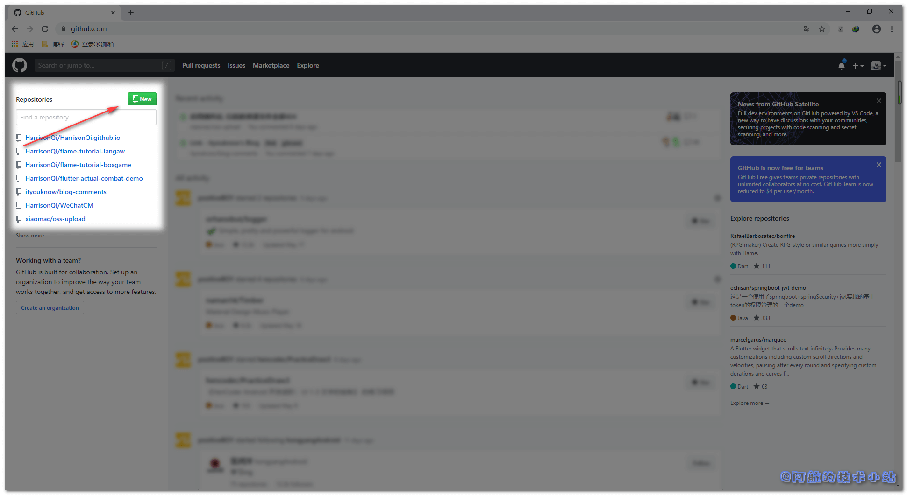
2. 输入仓库基本信息, 点击`Create repository`: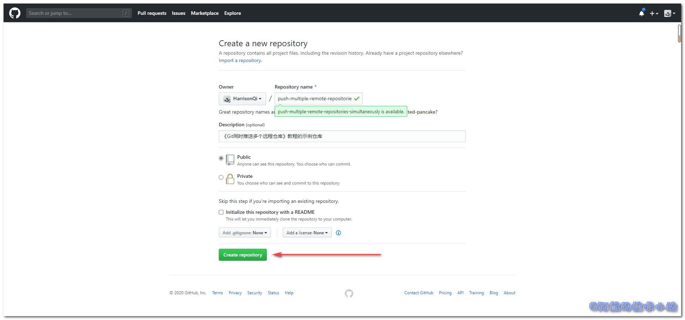
3. 稍等片刻, 仓库创建完成: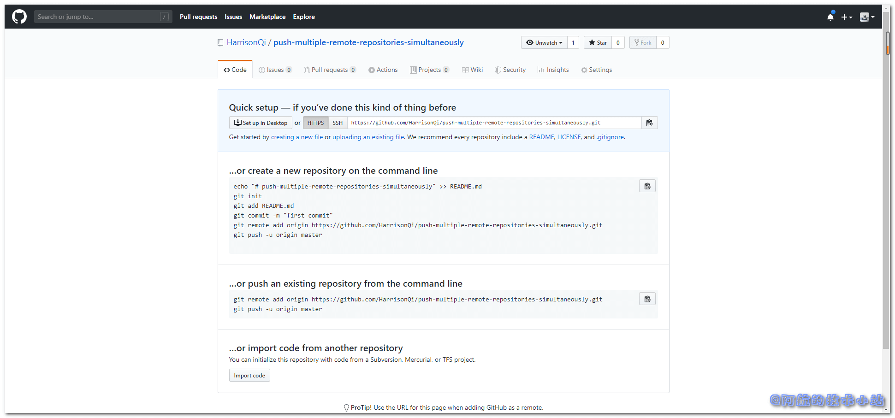

至此, Github的准备工作完成.

#### 码云

码云就简单多了, 因为码云可以直接导入来自Github的项目!

1. 进入码云, 鼠标移至右上角的加号, 点击**新建仓库**按钮: 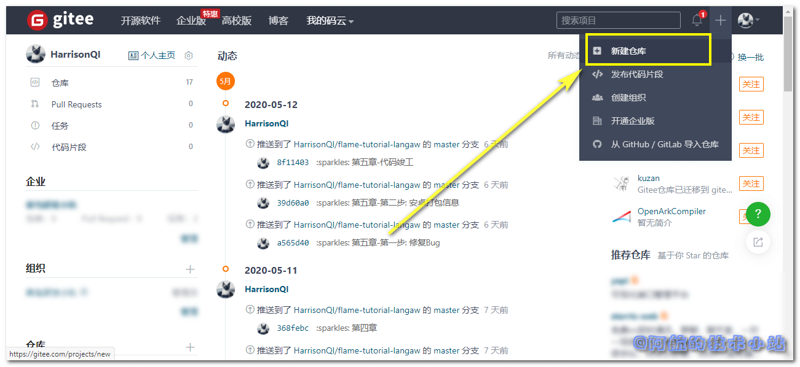

2. 进入到仓库基本信息页面, 别急着填, 直接拉到最下面, 找到这个: 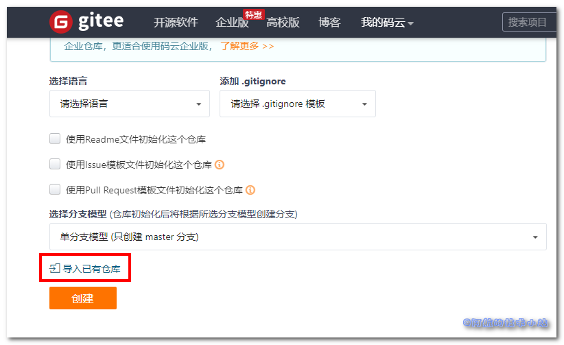

3. 点击后, 输入上面Github的仓库地址, 点击创建: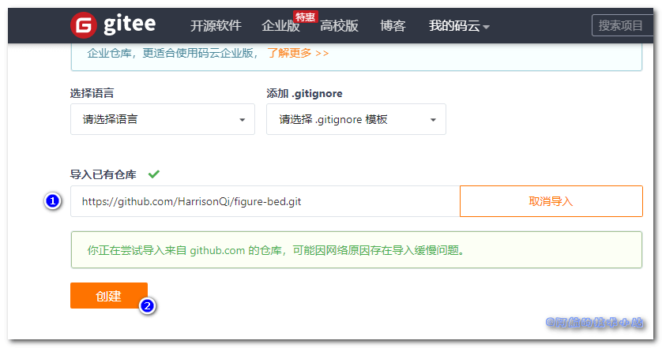

4. 等待片刻: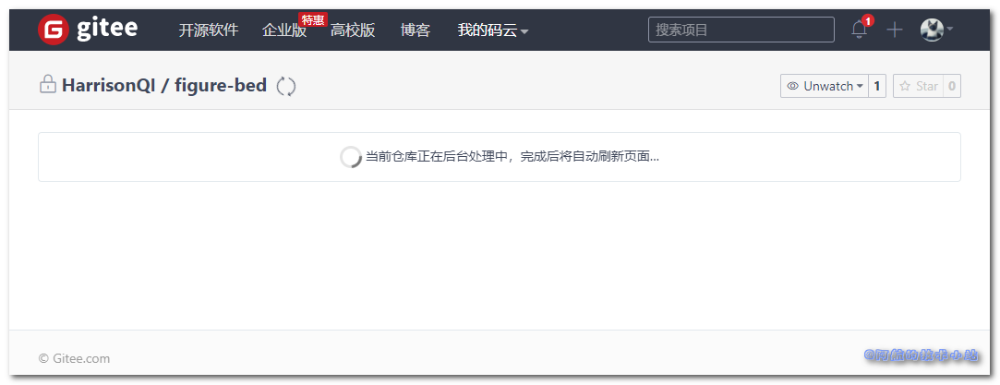

5. 创建完成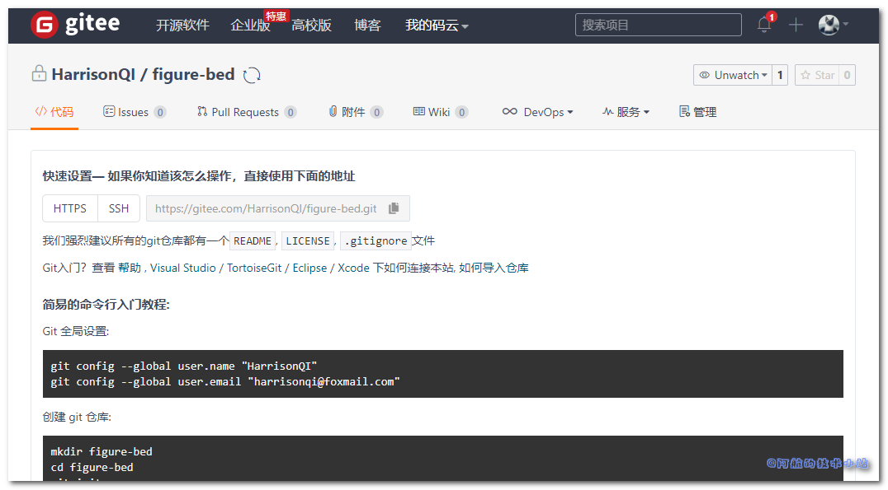

### 创建、初始化本地仓库

#### 创建本地仓库

在电脑中创建一个新目录:

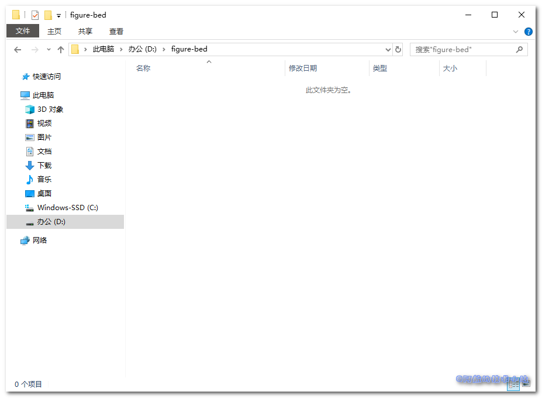

右键, 点击`Git Bash Here`(如果没有, 直接用`CMD`进入目录即可)

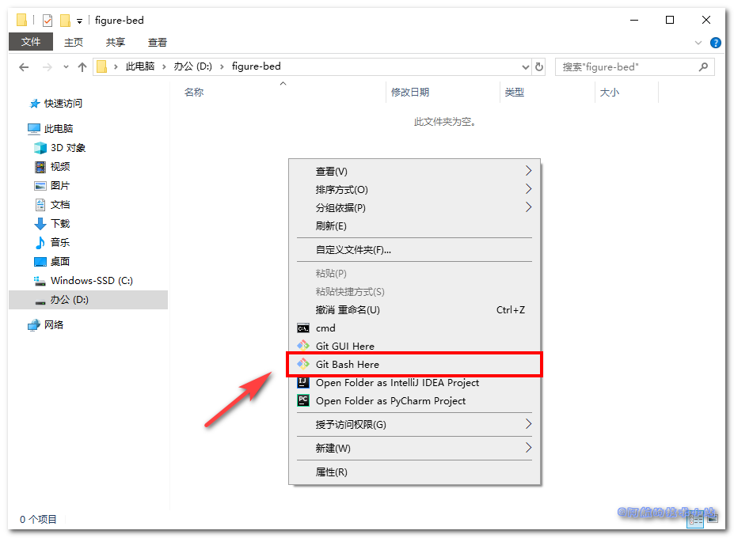

#### 初始化本地仓库

输入命令:

```shell
git init
```

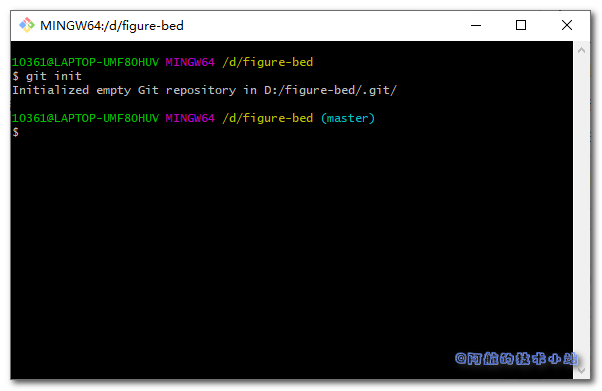

在项目目录中创建文件`README.md`:

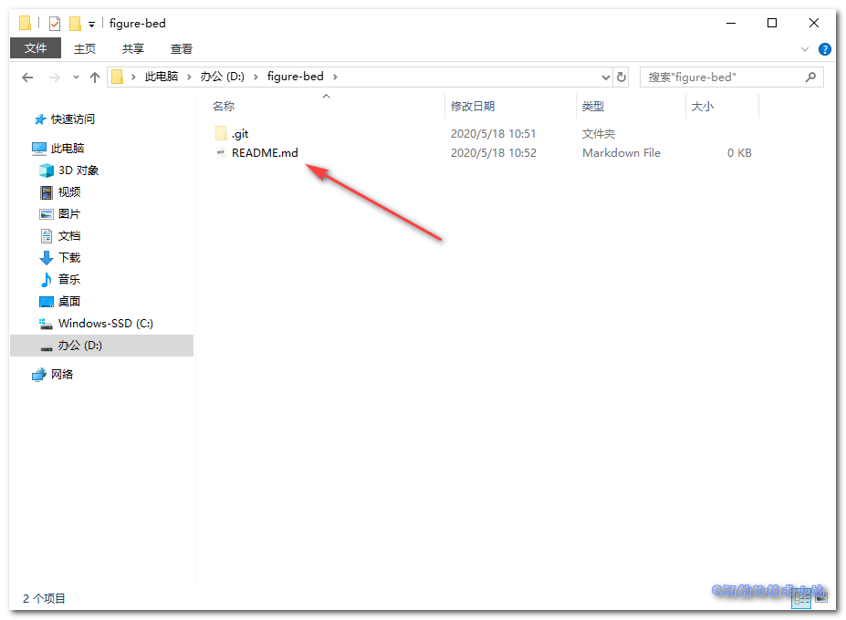

#### git提交

回到Git终端, 分别输入:

```shell
git add README.md
```

```shell
git commit -m "first commit"
```

```shell
git remote add origin 你的Github仓库地址
```

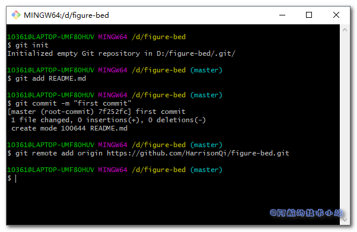

至此, Github的远程仓库已经配置完毕

### 配置第二个远程仓库

**重点来了!**

输入:

```shell
git remote set-url --add origin 你的码云地址
```

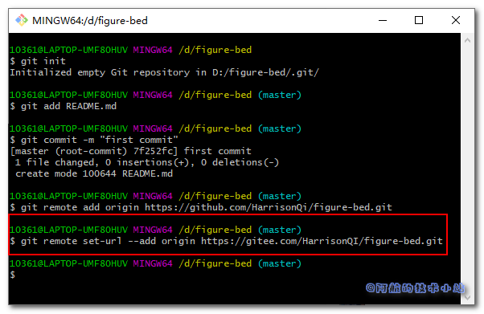

### 同时推送

输入推送命令:

```shell
git push -u origin master
```

可能会遇到Github登录, 输入账号密码即可:

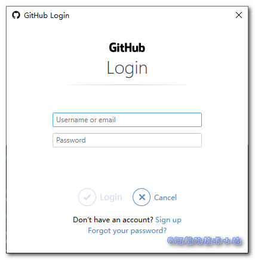

如果遇到码云登录, 照做即可.

稍等片刻, 推送成功:

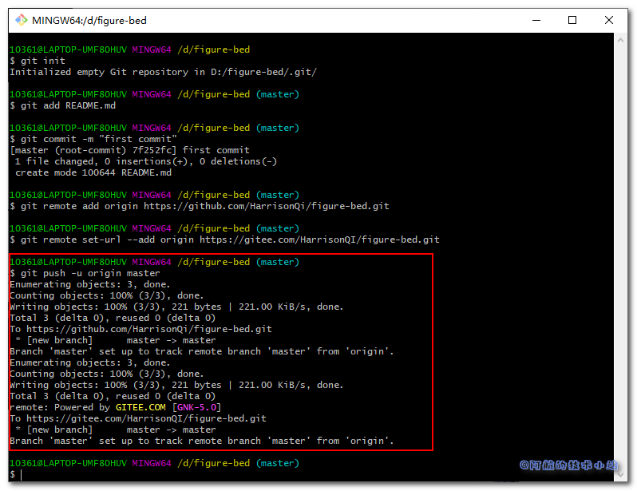

有些同学应该已经发现了, 返回日志中同时包含了`Github`和`码云`的远程Git地址.

## 收工!

分别刷新码云和`Github`的仓库主页. 若你完全遵循本教程进行操作, 你会发现仓库的变化:

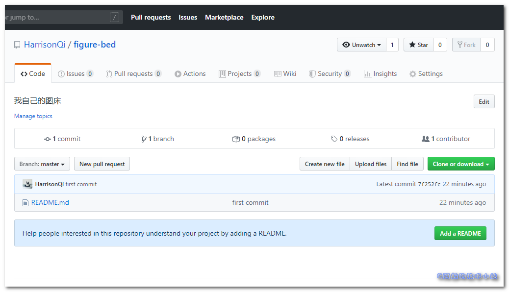

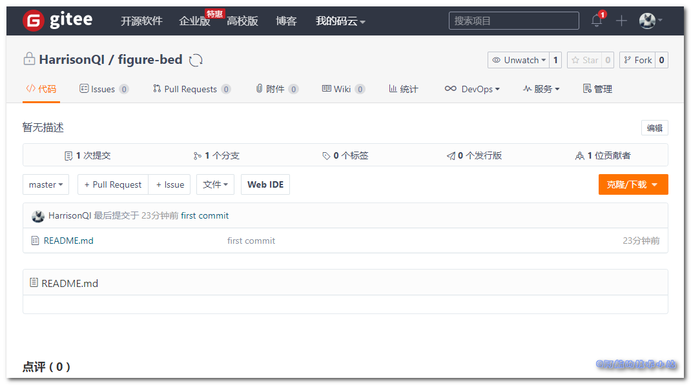

相同的提交信息, 相同的提交时间, 相同的提交文件.

## 感谢

- [git 本地项目添加多个远程仓库](https://blog.csdn.net/mengzuchao/article/details/80489864)
- [Pexels](https://www.pexels.com/zh-cn/photo/82256/?utm_content=attributionCopyText&utm_medium=referral&utm_source=pexels) 上的 [tbee](https://www.pexels.com/zh-cn/@tbee-14592?utm_content=attributionCopyText&utm_medium=referral&utm_source=pexels) 拍摄的照片

排名不分先后

## 结语

[原文链接](https://www.bugcatt.com/archives/1232). 如果有任何问题, 欢迎在下方回复或者讨论.

更多技术干货, 欢迎访问我的官网[阿航的技术小站](https://www.bugcatt.com)
