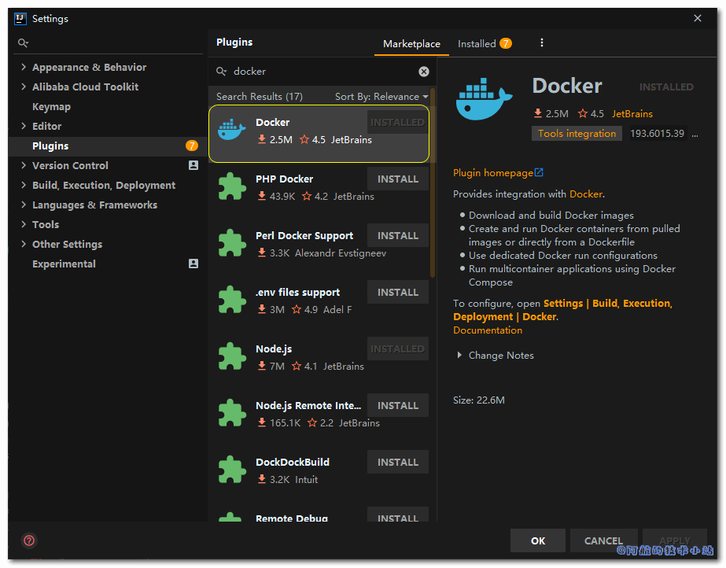
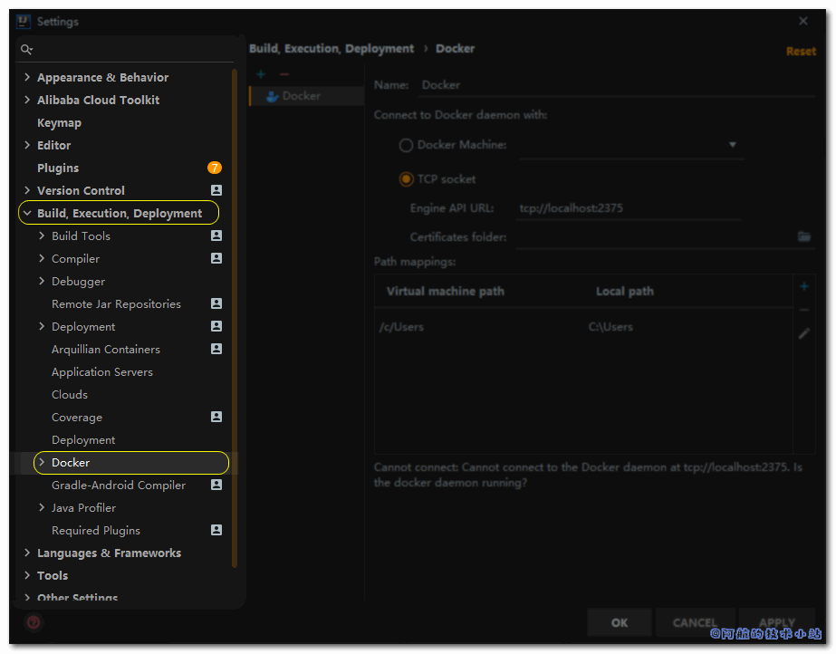
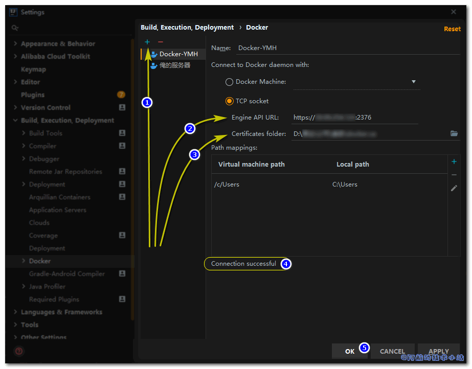
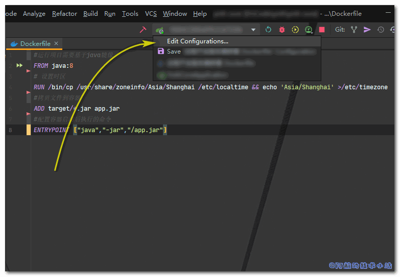
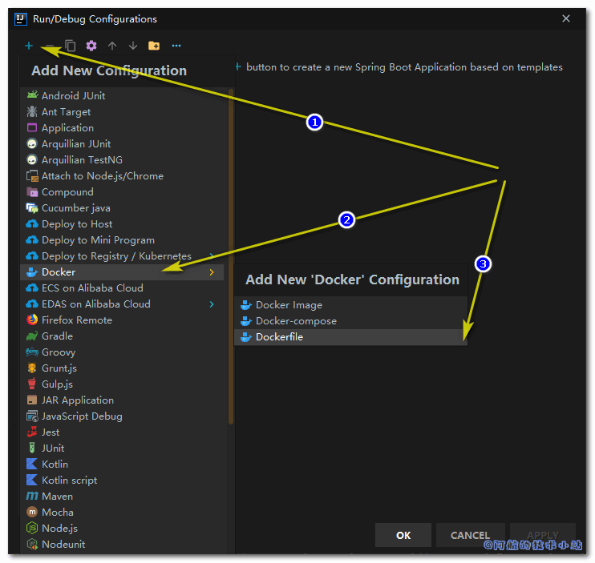
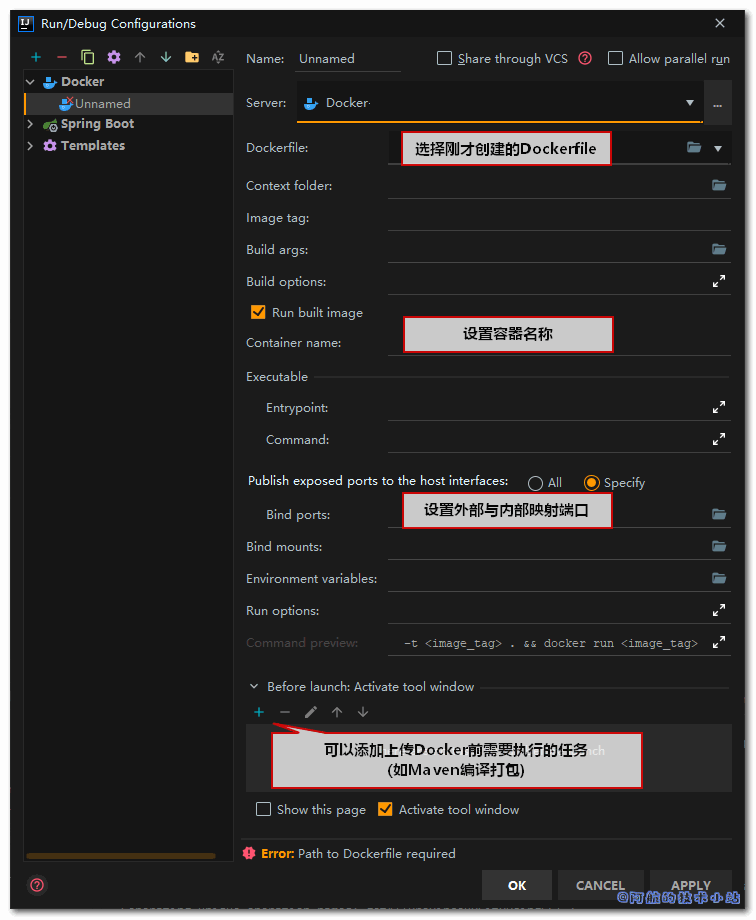
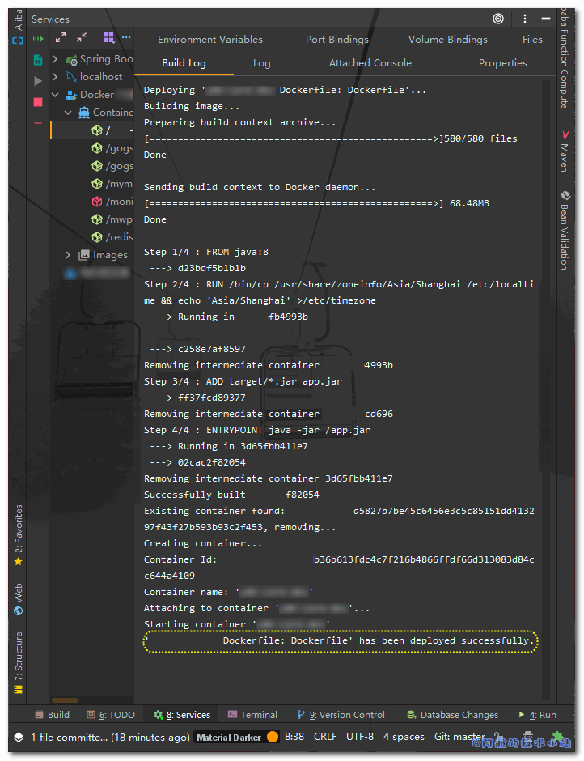

Docker作为当前较为流行的微服务容器管理工具, 极大的方便了传统运维部署的工作. IDEA作为地表最强Java开发IDE, 自然提供了对Docker服务的支持. 本篇文章就来记录下如何使用IDEA 一键部署 SpringBoot 到远程服务器 Docker 内.

## 应用场景

先来看下传统的部署流程:


传统开发流程还好, 每个版本的间隔时间较长. 但是对于小型敏捷开发团队, 这个流程就很要命了! 阿航个人的经验, 每个项目从打包到重启Docker服务器, 预计要花费近10~20分钟! 痛不欲生.

## 需具备的条件

- 你了解服务器的基本使用.
- 你掌握Docker/Dockerfile的使用.
- 你掌握基础的Bash命令.

本篇文章的环境:

<table><tbody><tr><td>远程服务器</td><td>阿里云 + CentOS</td></tr><tr><td>Docker</td><td>1.13.1</td></tr><tr><td>IDEA</td><td>2019.3.2</td></tr></tbody></table>

## 实战开始

\[epcl\_box type="notice"\]本篇教程小步骤较多! 只要稍有疏忽就可能导致失败! 请实践时仔细阅读教程!\[/epcl\_box\]

### 生成CA公钥私钥

进入**安装了Docker的远程服务器**, 创建目录`ca`, 用于存储docker ca认证文件:

```
mkdir -p /usr/local/ca
```

进入该目录中:

```
cd /usr/local/ca
```

执行以下命令, 生成公钥及私钥. 需要输入你自己的密码. **记住该密码, 下面会多次使用**:

```
openssl genrsa -aes256 -out ca-key.pem 4096
```

执行以下命令, 根据提示分别输入你的信息:

```
openssl req -new -x509 -days 365 -key ca-key.pem -sha256 -out ca.pem
```

执行以下命令生成key:

```
openssl genrsa -out server-key.pem 4096
```

执行以下命令, 把`$HOST`替换为你的远程服务器的IP地址:

> 比如你的IP地址为`165.115.12.0`, 那么就变为`"/CN=165.115.12.0"`

```
openssl req -subj "/CN=$HOST" -sha256 -new -key server-key.pem -out server.csr
```

执行以下命令, 来配置白名单.

> 也就是允许指定IP机器远程操作docker. 这里建议直接配置为`0.0.0.0`, 也就是放行所有IP. 因为我们已经有了证书加密, 只要保护证书文件即可.
> 
> 同样别忘了将`$HOST`替换为你远程服务器的IP地址!

```
echo subjectAltName = IP:$HOST,IP:0.0.0.0 >> extfile.cnf
```

将Docker守护进程密钥的扩展用法属性设置为仅用于服务器身份验证:

```
echo extendedKeyUsage = serverAuth >> extfile.cnf
```

生成`ca-key`(需要输入上面设置的密码):

```
openssl x509 -req -days 365 -sha256 -in server.csr -CA ca.pem -CAkey ca-key.pem \-CAcreateserial -out server-cert.pem -extfile extfile.cnf
```

生成远程连接需要的连接key, 依次执行:

```
openssl genrsa -out key.pem 4096
```

```
openssl req -subj '/CN=client' -new -key key.pem -out client.csr
```

```
echo extendedKeyUsage = clientAuth >> extfile.cnf
```

生成`cert.pem`(需要输入上面设置的密码):

```
openssl x509 -req -days 365 -sha256 -in client.csr -CA ca.pem -CAkey ca-key.pem \-CAcreateserial -out cert.pem -extfile extfile.cnf
```

在生成了`cert.pem`以及`server-cert.pem`后, 我们可以安全地删除不需要的配置文件了:

```
rm -v client.csr server.csr
```

为了保护这两个文件不受到破坏, 移除它们的可写权限, 使它们变为只读. 依次执行:

```
chmod -v 0400 ca-key.pem key.pem server-key.pem
```

```
chmod -v 0444 ca.pem server-cert.pem cert.pem
```

将服务器证书拷贝至`/etc/docker`:

> 注意, 你的docker安装目录可能不为`/etc/docker`.  
> 可通过命令`docker info | grep "Docker Root Dir"`查询你的实际目录

```
cp server-*.pem  /etc/docker/
```

```
cp ca.pem /etc/docker/
```

修改docker配置:

```
vi /lib/systemd/system/docker.service
```

将其中的(可能略有差异):

```
ExecStart=/usr/bin/dockerd
```

替换为(**同样别忘记将`/etc/docker`替换为你自己的路径!**):

```
ExecStart=/usr/bin/dockerd --tlsverify --tlscacert=/etc/docker/ca.pem --tlscert=/etc/docker/server-cert.pem --tlskey=/etc/docker/server-key.pem -H tcp://0.0.0.0:2376 -H unix:///var/run/docker.sock
```

编辑完毕, 保存.

    `:wq`

#### 重启docker守护进程

依次输入以下命令:

```
systemctl daemon-reload
```

```
systemctl restart docker
```

#### 开放外部端口

依次输入以下命令, 开放端口:

```
/sbin/iptables -I INPUT -p tcp --dport 2376 -j ACCEPT
```

```
iptables-save
```

**注意**, 如果你使用了云服务器(如阿里云), 同样需要在云服务器上开放2376端口!

#### 重启docker

```
service docker restart
```

### 下载客户端访问校验文件

使用FTP工具(如WinSCP), 进入`/usr/local/ca`目录, 将其中的三个文件:

```
/usr/local/ca/ca.pem
/usr/local/ca/cert.pem
/usr/local/ca/key.pem
```

存储至本地某文件夹内.

### IDEA安装Docker插件

打开IDEA设置, 左上角`File`\->`Settings`(快捷键`CTRL`+`ALT`+`S`).

找到`Plugins`, 搜索关键词"docker\`:

<figure>



<figcaption>

IDEA Docker 插件

</figcaption>

</figure>

若未安装, 点击`INSTALL`按钮进行安装. 安装完成后重启IDEA.

### IDEA连接Docker

打开IDEA设置, 左上角`File`\->`Settings`(快捷键`CTRL`+`ALT`+`S`).

找到Docker设置:

<figure>



<figcaption>

IDEA Docker设置位置

</figcaption>

</figure>

按照下方图片步骤操作:

1. 点击加号, 创建Docker配置
2. 设置远程服务器地址, 格式为`https://你的IP:2376`
3. 设置本地ca目录, 也就是上面我们拷贝下来的三个文件存放的目录
4. 查看下方文本提示, 若为`Connection successful`则表示成功
5. 保存配置

<figure>



<figcaption>

IDEA配置Docker

</figcaption>

</figure>

### 创建Dockerfile

在项目目录中创建文件`Dockerfile`:

```
#运行项目需要基于java镜像
FROM java:8
# 设置时区
RUN /bin/cp /usr/share/zoneinfo/Asia/Shanghai /etc/localtime && echo 'Asia/Shanghai' >/etc/timezone
#拷贝文件到容器
ADD target/*.jar app.jar
#配置容器启动后执行的命令
ENTRYPOINT ["java","-jar","/app.jar"]
```

### 创建Docker运行配置

点击上方偏右的下拉框, 选择`Edit Configurations`点击:



创建一个Docker运行配置:



点击后进入一个详情页, 几个重要配置项在图片中有解释:



完成后进行保存.

\[epcl\_box type="success"\]进行如此一番折腾, 我们终于成功的搞定IDEA一键部署了!\[/epcl\_box\]

🟢 运行一下, 当控制台日志显示success即为成功:



享受一键部署吧!

## 感谢

- [Protect the Docker daemon socket](https://docs.docker.com/engine/security/https/#create-a-ca-server-and-client-keys-with-openssl)
- [【Docker】在IDEA中实现一键部署到服务器(附ssl连接加密)](https://blog.csdn.net/lovexiaotaozi/article/details/82797236)
