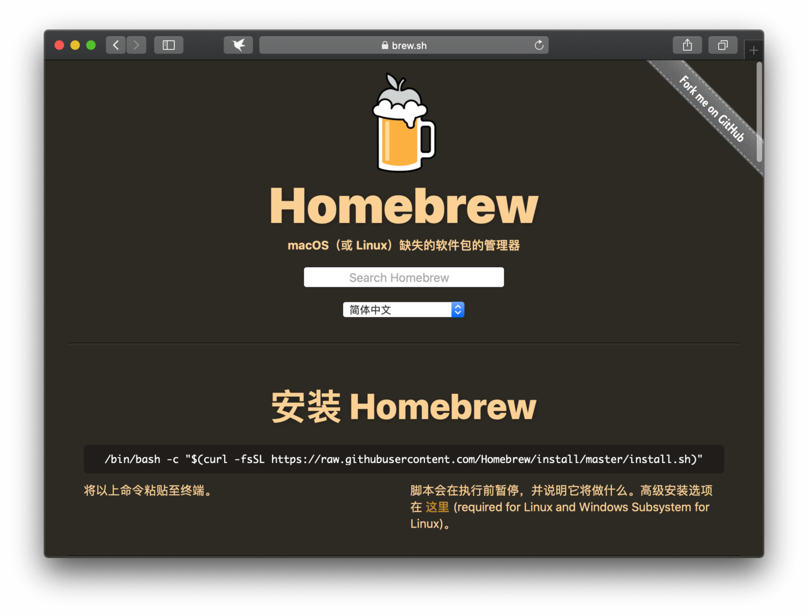
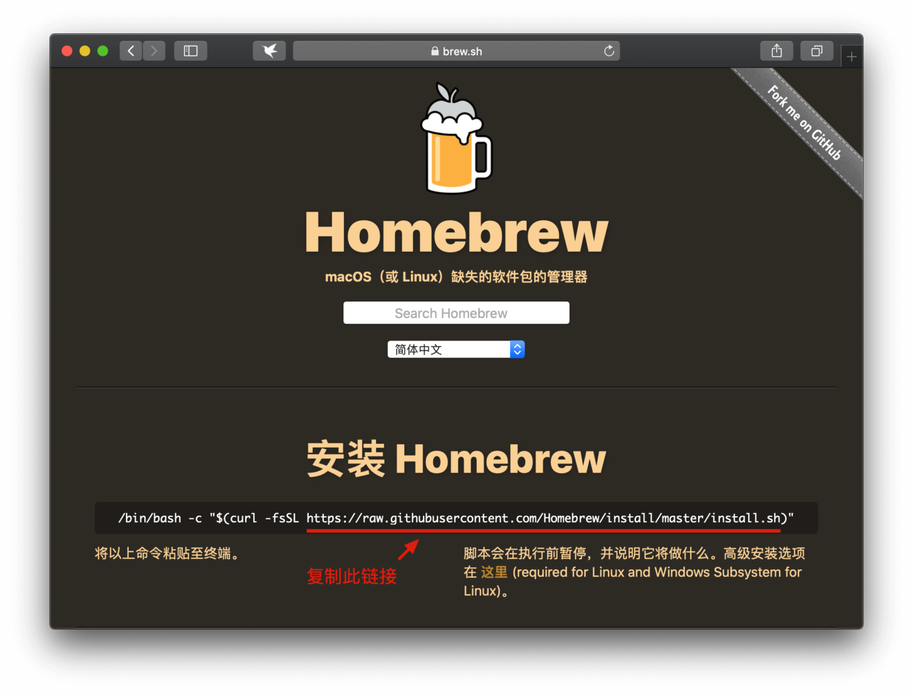
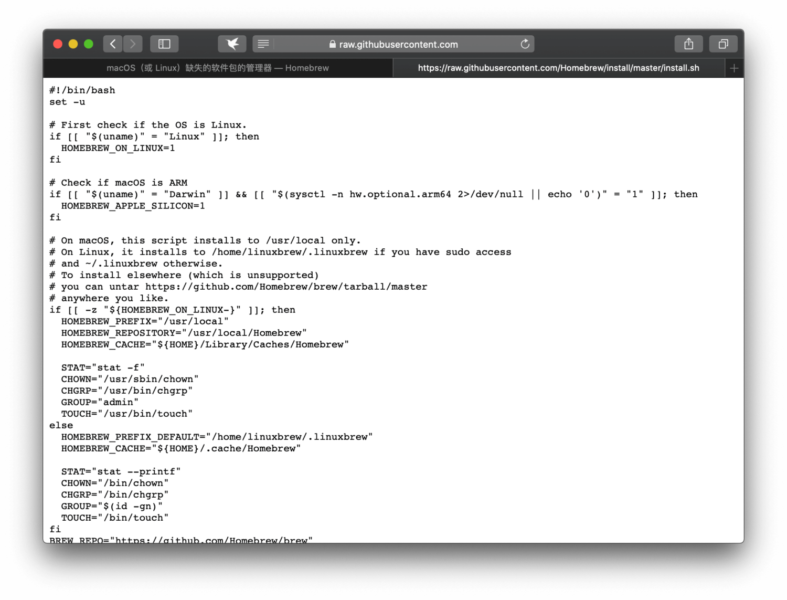
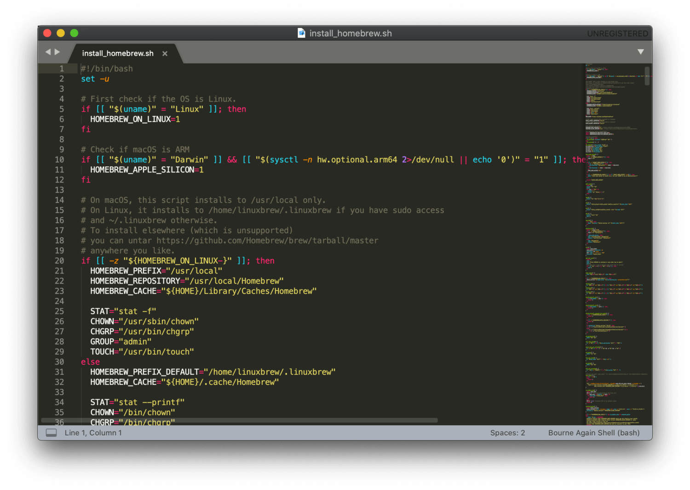
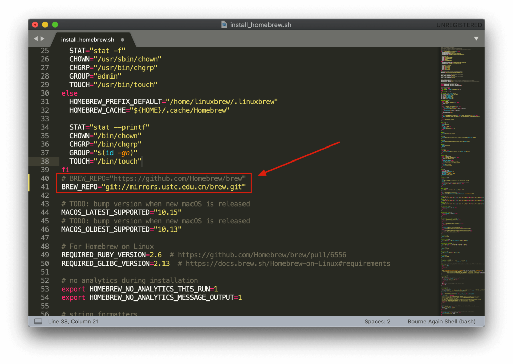
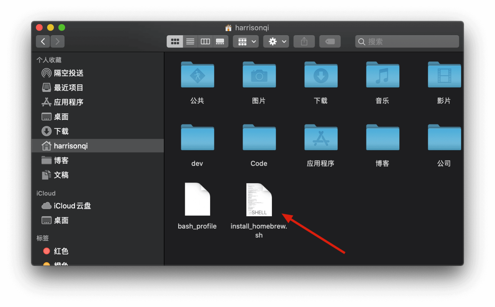
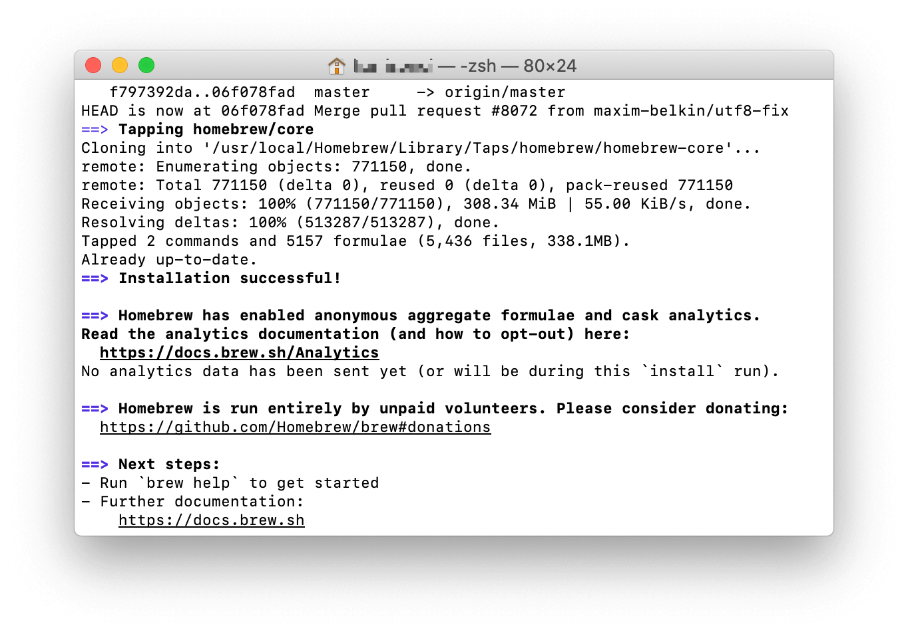
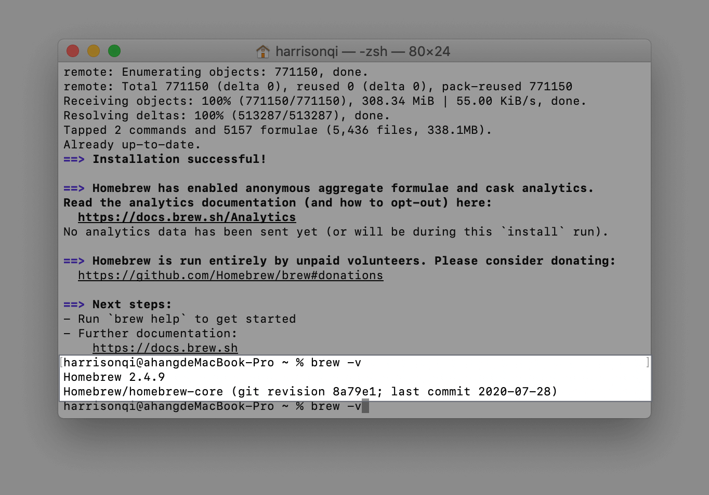

因为最近刚刚换的Macbook，所以需要部署之前的开发环境。部署一部分以后发现很多都建议使用`brew`命令进行安装。本篇文章就来记录下MacOS如何安装Homebrew。

## 什么是Homebrew

Homebrew是一个包管理器，方便管理你的软件（安装、升级与卸载）。

\[epcl\_box type="information"\]联想一下你安装手机应用时一般都会打开应用商店而不是去每个网站下载，你就很快能够理解它的重要性了。\[/epcl\_box\]

## 安装Homebrew

### 海外安装

> 如果你是大陆用户，请直接跳转至下方的“大陆安装”。

如果你身在国外，安装Homebrew非常简单，只需要运行以下命令：

    `/bin/bash -c "$(curl -fsSL https://raw.githubusercontent.com/Homebrew/install/master/install.sh)"`

如果返回：`curl: (7) Failed to connect to raw.githubusercontent.com port 443: Connection refused`欢迎查看阿航写的教程[《一步解决 Failed to connect to raw.githubusercontent.com port 443: Connection refused》](https://www.bugcatt.com/archives/2485)。

* * *

耐心等待一会儿，直到终端中提示：

    `Press RETURN to continue or any other key to abort`

点击回车(`ENTER`)键继续，然后继续耐心等待。

### 大陆安装

因为国内的外网环境很差，如果按照正常的方法安装，恐怕要到猴年马月去。这里给大家提供加速的方法。

#### 访问官网

访问[Homebrew官网](https://brew.sh/index_zh-cn)，可以看到：

复制下方命令行中的链接：

在浏览器中访问该链接，并复制网页上的全部内容（如果电脑无法访问，可尝试在手机上访问）：

粘贴至文本编辑器：

找到其中的`BREW_REPO`参数，替换值为`git://mirrors.ustc.edu.cn/brew.git`:

保存至电脑：

打开终端，为刚才的文件赋予权限（替换`~/install_homebrew.sh`为你刚才保存文件的路径）：

    `chmod +x ~/install_homebrew.sh`

运行以下命令（仍然替换`~/install_homebrew.sh`为你刚才保存文件的路径）：

    `/bin/bash -c ~/install_homebrew.sh`

当出现提示：

    `Press RETURN to continue or any other key to abort`

点击回车即可。享受飞一般的速度吧！（相较于原本的方法）

当出现以下提示时就应该成功了：

### 校验是否成功

在终端中输入：

    `brew -v`

如果出现了brew版本即为安装成功：

### 替换Homebrew源

如果你是大陆用户，本步骤至关重要。如果不进行国内镜像加速，每次安装和升级将会让你痛不欲生。

#### 替换Homebrew默认源

在终端中依次输入：

    `cd "$(brew --repo)"`

    `git remote set-url origin git://mirrors.ustc.edu.cn/brew.git`

#### 替换Homebrew-core源

在终端中依次输入：

    `cd "$(brew --repo)/Library/Taps/homebrew/homebrew-core"`

    `git remote set-url origin git://mirrors.ustc.edu.cn/homebrew-core.git`

#### 更新Homebrew

在终端中输入：

    `brew update`
