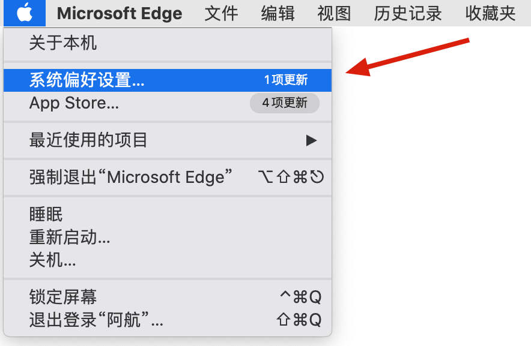
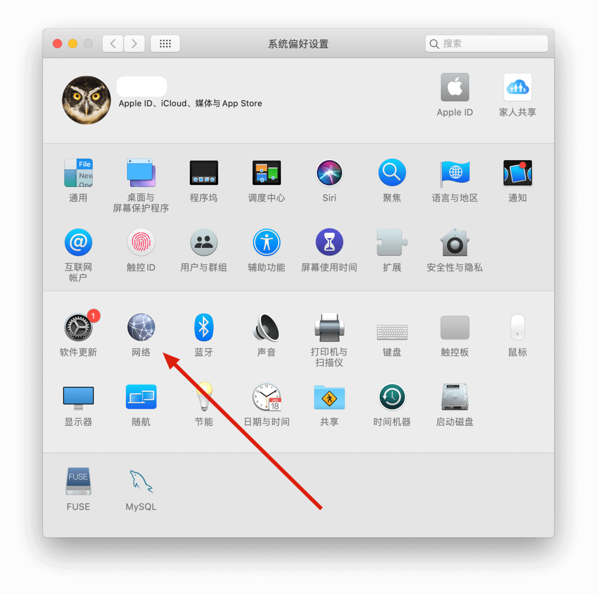
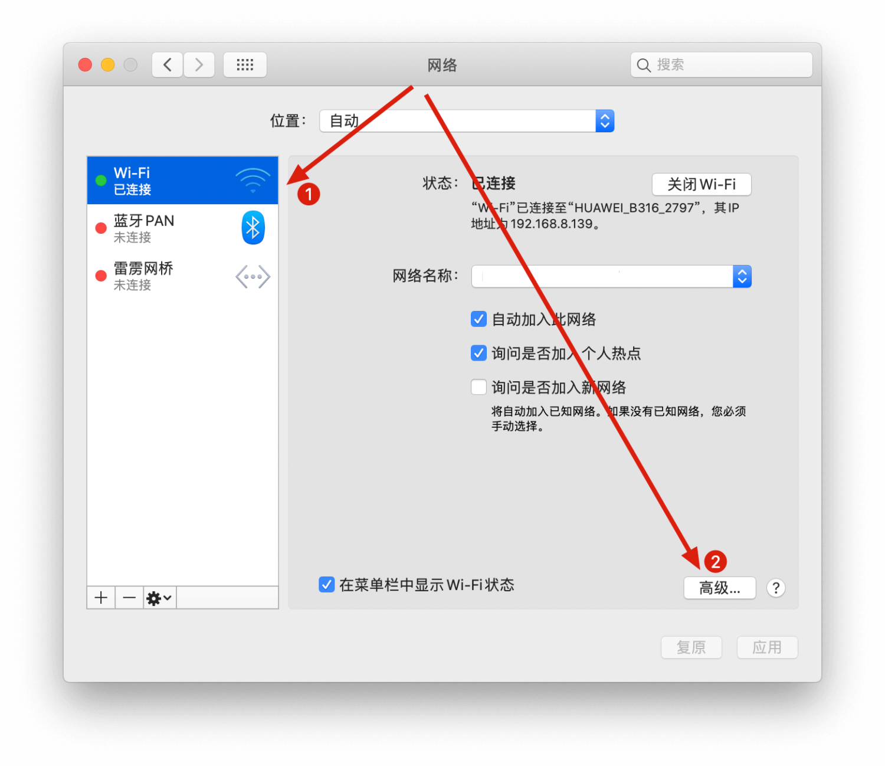
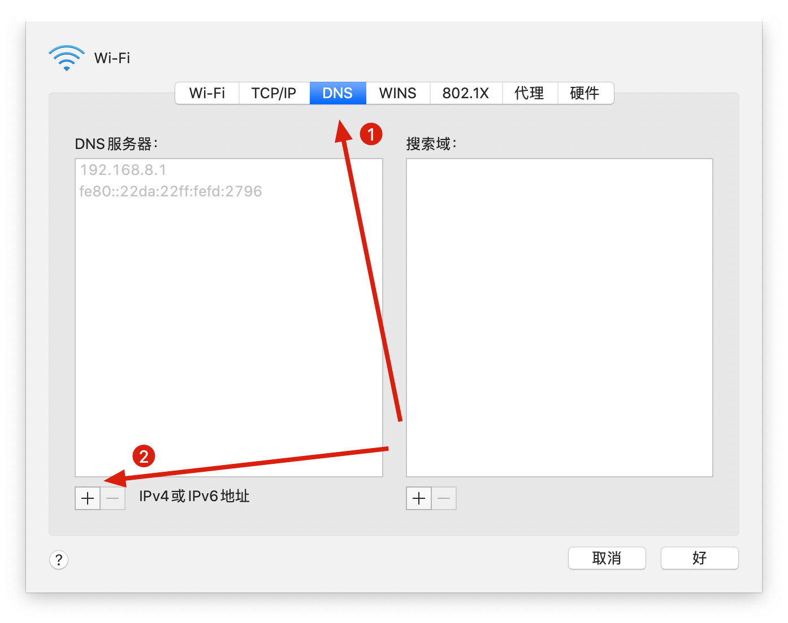

有时修改DNS，就能访问某些原本被禁止的网站。本篇文章就来记录下如何修改MacOS的DNS设置。

## 实战开始

### 修改DNS

点击左上角的🍎图标，找到系统偏好设置：

找到网络：

选中当前的网络连接，并点击右下角的`高级`按钮:

在高级设置中，选中`DNS`标签，并点击左下角的`+`号按钮添加DNS。

这里附上部分公共DNS，供你参考：

| 名称 | DNS1 | DNS2 |
| --- | --- | --- |
| 114 DNS | 114.114.114.114 | 114.114.115.115 |
| Google DNS | 8.8.8.8 | 8.8.4.4 |
| 阿里 AliDNS | 223.5.5.5 | 223.6.6.6 |
| 百度 BaiduDNS | 180.76.76.76 | \- |
| DNSPod DNS+ | 119.29.29.29 | 182.254.116.116 |

完成后**别忘了进行保存**。

### 刷新DNS缓存

如果保存完成后并未生效（多数会实时生效），你可以尝试输入以下命令刷新DNS缓存。

#### OS X Yosemite及后面的版本

适用于 OS X v10.10.4 及以后的版本：

    `sudo killall -HUP mDNSResponder`

适用于 OS X v10.10 到 v10.10.3 之间:

    `sudo discoveryutil mdnsflushcache`

#### OS X Mavericks, Mountain Lion, 和 Lion

适用于 OS X v10.9.5 及更早：

    `sudo killall -HUP mDNSResponder`

#### Mac OS X Snow Leopard

    `sudo dscacheutil -flushcache`

你也可以查看[官网说明](https://support.apple.com/en-us/HT202516)。

## 注意

使用完成后，建议将DNS改回去，否则你会出现网络卡顿的现象。
