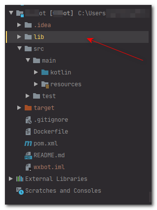

在尝试打包Maven项目, 运行`mvn install`命令时, IDEA报了这个错:

    `kotlin unresolved reference`

然后查看该报错指向的行, 是来自外部的jar. 本篇文章就来记录下如何将外部jar打包进入Maven项目.

## 解决方案

将你的`*.jar`文件全部移动至`项目目录/lib`下. 比如我的springboot项目, 包结构大致是这样的:

然后进入`pom.xml`文件, 分别为你的每个jar文件添加依赖, 比如:

    `<dependency>     <groupId>com.example</groupId>     <artifactId>xxx-sdk</artifactId>     <version>0.0.1</version>     <scope>system</scope>     <systemPath>${project.basedir}\lib\xxxx.jar</systemPath> </dependency>`

其中, `groupId`、`artifactId`以及`version`的值你可以随意填写(阿航是参照jar的内容来写).

重点是`scope`以及`systemPath`:

- scope标签不能缺少.

- systemPath填写jar所在位置的相对路径. 你直接替换上面的xxxx.jar为你的文件名即可
