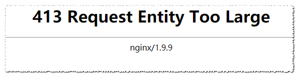

在进行文件上传的操作时, Nginx 报错: 413 Request Entity Too Large

## 问题展示

又是熟悉的踩坑环节😂! 看看今天阿航踩了啥坑吧:

在尝试上传文件到服务器时, 碰到了大大的:



## 原因

nginx的默认文件上传大小大于你上传文件的大小

## 解决方案

### 找到nginx配置文件

找到nginx的配置文件(nginx/conf/nginx.conf)

### 修改`server`的`location`的配置

找到你要修改的server, 比如:

```
server {
    listen 80;
    server_name adb.abc.com;
    location / {
        root   html;
        index  index.html index.htm;
    }
}
```

在location块中添加一行配置:

```
client_max_body_size  64m; # 改为你需要的大小!
```

修改后就变为了:

```
server {
    listen 80;
    server_name adb.abc.com;
    location / {
        root   html;
        index  index.html index.htm;
        client_max_body_size  64m; # 改为你需要的大小!
    }
}
```

### 保存并重启

保存文件, 重启nginx(首个nginx替换为你安装的目录):

```
nginx/sbin/nginx -s reload
```

如果你在Centos使用yum安装的, 那么直接输入重启服务命令:

```
systemctl restart nginx
```

## 附官方文档

若上述方案未解决你的问题, 你也可以去查看[nginx官方中文文档](https://www.nginx.cn/doc/)

## 结语

对文章若有任何问题、异议以及改进建议, 欢迎在下方进行评论. 作者将尽快回复! 获取最新文章, 欢迎阅读[官方博客](https://blog.bugcatt.com/?p=213).

更多更好的教程/博客/资讯, 欢迎访问我的官网: [阿航的技术小站](https://blog.bugcatt.com).
