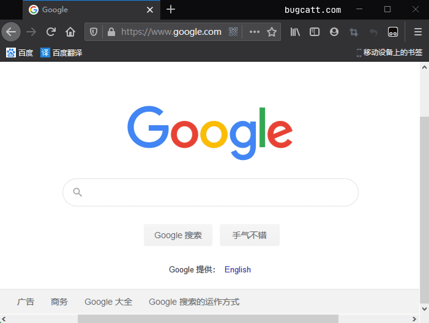
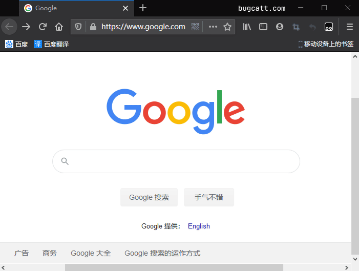

这次阿航需要为公司的某网站开启远程访问, 但是仅允许公司内部员工使用. 本篇文章就来记录下如何为Nginx 设置密码/开启密码验证/需用户名密码才能访问.

## 效果

有图有真相, 我们最终要实现的效果如下:

<figure>

<figcaption>

用户名与密码输入正确

</figcaption>

</figure>

<figure>

<figcaption>

尝试匿名访问

</figcaption>

</figure>

## 前置条件

1. 掌握Nginx基础.
2. 掌握bash/shell的基本命令.

本篇文章的环境:

<table class=""><tbody><tr><td>操作系统</td><td>CentOS 7</td></tr><tr><td>nginx</td><td>1.8+</td></tr></tbody></table>

## 实战开始

### 安装生成账号密码工具

    `yum install httpd-tools`

\[epcl\_box type="notice"\]如果yum下载过慢, 请阅读[这篇文章](https://www.bugcatt.com/archives/981)开启加速.\[/epcl\_box\]

如果提示`Is this ok [y/d/N]:`, 输入`y`并点击回车.

### 生成账号密码

输入以下命令, 生成账号密码文件:

    `htpasswd -bc 文件路径 用户名 密码`

比如:

    `htpasswd -bc /usr/root.db root 123456`

### 为nginx配置账号密码校验

进入nginx配置文件. 找到你要添加账号密码验证的`server`. 为其添加两行代码:

    `server {     listen       80;     server_name  hello.com;      auth_basic "Please enter password";   # 密码提示     auth_basic_user_file /usr/root.db; # 填写上面你生成的账户密码文件路径      location / {         root   /usr/share/nginx/html;         index  index.html index.htm;     } }`

重启nginx(两种方式, 按需选择):

    `nginx -s reload`

或

    `service nginx restart`

🟢 重启完成后, 访问你的链接. 应该会有如下效果:

<figure>

<figcaption>

效果-输入正确

</figcaption>

</figure>

<figure>

<figcaption>

效果-不输入密码

</figcaption>

</figure>

### 重新验证

目前阿航仅知道清除浏览器缓存(`CTRL`+`SHIFT`+`DEL`)后, 可重新登录. 若同学们知道其他方法, 欢迎在下方评论区进行讨论.

## 感谢

- [nginx 使用密码认证](https://www.jianshu.com/p/2da79aea5fc3)
- [Pexels](https://www.pexels.com/zh-cn/photo/846288/?utm_content=attributionCopyText&utm_medium=referral&utm_source=pexels) 上的 [Bich Tran](https://www.pexels.com/zh-cn/@thngocbich?utm_content=attributionCopyText&utm_medium=referral&utm_source=pexels) 拍摄的图片
