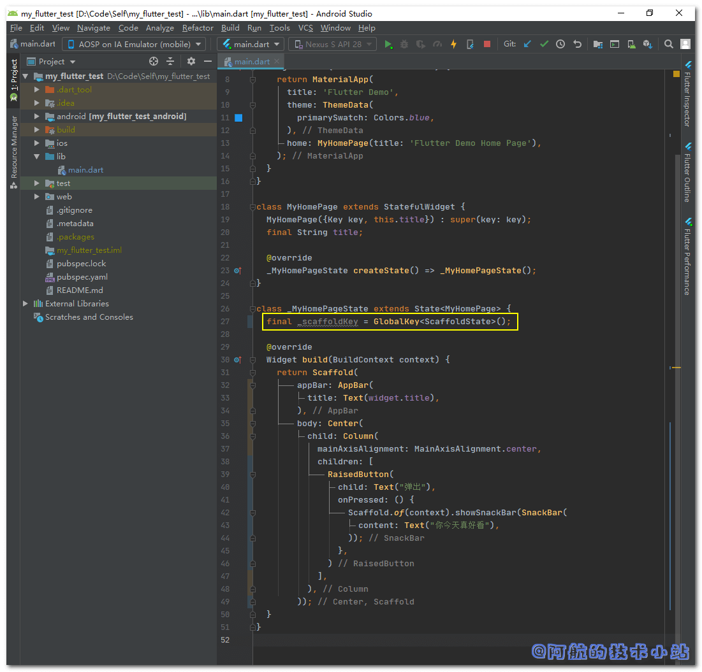
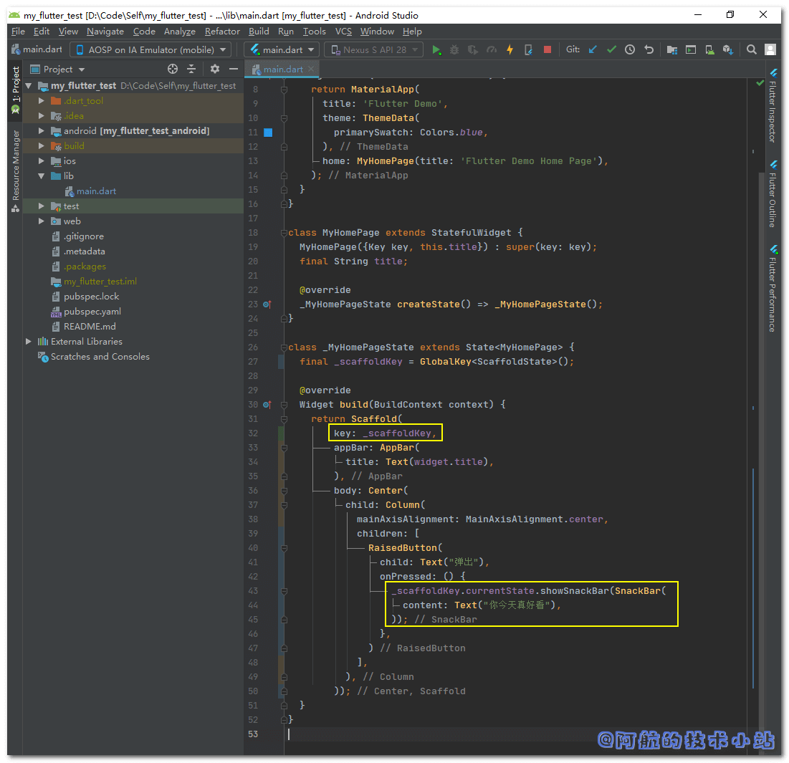

今天阿航在研究底部弹出提示`showSnackBar()`组件时碰到了这个报错:

```
Scaffold.of() called with a context that does not contain a Scaffold.
```

本篇文章就来记录下这种报错该如何解决!

## 问题原因

完整报错日志:

```
════════ Exception caught by gesture ═══════════════════════════════════════════════════════════════
The following assertion was thrown while handling a gesture:
Scaffold.of() called with a context that does not contain a Scaffold.

No Scaffold ancestor could be found starting from the context that was passed to Scaffold.of(). This usually happens when the context provided is from the same StatefulWidget as that whose build function actually creates the Scaffold widget being sought.

There are several ways to avoid this problem. The simplest is to use a Builder to get a context that is "under" the Scaffold. For an example of this, please see the documentation for Scaffold.of():
```

先来看下阿航出错的源码:

```
import 'package:flutter/material.dart';

void main() => runApp(MyApp());

class MyApp extends StatelessWidget {
  @override
  Widget build(BuildContext context) {
    return MaterialApp(
      title: 'Flutter Demo',
      theme: ThemeData(
        primarySwatch: Colors.blue,
      ),
      home: MyHomePage(title: 'Flutter Demo Home Page'),
    );
  }
}

class MyHomePage extends StatefulWidget {
  MyHomePage({Key key, this.title}) : super(key: key);
  final String title;

  @override
  _MyHomePageState createState() => _MyHomePageState();
}

class _MyHomePageState extends State {

  @override
  Widget build(BuildContext context) {
    return Scaffold(
      appBar: AppBar(
        title: Text(widget.title),
      ),
      body: Center(
        child: Column(
          mainAxisAlignment: MainAxisAlignment.center,
          children: [
            RaisedButton(
              child: Text("弹出"),
              onPressed: () {
                Scaffold.of(context).showSnackBar(SnackBar(
                  content: Text("你今天真好看"),
                ));
              },
            )
          ],
        ),
      ),
    );
  }
}
```

其中, 报错的重点是:

```
Scaffold.of(context).showSnackBar(SnackBar(
  content: Text("你今天真好看"),
));
```

问题的可能原因是: `Scaffold.of(context)`中传入的`context`并非是所需的`context`, 被`build`函数顶替了!

\[epcl\_box type="information"\]速度快的同学可以直接看下面的核心代码!\[/epcl\_box\]

## 解决方案

### 方法一: 使用Builder

进行代码替换:

```
- body: Center(
+ body: Builder(
+   builder: (context) => Center(
    child: Column(
      mainAxisAlignment: MainAxisAlignment.center,
      children: [
        RaisedButton(
          child: Text("弹出"),
          onPressed: () {
            Scaffold.of(context).showSnackBar(SnackBar(
              content: Text("你今天真好看"),
            ));
          },
        )
      ],
+   ),
  ));
```

> 💡 代码解析: 实际上, 我们只是在`Center`外面套了一层`Builder()`. 这样就可以使正确的`context`传入`snackBar`.

但是, 这样对代码的改动比较大, 并且变更了结构. 这是典型的"丑代码". 我们再来介绍另一种方法.

### 方法二: 使用GlobalKey(推荐)

我们在`_MyHomePageState`中添加一个实例变量:

```
final _scaffoldKey = GlobalKey();
```

如图:



先在`Scaffold`对象内添加一条属性:

```
key: _scaffoldKey,
```

之后, 替换之前的:

```
Scaffold.of(context).showSnackBar(SnackBar(
  content: Text("你今天真好看"),
));
```

为:

```
_scaffoldKey.currentState.showSnackBar(SnackBar(
  content: Text("你今天真好看"),
));
```

修改如图:



> 💡 代码解析: 这里首先创建了一个`GlobalKey`类型的`_scaffoldKey`实例变量, 将当前`Scaffold`对象的key进行绑定. 之后再次通过该`_scaffoldKey`调用`showSnackBar`函数.

这样做的一大好处就是直接消除了调用位置的限制! 只要变量能被引用, 就可以直接调用其`showSnackBar`.

全部代码, 你可以直接运行:

```
import 'package:flutter/material.dart';

void main() => runApp(MyApp());

class MyApp extends StatelessWidget {
  @override
  Widget build(BuildContext context) {
    return MaterialApp(
      title: 'Flutter Demo',
      theme: ThemeData(
        primarySwatch: Colors.blue,
      ),
      home: MyHomePage(title: 'Flutter Demo Home Page'),
    );
  }
}

class MyHomePage extends StatefulWidget {
  MyHomePage({Key key, this.title}) : super(key: key);
  final String title;

  @override
  _MyHomePageState createState() => _MyHomePageState();
}

class _MyHomePageState extends State {
  final _scaffoldKey = GlobalKey();

  @override
  Widget build(BuildContext context) {
    return Scaffold(
        key: _scaffoldKey,
        appBar: AppBar(
          title: Text(widget.title),
        ),
        body: Center(
          child: Column(
            mainAxisAlignment: MainAxisAlignment.center,
            children: [
              RaisedButton(
                child: Text("弹出"),
                onPressed: () {
                  _scaffoldKey.currentState.showSnackBar(SnackBar(
                    content: Text("你今天真好看"),
                  ));
                },
              )
            ],
          ),
        ));
  }
}
```

## 核心代码

### 方法一

在你的组件外层包裹:

```
Builder(
   builder: (context) =>
    // 你之前的代码
)
```

### 方法二

首先定义`GlobalKey`:

```
final _scaffoldKey = GlobalKey();
```

然后在`Scaffold`中绑定`key`:

```
Scaffold(
  key: _scaffoldKey,
  // ...
```

之后通过key调用`snackBar`:

```
_scaffoldKey.currentState.showSnackBar(SnackBar(
  content: Text("你今天真好看"),
));
```

## 感谢

[Scaffold.of() called with a context that does not contain a Scaffold - Stack Overflow](https://stackoverflow.com/questions/51304568/scaffold-of-called-with-a-context-that-does-not-contain-a-scaffold)
