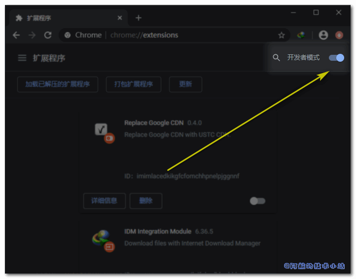
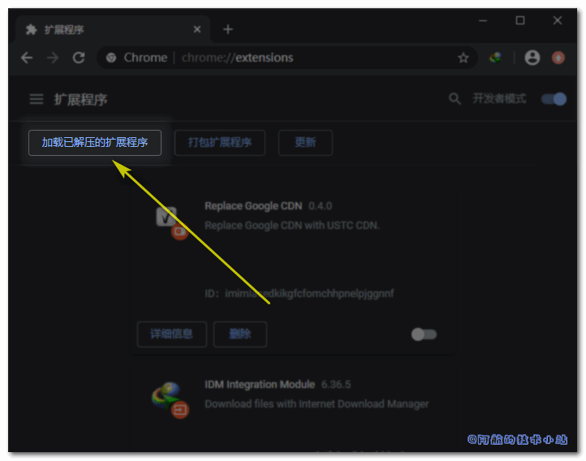

因为大陆对Google进行了封锁, 所以大陆无法访问包含了Google域名的资源文件的页面, 即使能访问也过慢. Stack Overflow作为全球最大的技术问答平台, 无法访问是我们相当大的一个损失. 本篇文章就来记录几种解决方案.

## 问题原因

打开调试控制台(F12), 访问 [https://stackoverflow.com/](https://stackoverflow.com/) . 我们会发现有关Google的请求非常慢, 甚至无法访问. 如:

```
https://ajax.googleapis.com/ajax/libs/jquery/1.12.4/jquery.min.js
```

那么找到了原因, 我们就针对此问题进行解决即可!

## 解决方案

### Replace Google CDN

#### FireFox

直接安装插件即可 [插件地址](https://addons.mozilla.org/en-US/firefox/addon/replace-google-cdn/)

#### Chrome/Edge等谷歌内核的浏览器:

[点击下载插件](https://github.com/justjavac/ReplaceGoogleCDN/archive/master.zip), 并解压. 找到其中的`chrome`目录

打开浏览器, 输入`chrome://extensions/`

开启右上角的`开发者模式`或者`Developer Mode`:



紧接着点击`加载已解压的扩展程序`或`Load unpacked extension...`:



选择刚才下载的插件目录中的`chrome`目录.

关闭开发者模式.

\[epcl\_box type="success"\]再次访问Stack Overflow, 感受飞一样的速度吧!\[/epcl\_box\]

## 感谢

[justjavac](https://github.com/justjavac) / **[ReplaceGoogleCDN](https://github.com/justjavac/ReplaceGoogleCDN)**
