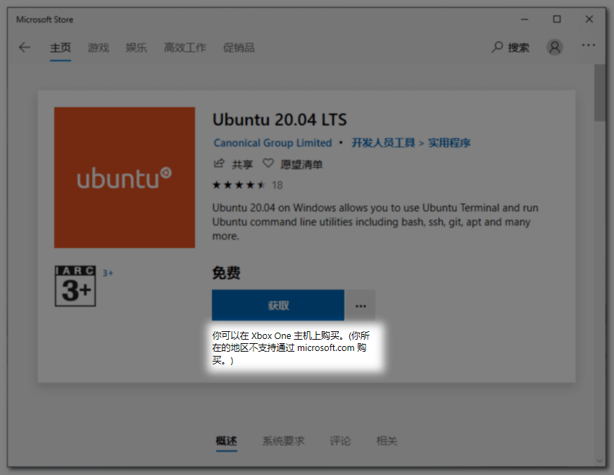
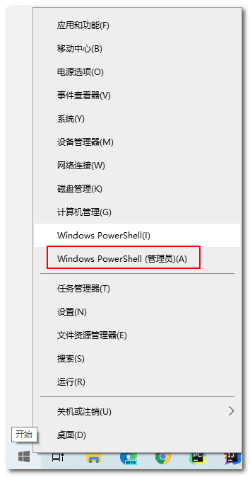
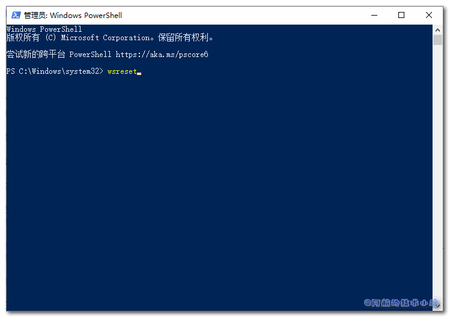
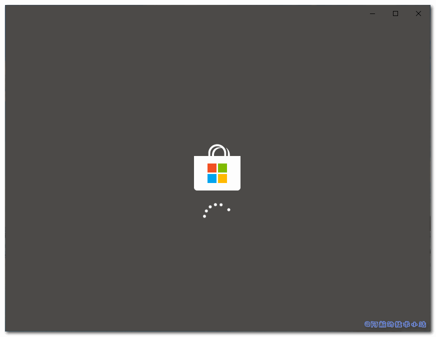
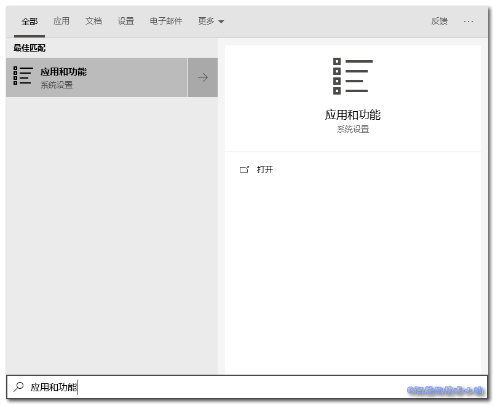
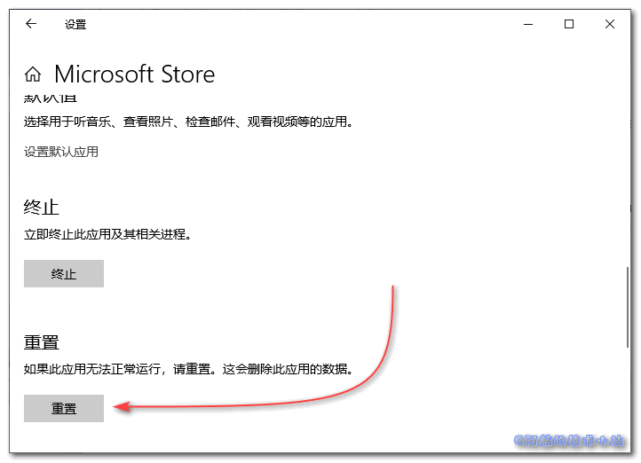
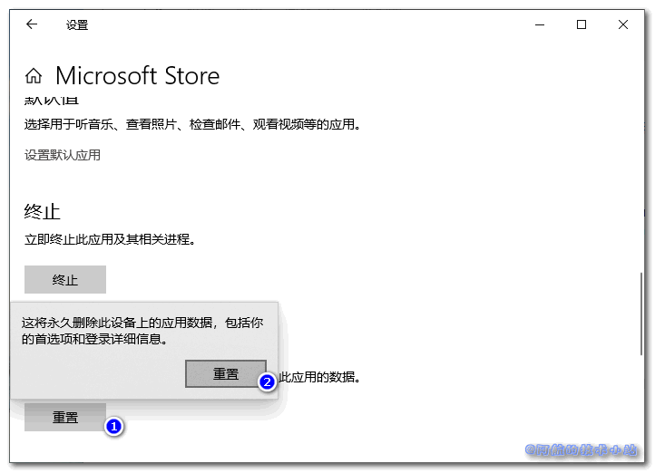
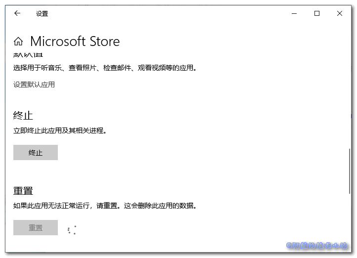
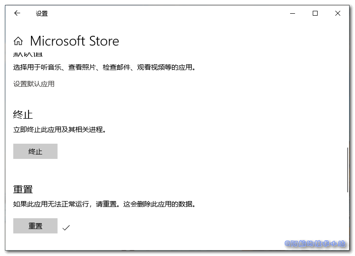

在使用Microsoft应用商店, 准备下载某个应用时, 点击获取按钮. 手都tm按麻了也没见开始下载...甚至连提示都没有!! 服了这微软. 本篇文章就来记录下如何解决此问题.

## 问题展示

### 所在地区不支持

如果你是如图的问题, 请先移步[《你所在的地区不支持通过 microsoft.com 购买的解决方案》](https://www.bugcatt.com/archives/1821):

### 点击获取按钮无反应:

当你点击如下图的获取按钮后, 界面一动不动, 没有任何回应、提示:

本篇文章就是来解决这个问题的.

## 解决方案

### 方案一: 清理Microsoft应用商店缓存

先**关闭**所有打开的应用商店窗口.

右键开始, 点击`Windows Powershell(管理员)`:

在命令行中输入`wsreset`:

输入回车, **耐心等一下**(因为不会有反馈, 甚至进度条也没有), 阿航大概等了3分钟左右. 清理完成后会弹出商店:

再次进入应用下载页, 点击获取:

当然, 这种方式可能无法解决问题, 若如此, 请继续看下面的解决方案.

### 方案二: 重置Microsoft应用商店

点击开始, 输入`应用和功能`:

点击进入, 向下拉, 找到`Microsoft Store`, 单击它, 点击`高级选项`:

进入到`高级选项`窗口, 向下拉, 找到`重置`:

点击`重置`, 并确认重置:

等待, 转圈:

重置完成后, 重置按钮右边会出现"√":

再次打开应用商店, 看看是否成功.

\[epcl\_box type="success"\]阿航在这一步成功了!\[/epcl\_box\]
