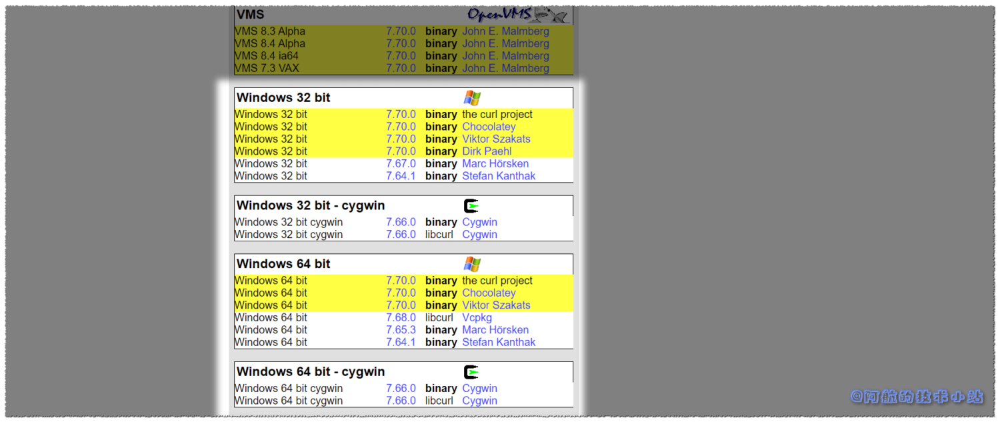
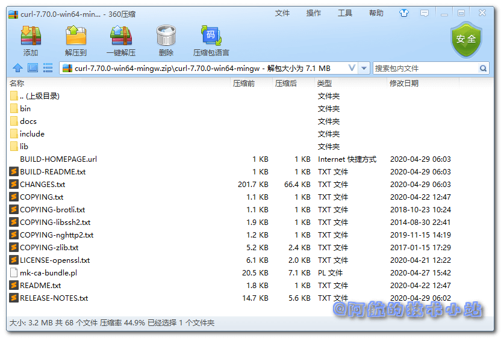
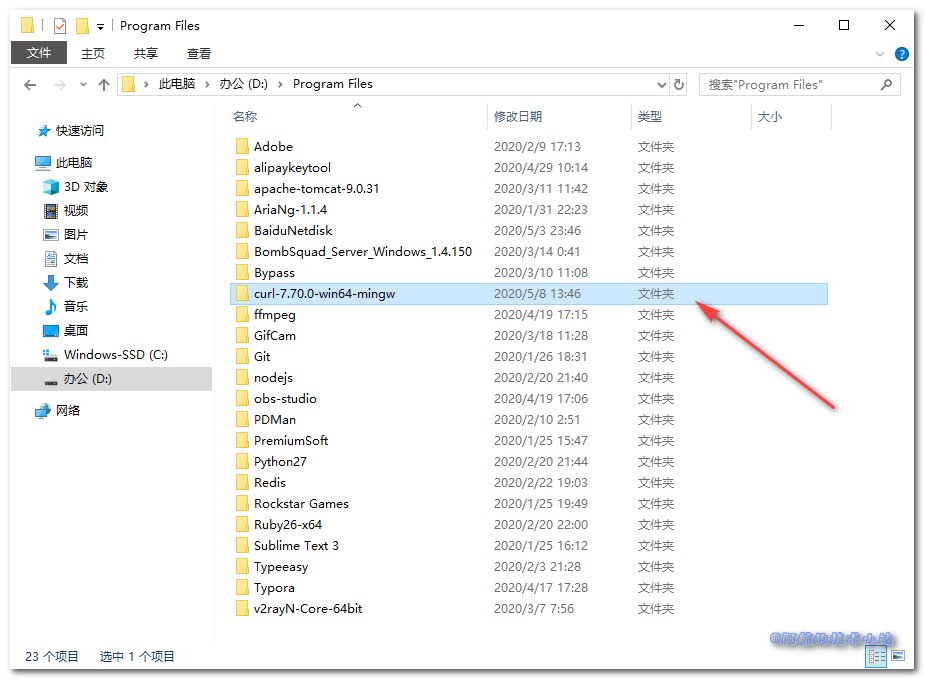
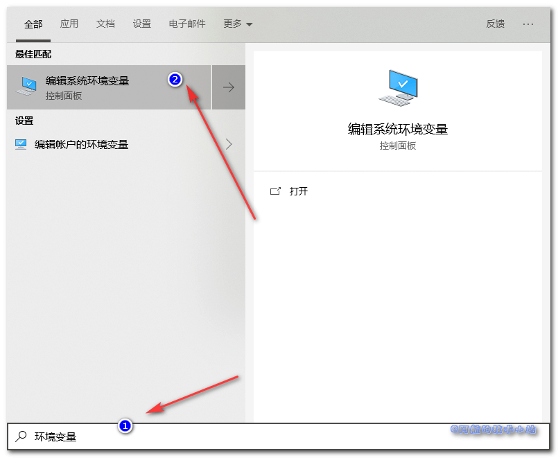
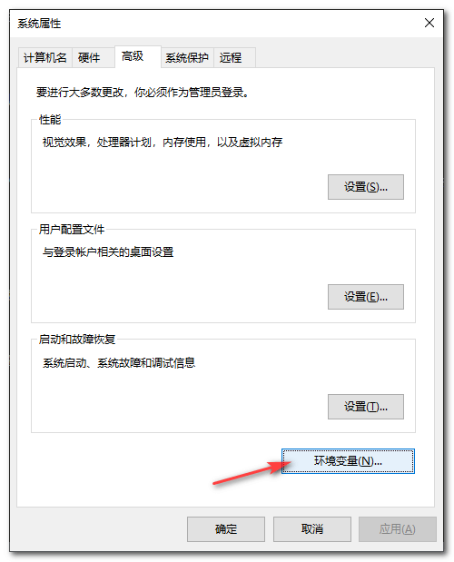
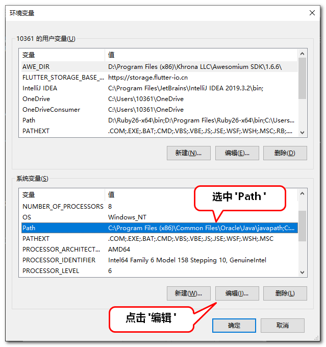
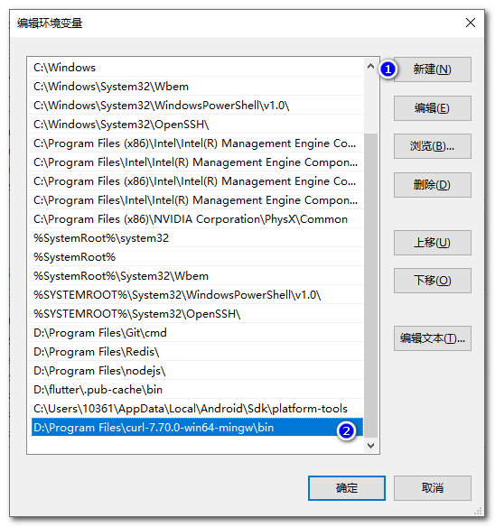
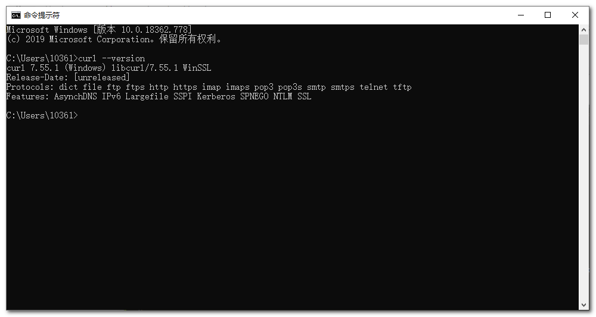

很多时候对接API, 接口提供方都会给出CURL格式的数据让我们进行访问、运行. 今天阿航看到百度站长平台(百度搜索资源平台)的主动推送有CURL方式. 但是发现自己的Windows上没有CURL的运行环境, 在此记录一下安装、部署CURL的过程.


## 需具备的条件

- 本篇教程针对于Windows系统用户, 阿航用的是Win10
- 你的电脑可以联网
- 电脑有了自己的压缩软件(比如WinRAR、 360压缩等)

## 下载 CURL

访问[CURL官网](https://curl.haxx.se/download.html), 向下拉, 找到Windows的版本(汗, 在最下面. 这是多讨厌Windows…).  
如图:



解压, 应该可以看到如下目录:



把压缩文件中的目录解压到某个地方(阿航放在了`D:\Program Files\curl-7.70.0-win64-mingw`下):



## 配置 Windows 环境变量

打开环境变量设置(点击开始, 直接输入关键字"环境变量"):



点击"环境变量"按钮:



选中"系统变量"的`Path`, 点击编辑:



新建一个环境变量, 值为`解压目录\bin`. 阿航这里为`D:\Program Files\curl-7.70.0-win64-mingw\bin`:



一路确定保存.

## 校验 CURL 是否安装成功

打开CMD, 输入:

```
curl --version
```

如果出现了版本信息, 证明安装成功:



## 感谢

- [Pexels](https://www.pexels.com/zh-cn/photo/3740380/?utm_content=attributionCopyText&utm_medium=referral&utm_source=pexels) 上的 [bongkarn thanyakij](https://www.pexels.com/zh-cn/@bongkarn-thanyakij-683719?utm_content=attributionCopyText&utm_medium=referral&utm_source=pexels) 拍摄的照片

## 结语

如果有任何问题, 欢迎在下方回复或者讨论.
