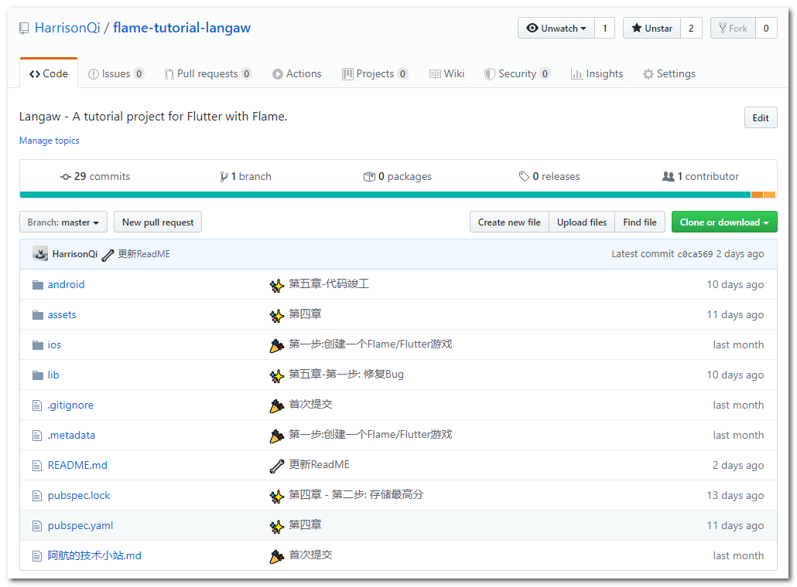
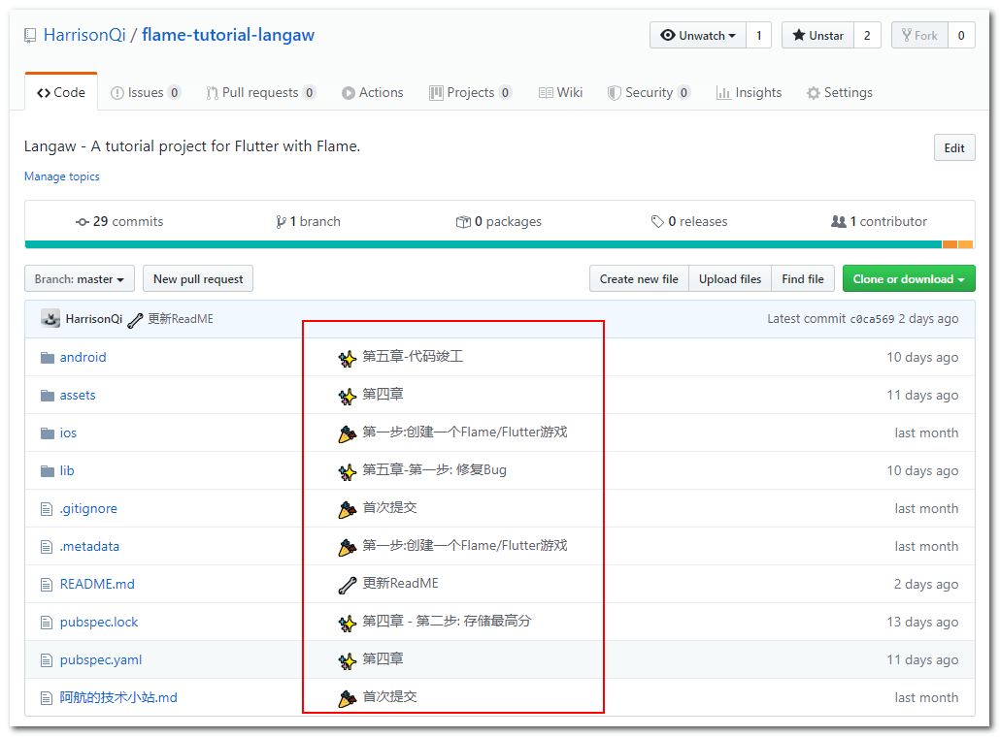
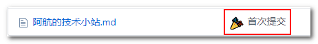

漫漫的代码生涯, 不知何时才是尽头😩😩. 苦中作乐, 才是良药. 我们不能改变作为程序员的命运, 但是我们可以为其添上几朵小花, 点缀一下. 本篇文章非技术干货, 而是跳出技术之外, 为我们的开发生活添加一点乐趣 -- 为你的Git提交日志添加emoji表情!

## 举个栗子

在Github上找寻所需的轮子时, 是否看到过这样的情形:



什么? 你没发现亮点? 那我给你圈出来!



看到提交日志左边那些"bu ling bu ling"✨✨的小图标了吗?

在代码仓库看到这个, 不知你的心情是否多少放松了一些?😏

当然, 无规矩不成方圆. 如果不设定一些规范, 可想而知, 日志将会一团糟🤯🤯. (还不如没有呢!)

## 如何使用

使用的方法很简单, 只需要找到emoji对应的代码, 放在提交日志中即可!

比如🎉代表的是"首次提交", 其代码为`:tada:`. 我们假设进行git提交:

```
git commit -m ":tada: 首次提交哦!"
```

之后去到远程仓库, 你会发现提交信息变得没那么单调啦!



## 常用提交图标及含义

在这里我们放出部分常用的提交图标吧:

\[epcl\_col width="20"\]

🎉

**:tada:  
**首次提交

\[/epcl\_col\]

\[epcl\_col width="20"\]

✨

**:sparkles:  
**添加新功能

\[/epcl\_col\]

\[epcl\_col width="20"\]

🔥

**:fire:  
**删除文件/删除代码

\[/epcl\_col\]

\[epcl\_col width="20"\]

🐛

**:bug:  
**bug修复

\[/epcl\_col\]

\[epcl\_col width="20"\]

🔧

**:wrench:  
**修改配置文件

\[/epcl\_col\]

\[epcl\_col width="20"\]

📝

**:pencil:  
**编写文档

\[/epcl\_col\]

\[epcl\_col width="20"\]

💥

**:boom:  
**重大功能更新/大改革

\[/epcl\_col\]

\[epcl\_col width="20"\]

🗃

**:card\_file\_box:  
**数据库相关操作

\[/epcl\_col\]

\[epcl\_col width="20"\]

🚚

**:truck:  
**重命名/移动文件

\[/epcl\_col\]

\[epcl\_col width="20"\]

♻️

**:recycle:  
**代码重构

\[/epcl\_col\]

\[epcl\_col width="100"\]

## 更多图标

不仅有上面这些常用图标, 你可以点击下方按钮查看全部Git emoji 图标.

\[epcl\_button label="查看全部Git提交表情👉" url="https://www.bugcatt.com/git提交表情" type="glow" size="fluid" color="green" icon="" target="\_url"\]

\[/epcl\_col\]

## 感谢

[gitmoji](https://gitmoji.carloscuesta.me/)
