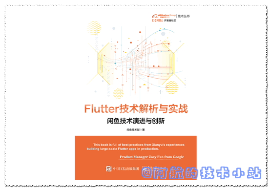
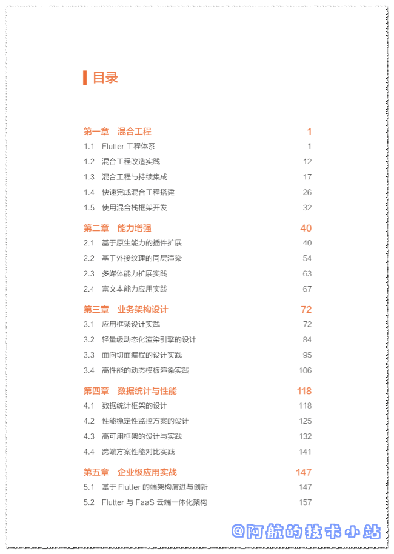

若图片资源无法加载, 请访问我的[官方博客](https://blog.bugcatt.com/?p=243).

众所周知, 阿里是国内Flutter的技术先驱团队. 阿里比较有名的开源项目有:

## Flutter Go

flutter 开发者帮助 APP，包含 flutter 常用 140+ 组件的demo 演示与中文文档. [官网](https://flutter-go.pub/website/)

## Fish Redux

Fish Redux 是一个基于 Redux 数据管理的组装式 flutter 应用框架， 它特别适用于构建中大型的复杂应用。

这回, 阿里闲鱼技术又出书了! 而且, 完全免费😍! 那就是:

## 《Flutter 技术解析与实战》

不得不说, 阿里的开源精神仍然是国内一流的.🤭🤭🤭

为了节省各位的时间, 阿航在这里直接把书的目录放出来:

看得出来, 书的内容丰富, 十分用心. 具体内容还需各位自行查阅.

### 下载链接

微信关注"**阿航的技术小站**", 发送"**flutter技术解析与实战**", 即刻获取网盘下载链接!

<figure>

<figcaption>

阿航的技术小站公众号

</figcaption>

</figure>

对文章有任何问题、 建议, 欢迎在评论区下方评论. 作者将会尽力、尽快回复.

最新、更多、更好的教程/博客/资讯, 欢迎访问我的官网: [阿航的技术小站](https://blog.bugcatt.com).
