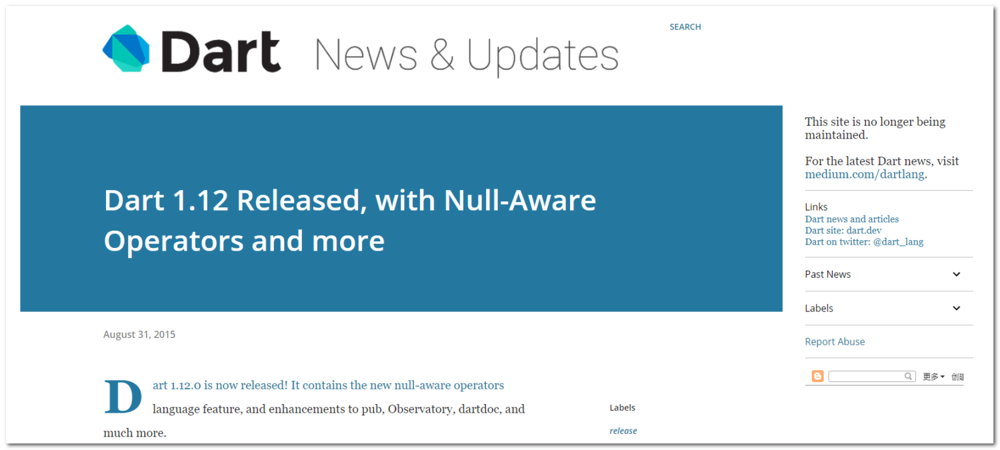
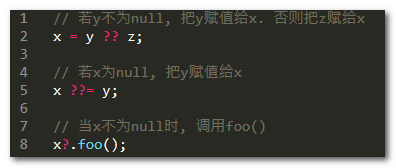

来到这篇文章, 说明你一定想在 Dart 的语法上更进一步(不出意外的话, 你在学 Flutter 🤭🤭). 工欲善其事, 必先利其器. 一个优秀的程序员应该掌握可以节省代码量的高级语法, 不论是节约时间还是提升水平. 本篇文章就来讲讲Dart语言中的 Null-aware ( null感知运算符 )吧!

## 背景

Dart的Null-aware来自于`Dart 1.12`正式版本:



> 你也可以看看[官网版本介绍](https://news.dartlang.org/2015/08/dart-112-released-with-null-aware.html)

## 用途

存在即是合理. 既然有这样的新运算符, 说明它在一定程度上**节省了我们的代码**, 使**代码更加简洁**.

既然它被称为`Null-aware`, 说明这个运算符是专门**用于处理`null`值**的. 将会提供空指针的相关操作.



## 创建示例对象

我们来创建一个`Person`对象, 方便后续使用:

```
class Person{
  // 性别
  String gender;

  // 变更性别为女性
  void changeToFemale(){
    gender = "女性";
  }
}

Person person = Person();
```

## ??

当前者为null时, 返回后者.

```
exp ?? anotherExp
```

### 实例: 获取用户性别

当某个Person对象的gender(性别)属性为null时, 返回'未知':

#### 方法一: 基础IF语句

我们可以用最基础的语句来写:

```
String gender;
if(person.gender!=null){
    gender = person.gender;
}else{
    gender = '未知';
}
```

#### 方法二: 三目运算

三目运算符相当好用:

```
String gender = person.gender!=null ? person.gender : '未知';
```

一行搞定, 比if爽太多.

#### 最佳方案: `??`运算符

使用刚学的`??`运算符处理:

```
String gender = person.gender ?? '未知';
```

简洁爆了.

## ??=

若obj为null, 把value赋值给obj.

```
obj ??= value
```

### 实例: 默认性别

若Person对象的gender属性为null, 为其赋值为"男性".

这里就不举笨方法了, 直接上:

```
person.gender ??= "男性";
```

## ?.

当obj不为null时, 调用`method`函数:

```
obj?.method()
```

### 实例: 变更性别

当person不为null时, 变更性别为女性:

```
person?.changeToFemale();
```

## 收工!

若你跟随教程一切顺利, 那么恭喜你, 你又掌握了节省寿命的新方法!

## 感谢

- [Null-aware Operators in Dart - Jonathan White](https://medium.com/@thinkdigitalsoftware/null-aware-operators-in-dart-53ffb8ae80bb)
- [Dart1.12新闻](https://news.dartlang.org/2015/08/dart-112-released-with-null-aware.html)
- [Pexels](https://www.pexels.com/zh-cn/photo/2736497/?utm_content=attributionCopyText&utm_medium=referral&utm_source=pexels) 上的 [Content Pixie](https://www.pexels.com/zh-cn/@content-pixie-1405717?utm_content=attributionCopyText&utm_medium=referral&utm_source=pexels) 拍摄的照片
- (排名不分先后)

IIRC并不是唯一基于现实世界短语的缩写词。其他流行的语言包括 [TBH](/post/2020/tbh是什么意思/) 和 FWIW，它们可以是您的互联网词汇的有力补充。
