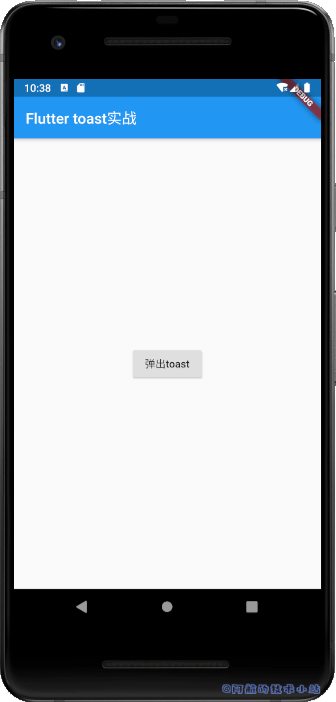
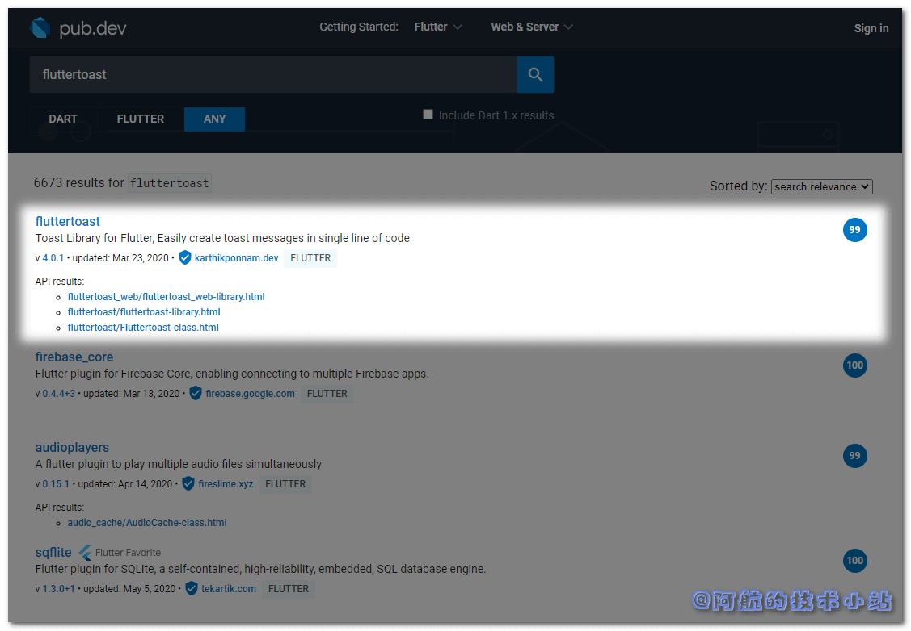
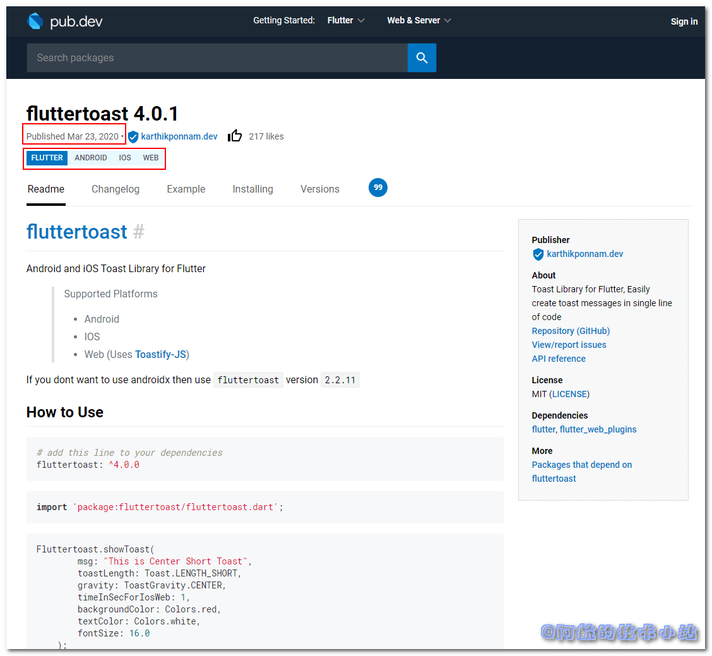
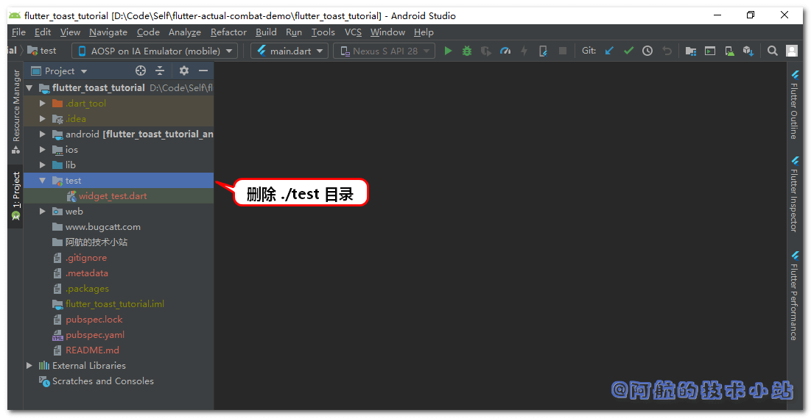
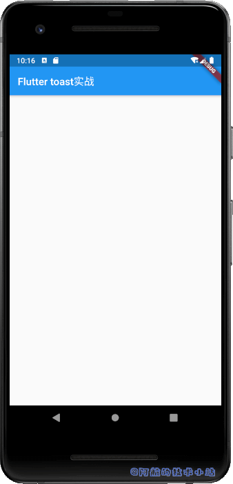
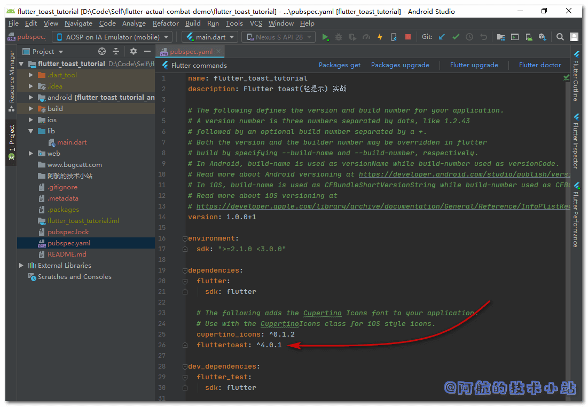
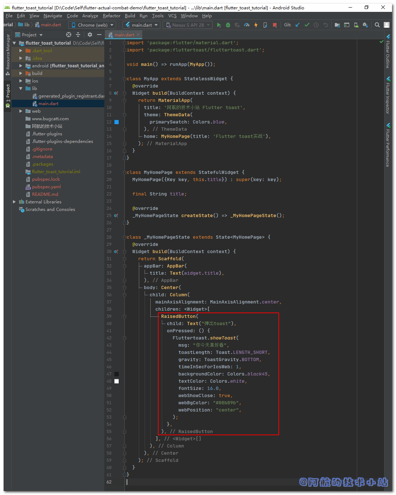
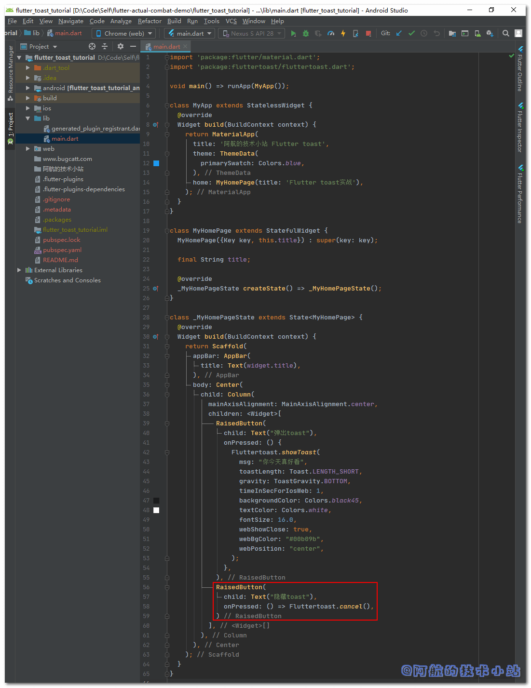

主流的三种APP反馈形式: `toast`、`snackbar`以及`dialog`. `toast`又称为弹出提示、轻提示.通常用于提示用户一些不那么重要的信息, 会弹出并显示文字一段时间. 时间一到就会消失. 相较于`snackbar`和`dialog`, 对屏幕的入侵较少. 身为开发人员怎能不掌握toast的基本使用? 这篇文章阿航就带着大家一起探讨一下Flutter中的`toast`.

## 效果

有图有真相, 我们来看下我们本次要实现的最终效果:



## 源码地址

**👉在[Github](https://github.com/HarrisonQi/flutter-actual-combat-demo/tree/master/)或[码云](https://gitee.com/HarrisonQI/flutter-actual-combat-demo/tree/master/flutter_toast_tutorial)上查看本篇文章全部代码.**

## 搜索fluttertoast

\[epcl\_box type="information"\]有同学会问, 为什么要选择插件, 不选择原生呢… 因为Flutter没有我们所需的这种效果! 只有自带的snackBar!\[/epcl\_box\]

老样子, 上[pub.dev](https://pub.flutter-io.cn/packages)寻找我们所需的插件, 在搜索框输入`fluttertoast`:

看到第一条:



`99`分, 相当高的评分.

点进去, 查看最新版本发布日期和兼容性:



\[epcl\_box type="information"\]一般我们在选择一款Flutter插件时, 会先看它的评分(Flutter官方评分还是比较严格的). 之后再去看看它的最新日期(如果很久未更新, 可能项目已经停止维护了). 最后再来看看它的兼容性, 是否合乎我们的规则.\[/epcl\_box\]

同时支持`Android`、`IOS`以及`Web`. 兼容性很好.

## 实战开始

### 创建项目

创建一个Flutter项目, 先来清理项目.

删除`./test`目录, 因为我们的这个项目只是一个简单的demo. 不需要测试驱动开发.



通过flutter创建的项目的`./lib/main.dart`会有很多自带的注释, 我们替换整个文件为:

```
import 'package:flutter/material.dart';

void main() => runApp(MyApp());

class MyApp extends StatelessWidget {
  @override
  Widget build(BuildContext context) {
    return MaterialApp(
      title: '阿航的技术小站 Flutter toast',
      theme: ThemeData(
        primarySwatch: Colors.blue,
      ),
      home: MyHomePage(title: 'Flutter toast实战'),
    );
  }
}

class MyHomePage extends StatefulWidget {
  MyHomePage({Key key, this.title}) : super(key: key);

  final String title;

  @override
  _MyHomePageState createState() => _MyHomePageState();
}

class _MyHomePageState extends State {
  @override
  Widget build(BuildContext context) {
    return Scaffold(
      appBar: AppBar(
        title: Text(widget.title),
      ),
      body: Center(
        child: Column(
          mainAxisAlignment: MainAxisAlignment.center,
          children: [],
        ),
      ),
    );
  }
}
```

> 💡 代码解析: 删除了多余的注释, 和部分初始化的按钮. 添加一些名称.

\[epcl\_box type="success"\]运行项目, 应该相当简洁:\[/epcl\_box\]



### 引入依赖

在`./pubspec.yaml`中添加依赖:

```
  fluttertoast: ^4.0.1
```



\[epcl\_box type="notice"\]一定要注意字符缩进. 缩进不正确会导致导入失败!\[/epcl\_box\]

运行IDE的`Packages get`或者在终端中输入:

```
flutter pub get
```

### 创建按钮

回到`./lib/main.dart`, 在`Column`内添加一个按钮:

```
RaisedButton(
  child: Text("弹出toast"),
  onPressed: (){},
)
```

> 该按钮等下用来触发弹出toast

### 使用fluttertoast

导入fluttertoast:

```
import 'package:fluttertoast/fluttertoast.dart';
```

上面创建的按钮中的`onPressed`中添加函数, 替换上面的`RaisedButton`为:

```
RaisedButton(
  child: Text("弹出toast"),
  onPressed: () {
    Fluttertoast.showToast(
                  msg: "你今天真好看",
                  toastLength: Toast.LENGTH_SHORT,
                  gravity: ToastGravity.BOTTOM,
                  timeInSecForIosWeb: 1,
                  backgroundColor: Colors.black45,
                  textColor: Colors.white,
                  fontSize: 16.0,
                  webShowClose: true,
                  webBgColor: "#00b09b",
                  webPosition: "center",
                );
  },
)
```

> 下面会详细解释各个参数的作用, 先运行, 一睹为快!

具体位置如图:



\[epcl\_box type="success"\]运行项目(因为有新导入的库, 所以建议先停止, 再重新运行), 点击"弹出toast"按钮试试:\[/epcl\_box\]


成功运行.

下面来介绍一下`Fluttertoast.showToast`的详细参数:

| 参数 | 参数类型 | 参数说明 | 是否必传 | 默认值 |
| --- | --- | --- | --- | --- |
| msg | String | 设置toast展示的字符串 | √ | \- |
| gravity | ToastGravity枚举 | 设置toast的展示位置.(Web端仅支持顶部和底部) | × | ToastGravity.BOTTOM |
| timeInSecForIosWeb | int | ios秒数 | × | 1 |
| bgcolor | Color | toast背景色 | × | Colors.black |
| textcolor | Color | toast文字颜色 | × | Colors.white |
| fontSize | float | toast文字字体大小 | × | 16.0 |
| webShowClose | bool | web端 是否显示关闭按钮("×"号) | × | false |
| webBgColor | String | web端 16进制颜色, 比如`#00b09b` | × | 渐变色(#00b09b与#96c93d) |
| webPosition | String | web端 toast水平位置(`left`, `center`或`right`) | × | right |

你可以自己随意传入参数和值来看看效果!

\[epcl\_box type="information"\]经过阿航的测试, fluttertoast本版本的web端不是非常好看. 所以不放出web端的截图啦! \[/epcl\_box\]

### 主动隐藏toast

toast不仅可以自动消失, 也可以根据我们的需要让其立即消失.

在刚才的按钮下方再添加一个按钮:

```
RaisedButton(
  child: Text("隐藏toast"),
  onPressed: () => Fluttertoast.cancel(),
)
```

如图:



\[epcl\_box type="success"\]运行项目, 先点击"弹出toast"按钮, 紧接着点击"隐藏toast\`按钮, 你会发现提示立刻消失:\[/epcl\_box\]


## 大功告成

至此, 我们的教程已经基本完成. 如果你对本篇文章有任何问题, 欢迎在下方评论区进行讨论.

## 源码下载

**👉在[Github](https://github.com/HarrisonQi/flutter-actual-combat-demo/tree/master/)或[码云](https://gitee.com/HarrisonQI/flutter-actual-combat-demo/tree/master/flutter_toast_tutorial)上查看本篇文章全部代码.**

## 感谢

- [fluttertoast - pub.dev](https://pub.flutter-io.cn/packages/fluttertoast)
- [FlutterToast - Github](https://github.com/PonnamKarthik/FlutterToast)
- [Pexels](https://www.pexels.com/zh-cn/photo/4k-281260/?utm_content=attributionCopyText&utm_medium=referral&utm_source=pexels) 上的 [Francesco Ungaro](https://www.pexels.com/zh-cn/@francesco-ungaro?utm_content=attributionCopyText&utm_medium=referral&utm_source=pexels) 拍摄的照片
- (排名不分先后)
