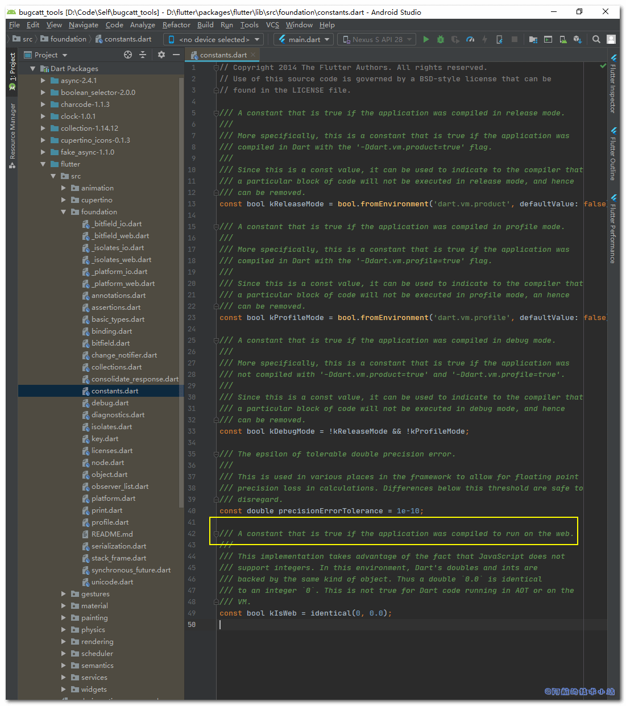

如果你最近在使用Flutter, 应该了解到目前Flutter已经可以导出为Web/安卓/IOS/MacOS/Windows/Linux/Fuchsia项目了. 但是目前兼容Web的Flutter第三方库不是很多, 并且布局上可能需要进行相应的调整, 所以本篇文章就来记录下Flutter判断当前环境是否为Web!

## 适用场景

我们通常会在原生应用和web端等有环境差异时使用, 根据不同环境做不同处理.

### 方法一: 使用原生Platform判断

flutter已经为我们提供了获取当前运行环境的`Platform`类.

先导入:

```
import 'dart:io';
```

进行调用:

```
if(Platform.isAndroid){
  // Android
}else if(Platform.isIOS){
  // IOS
}else if(Platform.isFuchsia){
  // Fuchsia
}else if(Platform.isWindows){
  // Windows
}else if(Platform.isMacOS){
  // MacOS
}else if(Platform.isLinux){
  // Linux
}
```

当然, 这个方法是有缺陷的. 因为我们无法从中判断当前环境是否为Web! 所以, 方法二就出现了.

### 方法二: 自定义工具类(所有环境)

#### 查看 constants.dart 源码

进入`flutter/packages/flutter/lib/src/foundation/constants.dart`, 我们来看看源码:



我们可以看到一行`kIsWeb`的注释:

```
/// A constant that is true if the application was compiled to run on the web.
```

> 💡 含义: 当应用编译运行在web上时, 该常量为`true`

有了这个变量, 我们就有了判断当前环境的方法!

#### 定义工具类

创建文件`platform_utils.dart`, 写入以下代码:

```
import 'dart:io';

import 'package:flutter/foundation.dart';

class PlatformUtils {
  static bool _isWeb() {
    // 通过kIsWeb变量判断是否为web环境!
    return kIsWeb == true;
  }

  static bool _isAndroid() {
    return _isWeb() ? false : Platform.isAndroid;
  }

  static bool _isIOS() {
    return _isWeb() ? false : Platform.isIOS;
  }

  static bool _isMacOS() {
    return _isWeb() ? false : Platform.isMacOS;
  }

  static bool _isWindows() {
    return _isWeb() ? false : Platform.isWindows;
  }

  static bool _isFuchsia() {
    return _isWeb() ? false : Platform.isFuchsia;
  }

  static bool _isLinux() {
    return _isWeb() ? false : Platform.isLinux;
  }

  static bool get isWeb => _isWeb();

  static bool get isAndroid => _isAndroid();

  static bool get isIOS => _isIOS();

  static bool get isMacOS => _isMacOS();

  static bool get isWindows => _isWindows();

  static bool get isFuchsia => _isFuchsia();

  static bool get isLinux => _isLinux();
}
```

> 💡 代码解析: 代码看起来虽然较多, 实际上只有高亮的代码是我们经过包装的!

#### 使用工具类

```
if(PlatformUtils.isAndroid){
  // Android
}else if(PlatformUtils.isIOS){
  // IOS
}else if(PlatformUtils.isFuchsia){
  // Fuchsia
}else if(PlatformUtils.isWindows){
  // Windows
}else if(PlatformUtils.isMacOS){
  // MacOS
}else if(PlatformUtils.isLinux){
  // Linux
}else if(PlatformUtils.isWeb){
  // Web
}
```

\[epcl\_box type="success"\]可以看到, 调用方式和原生的方式几乎一致! 但是有了Web的判断!\[/epcl\_box\]

## 感谢

- [flutter怎么判断是否是web平台？ - 罗小黑的回答 - 知乎](https://www.zhihu.com/question/369285569/answer/1246486911)
- [Pexels](https://www.pexels.com/zh-cn/photo/2847648/?utm_content=attributionCopyText&utm_medium=referral&utm_source=pexels) 上的 [Alexander Kovalev](https://www.pexels.com/zh-cn/@alscre?utm_content=attributionCopyText&utm_medium=referral&utm_source=pexels) 拍摄的照片
