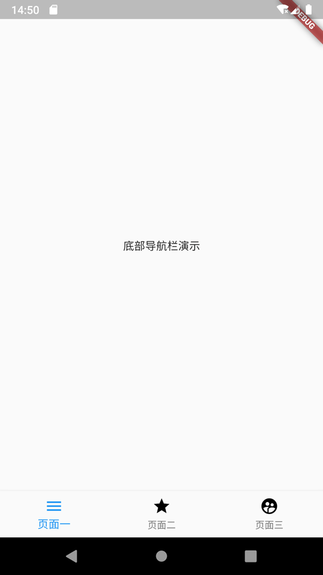
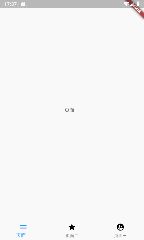

几乎99%的应用类APP都需要一个底部导航栏. 这篇教程为 **Flutter** 语言中, 如何写一个主流的 **底部导航栏** . 并使用 **Flutter** 官方提供的 **BottomNavigationBar** 组件. 几乎每一个APP都拥有一个底部导航栏, 所以这篇教程将会十分有用🤭

* * *

## 效果

有图有真相, 我们本次要实现 底部导航栏 的最终效果如下🙊:

<figure>


<figcaption>

底部导航栏最终效果

</figcaption>

</figure>

## 仓库地址

全部代码均已上传至开源仓库(含完整注释):

- [Github](https://github.com/HarrisonQi/flutter-actual-combat-demo/tree/master/bottom_navigation)
- [码云](https://gitee.com/HarrisonQI/flutter-actual-combat-demo/tree/master/bottom_navigation)

## 用途

虽然如此普遍, 但我们还是要更直观的看下哪里需要用到底部导航栏, 如下图:

<figure>


<figcaption>

用到底部导航栏的主流APP

</figcaption>

</figure>

> 可以得知, 最流行的、最主流的APP都需要导航栏

## 实战开始

### 创建导航页面

创建`lib/main.dart`文件, 内容:

```
import 'package:flutter/material.dart';

void main() => runApp(MyApp());

class MyApp extends StatelessWidget {
  @override
  Widget build(BuildContext context) {
    return MaterialApp(
      title: 'Bottom Navigation',
      home: MyHomePage(),
    );
  }
}

class MyHomePage extends StatefulWidget {
  MyHomePage({Key key}) : super(key: key);
  @override
  _MyHomePageState createState() => _MyHomePageState();
}

class _MyHomePageState extends State {

  @override
  Widget build(BuildContext context) {
    return Scaffold(
      body: Center(
        child: Text(
          '底部导航栏演示',
        )
      ),
    );
  }
}
```

> 这个页面就作为我们的导航页了, 继续.

### 创建导航目标页面

也就是点击导航按钮要跳转到哪些页面, 我们分别创建三个文件:

- `lib/page_first.dart`
- `lib/page_second.dart`
- `lib/page_third.dart`

三个文件的内容:

**注意, 每个页面需要在注释处变更一下文字内容, 以便区分**

```
import 'package:flutter/material.dart';

// 这里的class 名称分别为"PageFirst"、"PageSecond"以及"PageThird"
class PageFirst extends StatefulWidget {
  PageFirst({Key key}) : super(key: key);
  @override
  _PageFirstState createState() => _PageFirstState();
}

// 这里的class 名称分别为"_PageFirstState"、"_PageSecondState"以及"_PageThirdState"
class _PageFirstState extends State {

  @override
  Widget build(BuildContext context) {
    return Scaffold(
      body: Center(
        child: Text(
          // 这里分别改为"页面一"、"页面二"以及"页面三"
          '页面一',
        ),
      ),
    );
  }
}
```

### 使用 BottomNavigationBar 组件

`BottomNavigationBar`是一个原生的组件, 通常和`Scaffold`配合使用

我们来尝试使用一下, 在`Scaffold`中添加一个参数`bottomNavigationBar`:

```
class _MyHomePageState extends State {

  @override
  Widget build(BuildContext context) {
    return Scaffold(
      body: Center(
        child: Text(
          '底部导航栏演示',
        ),
      ),
      // 这里添加了NavigationBar
      bottomNavigationBar: BottomNavigationBar(),
    );
  }
}
```

此时, 你的IDE应该会提醒你, 缺少必填参数. 我们下面处理.

### 绘制 底部导航栏

#### 导航组件`BottomNavigationBarItem`

我们在`class _MyHomePageState`中创建一个集合, 把三个目标页面装进去:

```
  // 创建集合对象, 存储底部选项集合
  List barItems = [
    BottomNavigationBarItem(
        // 图标(普通状态)
        icon: Icon(
          Icons.menu,
          color: Colors.black,
        ),
        // 图标(选中状态)
        activeIcon: Icon(
          Icons.menu,
          color: Colors.blue,
        ),
        // 文字内容
        title: Text("页面一"),
        // 背景色
        backgroundColor: Colors.blue),
    BottomNavigationBarItem(
        // 图标(普通状态)
        icon: Icon(
          Icons.grade,
          color: Colors.black,
        ),
        // 图标(选中状态)
        activeIcon: Icon(
          Icons.grade,
          color: Colors.blue,
        ),
        // 文字内容
        title: Text("页面二"),
        // 背景色
        backgroundColor: Colors.blue),
    BottomNavigationBarItem(
        // 图标(普通状态)
        icon: Icon(
          Icons.supervised_user_circle,
          color: Colors.black,
        ),
        // 图标(选中状态)
        activeIcon: Icon(
          Icons.supervised_user_circle,
          color: Colors.blue,
        ),
        // 文字内容
        title: Text("页面三"),
        // 背景色
        backgroundColor: Colors.blue),
  ];
```

> 当然, 这不是最优写法, 但这种方式能让你看到所有的参数说明!😉

#### 构建 `BottomNavigationBar`

回到刚才的位置, 我们把刚刚创建的`BottomNavigationBarItem`集合放入`BottomNavigationBar`中:

```
  @override
  Widget build(BuildContext context) {
    return Scaffold(
      body: Center(
        child: Text(
          '底部导航栏演示',
        ),
      ),
      bottomNavigationBar: BottomNavigationBar(
        // 放在这里
        items: barItems,
      ),
    );
  }
```

#### 效果图

如果你上面的步骤没有问题, 那么效果应该是这样的:

<figure>



<figcaption>

4.3 效果图

</figcaption>

</figure>

> 当然. 点击按钮还没有达到我们的最终效果.

### 绑定目标页面至导航栏

在`_MyHomePageState`中创建页面集合及变量:

```
  // 导航目标页集合
  final pages = [
    PageFirst(),
    PageSecond(),
    PageThird(),
  ];

  /// 当前选中的导航下标, 默认第一个
  int _currentNavIndex = 0;
```

在`_MyHomePageState`中创建函数:

```
// 当点击导航栏按钮时, 触发此函数
void _changeCurrentNavIndex(int index){
  // 细节: 当用户点击的导航和当前一致, 则不发生变化, 节省系统资源
  if (index != _currentNavIndex) {
    // 切换导航下标
    _currentNavIndex = index;
    setState(() {});
  }
}
```

修改`build`函数:

```
  @override
  Widget build(BuildContext context) {
    return Scaffold(
      body: pages[_currentNavIndex],
      bottomNavigationBar: BottomNavigationBar(
          items: barItems,
          // 当前下标
          currentIndex: _currentNavIndex,
          // 点击后进行何种操作, index为当前点击的导航按钮下标
          onTap: (index) {
            _changeCurrentNavIndex(index);
          }),
    );
  }
```

### 大功告成!

若以上步骤没有问题, 再次运行应该是这样的:

<figure>


<figcaption>

底部导航栏最终效果

</figcaption>

</figure>

## 进阶 - 水平滑动(左右滑动)

在某些app中, 导航页是可滑动的, 为了满足这个需求, 我们这里进行一下处理

### 效果:

<figure>



<figcaption>

滑动最终效果

</figcaption>

</figure>

**注意: 并非所有的APP都适用与滑动的导航栏! 某些APP会产生冲突(如QQ), 请考虑实际需求!**

### 复制`main.dart`

复制一份我们之前的`main.dart`, 重命名为`main_advanced_horizontal_scroll.dart`

### 添加PageView控制器

在`_MyHomePageState`中添加实例变量:

```
/// pageView控制器
PageController _pageViewController = PageController();
```

在`_changeCurrentNavIndex()`中, `_currentNavIndex = index;`下面添加:

```
_pageViewController.jumpToPage(index);
```

### 替换翻页为PageView

在我们新创建的文件`main_advanced_horizontal_scroll.dart`中, 替换`Scaffold`的`body`:

```
  @override
  Widget build(BuildContext context) {
    return Scaffold(
      body: pages[_currentNavIndex],
      // ...
    );
  }
```

为:

```
  @override
  Widget build(BuildContext context) {
    return Scaffold(
      body: PageView(
        // 这里绑定了控制器
        controller: _pageViewController,
        children: pages,
        onPageChanged: (index) => _changeCurrentNavIndex(index),
      ),
      // ...
    );
  }
```

如果按上述操作, 运行起来的效果:

<figure>


<figcaption>

滑动最终效果

</figcaption>

</figure>

是的, 就是这么简单😄

## 仓库地址

全部代码均已上传至开源仓库(含完整注释):

- [Github](https://github.com/HarrisonQi/flutter-actual-combat-demo/tree/master/bottom_navigation)
- [码云](https://gitee.com/HarrisonQI/flutter-actual-combat-demo/tree/master/bottom_navigation)

以上就是 **Flutter** 语言中, 如何写一个主流的 **底部导航栏** . 并使用 **Flutter** 官方提供的 **BottomNavigationBar** 组件的全部内容了. 感谢阅读.

若有任何问题, 欢迎在下方回复, 作者会尽可能回复! 更多技术干货, 请访问[阿航的技术小站主页](https://blog.bugcatt.com)
