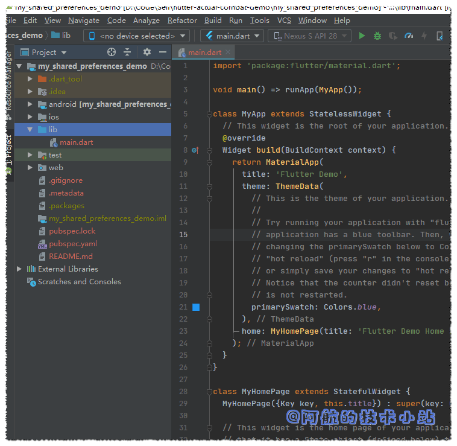
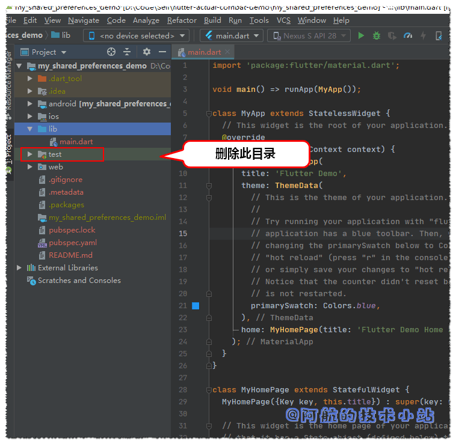
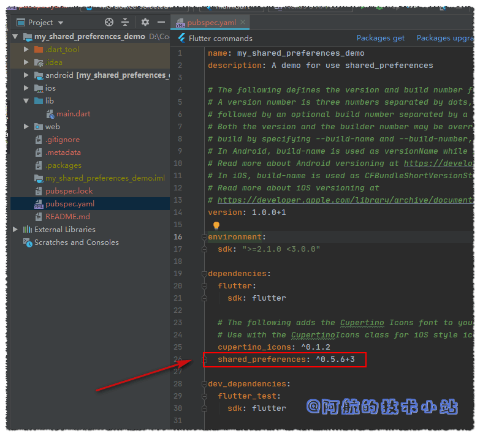
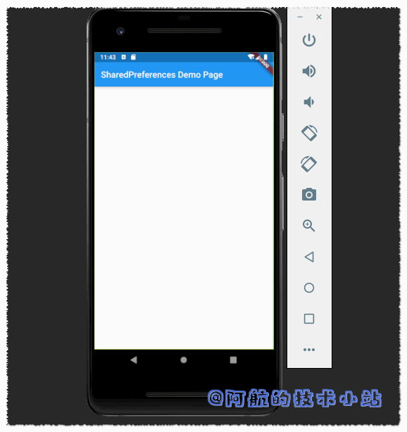
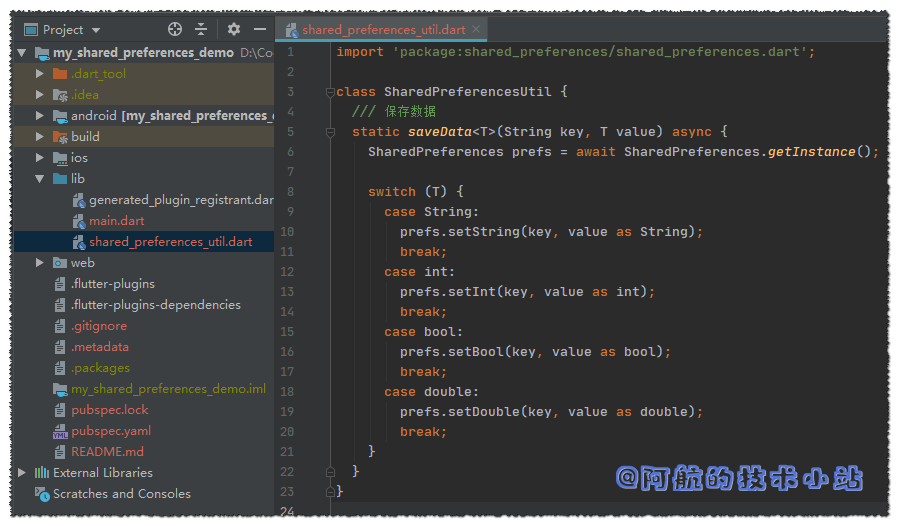
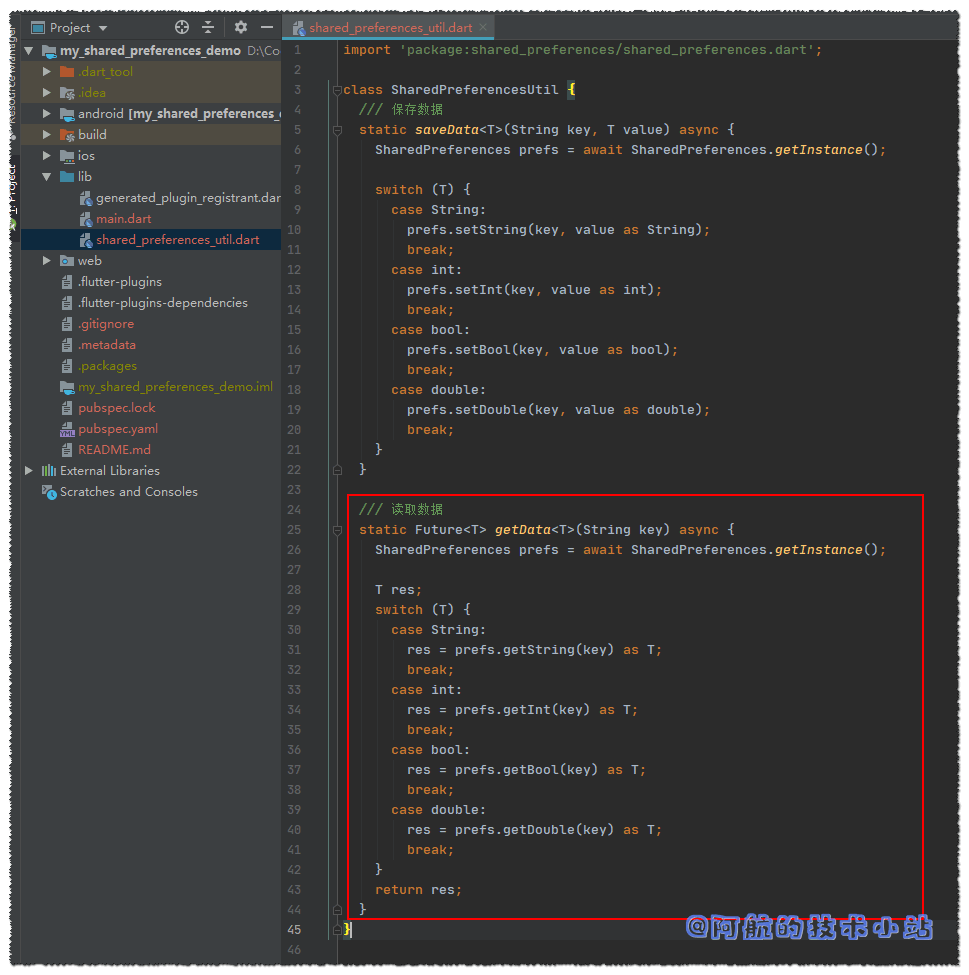
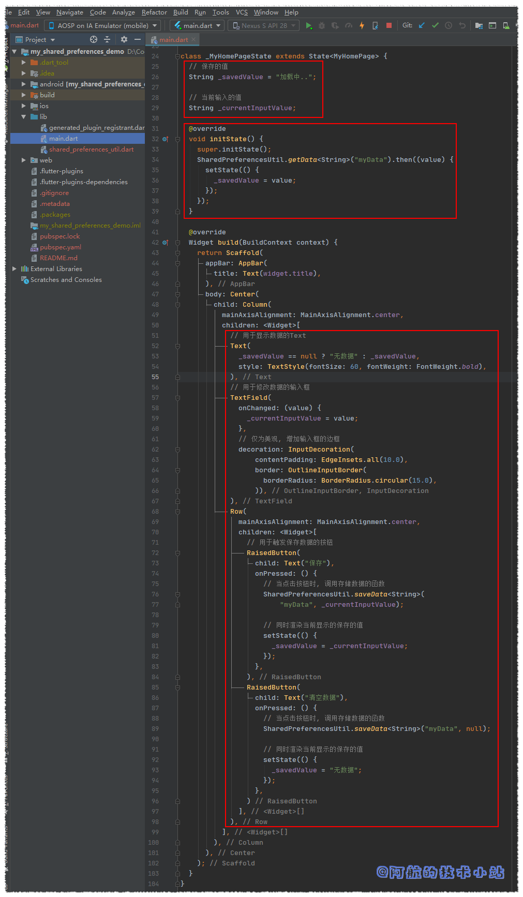

我们在做APP开发时, 经常会涉及到用户的 数据存储(比如保存用户登录token、用户的某些偏好设置等). 开发过Android的朋友应该知道有 SharedPreferences. 在 Flutter 中, 同样为我们提供了十分相似的(甚至名字都一样)组件, 为我们提供数据存储的能力.

本篇教程将用一个简单的小Demo, 让你完全掌握 数据存储之SharedPreferences 的用法.

> 若图片展示异常, 请访问我的[官方博客](/post/2020/flutter-数据存储-sharedpreferences/)

## 效果

有图有真相, 我们先来看一下我们最终的效果:

<figure>


<figcaption>

SharedPreferences最终效果

</figcaption>

</figure>

## 仓库地址

所有源码(含注释)均已上传至开源仓库:

- [Github](https://github.com/HarrisonQi/flutter-actual-combat-demo/tree/master/my_shared_preferences_demo)
- [码云](https://gitee.com/HarrisonQI/flutter-actual-combat-demo/tree/master/my_shared_preferences_demo)

## 准备工作

### 开发环境

本博客的环境一览:

| 环境 | 版本号 |
| --- | --- |
| Flutter | 1.14.6 beta |
| Dart | 2.8.0-dev.5.0 |
| Android Studio | 3.5.2 |

> 注意您的环境和文中的差异, 避免出现不兼容的情况哦!

### 需具备的条件

要顺利阅读本文, 假定您已经具备以下条件:

1. 一台电脑(能同时运行IDE、APP模拟器).
2. `Android Studio` 或 `VSCode`(或任何你喜欢的代码编辑器).
3. `Flutter`开发环境.
4. 您掌握了`Flutter`的开发基础(至少了解目录结构、`Dart`语言基本知识).

## 实战开始

### 创建Flutter项目

创建一个新的Flutter项目, 命名为`my_shared_preferences_demo`(您可以随意起名, 但是在下面也要替换名字为您自己的).

> 注意: Flutter项目名不要和引入的某个第三方库重名, 否则会报: `A package may not list itself as a dependency` 详见[这里](/post/2020/flutter-a-package-may-not-list-itself-as-a-dependency/)

代码截图:

<figure>



<figcaption>

初始化项目

</figcaption>

</figure>

### 清理代码

因为我们的项目过于简单, 暂时不需要进行测试. 删除./test目录:

<figure>



<figcaption>

清理test目录

</figcaption>

</figure>

避免冗余代码误导我们, 替换`./lib/main.dart`为:

```dart
import 'package:flutter/material.dart';

void main() => runApp(MyApp());

class MyApp extends StatelessWidget {
  @override
  Widget build(BuildContext context) {
    return MaterialApp(
      title: 'SharedPreferences Demo',
      home: MyHomePage(title: 'SharedPreferences Demo Page'),
    );
  }
}

class MyHomePage extends StatefulWidget {
  MyHomePage({Key key, this.title}) : super(key: key);
  final String title;

  @override
  _MyHomePageState createState() => _MyHomePageState();
}

class _MyHomePageState extends State {
  @override
  Widget build(BuildContext context) {
    return Scaffold(
      appBar: AppBar(
        title: Text(widget.title),
      ),
      body: Center(
        child: Column(
          mainAxisAlignment: MainAxisAlignment.center,
          children: [],
        ),
      ),
    );
  }
}
```

### 导入 SharedPreferences 第三方库

进入`./pubspec.yaml`, 添加依赖:

```yaml
dependencies:
  shared_preferences: ^0.5.6+3
```

> 你也可以去官网查看[最新的shared\_preferences](https://pub.flutter-io.cn/packages/shared_preferences)

截图:

<figure>



<figcaption>

导入SharedPreferences库

</figcaption>

</figure>

更新包, 在终端中输入(或者点击IDE的更新包的按钮):

```bash
flutter packages get
```

运行项目:

<figure>



<figcaption>

运行APP1

</figcaption>

</figure>

现在, 我们可以正式进行数据存储的操作了!

### 创建数据读写工具类

实际项目中, 我们定会多次用到数据的读写, 所以封装一个工具类是比较明智的选择.

创建`./lib/shared_preferences_util.dart`

#### 创建`SharedPreferencesUtil`类

```dart
class SharedPreferencesUtil {
}
```

因为后面要用到SharedPreferences, 所以导入shared\_preferences:

```dart
import 'package:shared_preferences/shared_preferences.dart';
```

#### 数据存储函数 `saveData()`

添加函数`saveData()`:

```dart
  /// 保存数据
  static saveData<T>(String key, T value) async {
    SharedPreferences prefs = await SharedPreferences.getInstance();

    switch (T) {
      case String:
        prefs.setString(key, value as String);
        break;
      case int:
        prefs.setInt(key, value as int);
        break;
      case bool:
        prefs.setBool(key, value as bool);
        break;
      case double:
        prefs.setDouble(key, value as double);
        break;
    }
  }
```

> 在定义函数时, 名称后面多了一个"`<T>`", 这运用了泛型. 若对此有疑问, 请自行搜索"dart 泛型"的相关知识.
> 
> 代码解析: 函数要求传入两个值, key以及value. key为我们要存的值的"名字". 这个名字是唯一的, 后续我们在读取数据的时候也需要传入与这个key. value就是它对应的值. 函数体内, 我们先在首行引入一个SharedPreferences的实例, 便于后续使用. 使用`switch`分支, 用来判断传入的泛型类型. 判断完成后, 分别调用`prefs.setXXX(key, value)`, 完成数据存储.

<figure>



<figcaption>

SharedPreferencesUtil01

</figcaption>

</figure>

代码截图:  

#### 数据读取函数 `getData()`

有数据存储函数, 自然也应该有与之对应的数据读取函数, 我们来写:

添加函数`getData()`:

```dart
  /// 读取数据
  static Future getData(String key) async {
    SharedPreferences prefs = await SharedPreferences.getInstance();

    T res;
    switch (T) {
      case String:
        res = prefs.getString(key) as T;
        break;
      case int:
        res = prefs.getInt(key) as T;
        break;
      case bool:
        res = prefs.getBool(key) as T;
        break;
      case double:
        res = prefs.getDouble(key) as T;
        break;
    }
    return res;
  }
```

> 代码解析: 与上面的`saveData()`函数类似, 同样运用了泛型以及`switch`. 不同的是读取数据时调用的是`prefs.getXXX()`

代码截图:

<figure>



<figcaption>

SharedPreferencesUtil02

</figcaption>

</figure>

> 到这里, 我们几乎已经完成了我们的教程. 反应快的同学应该已经可以直接使用了. 但是阿航的教程要保证其完整性, 让大家都会用, 并且理解为什么这么用. 我们来绘制APP界面, 更直观的测试!

### 绘制用于测试工具类的简单界面

回到`./lib/main.dart`, 我们来增加几个按钮和输入框.

#### 导入`SharedPreferencesUtil`

先导入`SharedPreferencesUtil`方便后续使用:

```dart
import 'package:my_shared_preferences_demo/shared_preferences_util.dart';
```

#### 定义实例变量

在`_MyHomePageState`定义实例变量`_savedValue`和`_currentInputValue`, 用于记录存储及当前输入的值:

```dart
  // 保存的值
  String _savedValue = "加载中..";

  // 当前输入的值
  String _currentInputValue;
```

#### 初始化页面时加载数据.

定义`initState()`, 在初始化页面时读取已存的数据

```dart
  @override
  void initState() {
    super.initState();
    SharedPreferencesUtil.getData("myData").then((value) {
      setState(() {
        _savedValue = value;
      });
    });
  }
```

> 代码解析: 可以看到`initState()`上有`@override`, 因为`initState()`为继承过来的函数. 函数内部先调用`super.initState()`. 接下来就是通过此前定义的`SharedPreferencesUtil`获取存储的数据. 因为`shared_preferences`提供的函数是`async`(异步)的, 所以需要通过`.then()`来保证其获取到数据后再进行后续操作. 获取到value后, 存至\_savedValue.

接下来就是绘制界面了, 在`build`\->`Scaffold`\->`body:Center`\->`child: Column`\->`children`中添加以下代码块:

```dart
// 用于显示数据的Text
Text(
  _savedValue == null ? "无数据" : _savedValue,
  style: TextStyle(fontSize: 60, fontWeight: FontWeight.bold),
),
// 用于修改数据的输入框
TextField(
  onChanged: (value) {
    _currentInputValue = value;
  },
  // 仅为美观, 增加输入框的边框
  decoration: InputDecoration(
      contentPadding: EdgeInsets.all(10.0),
      border: OutlineInputBorder(
        borderRadius: BorderRadius.circular(15.0),
      )),
),
Row(
  mainAxisAlignment: MainAxisAlignment.center,
  children: [
    // 用于触发保存数据的按钮
    RaisedButton(
      child: Text("保存"),
      onPressed: () {
        // 当点击按钮时, 调用存储数据的函数
        SharedPreferencesUtil.saveData(
            "myData", _currentInputValue);

        // 同时渲染当前显示的保存的值
        setState(() {
          _savedValue = _currentInputValue;
        });
      },
    ),
    RaisedButton(
      child: Text("清空数据"),
      onPressed: () {
        // 当点击按钮时, 调用存储数据的函数
        SharedPreferencesUtil.saveData("myData", null);

        // 同时渲染当前显示的保存的值
        setState(() {
          _savedValue = "无数据";
        });
      },
    )
  ],
),
```

> 代码解析: 这里虽然看起来代码多一点, 实质上只有1个输入框和2个按钮. 里面没有特别复杂的逻辑, 所有说明都在代码注释中, 可自行查看.

以上的代码截图:

<figure>



<figcaption>

绘制界面代码截图

</figcaption>

</figure>

## 大功告成

若你的代码没有问题, 运行项目, 效果应该是这样的:  

<figure>


<figcaption>

SharedPreferences 最终效果

</figcaption>

</figure>

通过以上的一些步骤, 我们终于完成了 Flutter 数据存储 之 SharedPreference , 是不是很简单?

## 仓库地址　

所有源码(含注释)均已上传至开源仓库:

- [Github](https://github.com/HarrisonQi/flutter-actual-combat-demo/tree/master/my_shared_preferences_demo)
- [码云](https://gitee.com/HarrisonQI/flutter-actual-combat-demo/tree/master/my_shared_preferences_demo)

对文章若有任何问题、异议以及改进建议, 欢迎在下方进行评论. 作者将尽快回复! 若图片展示异常, 欢迎阅读[官方博客](/post/2020/flutter-数据存储-sharedpreferences/).

更多更好的教程/博客/资讯, 欢迎访问我的官网: [阿航的技术小站](/)
