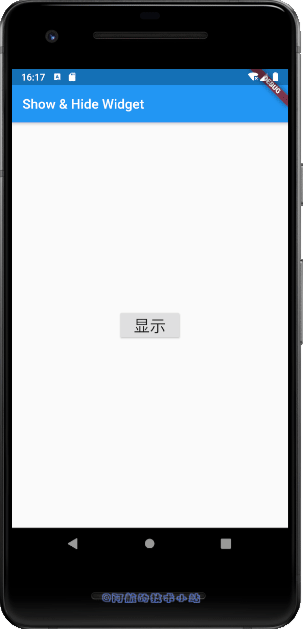
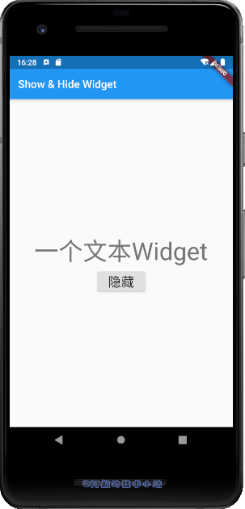
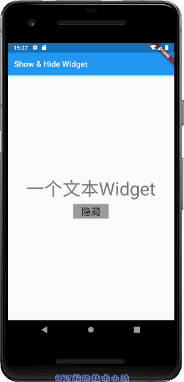
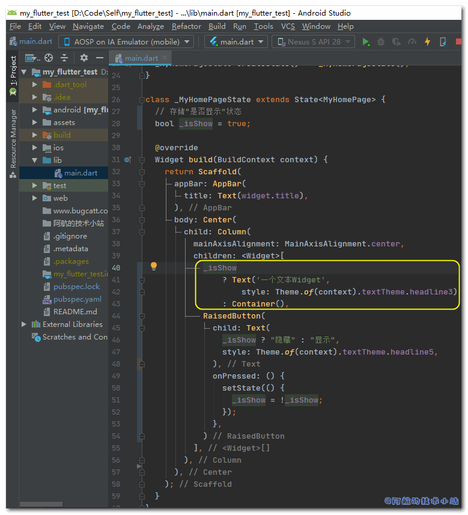
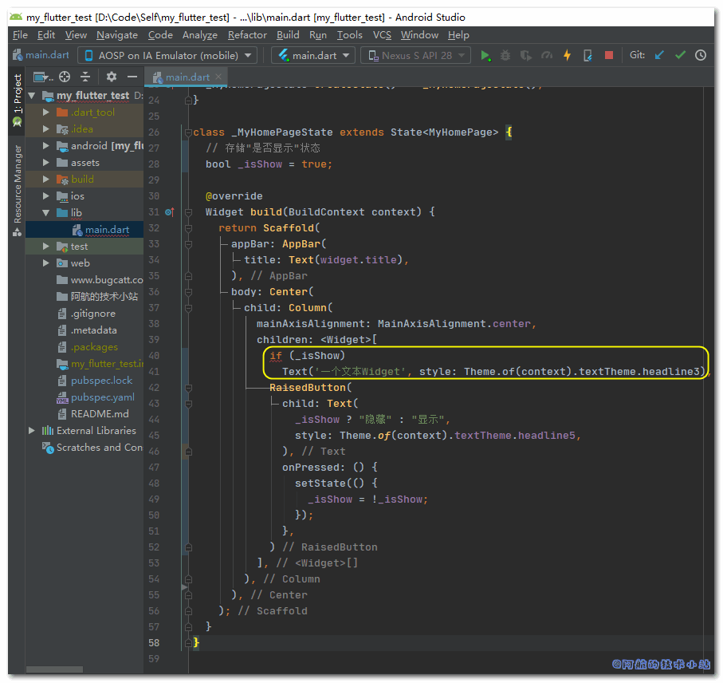
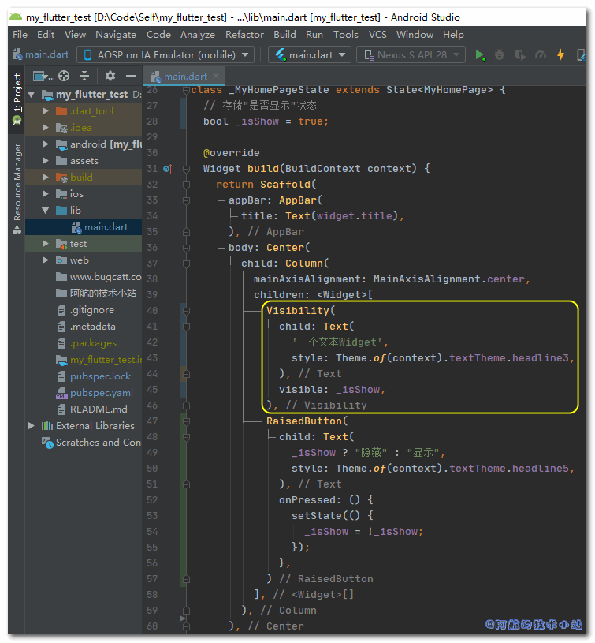
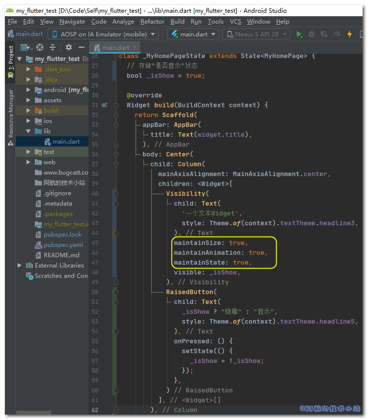

在进行Flutter开发时, 我们需要对某个widget进行显示与隐藏状态的切换. 这个需求还是蛮常见的. 本篇文章就来记录下Flutter如何隐藏/显示某widget组件、切换显示状态.

## 效果

有图有真相, 先来看下我们要实现的最终效果:

<figure>

<figcaption>

隐藏Widget

</figcaption>

</figure>

<figure>

<figcaption>

隐藏且不影响布局

</figcaption>

</figure>

## 需具备的条件

- 你已经掌握Flutter基础

本篇文章环境:

<table class=""><tbody><tr><td>操作系统</td><td>Windows 10</td></tr><tr><td>Flutter SDK</td><td>1.20.0-1.0.pre.91</td></tr></tbody></table>

\[epcl\_box type="information"\]老规矩, 速度快的同学直接去看核心代码!\[/epcl\_box\]

## 实战开始

### 准备工作

创建一个Flutter项目, 替换文件`./lib/main.dart`为:

    `import 'package:flutter/material.dart';  void main() => runApp(MyApp());  class MyApp extends StatelessWidget {   @override   Widget build(BuildContext context) {     return MaterialApp(       title: 'Show Hide widget',       theme: ThemeData(         primarySwatch: Colors.blue,       ),       home: MyHomePage(title: 'Show & Hide Widget'),     );   } }  class MyHomePage extends StatefulWidget {   MyHomePage({Key key, this.title}) : super(key: key);   final String title;    @override   _MyHomePageState createState() => _MyHomePageState(); }  class _MyHomePageState extends State {   // 存储"是否显示"状态   bool _isShow = true;    @override   Widget build(BuildContext context) {     return Scaffold(       appBar: AppBar(         title: Text(widget.title),       ),       body: Center(         child: Column(           mainAxisAlignment: MainAxisAlignment.center,           children: [             Text('一个文本Widget', style: Theme.of(context).textTheme.headline3),             RaisedButton(               child: Text(                 _isShow ? "隐藏" : "显示",                 style: Theme.of(context).textTheme.headline5,               ),               onPressed: () {                 setState(() {                   _isShow = !_isShow;                 });               },             )           ],         ),       ),     );   } }`

> 我们创建了布尔类型的实例变量`_isShow`, 用于保存widget的显示状态.
> 
> 可以看到我们在界面内分别添加了一个`Text`和`RaisedButton`. 若`_isShow`的值为true, Text的值为"隐藏". 反之则为"显示".
> 
> 每次点击按钮, RaisedButton的`onPress`将会反转`_isShow`的值.
> 
> 💡 代码解析

🟢 运行项目, 可以看到界面有一行文字和一个按钮:

> 目标: 通过点击"隐藏"/"显示"按钮来切换上方文本的显示状态.

### 方案一: 直接判断

替换:

    `Text('一个文本Widget', style: Theme.of(context).textTheme.headline3),`

为:

    `_isShow     ? Text('一个文本Widget',         style: Theme.of(context).textTheme.headline3)     : Container(),`

> 我们运用了Dart的三目运算. 当\_isShow的值为`true`, 返回文本. 反之返回一个空的`Container`.
> 
> 💡 代码解析

🟢 运行项目, 查看效果:

<figure>

<figcaption>

直接判断

</figcaption>

</figure>

\[epcl\_box type="success"\]轻松搞定! 最容易理解的一种方案!\[/epcl\_box\]

速度快的同学可能已经举一反三了. 该思路是不是有多种方案? 答案是肯定的:

#### 变体: 使用if

替换整个Text为:

    `if (_isShow)   Text('一个文本Widget', style: Theme.of(context).textTheme.headline3),`

<figure>

<figcaption>

代码截图

</figcaption>

</figure>

> 非常简单, 我们在Text前加上了`if (_isShow)`. 直接可以实现效果.
> 
> 💡 代码解析

\[epcl\_box type="notice"\]但是为什么不作为教程的首选呢? 因为该方法会使IDE报错, 并且需要flutter的最小版本大于2.2.2. 贸然提升flutter的最小版本是会出问题的!\[/epcl\_box\]

该思路虽然简单, 但也有着自己的缺点. 比如隐藏后影响排版、代码不简洁等等.

### 方案二: 使用Visibility

我们使用Flutter自带的`Visibility`组件. 替换Text组件的代码为:

    `Visibility(   child: Text(     '一个文本Widget',     style: Theme.of(context).textTheme.headline3,   ),   visible: _isShow, ),`

<figure>

<figcaption>

代码截图

</figcaption>

</figure>

🟢 运行项目, 查看效果:

<figure>

<figcaption>

使用Visibility

</figcaption>

</figure>

有同学问, 如果我想隐藏后不影响排版怎么办? 很简单! 在`Visibility`添加属性:

    `Visibility(   child: Text(     '一个文本Widget',     style: Theme.of(context).textTheme.headline3,   ),   maintainSize: true,   maintainAnimation: true,   maintainState: true,   visible: _isShow, ),`

<figure>

<figcaption>

代码截图

</figcaption>

</figure>

> Visibility新增的3个属性值决定了其child是否使其占位、效果及数据绑定生效. 当`maintainSize`为true时, 无论child显示或隐藏, 其**占位都不会改变**. 从而达到**不影响排版**的目的.
> 
> 💡 代码解析

🟢 运行项目. 阿航这里直接给出前后的对比图:

<figure>

<figcaption>

maintainSize 为 false

</figcaption>

</figure>

<figure>

<figcaption>

maintainSize 为 true

</figcaption>

</figure>

> 通过按钮的位置可以看出, `maintainSize`为true后, 按钮位置没有发生变化, 也就是排版未被影响.

\[epcl\_box type="success"\]成功搞定! 并且比其他方式更优雅! 支持的功能更多!\[/epcl\_box\]

### 其他方案

还有其他能达成同样效果的解决方案, 比如Opacity、Offstage、TickerMode、ExcludeSemantics、IgnorePointer等. 但是这些方案都不如上述的解决方案那么优雅. 这里就不再赘述.

## 核心代码

下面的`_isShow`变量是一个定义好的布尔类型变量, 决定是否显示.

**方案一:**

三目:

    `_isShow ? Text('一个文本Widget',     style: Theme.of(context).textTheme.headline3) : Container(),`

if方式(需要改变flutter版本, 慎用):

    `if (_isShow) Text('一个文本Widget', style: Theme.of(context).textTheme.headline3),`

**方案二:**

`maintainSize`为true时, 显示/隐藏不会影响排版.

    `Visibility(   child: Text(     '一个文本Widget',     style: Theme.of(context).textTheme.headline3,   ),   maintainSize: true,   maintainAnimation: true,   maintainState: true,   visible: _isShow, ),`

## 感谢

- [Visibility class](https://api.flutter.dev/flutter/widgets/Visibility-class.html)
- [Show/hide widgets in Flutter programmatically](https://stackoverflow.com/questions/44489804/show-hide-widgets-in-flutter-programmatically)
