有时我们需要为Flutter的widget小部件添加各式各样的边框. 但是并不是所有widget都提供了边框的属性, 本篇文章就来记录下如何为Flutter 的 widget 添加border边框、下划线.

## 效果

有图有真相, 先来看下我们要实现的最终效果:

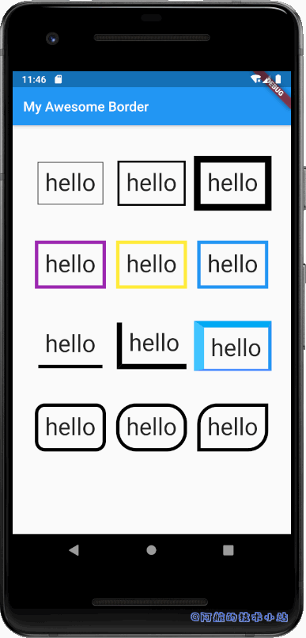

## 需具备的条件

- 你已经掌握Flutter基础

本篇文章的开发环境:

| 环境 | 版本 |
| --- | --- |
| 操作系统 | Windows 10 |
| Flutter | 1.19.0-2.0.pre |
| IDE | Android Studio 3.5 |

\[epcl\_box type="information"\]速度快的同学直接复制下方的"全部源码"自行研究! 稳一点的同学请按照教程一步一步来! \[/epcl\_box\]

## 实战开始

### 创建项目&清理代码

为了便于演示, 阿航在这里创建一个空项目.

创建完成后, 删除`./test`目录. 因为我们的demo无需测试类.

替换`./lib/main.dart`为:

```
import 'package:flutter/material.dart';

void main() => runApp(MyApp());

class MyApp extends StatelessWidget {
  @override
  Widget build(BuildContext context) {
    return MaterialApp(
      title: 'Awesome Border',
      theme: ThemeData(primarySwatch: Colors.blue),
      home: MyHomePage(title: 'My Awesome Border'),
    );
  }
}

class MyHomePage extends StatefulWidget {
  MyHomePage({Key key, this.title}) : super(key: key);
  final String title;

  @override
  _MyHomePageState createState() => _MyHomePageState();
}

class _MyHomePageState extends State {
  // 即将渲染的边框组件集合
  List _borderWidgets;

  @override
  void initState() {
    // 处理带边框的对象集合
    _borderWidgets = [];
    super.initState();
  }

  @override
  Widget build(BuildContext context) {
    // 为了美观, 将内容全部居中处理
    _borderWidgets.forEach((element) {
      _borderWidgets[_borderWidgets.indexOf(element)] = Center(child: element);
    });

    return Scaffold(
      appBar: AppBar(title: Text(widget.title)),
      body: Center(
          child: Container(
        padding: EdgeInsets.all(20),
        child: GridView.count(
          padding: const EdgeInsets.all(8.0),
          crossAxisCount: 3,
          crossAxisSpacing: 5,
          mainAxisSpacing: 5,
          children: _borderWidgets,
        ),
      )),
    );
  }
}
```

> 我们首先在`26`行定义了实例变量`_borderWidgets`, 它将保存我们所有的用来展示边框的Widget.
> 
> 然后定义`initState()`, 用于初始化`_borderWidgets`.
> 
> 在下方的build内部为其套上一层`Center`实现居中效果.
> 
> 最后就是使用`GridView`进行渲染了.
> 
> 💡 代码解析

🟢 运行项目. 应该是空白的, 啥也木有:

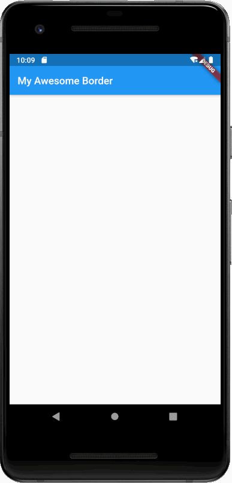

### 添加边框

至此, 准备工作已经完成了. 我们接下来添加一个`Text`对象, 并为其添加边框.

先来添加一个`Text`对象. 在初始化`_borderWidgets`的集合中添加:

```
Container(
  padding: EdgeInsets.all(10),
  decoration: BoxDecoration(
    border: Border.all(),
  ),
  child: Text(
    "hello",
    style: TextStyle(fontSize: 35),
  ),
),
```

<figure>

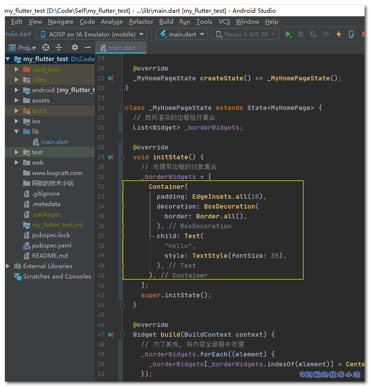

<figcaption>

代码截图

</figcaption>

</figure>

> 我们在这里定义了一个`Container`对象, 定义其 padding 为 10 . child 为一个 Text 对象.
> 
> 我们的重点就是在其`decoration`属性了, 这里我们定义了一个最基本的边框.
> 
> 💡 代码解析

🟢 运行项目(非热部署, 热部署无法重新`initState`), 看到了如下的边框:

<figure>

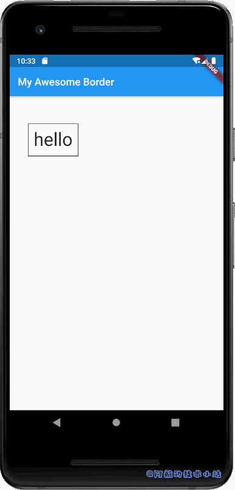

<figcaption>

边框效果

</figcaption>

</figure>

\[epcl\_box type="success"\]至此, 我们成功为widget提供了边框. 但是下方还有更多的示例!\[/epcl\_box\]

### 边框粗细(厚度)

实现了最基础的边框, 我们来尝试改变下其粗细.

在`_borderWidgets`中, 刚才定义的Container下方添加:

```
// 细边框
Container(
  padding: EdgeInsets.all(10),
  decoration: BoxDecoration(
    border: Border.all(width: 3),
  ),
  child: Text(
    "hello",
    style: TextStyle(fontSize: 35),
  ),
),
// 粗边框
Container(
  padding: EdgeInsets.all(10),
  decoration: BoxDecoration(
    border: Border.all(width: 10),
  ),
  child: Text(
    "hello",
    style: TextStyle(fontSize: 35),
  ),
),
```

<figure>

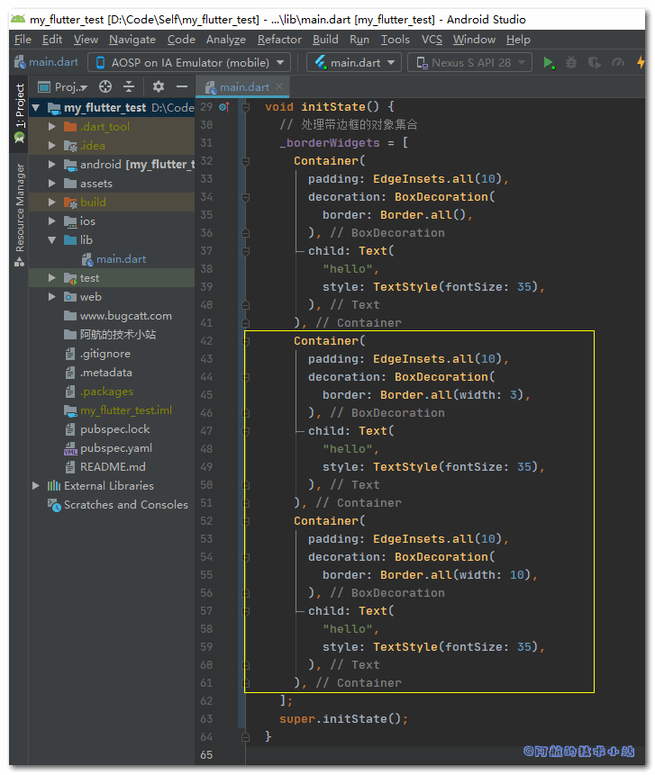

<figcaption>

代码截图

</figcaption>

</figure>

> 我们的重点放在`Border.all()`上. 我们新增的两个widget, 它们的 Border.all()的`width`属性分别传入了`3`和`10`. 数值越大, 边框越粗.
> 
> 💡 代码解析

🟢 运行项目, 查看效果:

<figure>

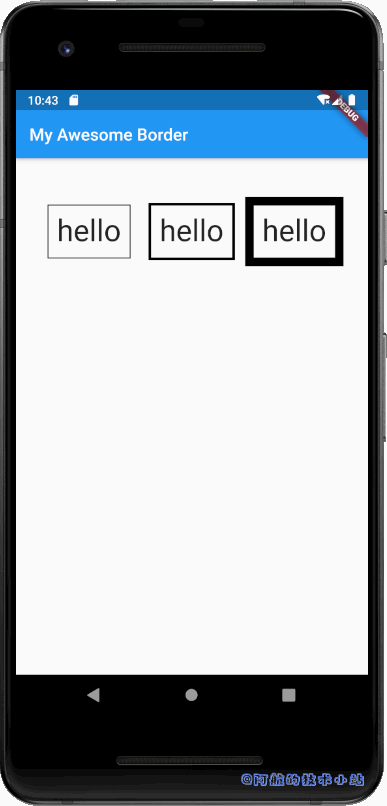

<figcaption>

不同粗细的边框

</figcaption>

</figure>

\[epcl\_box type="success"\]搞定边框粗细啦!\[/epcl\_box\]

### 边框颜色

解决了边框粗细, 我们来设置下边框颜色吧!

在`_borderWidgets`中继续添加:

```
// 紫色边框
Container(
  padding: EdgeInsets.all(10),
  decoration: BoxDecoration(
    border: Border.all(width: 5, color: Colors.purple),
  ),
  child: Text(
    "hello",
    style: TextStyle(fontSize: 35),
  ),
),
// 黄色边框
Container(
  padding: EdgeInsets.all(10),
  decoration: BoxDecoration(
    border: Border.all(width: 5, color: Colors.yellow),
  ),
  child: Text(
    "hello",
    style: TextStyle(fontSize: 35),
  ),
),
// 蓝色边框
Container(
  padding: EdgeInsets.all(10),
  decoration: BoxDecoration(
    border: Border.all(width: 5, color: Colors.blue),
  ),
  child: Text(
    "hello",
    style: TextStyle(fontSize: 35),
  ),
),
```

<figure>

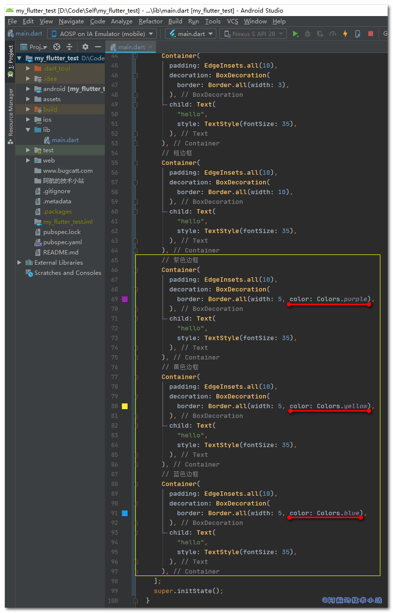

<figcaption>

代码截图

</figcaption>

</figure>

> 焦点放在Border.all的`color`属性上, 指定不同颜色的色值!
> 
> 💡 代码解析

🟢 运行项目, 查看效果:

<figure>

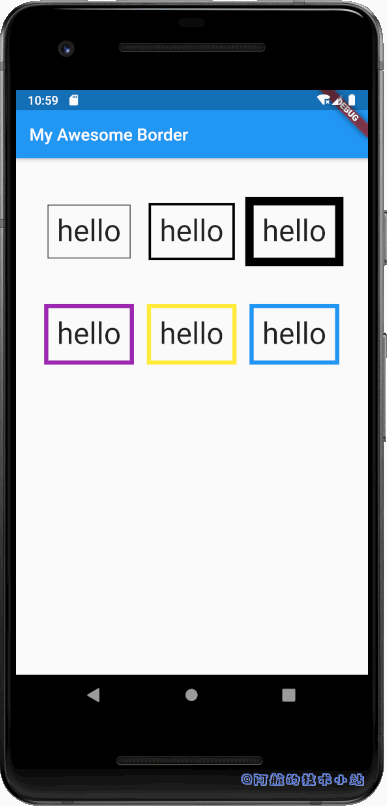

<figcaption>

不同颜色的边框

</figcaption>

</figure>

\[epcl\_box type="success"\]再次搞定边框颜色!\[/epcl\_box\]

### 边框方向

当我们只想在某几个方向添加边框怎么办? 很简单!

继续添加:

```
// 边框方向(仅底部)
Container(
  padding: EdgeInsets.all(10),
  decoration: BoxDecoration(
    border: Border(bottom: BorderSide(width: 5, color: Colors.black)),
  ),
  child: Text(
    "hello",
    style: TextStyle(fontSize: 35),
  ),
),
// 边框方向并加粗(左、底)
Container(
  padding: EdgeInsets.all(10),
  decoration: BoxDecoration(
    border: Border(
        left: BorderSide(width: 8, color: Colors.black),
        bottom: BorderSide(width: 8, color: Colors.black)),
  ),
  child: Text(
    "hello",
    style: TextStyle(fontSize: 35),
  ),
),
// 边框方向, 3d效果
Container(
  padding: EdgeInsets.all(10),
  decoration: BoxDecoration(
    border: Border(
        top: BorderSide(width: 10, color: Colors.lightBlue),
        left: BorderSide(width: 15, color: Colors.lightBlueAccent),
        right: BorderSide(width: 5, color: Colors.blue),
        bottom: BorderSide(width: 3, color: Colors.blueAccent)),
  ),
  child: Text(
    "hello",
    style: TextStyle(fontSize: 35),
  ),
),
```

> 这回我们没有用Border.all进行创建, 而是用了`Border()`的构造函数, 可以上下左右分别传入`BorderSide`进行每个边的设置.
> 
> 💡 代码解析

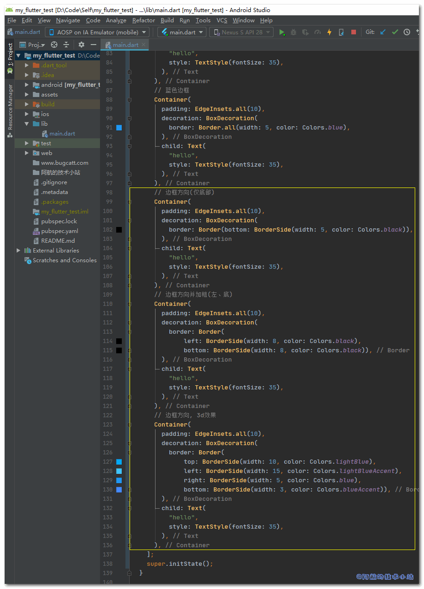

🟢 运行项目, 看看效果(第三行):

<figure>

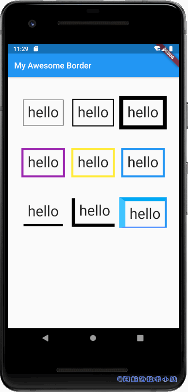

<figcaption>

不同方向的边框(第3行)

</figcaption>

</figure>

\[epcl\_box type="information"\]仔细观察第三行第三个. 我们可以通过不同的处理为其添加"按钮高度"的3d效果!\[/epcl\_box\]

\[epcl\_box type="success"\]轻松搞定方向, 是不是超简单?\[/epcl\_box\]

### 边框半径(圆角)

我们接下来搞定圆角. 继续添加:

```
// 边框半径(圆角)
Container(
  padding: EdgeInsets.all(10),
  decoration: BoxDecoration(
      border: Border.all(width: 5),
      borderRadius: BorderRadius.all(Radius.circular(15))),
  child: Text(
    "hello",
    style: TextStyle(fontSize: 35),
  ),
),
// 边框半径(较大圆角)
Container(
  padding: EdgeInsets.all(10),
  decoration: BoxDecoration(
      border: Border.all(width: 5),
      borderRadius: BorderRadius.all(Radius.circular(30))),
  child: Text(
    "hello",
    style: TextStyle(fontSize: 35),
  ),
),
// 边框半径(指定方向圆角)
Container(
  padding: EdgeInsets.all(10),
  decoration: BoxDecoration(
      border: Border.all(width: 5),
      borderRadius: BorderRadius.only(
          topLeft: Radius.circular(30),
          bottomRight: Radius.circular(30))),
  child: Text(
    "hello",
    style: TextStyle(fontSize: 35),
  ),
),
```

<figure>

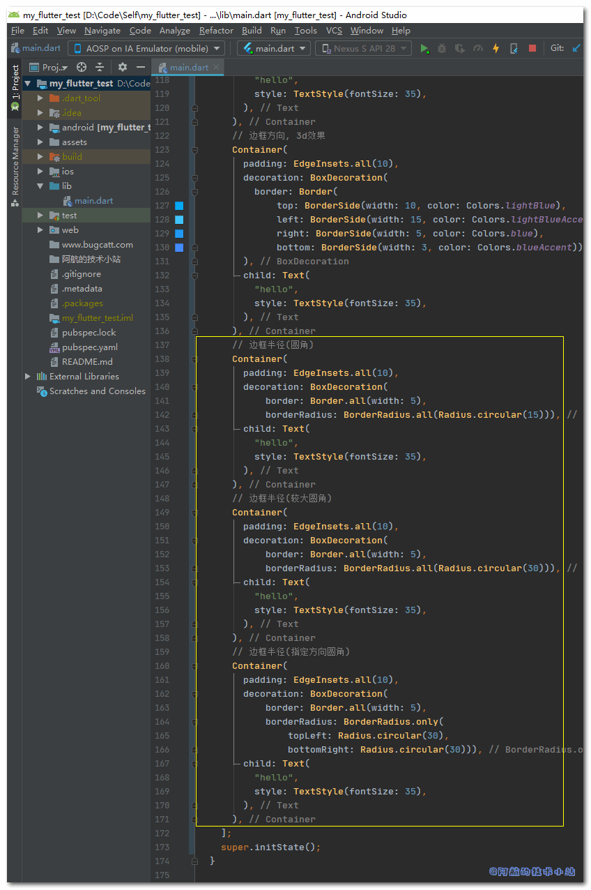

<figcaption>

代码截图

</figcaption>

</figure>

> 我们把焦点放在`borderRadius`上. 我们分别用到了`BorderRadius.all()`以及`BorderRadius.only()`进行初始化边框半径. 和此前的用法类似, all代表所有角, only用来指定某角度.
> 
> 💡 代码解析

🟢 运行项目, 看看效果(第四行):

<figure>


<figcaption>

边框半径(圆角)的不同效果(第4行)

</figcaption>

</figure>

\[epcl\_box type="success"\]又一次轻松搞定🤘🤘🤘🤘\[/epcl\_box\]

## 全部源码

这里为大家提供`./lib/main.dart`的可直接运行的全部源码:

\[epcl\_toggle title="点击展开全部源码"\]

```
import 'package:flutter/material.dart';

void main() => runApp(MyApp());

class MyApp extends StatelessWidget {
  @override
  Widget build(BuildContext context) {
    return MaterialApp(
      title: 'Awesome Border',
      theme: ThemeData(primarySwatch: Colors.blue),
      home: MyHomePage(title: 'My Awesome Border'),
    );
  }
}

class MyHomePage extends StatefulWidget {
  MyHomePage({Key key, this.title}) : super(key: key);
  final String title;

  @override
  _MyHomePageState createState() => _MyHomePageState();
}

class _MyHomePageState extends State {
  // 即将渲染的边框组件集合
  List _borderWidgets;

  @override
  void initState() {
    // 处理带边框的对象集合
    _borderWidgets = [
      // 普通边框
      Container(
        padding: EdgeInsets.all(10),
        decoration: BoxDecoration(
          border: Border.all(),
        ),
        child: Text(
          "hello",
          style: TextStyle(fontSize: 35),
        ),
      ),
      // 细边框
      Container(
        padding: EdgeInsets.all(10),
        decoration: BoxDecoration(
          border: Border.all(width: 3),
        ),
        child: Text(
          "hello",
          style: TextStyle(fontSize: 35),
        ),
      ),
      // 粗边框
      Container(
        padding: EdgeInsets.all(10),
        decoration: BoxDecoration(
          border: Border.all(width: 10),
        ),
        child: Text(
          "hello",
          style: TextStyle(fontSize: 35),
        ),
      ),
      // 紫色边框
      Container(
        padding: EdgeInsets.all(10),
        decoration: BoxDecoration(
          border: Border.all(width: 5, color: Colors.purple),
        ),
        child: Text(
          "hello",
          style: TextStyle(fontSize: 35),
        ),
      ),
      // 黄色边框
      Container(
        padding: EdgeInsets.all(10),
        decoration: BoxDecoration(
          border: Border.all(width: 5, color: Colors.yellow),
        ),
        child: Text(
          "hello",
          style: TextStyle(fontSize: 35),
        ),
      ),
      // 蓝色边框
      Container(
        padding: EdgeInsets.all(10),
        decoration: BoxDecoration(
          border: Border.all(width: 5, color: Colors.blue),
        ),
        child: Text(
          "hello",
          style: TextStyle(fontSize: 35),
        ),
      ),
      // 边框方向(仅底部)
      Container(
        padding: EdgeInsets.all(10),
        decoration: BoxDecoration(
          border: Border(bottom: BorderSide(width: 5, color: Colors.black)),
        ),
        child: Text(
          "hello",
          style: TextStyle(fontSize: 35),
        ),
      ),
      // 边框方向并加粗(左、底)
      Container(
        padding: EdgeInsets.all(10),
        decoration: BoxDecoration(
          border: Border(
              left: BorderSide(width: 8, color: Colors.black),
              bottom: BorderSide(width: 8, color: Colors.black)),
        ),
        child: Text(
          "hello",
          style: TextStyle(fontSize: 35),
        ),
      ),
      // 边框方向, 3d效果
      Container(
        padding: EdgeInsets.all(10),
        decoration: BoxDecoration(
          border: Border(
              top: BorderSide(width: 10, color: Colors.lightBlue),
              left: BorderSide(width: 15, color: Colors.lightBlueAccent),
              right: BorderSide(width: 5, color: Colors.blue),
              bottom: BorderSide(width: 3, color: Colors.blueAccent)),
        ),
        child: Text(
          "hello",
          style: TextStyle(fontSize: 35),
        ),
      ),
      // 边框半径(圆角)
      Container(
        padding: EdgeInsets.all(10),
        decoration: BoxDecoration(
            border: Border.all(width: 5),
            borderRadius: BorderRadius.all(Radius.circular(15))),
        child: Text(
          "hello",
          style: TextStyle(fontSize: 35),
        ),
      ),
      // 边框半径(较大圆角)
      Container(
        padding: EdgeInsets.all(10),
        decoration: BoxDecoration(
            border: Border.all(width: 5),
            borderRadius: BorderRadius.all(Radius.circular(30))),
        child: Text(
          "hello",
          style: TextStyle(fontSize: 35),
        ),
      ),
      // 边框半径(指定方向圆角)
      Container(
        padding: EdgeInsets.all(10),
        decoration: BoxDecoration(
            border: Border.all(width: 5),
            borderRadius: BorderRadius.only(
                topLeft: Radius.circular(30),
                bottomRight: Radius.circular(30))),
        child: Text(
          "hello",
          style: TextStyle(fontSize: 35),
        ),
      ),
    ];
    super.initState();
  }

  @override
  Widget build(BuildContext context) {
    // 为了美观, 将内容全部居中处理
    _borderWidgets.forEach((element) {
      _borderWidgets[_borderWidgets.indexOf(element)] = Center(child: element);
    });

    return Scaffold(
      appBar: AppBar(title: Text(widget.title)),
      body: Center(
          child: Container(
        padding: EdgeInsets.all(20),
        child: GridView.count(
          padding: const EdgeInsets.all(8.0),
          crossAxisCount: 3,
          crossAxisSpacing: 5,
          mainAxisSpacing: 5,
          children: _borderWidgets,
        ),
      )),
    );
  }
}
```

\[/epcl\_toggle\]

## 感谢

[How to add a border to a widget in Flutter?](https://stackoverflow.com/questions/47423297/how-to-add-a-border-to-a-widget-in-flutter)

## 结语

> 什么, 你认为项目示例写法重复过多, 有更好的方法? 这是必然的. 阿航完全可以使用循环, 只需要保存不同的属性就可以了. 但是为什么不这么做? 因为这么写, 每种示例都可以提供给你直接复制使用.

以上就是本篇文章的全部内容了. 有任何问题欢迎在下方评论区留言. 👦👦👦
