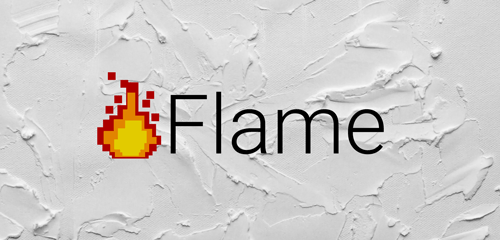
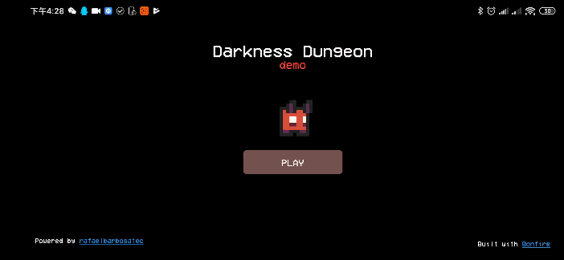
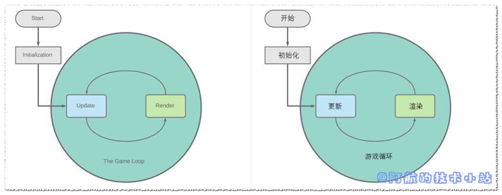

Flutter作为近年来的新兴混合开发语言, 一直备受关注. 既然Flutter这么好用, 并且宣传渲染帧率可高达60fps.

那我们是不是可以用它开发游戏呢?

答案是肯定的, 某个Flutter大神制作了一款框架, 名为Flame.

如果你没有代码基础, 想开发一款自己的游戏, 那么Flutter + Flame也许是比较好的选择.

先来看一下使用Flutter + Flame做的几款游戏吧:

[DarknessDungeon](https://github.com/RafaelBarbosatec/darkness_dungeon) 地牢游戏

4 in A Row 四子棋益智游戏

嗯…看起来还不错

阿航在之前的空闲时间也使用了该框架进行了游戏开发, 体验还不错.

这个是游戏大体的框架结构:

使用Flame开发游戏, 只需要先创建**Game loop**(游戏循环/游戏场景), 维护好**update**函数(计算各种数值)以及**render**函数(渲染屏幕).

在这里贴出一个Flutter开发与其他游戏开发引擎的对比:

|  | Flutter + Flame | Unity、虚幻等主流开发引擎 |
| --- | --- | --- |
| 适合独立开发 | 很适合 | 适合 |
| 需要掌握的技术 | 仅Flutter | 开发语言+软件使用 |
| 学习难度 | 容易 | 中等甚至困难 |
| 开发难度 | 容易 | 中等甚至困难 |
| 国内文档支持 | 较少, 阿航的技术小站将会提供中文文档 | 丰富 |
| 3d支持 | 暂无 | 3d支持很好 |
| 开发大型游戏 | 适合 | 非常适合 |
| 开发小型游戏 | 非常适合 | 适合 |

> 我已经在博客里写了这个框架的教程以及实例教学！  
> 立即访问《[Flutter 游戏开发(flame) 01 初识Flame](https://blog.bugcatt.com/archives/279)》开始学习!

对文章有任何问题、 建议, 欢迎在评论区下方评论. 作者将会尽力、尽快回复.

最新、更多、更好的教程/博客/资讯, 欢迎访问我的官网: [阿航的技术小站](https://blog.bugcatt.com).
