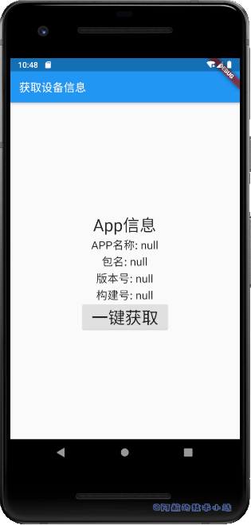
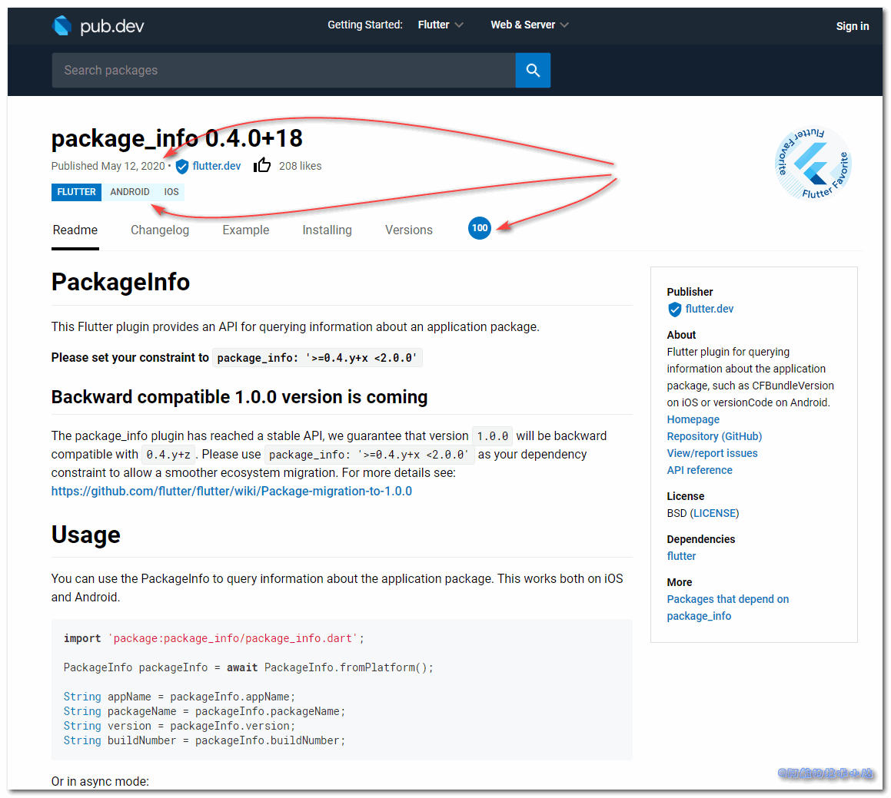
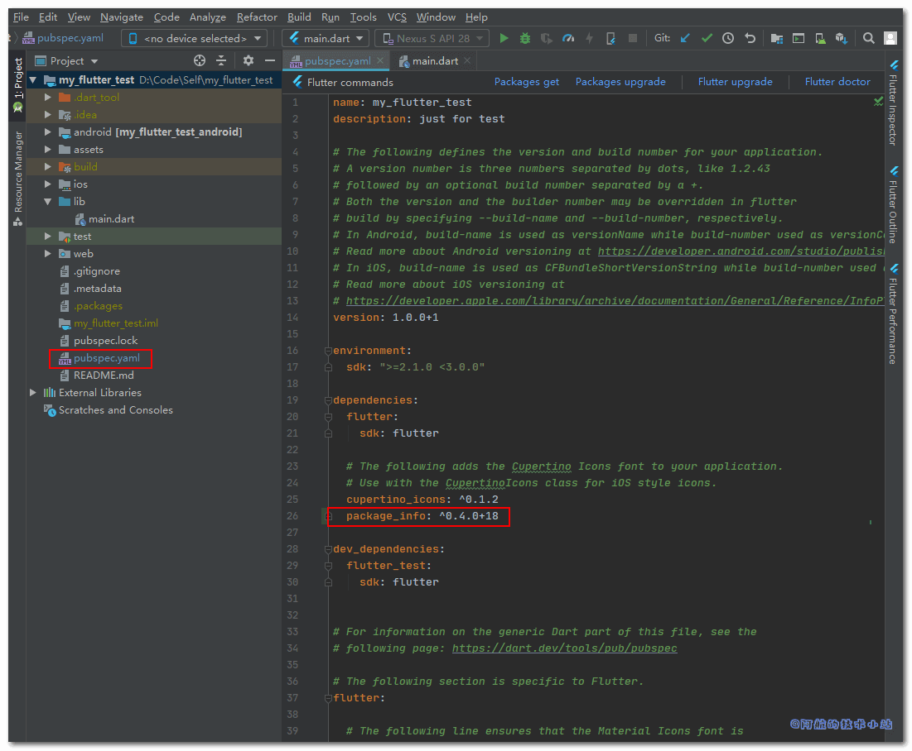

在进行APP版本迭代的过程中, 有时我们需要通过获取当前APP的版本号, 与后端服务器获取的当前最新版本进行比对, 如果出现了最新版本, 我们提醒用户进行应用更新. 本篇文章就来记录一下Flutter获取包名、应用APP名称、版本号、build构建版本号.

## 最终效果

有图有真相, 先来看下最终效果吧!



## 应用场景

1. 通过检查当前APP版本号来判断是否需要更新.
2. APP出现错误日志需要传回服务器时, 获取APP基本信息(也就是看看bug出现在哪个版本!).

## 实战开始

### 引入PackageInfo

老样子, 上官方的存储库中寻找我们今天需要的`PackageInfo`:



\[epcl\_box type="information"\]一般我们选用第三方库会看三个指标: 评分、兼容性以及活跃度.\[/epcl\_box\]

这个库将会成为我们获取APP信息的主力.

进入`./pubspec.yaml`, 导入:

```yaml
dependencies:
  package_info: ^0.4.0+18
```



一定要注意缩进哦!

### 初始化项目

为了让大家更直观的看到, 这里提供`./lib/main.dart`的代码, 你可以直接进行复制并运行:

```dart
import 'package:flutter/material.dart';

void main() => runApp(MyApp());

class MyApp extends StatelessWidget {
  @override
  Widget build(BuildContext context) {
    return MaterialApp(
      title: '获取设备信息Demo',
      theme: ThemeData(
        primarySwatch: Colors.blue,
      ),
      home: MyHomePage(title: '获取设备信息'),
    );
  }
}

class MyHomePage extends StatefulWidget {
  MyHomePage({Key key, this.title}) : super(key: key);

  final String title;

  @override
  _MyHomePageState createState() => _MyHomePageState();
}

class _MyHomePageState extends State {

  @override
  Widget build(BuildContext context) {
    return Scaffold(
      appBar: AppBar(
        title: Text(widget.title),
      ),
      body: Center(
        child: Column(
          mainAxisAlignment: MainAxisAlignment.center,
          children: [
            Text(
              'App信息',
              style: TextStyle(fontSize: 30),
            ),
          ],
        ),
      ),
    );
  }
}
```

> 💡 代码解析: 只是一个空的项目. 我们将基于这个空项目继续我们的实例.

\[epcl\_box type="success"\]运行, 如图:\[/epcl\_box\]


## 使用PackageInfo

在`./lib/main.dart`中进行导入:

```dart
import 'package:package_info/package_info.dart';
```

在`_MyHomePageState`中创建四个实例变量, 用来保存信息:

```dart
// APP名称
String _appName;
// 包名
String _packageName;
// 版本号
String _version;
// 构建号
String _buildNumber;
```

> 💡 代码解析: 注释已标注各个属性所代表的含义!

在`_MyHomePageState`内的`build()`下方创建函数`getAppInfo()`:

```dart
/// 获取APP信息
void getAppInfo(){
    PackageInfo.fromPlatform().then((PackageInfo packageInfo) {
        _appName = packageInfo.appName;
        _packageName = packageInfo.packageName;
        _version = packageInfo.version;
        _buildNumber = packageInfo.buildNumber;
    });
    setState(() {});
}
```

> 💡 代码解析: 这里调用了`PackageInfo`的`fromPlatform`函数. 返回的对象包含了我们需要的四个信息. 最后, 进行`setState`刷新数据状态.

我们要做的就是在这里获取数据, 并将其展示出来. 替换:

```dart
Text(
    'App信息',
    style: TextStyle(fontSize: 30),
),
```

为:

```dart
Text(
    'App信息',
    style: TextStyle(fontSize: 30),
),
Text(
    'APP名称: $_appName',
    style: TextStyle(fontSize: 20),
),
Text(
    '包名: $_packageName',
    style: TextStyle(fontSize: 20),
),
Text(
    '版本号: $_version',
    style: TextStyle(fontSize: 20),
),
Text(
    '构建号: $_buildNumber',
    style: TextStyle(fontSize: 20),
),
RaisedButton(
    child: Text(
        '一键获取',
        style: TextStyle(fontSize: 30),
    ),
    onPressed: ()=>getAppInfo(),
)
```

> 💡 代码解析: 前几个`Text`并没有什么难点, 只是简单的数据展示. 最后一个`RaisedButton`通过`onPressed`来调用上方定义的`getAppInfo()`.

\[epcl\_box type="success"\]运行项目, 查看效果:\[/epcl\_box\]


搞定!

## 重点回顾

这里的核心代码:

先导入:

```dart
import 'package:package_info/package_info.dart';
```

再使用:

```dart
PackageInfo.fromPlatform().then((PackageInfo packageInfo) {
  String appName = packageInfo.appName;
  String packageName = packageInfo.packageName;
  String version = packageInfo.version;
  String buildNumber = packageInfo.buildNumber;
});
```

另一种写法(所在的函数必须由`async`修饰):

```dart
PackageInfo packageInfo = await PackageInfo.fromPlatform();

String appName = packageInfo.appName;
String packageName = packageInfo.packageName;
String version = packageInfo.version;
String buildNumber = packageInfo.buildNumber;
```

## 感谢

- [Pexels](https://www.pexels.com/zh-cn/photo/221004/?utm_content=attributionCopyText&utm_medium=referral&utm_source=pexels) 上的 [Pixabay](https://www.pexels.com/zh-cn/@pixabay?utm_content=attributionCopyText&utm_medium=referral&utm_source=pexels) 拍摄的照片
- [PackageInfo](https://pub.flutter-io.cn/packages/package_info#-readme-tab-)

## 结语

至此, 我们成功获取了 Flutter 的包名、应用APP名称、版本号、build构建版本号. 如果你有任何疑问, 欢迎评论.
