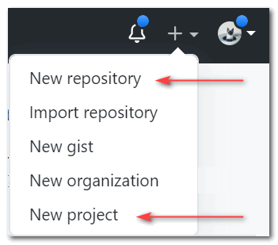

在使用全球最大的同性交友网站进行开源时, 也许你在打算创建一个新项目时碰到这种情况:

<figure>

<figcaption>

点击Github右上角的加号

</figcaption>

</figure>

点击加号后, 出现了两个选项. 分别是`New repository`以及`New project`.

转念一想...咦, 一个是仓库, 又一个是项目. 感觉是一个东西啊!

## Github Project

我们先来看一下[官方文档](https://docs.github.com/cn/github/managing-your-work-on-github/about-project-boards)的解释:

GitHub 上的项目板帮助您组织工作和排列工作的优先级。 您可以为特定功能工作、全面的路线图甚至发布检查列表创建项目板。 通过项目板可以灵活地创建适合需求的自定义工作流程。

这样一看就懂了, Project翻译过来的"项目"指的并非开发人员的"代码项目", 而是一整个软件项目管理.

\[epcl\_box type="information"\]如果你经历过大项目, 应该使用过Jira、Tapd、禅道等项目管理系统! \[/epcl\_box\]

## Github Repository

我们仍然来看一下[官方文档](https://docs.github.com/cn/github/creating-cloning-and-archiving-repositories/about-repositories)的解释:

仓库就像项目的文件夹。 项目的仓库包含项目的所有文件，并存储每个文件的修订记录。 您也可以在仓库中讨论并管理项目的工作。

我们程序员上传下载代码时频繁使用的是Repository!

## 区别

一个表格非常直观的展现它们之间的区别:

| Repository | Project |
| --- | --- |
| 保存代码, 进行版本控制 | 进行项目管理, 可以添加任务、制定工作流程等. |
