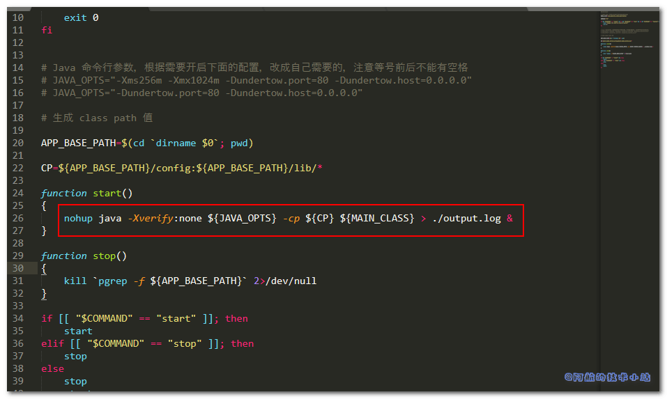
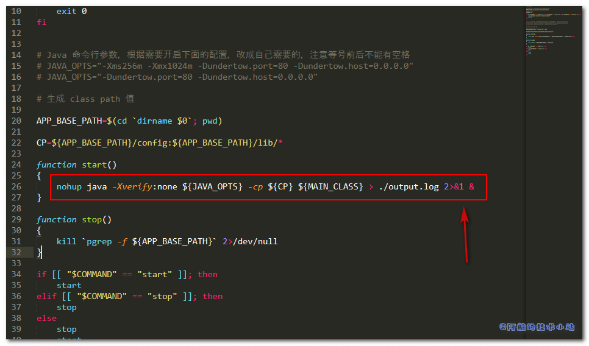

## 背景

为公司部署某CRM系统. 前几步还是比较顺畅的. 但是当我打完包, 把其上传至服务器后, 出现了这样的坑. 阿航在此记录一下, 希望能帮到你

运行其提供的`.sh`文件时, 报错:

```
nohup: redirecting stderr to stdout
```

找到`.sh`文件, 看到这一行:



## 解决方案

我将其末尾的 `%` 改为了 `2>&1 &`



再次运行, 成功😏😏.

## 结语

本篇文章只记录了阿航踩坑的过程, 不保证适用于全部情况. 很多时候的坑的原因是各种各样的. 希望这篇文章能帮到你.

[Linux菜鸟教程](https://www.runoob.com/linux/linux-tutorial.html)
