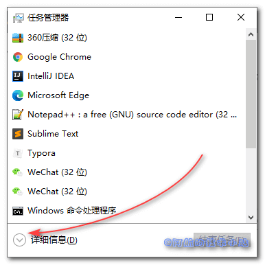
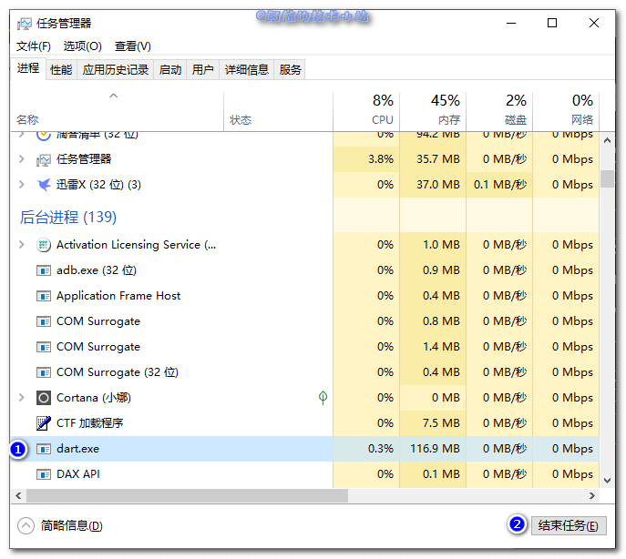
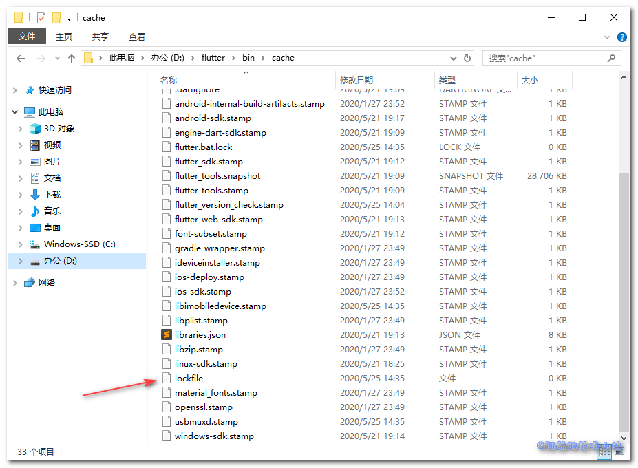

又是开发APP的一天, 但是在执行Flutter命令时, 终端中返回:

```
Waiting for another flutter command to release the startup lock…
```

字面意思是: 正在等待另一个正在执行的Flutter命令完成... 本篇文章就来记录一下如何如何解决这种问题.

## 出现原因

非常明显, 它告诉了我们已经有另一个Flutter命令正在执行! 一方面因为国内网络的原因, 有些命令执行相当慢. 导致可能很久之前执行的命令到现在也没完成. 亦或者是Flutter自己在后台执行了一些命令.

## 解决方案

所以, 要解决这个问题, 我们的目标就确定了. 那就是关闭掉当前执行的Flutter命令进程!

这里阿航给大家提供了若干方法, 大家可以按需选择.

### 方法一: 安全地等待执行结束

这个是最省心, 也是最安全的方式. 因为强行停止某个进程可能会出现各种异常, 甚至会导致需要重新安装Flutter... 如果真变成这样就糟透了😭😭😭

当然, 有时我们不想等, 那么就需要下面的方法了.

### 方法二: taskkill

打开Flutter安装目录, 复制`dart.exe`的路径(一般会在`flutter安装目录\bin\cache\dart-sdk\bin`).

打开Powershell或CMD.

若盘符不一致, 需要先切换盘符, 比如当前在C盘, 切换至D盘:

```
D:
```

CD进入刚才复制的路径:

```
cd flutter安装目录\bin\cache\dart-sdk\bin
```

使用taskkill关闭进程:

```
taskkill /F /IM dart.exe
```

如果返回类似这样的信息即是成功:

```
taskkill /F /IM dart.exe
成功: 已终止进程 "dart.exe"，其 PID 为 9804。
```

\[epcl\_box type="success"\]这是目前最便捷的强行关闭方式!\[/epcl\_box\]

### 方法三: 任务管理器关闭dart进程

打开任务管理器, 点击详细信息:



向下拉, 找到`dart.exe`进程, 结束它:



### 方法四: 移除lockfile

\[epcl\_box type="notice"\]本方法有时不会生效. 因为某些情况下Windows无法删除被占用的文件.\[/epcl\_box\]

进入`flutter安装目录/bin/cache`目录, 删除`lockfile`文件:



### 方法五: 关机, 并重新开机

有部分MacOS系统在使用了上述方法后仍然无效. 所以给大家提供另一个崭新的思路.

那就是关机, 再开机(**不是重新启动**).

## 感谢

- [《Waiting for another flutter command to release the startup lock》-](https://stackoverflow.com/questions/51679269/waiting-for-another-flutter-command-to-release-the-startup-lock) Stackoverflow
- Photo by [Markus Spiske](https://unsplash.com/@markusspiske?utm_source=unsplash&utm_medium=referral&utm_content=creditCopyText) on [Unsplash](https://unsplash.com/s/photos/knife?utm_source=unsplash&utm_medium=referral&utm_content=creditCopyText)
