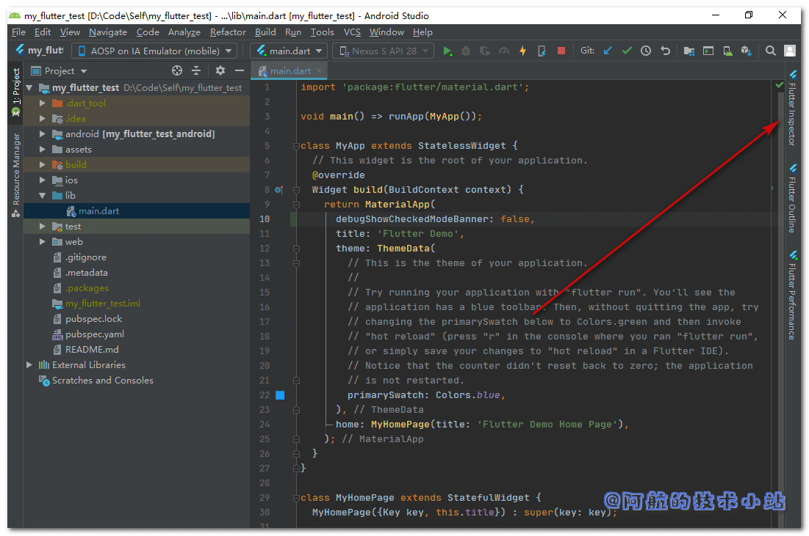

在使用Flutter进行开发时, 右上角会出现一个DEBUG的标识. 测试的时候倒是无所谓, 但是APP上线前肯定要将其去掉. 证明其是一个开发完成的、完整的APP. 这篇非常简短的博客将会记录如何去掉Flutter右上角的DEBUG标识. 一共有两种方式, 你可以按需来选择!

## 自动移除

别担心, 你在为Flutter打正式包的时候, 这个标志将会自动消失. 但有的时候我们想在开发过程中直接去掉, 那么你会需要下面的手动移除.

## 方法一: 代码修改

找到你的`MaterialApp`(建议直接使用关键字进行全局搜索), 为其添加一个属性即可去掉:

```dart
MaterialApp(
  debugShowCheckedModeBanner: false,
  // ... 其他配置
)
```

如图:


## 方法二: Android Studio修改

如果你用的是Android Studio, 那么你可以不修改代码, 通过鼠标来移除:

第一步: 点击界面右侧侧边栏的`Flutter Inspector`, 如图:



第二步: 点击弹出界面的"More Actions"的下拉选(这个按钮字比较小, 比较隐蔽):


第三步: 点击下拉选项的"Hide Debug Mode Banner":


搞定!

## 感谢

- [Pexels](https://www.pexels.com/zh-cn/photo/5412/?utm_content=attributionCopyText&utm_medium=referral&utm_source=pexels) 上的 [Jaymantri](https://www.pexels.com/zh-cn/@jaymantri?utm_content=attributionCopyText&utm_medium=referral&utm_source=pexels) 拍摄的照片
- [How to remove debug banner in flutter on android emulator? - Stack Overflow](https://stackoverflow.com/questions/48893935/how-to-remove-debug-banner-in-flutter-on-android-emulator)
- (排名不分先后)

## 结语

两种方式都可以进行修改, 唯一的区别就是方法一影响代码, 方法二不会变动代码. 你可以按实际情况选择你需要的方式!

如果你对本篇文章有任何问题, 欢迎在下方评论区, 进行讨论, 或加入[阿航的技术小站交流群](https://jq.qq.com/?_wv=1027&k=egT9rjgu) 