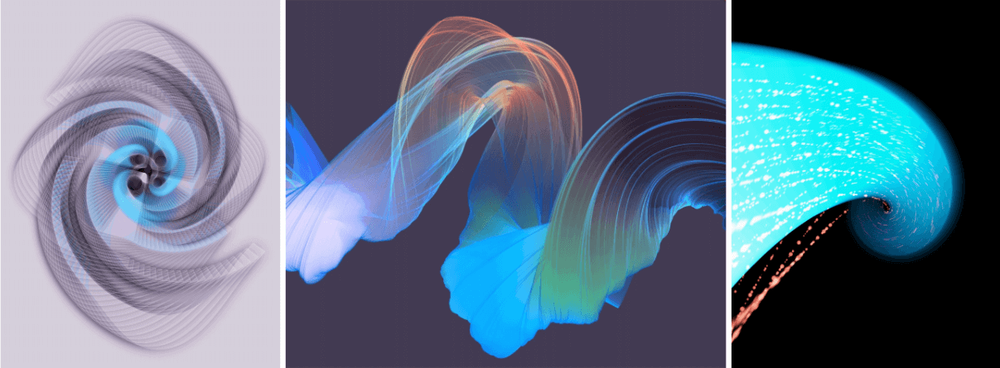
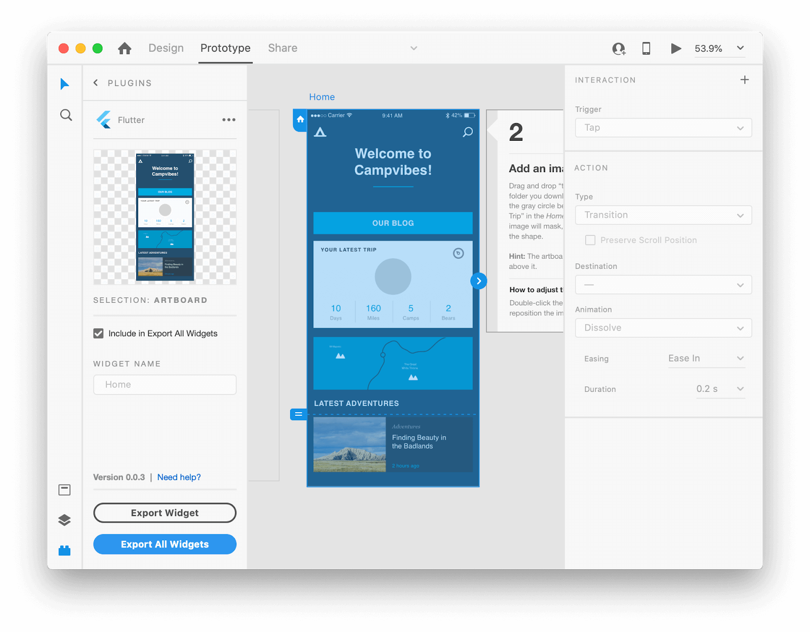
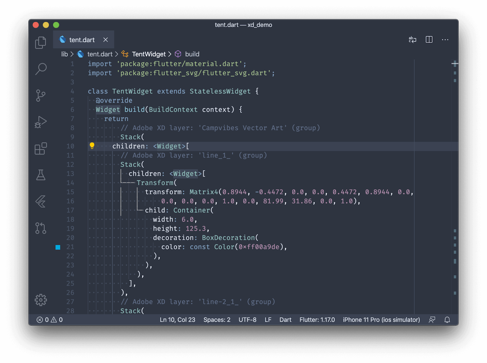
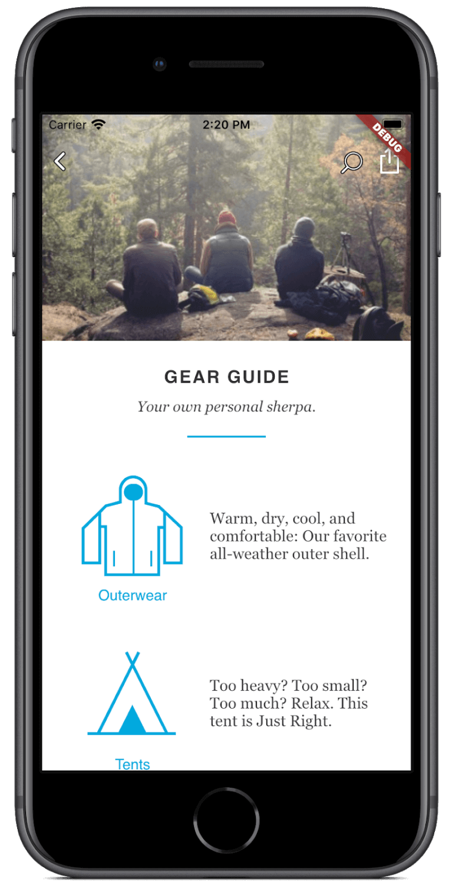

`Flutter`作为近两年年来的新型APP开发语言, 其受欢迎程度甚至和`React Native`不相上下. 最近, Flutter发表了一篇振奋人心的文章, 那就是新增了对`Adobe XD`的支持.

## Sketch和Adobe XD

如果你涉足过设计领域, 那么一定知道两个设计工具, 分别是`Sketch`以及`Adobe XD`. 大多数互联网公司的设计稿输出, 都是靠它们来进行. 当然, `Sketch`有着一个比较致命的限制, 那就是目前并不支持Windows系统.

作为设计师, 你应该碰到过将设计稿交给开发人员后, 做出的效果差强人意. 即使开发人员保证了所有的位置、距离、长度均准确无误, 但是你却怎么看怎么别扭😥😥.

## 令人头大的position、px

作为前端开发人员, 你一定为这个问题头疼了无数次——布局! 没错, 你明明完全按照设计师给出的设计稿上标注的尺寸去做了, 但是效果就是不咋地! 要做出类似的效果, 你还要慢慢的调整! 累!

## 是时候解决双方的苦恼了

终于, 在2020年5月13日, Flutter官方宣布了`Adobe XD`对其的支持, 那么, 到底有何变化呢?

### 从Adobe XD导出Flutter代码

使用XD可以在几分钟内导出Flutter代码. 你可以导出单个图形, 也可以导出整张画板!

你不需要将设计稿转化为一个又一个的区块了! 直接微调就可以了!

### 减少浪费时间的布局调整

最让人头疼的就是数字了, 上面的生成代码, 同样会生成布局所需的各种数值!

## 原文译文

上面只列出了重点功能, 阿航给大家翻译了原文:

Flutter的目标是为创意表达提供丰富的画布。借助iOS和Android上的硬件性能，对屏幕上渲染的每个像素的完全控制以及通过有状态的热重载进行快速迭代的能力，我们希望释放设计师和开发人员的潜力，建立不受人为技术边界限制的舒适体验.

去年在[Flutter Interact活动上](https://www.youtube.com/watch?v=HjZxyTJzvYg&feature=emb_logo)，我们将焦点放在使用Flutter进行探索和实验的创作者身上。我们听到了像[Robert Felker](https://www.youtube.com/watch?v=DEppSs_ko48)这样的数字艺术家的声音，他们使用Flutter通过生成算法构建空灵形式。我们介绍[了gskinner之类的创意机构的工作](https://flutter.gskinner.com/)，他们创建了一系列创新的短片来展示Flutter的潜力。我们还看到了Adobe的演示，该演示[是Adobe XD插件](https://www.youtube.com/watch?v=ukLBCRBlIkk&feature=youtu.be&t=3652)的[早期原型，该插件](https://www.youtube.com/watch?v=ukLBCRBlIkk&feature=youtu.be&t=3652)直接从其工具中导出Flutter代码。

(Flutter是用于创意表达的丰富画布：这是一种不受传统技术界限限制的美丽原生体验的工具包。（由Flutter制作的生成艺术品，由Robert Felker提供。))

今天，**我们很高兴与Adobe一起宣布他们的XD to Flutter插件**[**现在可以作为**](https://adobe.com/go/xd_plugins_discover_plugin?pluginId=6eaf77ea)更广泛的公共测试的[**初步试用**](https://adobe.com/go/xd_plugins_discover_plugin?pluginId=6eaf77ea)。[Adobe XD](https://www.adobe.com/products/xd.html)是一个UI / UX设计和协作工具，可帮助团队为网站，应用程序，语音界面，游戏等创建和共享设计。XD 是Adobe同类领先的[Creative Cloud的一部分](https://www.adobe.com/creativecloud.html)，它使设计师可以将矢量艺术，文本，图像，微交互和动画转换为行为类似的工作软件产品的交互式原型。将设计导出到Flutter的能力进一步减少了创意与产品开发之间的等待时间，因为XD原型现在可以在数分钟内成为Flutter代码。Adobe XD支持Windows或macOS上的设计，并包括[免费的入门计划](https://www.adobe.com/products/xd/compare-plans.html)，可助您启动并运行。

# 从Adobe XD导出Flutter代码

在XD中使用Flutter插件非常简单。您可以导出单个图形或Widget，也可以导出画板。就是这样。

首先安装[Flutter导出插件](https://adobe.com/go/xd_plugins_discover_plugin?pluginId=6eaf77ea)。在Adobe XD中，选择_Plugins > Discover Plugins_，然后搜索Flutter。安装后，您可以通过选择_Plugins> Flutter> UI Panel_来显示上面的屏幕快照中显示的_UI Panel_。

现在，通过将[adobe\_xd](https://pub.dev/packages/adobe_xd)包包含在您的`pubspec.yaml`应用清单中，将其添加到Flutter项目中。该软件包提供了辅助功能，以最大程度地减少生成的XD代码中的样板。

要导出单个元素，只需选择要导出到Flutter的单个小部件，然后从UI面板中选择 _Copy Selected_按钮。这会将相关的Dart代码复制到剪贴板，您可以将其用作无状态或有状态小部件的基础：

(可以将导出的代码集成到您现有的项目中并进行更新，而无需重新处理其他文件。)

另一种方法是导出整个项目。假设您已经有一个Flutter应用程序想要将内容加载到其中（包括中的`adobe_xd`包引用`pubspec.yaml`），则只需从UI面板中选择_Plugins> Flutter> Export All Widgets_，然后设置所需的任何其他配置选项。

这将在`lib/`项目的子目录中创建一系列类，然后可以直接使用它们。您可以继续调整XD原型，然后使用⇧⌘F（在Windows上为Ctrl + Shift + F）再次导出，并且，如果在Visual Studio Code中启用了[_“保存_](https://dartcode.org/docs/settings/#dartpreviewhotreloadonsavewatcher)监视程序上的Dart [_热重加载”_](https://dartcode.org/docs/settings/#dartpreviewhotreloadonsavewatcher)[设置](https://dartcode.org/docs/settings/#dartpreviewhotreloadonsavewatcher)，则您的应用会自动重新加载所有更新当您重新导出窗口小部件时。

(从XD到代码的快速转换为您提供了一种将原型转化为应用程序的新方法。)

作为初期，当然会有一些不足，这些限制在[发行说明中](https://github.com/AdobeXD/xd-to-flutter-plugin/blob/master/README.md)进行了描述。一个显着的限制是，在完成新的XD API之前，响应式布局尚不可用。但是，随着诸如此类的新功能可用，您将自动获得插件的更新。

与Adobe进行合作非常好。我们非常高兴它们支持Flutter，并且[基于JavaScript](https://adobexdplatform.com/plugin-docs/)的[新API](https://adobexdplatform.com/plugin-docs/)使每个人都可以轻松扩展Adobe XD。这是他们对这个新插件的评价：

> _“在Adobe，我们一直在寻求简化从设计人员到开发人员的工作流程，这使许多团队设计和构建应用程序感到痛苦。今天，我们很高兴能够发布与Flutter合作所产生的工作的早期访问预览，以消除猜测，加快决策制定并帮助团队更快地将新体验推向市场。”_
> 
> \-Adobe创意云平台和生态系统高级总监Vijay Vachani

有关更多信息，请访问[Adobe的XD to Flutter插件页面](https://github.com/AdobeXD/xd-to-flutter-plugin)。我们期待看到您用它创造的东西！

 

[原文链接](https://medium.com/flutter/announcing-adobe-xd-support-for-flutter-4b3dd55ff40e)
