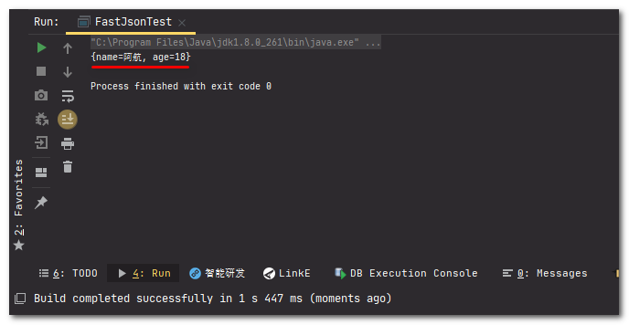
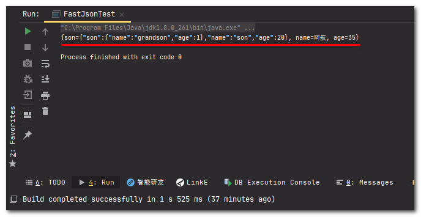

本次开发的任务是比对两个对象的属性, 查看有哪些地方不一致. 为了长期考虑, 决定将它们分别转为Map对象, 再遍历该Map, 分别比较键值对来达到效果. 本篇文章记录下如何通过FastJson将对象Object转为Map.

## 开始

### 引入FastJson

将`version`替换为合适的版本.

```xml
<dependency>
    <groupId>com.alibaba</groupId>
    <artifactId>fastjson</artifactId>
    <version>1.2.69</version>
</dependency>
```

### 对象转map函数

```java
/**
 * 对象转Map
 * @param object 要转换的对象
 * @return 转换后的Map
 */
private Map<String, Object> object2Map(Object object) {
    JSONObject jsonObject = (JSONObject) JSON.toJSON(object);
    Set<Map.Entry<String, Object>> entrySet = jsonObject.entrySet();
    Map<String, Object> map = new HashMap<>();
    for (Map.Entry<String, Object> entry : entrySet) {
        map.put(entry.getKey(), entry.getValue());
    }
    return map;
}
```

### 函数 + 运行测试

```java
import com.alibaba.fastjson.JSON;
import com.alibaba.fastjson.JSONObject;

import java.util.HashMap;
import java.util.Map;
import java.util.Set;

public class FastJsonTest {
    public static void main(String[] args) {
        // 创建对象
        Person person = new Person();
        person.setName("阿航");
        person.setAge(18);
        // 转换为Map
        Map<String, Object> map = new FastJsonTest().object2Map(person);
        // 打印
        System.out.println(map.toString());
    }

    private Map<String, Object> object2Map(Object object) {
        JSONObject jsonObject = (JSONObject) JSON.toJSON(object);
        Set<Map.Entry<String, Object>> entrySet = jsonObject.entrySet();
        Map<String, Object> map = new HashMap<>();
        for (Map.Entry<String, Object> entry : entrySet) {
            map.put(entry.getKey(), entry.getValue());
        }
        return map;
    }

    private static class Person {
        private String name;
        private Integer age;

        public String getName() {
            return name;
        }

        public void setName(String name) {
            this.name = name;
        }

        public Integer getAge() {
            return age;
        }

        public void setAge(Integer age) {
            this.age = age;
        }
    }
}
```

运行后打印到控制台:



### 复杂对象转换

> 此函数也可以转换嵌套对象, 比如`Person`拥有子对象:

```java
import com.alibaba.fastjson.JSON;
import com.alibaba.fastjson.JSONObject;

import java.util.HashMap;
import java.util.Map;
import java.util.Set;

public class FastJsonTest {
    public static void main(String[] args) {
        // 创建嵌套对象
        Person grandson = new Person();
        grandson.setName("grandson");
        grandson.setAge(1);

        Person son = new Person();
        son.setName("son");
        son.setAge(20);
        son.setSon(grandson);

        Person person = new Person();
        person.setName("阿航");
        person.setAge(35);
        person.setSon(son);
        // 对象转换为Map
        Map<String, Object> map = new FastJsonTest().object2Map(person);
        System.out.println(map.toString());
    }

    /**
     * 对象转Map
     * @param object 要转换的对象
     * @return 转换后的Map
     */
    private Map<String, Object> object2Map(Object object) {
        JSONObject jsonObject = (JSONObject) JSON.toJSON(object);
        Set<Map.Entry<String, Object>> entrySet = jsonObject.entrySet();
        Map<String, Object> map = new HashMap<>();
        for (Map.Entry<String, Object> entry : entrySet) {
            map.put(entry.getKey(), entry.getValue());
        }
        return map;
    }

    private static class Person {
        private String name;
        private Integer age;
        private Person son;

        public String getName() {
            return name;
        }

        public void setName(String name) {
            this.name = name;
        }

        public Integer getAge() {
            return age;
        }

        public void setAge(Integer age) {
            this.age = age;
        }

        public Person getSon() {
            return son;
        }

        public void setSon(Person son) {
            this.son = son;
        }
    }
}
```

运行后打印到控制台, 可以看到, 这个复杂的嵌套对象也被正常打印:



## 感谢

[借助fastjson 实体对象转map](https://www.cnblogs.com/lijiale/p/5417597.html)
