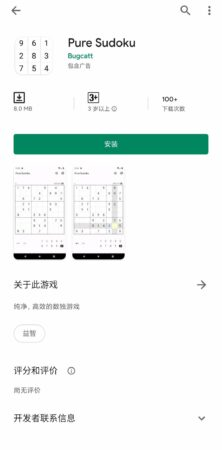
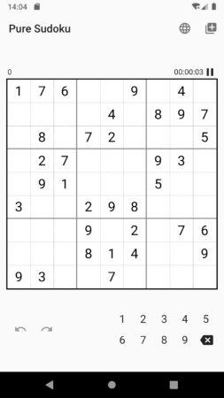
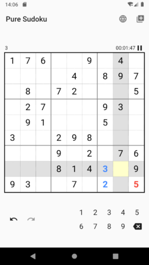

## 屏幕截图

  

## 介绍

这是一个数独APP, 一款独立游戏.

游戏玩法策划、界面设计、宣传物料、APP全部代码. 以上全部均由我独立完成.

目前已上架Google Play Store. [点击查看(需翻墙)](https://play.google.com/store/apps/details?id=com.bugcatt.pure_sudoku)

## 优势

1. 轻量, 仅**8M**.
2. APP国际化(支持多语言)
3. 界面极简, 专注APP体验. 操作友好, 无需学习成本.
4. 提供撤销、重做功能.
5. 实时保存, 无论何时退出APP都可以保存.

## 开发信息

作者: 阿航  
技术栈: Flutter  
开发周期: 4天

\[epcl\_button label="查看我的更多其他作品" url="" type="flat" color="light-blue" size="regular" icon="fa-chevron-right" target="\_self"\]
