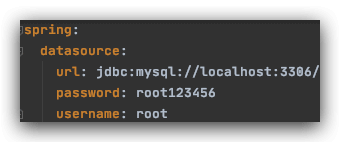
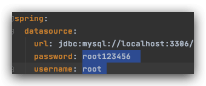

在开发的过程中坎坷不断。今天在Spring Boot中碰到了这个异常：

    `Caused by: com.mysql.cj.exceptions.CJException: Access denied for user 'root'@'localhost' (using password: YES)`

本篇文章就来记录下可能的情况以及解决方案。

## 问题原因

问题的根源就在数据库登陆上。肯定是账号和密码有误，所以我们要仔细检查配置文件，有以下几个地方容易出错：

### 情况一：检查配置文件是否包含空格

因为application.yml似乎并不会给我们的配置文件进行去空格处理，所以我们来仔细检查。配置文件人模人样的，看起来没啥问题：

结果一选中：

呵！其实不然。所以一定要**去除多余的空格**！

### 情况二：检查username和password值是否写反

因为26个字母中`u`在`p`的后面，所以默认的yml排序中`username`会在`password`下面。阿航就是踩了这个坑！以为用户名在上方，导致写反！

### 情况三：检查IP是否正确

如果确定账户密码正确，我们就来看看IP是否有误吧。

在数据库中输入以下SQL进行查询（这里以MySQL为例）：

    ` SELECT 	CONCAT( USER, '@', HOST ) Result FROM 	mysql.USER;`

查看返回结果是否包含你的报错。如果不包含就说明你的IP未被创建。

### 情况四：检查数据库服务器配置

使用其他的软件连接你的数据库（如Navicat），使用相同的用户名和密码看看能否登陆。如果不能登陆则是数据库层的问题，与代码无关了。

## 结语

总之，解决方案就是细心。。
