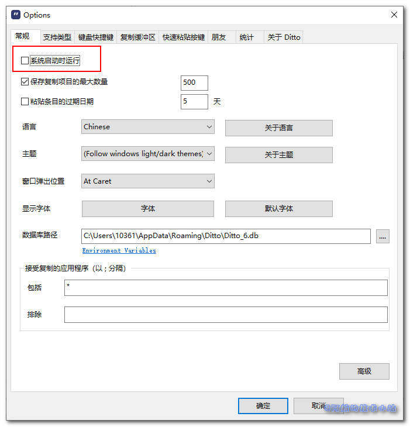
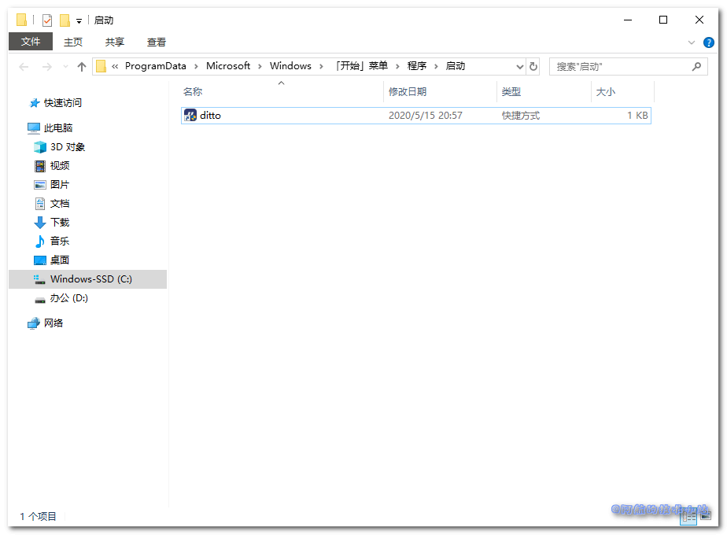
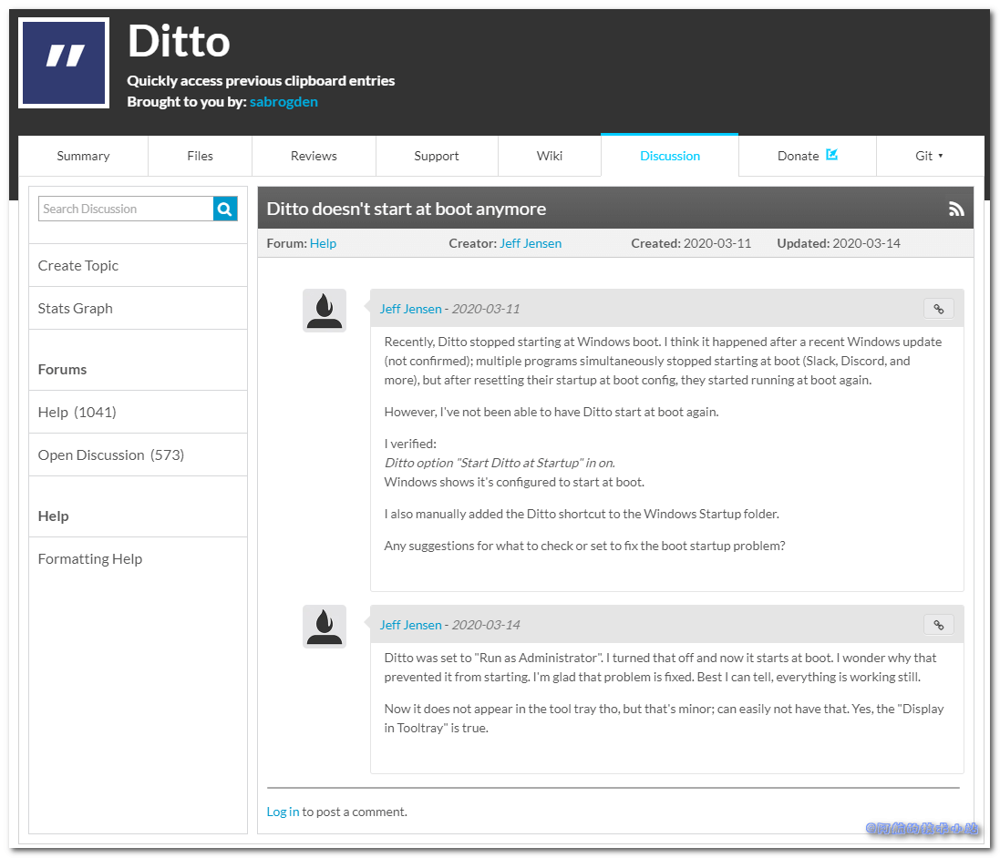

近些年一直在使用`Ditto`作为剪贴板增强工具, 但是突然有一天`Ditto`无法开机自启了! 自己设置了N次, 还是不行! 但是开动脑筋想了一阵子, 一次又一次的尝试, 终于成功了!

## 尝试过的方法

### 在Ditto软件中设置系统自启动

1. 以管理员身份运行Ditto
2. 勾选"系统启动时运行"
    
    \[caption id="attachment\_1213" align="aligncenter" width="701"\] 勾选"系统启动时运行"\[/caption\]

> 如果你通过这样设置可以成功, 那么恭喜你🎉🎉.

但是我这样没成功, 开机并没有自启动, 点击快捷键也没有反应.

### 添加Ditto至Windows的"启动"目录

1. 复制`Ditto`的快捷方式
2. `Win`+`R`打开"运行"
3. 输入`shell:Common Startup`: 
4. 点击确定, 打开"启动"目录, 粘贴`Ditto`的快捷方式. 

> 如果你通过这样设置可以成功, 那么恭喜你🎉🎉.

我同样死在了这一步. 重启后依然失败.

## 个人猜想

### 查询的过程

在网上冲浪的过程中, 并没有发现别人反馈类似的问题(可能是因为这个软件比较冷门)😑.

越过大墙, 发现真的有人[反馈](https://sourceforge.net/p/ditto-cp/discussion/287511/thread/75911afb1b/?limit=25):



### Win10 自带的剪贴板增强软件

无意中发现可以按快捷键`Win`+`V`唤起剪贴板:


这个自带的软件蛮简洁的, 喜欢的同学可以直接使用. (功能较少, 只有粘贴, 没有搜索)

### Win10故意屏蔽Ditto?

也许是微软看到`Ditto`的功能相当不错, 所以自己加了上面说的剪贴板工具. 为了将Ditto的用户引流过来, 故意屏蔽了`Ditto`.

> 以上纯属个人阴谋论、瞎猜, 请勿当真😏😏

## 终极解决方案

人之所以被称为万物之灵, 是因为人的智慧是无穷无尽的. 这一点在程序员身上提现的淋漓尽致. 那么, 现在就开始吧!

### 创建命令行文件

创建文件`start_ditto.bat`(名称随意, 后缀不能变)

使用记事本打开, 编辑. 输入以下内容:

```shell
start "" "D:\Program Files\Ditto\Ditto.exe"
```

后面的`D:\Program Files\Ditto\Ditto.exe`替换为你自己的Ditto安装路径!

### 移动文件至"启动"目录

将文件移动至上面的"启动"目录: 

### 搞定!

这样做, 天王老子来了也管不了你开机启动`Ditto`!

> 小小微软就想限制我们, 没门! (谁有空帮我把天上的牛拽下来🤣🤣)

### 感谢

**[Pexels](https://www.pexels.com/zh-cn/photo/1303092/?utm_content=attributionCopyText&utm_medium=referral&utm_source=pexels)** 上的 **[Giftpundits.com](https://www.pexels.com/zh-cn/@giftpundits-com-551816?utm_content=attributionCopyText&utm_medium=referral&utm_source=pexels)** 拍摄的照片

## 结语

若对本文有任何问题, 欢迎在下方评论区评论!
