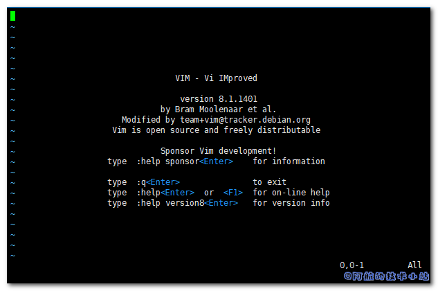

今天在尝试修改Docker容器内文件时, 发现容器内并没有vim命令, 返回了:

    `vim my.cnf bash: vim: command not found`

本篇文章就来记录下如何解决此问题.

## 解决方案

仍然在docker容器内部, 首先运行以下命令, 并耐心等待一会儿:

    `apt-get update`

完成后运行:

    `apt-get install vim`

等待安装完成后, 运行以下命令, 验证是否安装成功:

    `vim`

如果返回了类似以下界面则证明vim安装成功:

<figure>

<figcaption>

VIM安装成功返回

</figcaption>

</figure>

\[epcl\_box type="success"\]成功搞定. 继续你的文本编辑操作吧!\[/epcl\_box\]
