可以看到, 目前最主流的手机游戏都使用屏上手柄/摇杆进行控制, 比如:

\[caption id="attachment\_1286" align="aligncenter" width="700"\]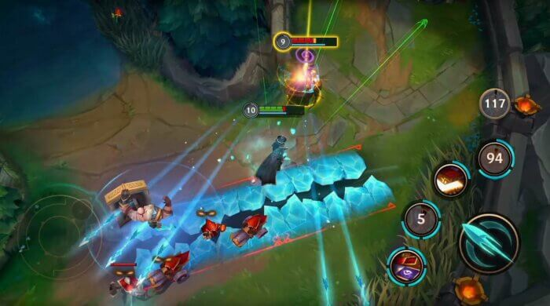 League of Legends Mobile (英雄联盟手游)\[/caption\]

\[caption id="attachment\_1284" align="aligncenter" width="700"\]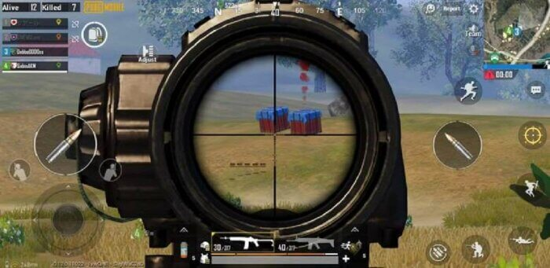 PUBG Mobile (和平精英)\[/caption\]

\[caption id="attachment\_1288" align="aligncenter" width="700"\]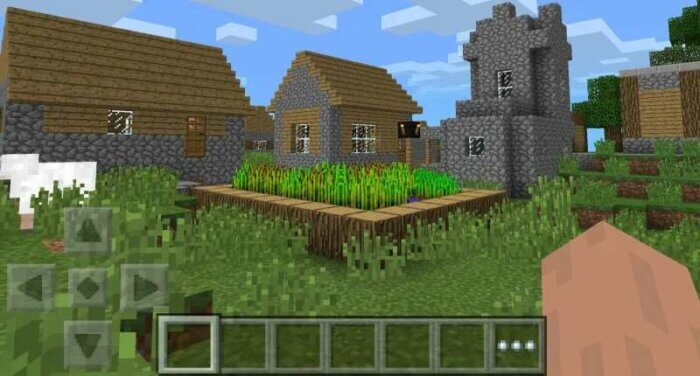 Minecraft PE(我的世界手机版)\[/caption\]

以上游戏都在当前手游榜(2020.04)排名前五.

\[epcl\_box type="information"\]看得出来, 目前的核心玩法、操作交互都离不开手柄/摇杆!\[/epcl\_box\]

所以, 本篇文章就来教大家在使用Flame框架时, 在屏幕上展示摇杆, 并控制某些component!

我们要做的项目名称为**Lame Tank 360**(Lame坦克360).

本项目将完整支持360°的旋转. 并将坦克的"炮塔"与"坦克身体"分开. 因此, 我们必须建立两个摇杆.

## 需具备的条件

若想顺利学习本篇教程, 你需要具备:

1. 掌握Flutter的基础用法.
2. 已完整学习Flame系列教程.

\[epcl\_box type="notice"\]如果你没有满足上述条件, 你将无法顺利完成这篇教程. 建议先阅读[《Flutter游戏开发-Flame教程》](https://www.bugcatt.com/archives/279)!\[/epcl\_box\]

## 开始

### 创建Flutter项目

```shell
flutter create lame_tank_360
```

\[epcl\_box type="information"\]阿航的教程, 只要涉及到创建项目、命名的相关操作, 身为读者的你可以用阿航教程提供的, 你也可以自己起名! 别忘了替换代码中牵扯的名称为你自己的!\[/epcl\_box\]

### 初始化项目设置

现在项目是可以运行的, 但是只是Flutter默认生成的

清空`./lib/main.dart`, 并添加以下内容:

```dart
import 'package:flutter/material.dart';
import 'package:flutter/services.dart';

Future main() async {

  WidgetsFlutterBinding.ensureInitialized();

  // 设置屏幕方向(设置屏幕方向为横向)
  await SystemChrome.setPreferredOrientations([
    DeviceOrientation.landscapeLeft,
    DeviceOrientation.landscapeRight,
  ]);

  // 禁止所有UI层(设置全屏)
  await SystemChrome.setEnabledSystemUIOverlays([]);
}
```

> 💡 代码解析: 删除了初始的其他内容, 导入所需的库, 将`main()`转为`async`, 将APP锁定为横向, 最后, 隐藏所有UI叠加层, APP因此变为全屏显示.

因为本教程不会通过测试驱动开发, 所以你同样要删除`./test`目录.

让我们为游戏准备所需的Widget树. Widget树将会由一个`Stack`组成, 其子级是游戏的各层.

这些层分别是:

1. 游戏本身(绘制草坪、坦克和子弹的区域)
2. UI层(绘制游戏手柄以及按钮)

当然, 游戏层会在UI层下面.

为此, 在将APP设置为全屏的代码下面添加以下代码块:

```dart
// 运行APP
runApp(
  Directionality(
    textDirection: TextDirection.ltr,
    child: Stack(
      children: [
        // 为游戏提供占位符
        Container(
          color: Color(0xff27ae60),
        ),
        // 摇杆层
        Container(),
      ],
    ),
  ),
);
```

> 💡 快速解析: 某些功能(例如`Stack`)需要确定方向, 这就是为什么我们必须在其中以**LTR**(从左至右)的方向对其定义的原因. `Stack`的子级的渲染顺序与列表中定义的顺序一致, 因此, 游戏将先被渲染, 然后渲染`joypad`进行覆盖, 使其渲染到游戏的顶部.

### 创建joypad(摇杆)小部件

由于我们将使用两个摇杆, 一个用于坦克主体, 另一个用于炮塔, 因此我们将创建一个可重复使用的`widget`. widget通常是其他小部件的集合, 但有时它具有一个自定义的绘制工具, 可以进行widget的实时渲染.

#### 创建新的widget类

下面即将提供`Joypad`widget的代码. 通常我**不鼓励盲目的复制粘贴网上的代码**, 最好阅读并理解其内容并手动打进项目中, 并在需要的时候进行修改.

**但是...**

由于Flutter Widget的格式就很大, 因此将以下代码放入`./lib/widgets/joypad.dart`, 我会在代码下面进行解释:

```dart
import 'dart:math';
import 'package:flutter/material.dart';

class Joypad extends StatefulWidget {
  final void Function(Offset) onChange;

  const Joypad({
    Key key,
    @required this.onChange,
  }) : super(key: key);

  JoypadState createState() => JoypadState();
}

class JoypadState extends State<Joypad> {
  Offset delta = Offset.zero;

  void updateDelta(Offset newDelta) {
    widget.onChange(newDelta);
    setState(() {
      delta = newDelta;
    });
  }

  void calculateDelta(Offset offset) {
    Offset newDelta = offset - Offset(60, 60);
    updateDelta(
      Offset.fromDirection(
        newDelta.direction,
        min(30, newDelta.distance),
      ),
    );
  }

  Widget build(BuildContext context) {
    return SizedBox(
      height: 120,
      width: 120,
      child: Container(
        decoration: BoxDecoration(
          borderRadius: BorderRadius.circular(60),
        ),
        child: GestureDetector(
          child: Container(
            decoration: BoxDecoration(
              color: Color(0x88ffffff),
              borderRadius: BorderRadius.circular(60),
            ),
            child: Center(
              child: Transform.translate(
                offset: delta,
                child: SizedBox(
                  height: 60,
                  width: 60,
                  child: Container(
                    decoration: BoxDecoration(
                      color: Color(0xccffffff),
                      borderRadius: BorderRadius.circular(30),
                    ),
                  ),
                ),
              ),
            ),
          ),
          onPanDown: onDragDown,
          onPanUpdate: onDragUpdate,
          onPanEnd: onDragEnd,
        ),
      ),
    );
  }

  void onDragDown(DragDownDetails d) {
    calculateDelta(d.localPosition);
  }

  void onDragUpdate(DragUpdateDetails d) {
    calculateDelta(d.localPosition);
  }

  void onDragEnd(DragEndDetails d) {
    updateDelta(Offset.zero);
  }
}
```

💡 代码解析:

- Flutter widget有两种类型, 分别是`StatelessWidgets`和`StatefulWidgets`.Stateless是简单的widget, 不管理动态数据. 它们通常一生都不会改变. 另一边, Stateful widget可以是动态的, 并且它们的外观、位置和其他属性取决于可能更改的数据.
- 我们正在使用`StatefulWidget`作为摇杆. `StatefulWidget`由widget和State(状态)组成.
- 创建时, 我们需要一个函数作为`onChange`的参数. 传递的函数本身必须接收`Offset`, 这样可以知道widget的当前增量.
- `build`函数中包含包含摇杆本身的完整布局.
- 在`build`函数内部, 有一个`GestureDetector`可以侦听三个事件(向下拖动, 拖动更新, 结束拖动).
- 向下拖动(玩家触摸摇杆的那一刻)和拖动更新(按下手指的每次移动)时, 增量将在`calculateDelta()`中重新计算. 然后将计算出的增加传递给`updateDelta()`.
- 在`updateDelta()`内部, 调用`onChange`内部的函数将新的(更新的)delta传递给它. 然后, 函数调用`setState`, 它触发Flutter再次调用这个widget的`build`函数, 有效的更新了`joypad`的外观.

\[epcl\_box type="information"\]如果你对此widget有任何疑问, 欢迎在下方评论区讨论! 或者加入[我的Flame交流群(QQ)](https://jq.qq.com/?_wv=1027&k=5ETLFm3).\[/epcl\_box\]

#### 在game中添加摇杆

现在我们有了一个摇杆widget, 让我们来为game构建UI层.

我们的目标:

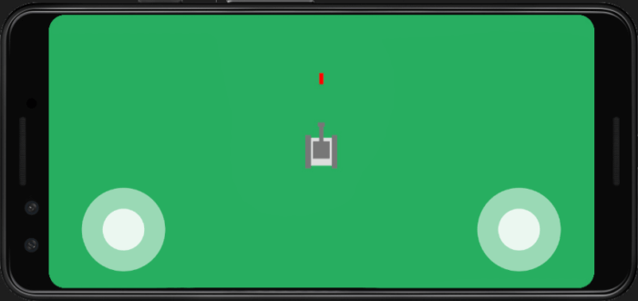

返回`./lib/main.dart`. 第一步就是要导入Joypad的widget:

```dart
import 'package:lame_tank_360/widgets/joypad.dart';
```

然后找到UI层:

```dart
// 摇杆层
Container(),
```

替换为:

```dart
// 摇杆层
Column(
  children: [
    Spacer(),
    Row(
      children: [
        SizedBox(width: 48),
        Joypad(
          onChange: (Offset delta) => print(delta),
        ),
        Spacer(),
        Joypad(
          onChange: (Offset delta) => print(delta),
        ),
        SizedBox(width: 48),
      ],
    ),
    SizedBox(height: 24),
  ],
),
```

\[epcl\_box type="notice"\]你现在应该熟悉`Column`和`Row`的widget了. 如果没有, 建议先去看看[《Flutter官方文档 - 布局》](https://flutterchina.club/widgets/layout/)\[/epcl\_box\]

\[epcl\_box type="information"\]目前为止, 我们只是在`delta`中打印每次在摇杆中变更的值. 我们稍后会将其链接至game\[/epcl\_box\]

### 360° 坦克

是时候将APP转化为游戏了! 和往常一样, 我们将会使用Flame游戏开发引擎.

#### 安装Flame

你可以在pub上找到Flame, 并且可以直接在`./pubspec.yaml`的`dependencies:`选项下方引入:

```yaml
  flame: ^0.16.0
```

\[epcl\_box type="notice"\]一定要注意缩进(**在**`flame`**前的两个空格**), 并且确定把它放在正确的位置(在`dependencies`内)\[/epcl\_box\]

运行IDE自带的\`Packages get\`或在终端中输入:

```shell
flutter pub get
```

下一步, 我们来创建包含game loop的game类. 创建文件`./lib/lame-tank-360.dart`并录入以下代码:

```dart

import 'dart:ui';
import 'package:flame/game.dart';

class LameTank360 extends Game {
  Size screenSize;

  @override
  void render(Canvas c) {}

  @override
  void update(double t) {}

  @override
  void resize(Size size) {}
}
```

> 💡 代码解析: 这仅是一个相当简单的game类文件, 继承自Flame的`Game`类. Flame已经替我们处理了所有的运行游戏所需的核心代码🤭🤭🤭

我们需要写代码来填充这些功能(`resize`, `update`以及`render`)用以扩展game类. 从`resize`开始:

```dart
@override
void resize(Size size) {
  screenSize = size;
}
```

上面的代码虽然非常简单, 但我也想跟大家解释下为何要这么做. 现在某些手机支持动态分辨率. 用户可以变更(降低)分辨率以节约电量, 也可以提高分辨率增加清晰度(看高清视频和玩高清游戏).

所以当玩家在玩游戏时, 分辨率可能会改变.

由于Flutter使用逻辑像素, 因此应用的分辨率在这种情况下会发生变化. 逻辑像素由Flutter计算得出, 因此无论物理尺寸和分辨率如何变化, 所以设备中的200个逻辑像素的大小始终相同.

向侧面旋转手机时, 也可能触发`resize`函数, 并且你的游戏同时允许纵向和横向(Lame Tank 360不允许).

在继续并实际渲染游戏画布上的内容之前, 让我们确保`update`和`render`只有在游戏至少从Flutter收到一次尺寸后才会运行.

将以下代码块**同时放入`update`和`render`**中:

```dart
if (screenSize == null) {
  // 如果screenSize为null, 直接结束执行即可.
  return; 
}
```

当前的`lame-tank-360.dart`文件的全部代码:

```dart
import 'dart:ui';
import 'package:flame/game.dart';

class LameTank360 extends Game {
  Size screenSize;

  @override
  void render(Canvas c) {
    if (screenSize == null) {
      // 如果screenSize为null, 直接结束执行即可.
      return;
    }
  }

  @override
  void update(double t) {
    if (screenSize == null) {
      // 如果screenSize为null, 直接结束执行即可.
      return;
    }
  }

  @override
  void resize(Size size) {
    screenSize = size;
  }
}
```

#### 添加game类至Flutter的widget树

为了确保在渲染APP时Flutter包含我们的game类, 我们创建实例并放入widget树中.

打开`./lib/main.dart`, 导入:

```dart
import 'package:lame_tank_360/lame-tank-360.dart';
```

紧接着创建一个game类实例. 只需放在调用`runApp`上方.

```dart
  // 先初始化game
  final LameTank360 game = LameTank360();
```

下一步只需要将`game`的.`widget`参数放入widget树即可. 我们可以通过替换以下代码:

```dart
// 为游戏提供占位符
Container(
  color: Color(0xff27ae60),
),
```

为:

```dart
// 为游戏提供占位符
game.widget,
```

现在, 我们准备继续开发game类.

#### 草坪

如果你现在运行游戏, 你应该会看到:

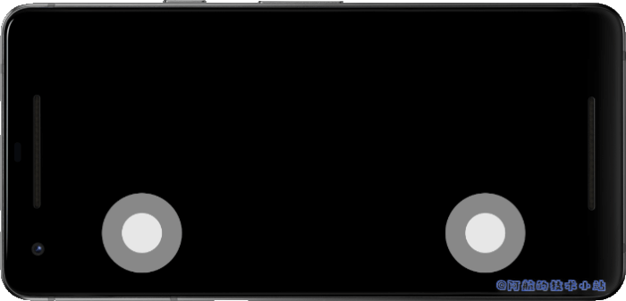

游戏是空的, 所以渲染出来的是黑色的. 让我们通过添加"草坪"来解决此问题. 为此, 我们将绘制一个与屏幕一般大的绿色矩形.

返回`./lib/lame-tank-360.dart`, 在`render`函数内部, 在判断`screenSize`是否为`null`以后, 放入以下代码块:

```dart
// 绘制草坪
c.drawRect(
  Rect.fromLTWH(
    0,
    0,
    screenSize.width,
    screenSize.height,
  ),
  Paint()..color = Color(0xff27ae60),
);
```

> 💡 代码解析: 这将绘制一个绿色(`#27ae60`)矩形, 该矩形始于屏幕左上角(`0,0`), 并且与屏幕等高、等宽.

现在运行游戏, 你会发现绿色草坪:


#### 坦克

让我们继续绘制坦克. 我们将其分离为单独的类.

创建文件`./lib/components/tank.dart`, 并录入以下代码:

```dart
import 'dart:ui';
import 'package:lame_tank_360/lame-tank-360.dart';

class Tank {
  final LameTank360 game;
  Offset position = Offset.zero;
  double bodyAngle = 0;
  double turretAngle = 0;

  Tank(this.game, {this.position});

  void render(Canvas c) {}

  void update(double t) {}
}
```

> 💡 代码解析: 仍然是一个基本的游戏component类, 其中包含了空的函数, 当然我们会尽快填充这些函数. 变量`position`将是坦克主体和炮塔的中心. `bodyAngle`和`turretAngle`分别是坦克主体和炮塔的当前方向.

下一步来绘制坦克. 在`render`函数内部添加代码:

```dart
// 准备Paint对象
Paint lightPaint = Paint()..color = Color(0xffdddddd);
Paint darkPaint = Paint()..color = Color(0xff777777);

// 将canvas的原点设置在坦克的坐标上
c.save();
c.translate(position.dx, position.dy);

// 绘制坦克主体
c.drawRect(
  Rect.fromLTWH(-20, -15, 40, 30),
  lightPaint,
);

// 绘制轮子
c.drawRect(
  Rect.fromLTWH(-24, -23, 48, 8),
  darkPaint,
);
c.drawRect(
  Rect.fromLTWH(-24, 15, 48, 8),
  darkPaint,
);

// 绘制炮塔
c.drawRect(
  Rect.fromLTWH(-10, -12, 25, 24),
  darkPaint,
);
c.drawRect(
  Rect.fromLTWH(0, -3, 36, 6),
  darkPaint,
);
c.drawRect(
  Rect.fromLTWH(36, -5, 6, 10),
  darkPaint,
);

c.restore();
```

> 💡 代码解析: 首先准备两种颜色的`Paint`对象, 并在下面绘制若干矩形来组成一个"坦克".

最终, 创建tank实例并添加进入`game`类中. 返回`./lib/lame-tank-360.dart`, 导入tank:

```dart
import 'package:lame_tank_360/components/tank.dart';
```

添加tank实例:

```dart
Tank tank;
```

然后在`resize`中进行判断, 若未进行过初始化, 则初始化一个实例:

```dart
if (tank == null) {
  tank = Tank(
    this,
    position: Offset(
      screenSize.width / 2,
      screenSize.height / 2,
    ),
  );
}
```

> 💡 代码解析: 判断`tank`是否为`null`可确保此代码块仅执行一次. 创建`Tank`类的新实例赋值给`tank`变量. 若手机(或APP)的分辨率再次变更, 则会再次调用`resize`函数, 因为经过判断, 所以不会创建新的tank.

最终, 通过从game类自己的`render()`中调用tank的`render()`来确保tank已被渲染.

```dart
// 绘制坦克
tank.render(c);
```

> 💡 代码解析: 渲染将会按照代码顺序执行. 因此, 请确保在调用草坪的`render`下面添加上面的代码块. 如果顺序出错, 草坪将覆盖坦克, 使我们看不到!

\[epcl\_box type="success"\]现在运行代码, 屏幕应该是这样的:\[/epcl\_box\]

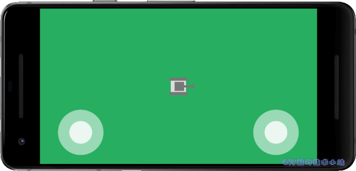

### 绑定旋转

现在到了比较有趣的环节, 让我们将左边的摇杆与坦克进行绑定. 换句话说, 我们使坦克对左摇杆产生回应. 打开`./lib/components/tank.dart`.

我们需要访问`pi`(数学中的`π`)常量和一些数学计算操作, 所以我们先导入:

```dart
import 'dart:math';
```

然后在绘制tank之前, 我们需要根据坦克主体的预估角度来旋转canvas, 通过以下代码完成:

\[epcl\_box type="notice"\]记住要在坦克主体渲染前旋转canvas !\[/epcl\_box\]

我们不仅要立即根据摇杆的角度更改`bodyAngle`, 还要做到使坦克以固定的速率向摇杆的角度转动.

为此, 我们需要一个变量来保存目标的角度值, 坦克将会尝试转向该角度.

我们将此变量命名为`targetBodyAngle`, 把它放在其他实例变量旁边:

```dart
double targetBodyAngle;
```

\[epcl\_box type="notice"\]要记得, 任何未经初始化的实例变量的值都为null哦\[/epcl\_box\]

下一步, 我们来编写代码时坦克主体角度转向目标角度. 更新`update`函数为:

```dart
void update(double t) {
  final double rotationRate = pi * t;

  if (targetBodyAngle != null) {
    if (bodyAngle < targetBodyAngle) { if ((targetBodyAngle - bodyAngle).abs() > pi) {
        bodyAngle = bodyAngle - rotationRate;
        if (bodyAngle < -pi) { bodyAngle += pi * 2; } } else { bodyAngle = bodyAngle + rotationRate; if (bodyAngle > targetBodyAngle) {
          bodyAngle = targetBodyAngle;
        }
      }
    }
    if (bodyAngle > targetBodyAngle) {
      if ((targetBodyAngle - bodyAngle).abs() > pi) {
        bodyAngle = bodyAngle + rotationRate;
        if (bodyAngle > pi) {
          bodyAngle -= pi * 2;
        }
      } else {
        bodyAngle = bodyAngle - rotationRate;
        if (bodyAngle < targetBodyAngle) {
          bodyAngle = targetBodyAngle;
        }
      }
    }
  }
}
```

> 💡 代码解析: 这一块的代码量比较多. 首先, 我们声明一个`rotationRate`常量, 其值`pi`乘以当前时间增量(`t`). 然后根据当前`bodyAngle`和`targetBodyAngle`之间的关系, 我们减去或添加一个`rotaionRate`的值

\[epcl\_box type="information"\]因为目前我还没有想出上面的代码如何更简约的写出. 所以目前先使用上述代码, 如果对此有疑问, 欢迎讨论.\[/epcl\_box\]

回到 `./lib/lame-tank-360.dart`, 在`update()`内部, 保证tank的`update`函数已被调用. 在判断`screenSize`是否为`null`下方添加代码:

```dart
tank.update(t);
```

创建一个新的函数, 用作摇杆值变更的处理器.

```dart
void onLeftJoypadChange(Offset offset) {
  if (offset == Offset.zero) {
    tank.targetBodyAngle = null;
  } else {
    tank.targetBodyAngle = offset.direction;
  }
}
```

最终, 在 `./lib/main.dart`中替换左边的摇杆处理器:

```dart
Joypad(
  onChange: (Offset delta) => print(delta),
),
```

为:

```
Joypad(
  onChange: game.onLeftJoypadChange,
),
```

> 这样一来, 每次`onChange`在摇杆上触发时, 也会调用`onLeftJoypadChange`处理器, 并将摇杆的`OffSet`传递给它.

\[epcl\_box type="success"\]如果上面的代码没有问题, 运行项目, 查看类似如下的效果!\[/epcl\_box\]

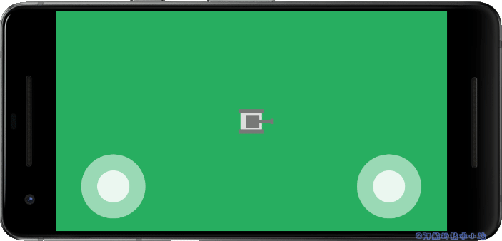

#### 炮台独立旋转

接下来是右侧的摇杆. 我们需要将其变化绑定至炮台上, 使其与坦克主体分开旋转.

回到`./lib/components/tank.dart`中, 我们需要一个炮台的目标角度, 炮台要"追赶"这个目标角度. 所以我们先添加这个实例变量:

```dart
double targetTurretAngle;
```

接下来, 修改`update`函数, 并根据目标角度计算炮台角度, 同时考虑坦克主体的角度. 在计算主体角度下面编写以下代码:

```dart
if (targetTurretAngle != null) {
  double localTargetTurretAngle = targetTurretAngle - bodyAngle;
  if (turretAngle < localTargetTurretAngle) {
    if ((localTargetTurretAngle - turretAngle).abs() > pi) {
      turretAngle = turretAngle - rotationRate;
      if (turretAngle < -pi) {
        turretAngle += pi * 2;
      }
    } else {
      turretAngle = turretAngle + rotationRate;
      if (turretAngle > localTargetTurretAngle) {
        turretAngle = localTargetTurretAngle;
      }
    }
  }
  if (turretAngle > localTargetTurretAngle) {
    if ((localTargetTurretAngle - turretAngle).abs() > pi) {
      turretAngle = turretAngle + rotationRate;
      if (turretAngle > pi) {
        turretAngle -= pi * 2;
      }
    } else {
      turretAngle = turretAngle - rotationRate;
      if (turretAngle < localTargetTurretAngle) {
        turretAngle = localTargetTurretAngle;
      }
    }
  }
}
```

> 💡 代码解析: 几乎与"计算坦克主体角度"部分完全一样, 但是它在处理角度之前, 会先从目标角度先减去坦克主体角度. 这个差值就成为了炮台即将追赶的目标角度. 在渲染期间, 这两个旋转最终会被添加进来，给炮塔一个合适的角度。

然后, 确保渲染炮台时将其旋转到适当的角度. 在绘制坦克的"车轮"下面, 添加以下代码:

```
// 旋转炮台
c.rotate(turretAngle);
```

> 此旋转应用于坦克主体旋转的顶部, 所以是加法.

之后, 跳转到game类(`./lib/lame-tank-360.dart`)并为右侧摇杆添加此函数:

```
void onRightJoypadChange(Offset offset) {
  if (offset == Offset.zero) {
    tank.targetTurretAngle = null;
  } else {
    tank.targetTurretAngle = offset.direction;
  }
}
```

最终, 替换`./lib/main.dart`中右侧游戏手柄的`onChange`属性的值, 修改:

```
Joypad(
  onChange: (Offset delta) => print(delta),
),
```

为:

```
Joypad(
  onChange: game.onRightJoypadChange,
),
```

\[epcl\_box type="success"\]现在运行项目, 应该可以类似这样的效果:\[/epcl\_box\]

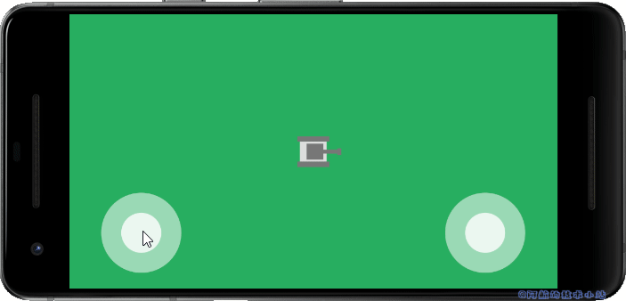

只是原地转圈太无聊了, **我们想让它动起来!**

返回`./lib/components/tank.dart`, `update()`内, 在判断`targetBodyAngle`是否不为`null`的内部添加:

```
if (bodyAngle == targetBodyAngle) {
  position = position + Offset.fromDirection(bodyAngle, 100 * t);
} else {
  position = position + Offset.fromDirection(bodyAngle, 50 * t);
}
```

> 💡 代码解析: 坦克在旋转时应该移动的较慢(`50`个逻辑像素), 直线运动时为正常速度(`100`个逻辑像素). 这就是`if`判断的意义所在.

\[epcl\_box type="success"\]运行项目, 查看效果! 现在应该可以看到坦克的移动啦!\[/epcl\_box\]

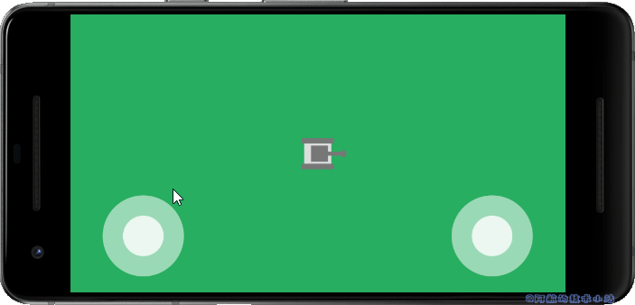

\[epcl\_box type="information"\]挑战一: 如果你愿意, 可以接受这个挑战. 与其保持恒定的移速, 不如尝试加速度. 从0开始, 逐渐增加速度到最大速度!\[/epcl\_box\]

\[epcl\_box type="notice"\]挑战二: 如果你进行了加速, 何不试试减速呢?\[/epcl\_box\]

### 按钮和子弹

坦克怎能不会开炮? 让我们来让这个坦克从炮筒内发射炮弹.

我们将添加两个按钮, 每个按钮都在摇杆上方. 这样是为了方便玩家, 可使用任意的拇指进行开炮.

#### 按钮widget

由于我们将使用两个外观和功能相同的按钮, 我们来创建单独的widget来复用, 以多次使用, 减少重复代码.

创建文件`./lib/widgets/button.dart`, 输入以下内容:

```
import 'package:flutter/material.dart';

class Button extends StatelessWidget {
  final void Function() onTap;

  const Button({
    Key key,
    @required this.onTap,
  }) : super(key: key);

  @override
  Widget build(BuildContext context) {
    return SizedBox(
      height: 64,
      width: 64,
      child: Container(
        decoration: BoxDecoration(
          borderRadius: BorderRadius.circular(32),
        ),
        child: GestureDetector(
          child: Container(
            decoration: BoxDecoration(
              color: Color(0x88ffffff),
              borderRadius: BorderRadius.circular(32),
            ),
          ),
          onTap: onTap,
        ),
      ),
    );
  }
}
```

> 💡 代码解析: 它只是一个圆形白色半透明的`Container`, 放在一个`GestureDetector`(手势检测器)中, 形状是圆形的(受另一个圆形`Container`的限制). 在其构造函数中, `onTap`属性是必选的参数, 并且需要传入一个函数. 这个函数在被点击时由`GestureDetector`进行调用.

#### 将按钮添加至UI层

我们跳转到`./lib/lame-tank-360.dart`添加一个点击按钮的处理器, 先定义, 等下我们来填充函数:

```
void onButtonTap() {}
```

最后我们打开`./lib/main.dart`, 先导入:

```
import 'package:lame_tank_360/widgets/button.dart';
```

将这些按钮添加至布局内, 在摇杆层添加以下代码块. 将它们放在包含`Joypads`的`Row`上的`Column`层上.

```
Row(
  children: [
    SizedBox(width: 48),
    Button(
      onTap: game.onButtonTap,
    ),
    Spacer(),
    Button(
      onTap: game.onButtonTap,
    ),
    SizedBox(width: 48),
  ],
),
```

> 💡 代码解析: 和`Joypad`列类似, 左右两侧都有`SizedBox`作为分隔符, 而一个`Spacer`widget将充满它们之间的空间.

将以下行添加到按钮row和摇杆row之间:

```
SizedBox(height: 20),
```

整个摇杆层的代码:

```
// 摇杆层
          Column(
            children: [
              Spacer(),
              Row(
                children: [
                  SizedBox(width: 48),
                  Button(
                    onTap: game.onButtonTap,
                  ),
                  Spacer(),
                  Button(
                    onTap: game.onButtonTap,
                  ),
                  SizedBox(width: 48),
                ],
              ),
              SizedBox(height: 20),
              Row(
                children: [
                  SizedBox(width: 48),
                  Joypad(
                    onChange: game.onLeftJoypadChange,
                  ),
                  Spacer(),
                  Joypad(
                    onChange: game.onRightJoypadChange,
                  ),
                  SizedBox(width: 48),
                ],
              ),
              SizedBox(height: 24),
            ],
          ),
```

\[epcl\_box type="success"\]运行项目, 屏幕上应该像这样, 多了两个按钮:\[/epcl\_box\]

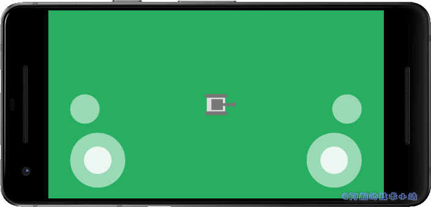

#### 子弹component

创建`./lib/components/bullet.dart`:

```
import 'dart:ui';
import 'package:lame_tank_360/lame-tank-360.dart';

class Bullet {
  final LameTank360 game;
  final double speed = 300;
  Offset position;
  double angle = 0;
  bool isOffscreen = false;

  Bullet(this.game, {this.position, this.angle});

  void render(Canvas c) {
  }

  void update(double t) {
  }
}
```

> 💡 代码解析: 我们再次创建了一个简单的component. `speed`使用`final`来修饰使其变为常量, 并将其用于移动子弹. 我们还跟踪子弹的位置和角度(两者均在创建时提供).

继续编写class, 让我们来编写`render()`的内容:

```
void render(Canvas c) {
  c.save();
  c.translate(position.dx, position.dy);

  // rotate the canvas
  c.rotate(angle);

  c.drawRect(
    Rect.fromLTWH(-10, -3, 16, 6),
    Paint()..color = Color(0xffff0000),
  );

  c.restore();
}
```

> 💡 代码解析: 首先以子弹的当前角度旋转canvas, 然后绘制红色Rect

然后编写`update()`:

```
void update(double t) {
  if (isOffscreen) {
    return;
  }

  position = position + Offset.fromDirection(angle, speed * t);
  if (position.dx < -50) {
    isOffscreen = true;
  }
  if (position.dx > game.screenSize.width + 50) {
    isOffscreen = true;
  }
  if (position.dy < -50) {
    isOffscreen = true;
  }
  if (position.dy > game.screenSize.height + 50) {
    isOffscreen = true;
  }
}
```

> 💡 代码解析: 我们通过添加`Offset`(偏移量)来更新子弹的位置, 该偏移量是通过`speed`常量乘以时间增量(`t`)在给定角度下产生的, 用以确保无论FPS是多少, 子弹一直以恒等速度进行移动. 然后我们检查子弹是否从屏幕的四个边界超出50像素. 如果是, 则将其标记为"屏幕外"(`isOffscreen = true;`)

最终, 整个子弹component:

```
import 'dart:ui';
import 'package:lame_tank_360/lame-tank-360.dart';

class Bullet {
  final LameTank360 game;
  final double speed = 300;
  Offset position;
  double angle = 0;
  bool isOffscreen = false;

  Bullet(this.game, {this.position, this.angle});

  void render(Canvas c) {
    c.save();
    c.translate(position.dx, position.dy);

    // rotate the canvas
    c.rotate(angle);

    c.drawRect(
      Rect.fromLTWH(-10, -3, 16, 6),
      Paint()..color = Color(0xffff0000),
    );

    c.restore();
  }

  void update(double t) {
    if (isOffscreen) {
      return;
    }

    position = position + Offset.fromDirection(angle, speed * t);
    if (position.dx < -50) {
      isOffscreen = true;
    }
    if (position.dx > game.screenSize.width + 50) {
      isOffscreen = true;
    }
    if (position.dy < -50) {
      isOffscreen = true;
    }
    if (position.dy > game.screenSize.height + 50) {
      isOffscreen = true;
    }
  }
}
```

### 发射子弹

这些按钮已经和game的`onTapHandler`进行关联, 因此我们只需编写添加子弹的代码即可.

首先我们需要在tank类中使用两个辅助功能, 以获取从坦克炮塔中射出的子弹的位置及方向.

打开`./lib/components/tank.dart`, 添加:

```
Offset getBulletOffset() {
  return position +
      Offset.fromDirection(
        getBulletAngle(),
        36,
      );
}

double getBulletAngle() {
  double bulletAngle = bodyAngle + turretAngle;
  while (bulletAngle > pi) {
    bulletAngle -= pi * 2;
  }
  while (bulletAngle < -pi) {
    bulletAngle += pi * 2;
  }
  return bulletAngle;
}
```

> 💡 代码解析: `getBulletOffset()`返回坦克的位置以及炮塔的角度和长度创建的新`Offset`. 子弹的角度就是坦克主体角度和炮塔角度的总和. 两个`while`循环以确保这个角度不超过`pi`或不低于负`pi`.

然后, 返回`./lib/lame-tank-360.dart`. 在任何给定的点, 可能会有多个子弹飞来飞去, 为了保存它们, 我们将创建`List`, 专门用于保存这些`Bullet`.

首先导入子弹:

```
import 'package:lame_tank_360/components/bullet.dart';
```

然后添加一个保存子弹集合的实例变量:

```
List<Bullet> bullets;
```

在`resize`函数中, 我们要确保list已被初始化. 在tank初始化下方添加:

```
if (bullets == null) {
  bullets = List();
}
```

然后我们需要确保bullets随game类一起更新. 在`update()`底部添加代码:

```
// 让子弹飞
    bullets.forEach((Bullet b) {
      b.update(t);
    });

    // 移除飞出屏幕的子弹
    bullets.removeWhere((Bullet b) {
      return b.isOffscreen;
    });
```

> 💡 代码解析: 第一个块循环list中所有现有子弹并进行更新. 第二个块用于移除飞出屏幕的子弹.

我们还要确保子弹被绘制完成. 在`render()`中添加:

```
// 绘制子弹
    bullets.forEach((Bullet b) {
      b.render(c);
    });
```

现在剩下的就是创建一个新的子弹并在每次触发该按钮的点击处理器时将其添加至list中. 修改`onButtonTap`处理器, 如下:

```
void onButtonTap() {
  bullets.add(
    Bullet(
      this,
      position: tank.getBulletOffset(),
      angle: tank.getBulletAngle(),
    ),
  );
}
```

\[epcl\_box type="success"\]如果上面的步骤没有问题, 运行游戏, 应该可以发射子弹了:\[/epcl\_box\]

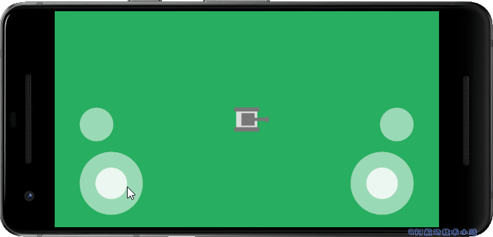

## 源码下载

**👉在[Github](https://github.com/HarrisonQi/flame-tutorial-joypad-lame-tank-360)或[码云](https://gitee.com/HarrisonQI/flame-tutorial-joypad-lame-tan-360)上查看全部代码.**

## 感谢

- [《On-screen joystick/joypad game controller with Flame》 - JapAlekhin](https://jap.alekhin.io/onscreen-joystick-joypad-controller-flame-game)
- [WallHaven](https://wallhaven.cc/)上[ezhik](https://wallhaven.cc/user/ezhik)提供的图片

## 结语

通过创建摇杆, 你应该可以做出更多可玩性较好的游戏了!
