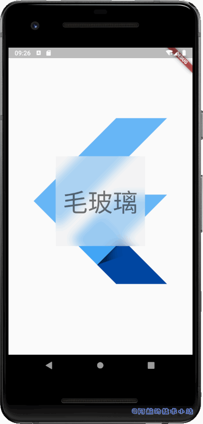
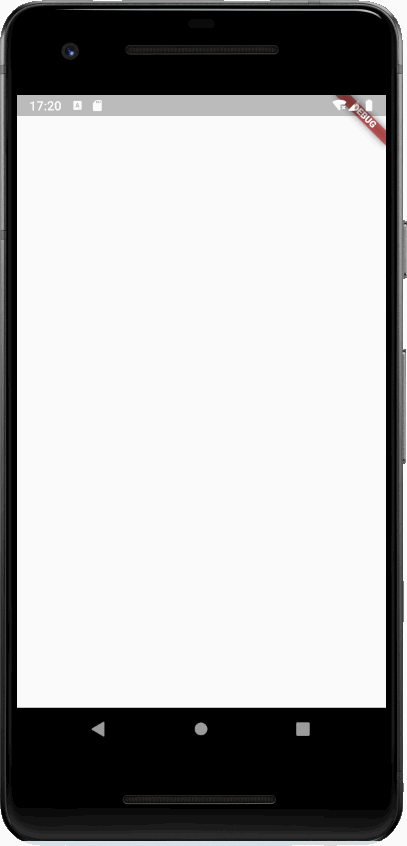
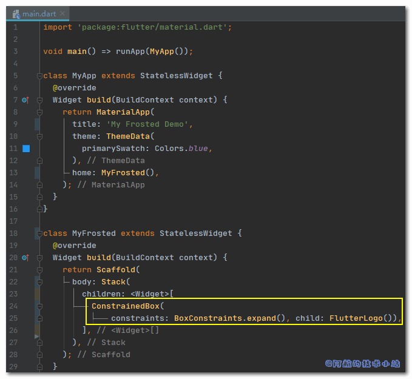
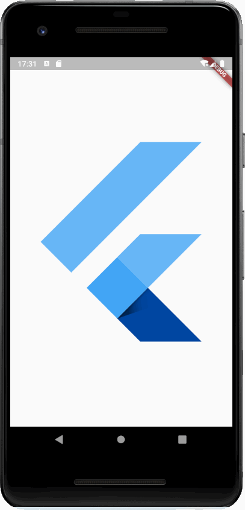
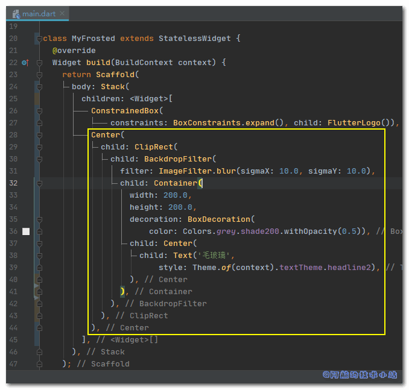

还记得之前风靡一时的Windows 7的毛玻璃效果吗? 虽然过去了好多年, 但毛玻璃效果一直没有过时👨‍🎓. 本篇文章就来记录下如何使用Flutter实现毛玻璃/磨砂效果.

## 效果

有图有真相, 先来看下我们要实现的最终效果:



## 环境&需具备的条件

本篇文章的开发环境:

<table class=""><tbody><tr><td>操作系统</td><td>Windows 10.0.18362.836</td></tr><tr><td>Flutter</td><td>1.19.0-2.0.pre</td></tr></tbody></table>

若想顺利阅读本篇教程, 你需要具备:

- 计算机已安装Flutter开发环境
- 掌握Flutter基础

## 实战开始

### 创建项目, 清理代码

先来创建一个空项目, 直接用IDE创建或在终端中输入:

```
flutter create my_frosted
```

删除`./test`目录. 并替换`./lib/main.dart`为:

```
import 'package:flutter/material.dart';

void main() => runApp(MyApp());

class MyApp extends StatelessWidget {
  @override
  Widget build(BuildContext context) {
    return MaterialApp(
      title: 'My Frosted Demo',
      theme: ThemeData(
        primarySwatch: Colors.blue,
      ),
      home: MyFrosted(),
    );
  }
}

class MyFrosted extends StatelessWidget {
  @override
  Widget build(BuildContext context) {
    return Scaffold(
      body: Stack(
        children: [],
      ),
    );
  }
}
```

🟢 运行项目, 可以看到白白的一片, 啥也没有:



\[epcl\_box type="information"\]空白是因为我们Stack里啥也没写!\[/epcl\_box\]

至此, 准备工作已经完成了.

### 绘制背景

为了展示我们的毛玻璃效果, 我们需要先渲染一个背景图. 为此, 在`Stack`的`children`中添加:

```
ConstrainedBox(
    constraints: BoxConstraints.expand(),
    child: FlutterLogo()),
```

代码截图:



> 我们在这里添加一个`ConstrainedBox`(该Widget可约束其child), 在其中添加一个Flutter的Logo图片.
> 
> 💡 代码解析

🟢 运行项目, 效果应该是这样:



可以看到, 我们渲染了一张较大的Flutter的Logo图像.

**重点来了!** 我们在`./lib/main.dart`顶部导入:

```
import 'dart:ui';
```

我们在`ConstrainedBox`下方添加:

```
Center(
  child: ClipRect(
    child: BackdropFilter(
      filter: ImageFilter.blur(sigmaX: 10.0, sigmaY: 10.0),
      child: Container(
        width: 200.0,
        height: 200.0,
        decoration: BoxDecoration(
            color: Colors.grey.shade200.withOpacity(0.5)
        ),
        child: Center(
          child: Text(
              '毛玻璃',
              style: Theme.of(context).textTheme.headline2
          ),
        ),
      ),
    ),
  ),
),
```

代码截图:



💡 代码解析: 我们使用一个表格来解释各个组件:

| Widget | 解释 |
| --- | --- |
| ClipRect | 限制模糊范围 |
| BackdropFilter | 设置高斯模糊 |
| Container | 设置毛玻璃尺寸大小 |
| BoxDecoration | 设置透明度 |

\[epcl\_box type="information"\]阿航在这里提供的是阿航认为比较合适的数值. 你可以按需对其进行调整.\[/epcl\_box\]

🟢 运行项目, 查看效果:


\[epcl\_box type="success"\]至此, 我们已经成功的生成了毛玻璃效果!\[/epcl\_box\]

## 核心代码/全部源码

\[epcl\_tabs\] \[epcl\_tab title="Core"\]

```
Stack(
  children: [
    ConstrainedBox(
        constraints: BoxConstraints.expand(), child: FlutterLogo()),
    Center(
      child: ClipRect(
        child: BackdropFilter(
          filter: ImageFilter.blur(sigmaX: 10.0, sigmaY: 10.0),
          child: Container(
            width: 200.0,
            height: 200.0,
            decoration: BoxDecoration(
                color: Colors.grey.shade200.withOpacity(0.5)),
            child: Center(
              child: Text('毛玻璃',
                  style: Theme.of(context).textTheme.headline2),
            ),
          ),
        ),
      ),
    ),
  ],
),
```

\[/epcl\_tab\]

\[epcl\_tab title="All"\]

```
import 'dart:ui';

import 'package:flutter/material.dart';

void main() => runApp(MyApp());

class MyApp extends StatelessWidget {
  @override
  Widget build(BuildContext context) {
    return MaterialApp(
      title: 'My Frosted Demo',
      theme: ThemeData(
        primarySwatch: Colors.blue,
      ),
      home: MyFrosted(),
    );
  }
}

class MyFrosted extends StatelessWidget {
  @override
  Widget build(BuildContext context) {
    return Scaffold(
      body: Stack(
        children: [
          ConstrainedBox(
              constraints: BoxConstraints.expand(), child: FlutterLogo()),
          Center(
            child: ClipRect(
              child: BackdropFilter(
                filter: ImageFilter.blur(sigmaX: 10.0, sigmaY: 10.0),
                child: Container(
                  width: 200.0,
                  height: 200.0,
                  decoration: BoxDecoration(
                      color: Colors.grey.shade200.withOpacity(0.5)),
                  child: Center(
                    child: Text('毛玻璃',
                        style: Theme.of(context).textTheme.headline2),
                  ),
                ),
              ),
            ),
          ),
        ],
      ),
    );
  }
}
```

\[/epcl\_tab\] \[/epcl\_tabs\]

## 感谢

[How do I do the “frosted glass” effect in Flutter?](https://stackoverflow.com/questions/43550853/how-do-i-do-the-frosted-glass-effect-in-flutter)
