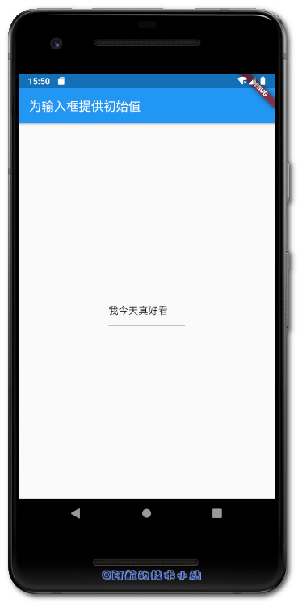

输入框也许是最常用的表单项了. 添加数据时我们直接使用空的输入框就可以了. 编辑的时候, 我们需要把旧的数据预先放在输入框内. 那么如何为其指定初始值呢? 本篇文章就来记录下Flutter如何指定TextField输入框(文本框)初始值(初始文字).

## 效果

有图有真相, 先来看一下我们的最终效果:

\[epcl\_box type="information"\]老规矩. 速度快的同学直接看下方的核心代码!\[/epcl\_box\]

## 应用场景

- 编辑数据使用的输入框
- 输入框提供默认数据

## 实战开始

### 方法一: TextField

创建一个dart文件, 内容为以下代码:

    `import 'package:flutter/material.dart';  void main() => runApp(MyApp());  class MyApp extends StatelessWidget {   @override   Widget build(BuildContext context) {     return MaterialApp(       title: 'Flutter Demo',       theme: ThemeData(         primarySwatch: Colors.blue,       ),       home: MyHomePage(title: '为输入框提供初始值'),     );   } }  class MyHomePage extends StatefulWidget {   MyHomePage({Key key, this.title}) : super(key: key);   final String title;    @override   _MyHomePageState createState() => _MyHomePageState(); }  class _MyHomePageState extends State {    @override   Widget build(BuildContext context) {     return Scaffold(       appBar: AppBar(         title: Text(widget.title),       ),       body: Center(         child: Column(           mainAxisAlignment: MainAxisAlignment.center,           children: [             Container(               width: MediaQuery.of(context).size.width * 0.3,               child: TextField(                 controller: TextEditingController()..text="你今天真好看",               ),             )           ],         ),       ),     );   } }`

> 重点放在`TextField`内部. 我们为其`controller`参数赋值为`TextEditingController()..text="你今天真好看"`.
> 
> 💡 代码解析

🟢 运行项目, 查看效果:

### 方法二: TextFormField

创建一个dart文件, 替换文件为以下代码:

    `import 'package:flutter/material.dart';  void main() => runApp(MyApp());  class MyApp extends StatelessWidget {   @override   Widget build(BuildContext context) {     return MaterialApp(       title: 'Flutter Demo',       theme: ThemeData(         primarySwatch: Colors.blue,       ),       home: MyHomePage(title: '为输入框提供初始值'),     );   } }  class MyHomePage extends StatefulWidget {   MyHomePage({Key key, this.title}) : super(key: key);   final String title;    @override   _MyHomePageState createState() => _MyHomePageState(); }  class _MyHomePageState extends State {   @override   Widget build(BuildContext context) {     return Scaffold(       appBar: AppBar(         title: Text(widget.title),       ),       body: Center(         child: Column(           mainAxisAlignment: MainAxisAlignment.center,           children: [             Container(               width: MediaQuery.of(context).size.width * 0.3,               child: TextFormField(                 initialValue: "我今天真好看",               ),             ),           ],         ),       ),     );   } }`

> 重点在`TextFormField`. 其内置`initialValue`参数, 直接指定其值即可指定输入框初始值!
> 
> 💡 代码解析

🟢 运行项目, 查看效果:

## 核心代码

方法一: 此方法只针对于`TextField`:

    `TextField(   controller: TextEditingController()..text="你今天真好看", ),`

方法二: 此方法只针对于`TextFormField`:

    `TextFormField(   initialValue: "我今天真好看", )`

## 感谢

[How do I supply an initial value to a text field?](https://stackoverflow.com/questions/43214271/how-do-i-supply-an-initial-value-to-a-text-field)
