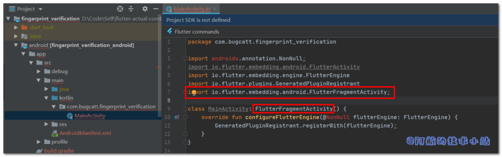
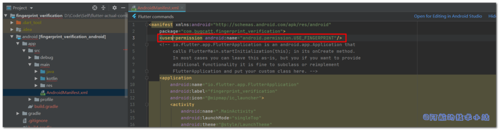
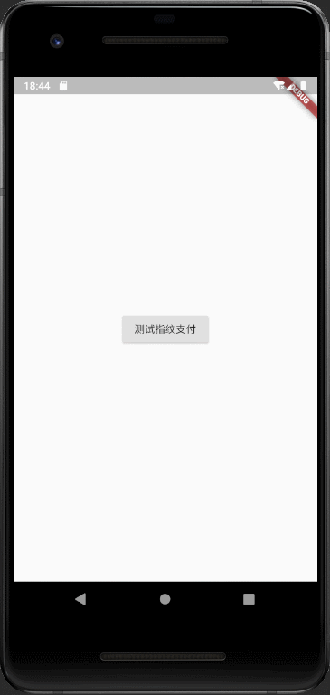

指纹验证/指纹识别 以及 人脸识别 是我们在平常使用各种APP时常用的功能, 这篇教程将使用第三方库 local\_auth 来实现 Flutter 中的指纹验证以及人脸识别.

* * *

## 效果

有图有真相, 我们本次要实现的最终效果如下:

<figure>


<figcaption>

指纹识别图片效果展示

</figcaption>

</figure>

## 仓库地址

全部代码均已上传至开源仓库(含完整注释):

- [Github](https://github.com/HarrisonQi/flutter-actual-combat-demo/tree/master/fingerprint_verification)
- [码云](https://gitee.com/HarrisonQI/flutter-actual-combat-demo/tree/master/fingerprint_verification)

## 用途

这个在支付相关功能中最常见了, 用于二次验证当前操作者是否为本人. 当然, 有时我们保护的不仅是现金.

## 实战开始

### 导入第三方库: local\_auth

在`./lib/pubspec.yaml`中导入:

```
dependencies:
  local_auth: ^0.6.1+3
```

### 修改MainActivity

进入`./android/app/src/main/***/MainActivity.java`或`MainActivity.kt`,导入依赖:

```
import io.flutter.embedding.android.FlutterFragmentActivity;
```

修改:

```
class MainActivity: FlutterActivity() {
    override fun configureFlutterEngine(@NonNull flutterEngine: FlutterEngine) {
        GeneratedPluginRegistrant.registerWith(flutterEngine);
    }
}
```

为:

```
class MainActivity: FlutterFragmentActivity() {
    override fun configureFlutterEngine(@NonNull flutterEngine: FlutterEngine) {
        GeneratedPluginRegistrant.registerWith(flutterEngine);
    }
}
```

> 这里主要是修改了`FlutterActivity`为`FlutterFragmentActivity`

<figure>



<figcaption>

代码截图1

</figcaption>

</figure>

### AndroidManifest.xml增加权限

进入 `android/app/src/main/AndroidManifest.xml`, 在`<manifest>`中, 添加:

```
<uses-permission android:name="android.permission.USE_FINGERPRINT"/>
```

<figure>



<figcaption>

代码截图2

</figcaption>

</figure>

### Info.plist增加权限

进入`./ios/Runner/Info.plist`, 添加:

```
<key>NSFaceIDUsageDescription</key>
<string>Why is my app authenticating using face id?</string>
```

代码截图:

<figure>


<figcaption>

代码截图3

</figcaption>

</figure>

## 使用指纹验证

### 清理main.dart

替换`./lib/main.dart`内容为:

```
import 'package:flutter/material.dart';

void main() => runApp(MyApp());

class MyApp extends StatelessWidget {
  @override
  Widget build(BuildContext context) {
    return MaterialApp(
      title: 'Flutter Demo',
      home: MyHomePage(),
    );
  }
}

class MyHomePage extends StatefulWidget {
  MyHomePage({Key key}) : super(key: key);

  @override
  _MyHomePageState createState() => _MyHomePageState();
}

class _MyHomePageState extends State {
  @override
  Widget build(BuildContext context) {
    return Scaffold(
      body: Center(),
    );
  }
}
```

### 创建"指纹验证"工具类

创建`./lib/fingerprint_util.dart`.

导入:

```
import 'package:local_auth/auth_strings.dart';
import 'package:local_auth/local_auth.dart';
import 'package:flutter/services.dart';
import 'package:local_auth/error_codes.dart' as auth_error;
```

class内容:

```
class FingerPrintUtil {
  static Future checkTouchId() async {
    var localAuth = LocalAuthentication();

    // 检查设备是否允许
    bool canCheckBiometrics = await localAuth.canCheckBiometrics;

    print("设备是否允许: $canCheckBiometrics");

    var androidAuthStrings = AndroidAuthMessages(
      // 用户未设置指纹时, 弹窗的标题
      fingerprintRequiredTitle: "123",
      // 用户未设置指纹时, 弹窗的说明
      goToSettingsDescription: 'Please set up your Touch ID.',
      // 用户未设置指纹时, 弹窗的 "设置" 按钮
      goToSettingsButton: '去设置',
      // 验证指纹弹窗标题
      signInTitle: "安全检测",
      // 验证指纹弹窗副标题
      fingerprintHint: "请验证您的指纹",
      cancelButton: "取消",
    );

    try {
      bool didAuthenticate = await localAuth.authenticateWithBiometrics(
          androidAuthStrings: androidAuthStrings,
          // 验证指纹弹窗说明
          localizedReason: '验证以继续操作',
          // 设置为true后, 在返回应用程序后可继续进行验证 (如用户来了电话, 若为stickyAuth=false验证直接会失败)
          stickyAuth: true);

      print("didAuthenticate: $didAuthenticate");
    } on PlatformException catch (e) {
      print("e:$e");
      if (e.code == auth_error.notAvailable) {
        // todo 处理异常
      }
    }
  }
}
```

> 详细说明都在注释当中!

<figure>


<figcaption>

代码截图4

</figcaption>

</figure>

## 测试指纹验证

### main.dart中添加用于测试的按钮

打开`./lib/main.dart`, 导入我们刚才创建的工具类:

```
import 'package:fingerprint_verification/fingerprint_util.dart';
```

在`_MyHomePageState`的`build`函数中, 在`center`内添加一个child, 执行我们刚才创建的工具类:

```
child: RaisedButton(
  onPressed: ()=>FingerPrintUtil.checkTouchId(),
  child: Text("测试指纹支付"),
),
```

代码截图:

<figure>


<figcaption>

代码截图5

</figcaption>

</figure>

运行项目, 看看效果:

<figure>


<figcaption>

指纹识别图片效果展示

</figcaption>

</figure>

### 情况: 设备不支持指纹识别

如果你的设备不支持指纹验证、未设置指纹:



## 大功告成!

## 仓库地址

全部代码均已上传至开源仓库(含完整注释):

- [Github](https://github.com/HarrisonQi/flutter-actual-combat-demo/tree/master/fingerprint_verification)
- [码云](https://gitee.com/HarrisonQI/flutter-actual-combat-demo/tree/master/fingerprint_verification)

若有任何问题, 欢迎在下方评论区留言, 作者会尽可能回复! 更多技术干货, 请访问[阿航的技术小站主页](https://blog.bugcatt.com/)
