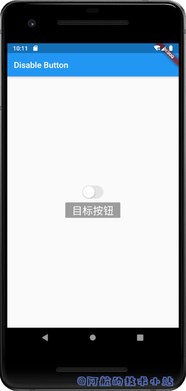
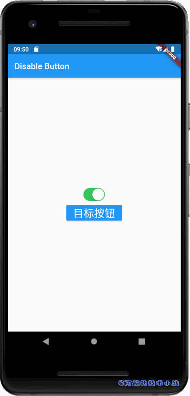
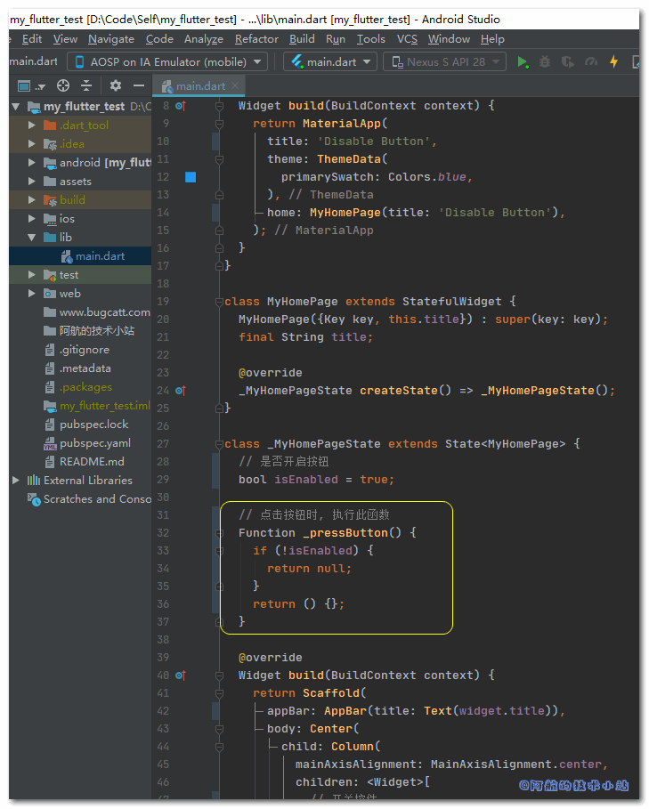
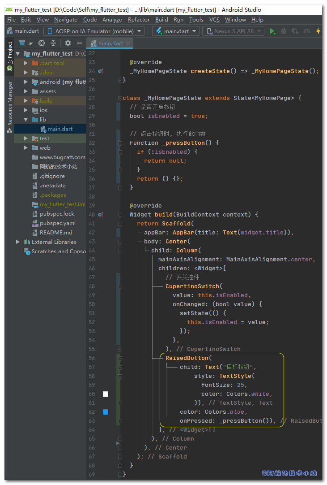

某些情况下我们需要禁用某个按钮的点击事件. 通过灵活的按钮禁止状态切换可以实现很多实际需求. 本篇文章就来记录下Flutter如何禁用按钮以及禁止按钮点击.

## 效果

有图有真相, 先来看下我们的最终效果:



## 应用场景

- 用户权限不足, 禁止某些按钮点击.
- 用户表单未填完, 禁止下一步.
- 用户阅读相关条款至少X秒, 倒数结束前锁定按钮.

## 需具备的条件

- 你了解Flutter基础

本篇文章的环境:

| 环境 | 版本 |
| --- | --- |
| Windows | 10 |
| Android Studio | 3.5 |
| Flutter | 1.19.0-2.0.pre |

## 实战开始

### 准备工作

创建一个空项目.

删除`./test`目录.

替换`./lib/main.dart`为:

```
import 'package:flutter/cupertino.dart';
import 'package:flutter/material.dart';

void main() => runApp(MyApp());

class MyApp extends StatelessWidget {
  @override
  Widget build(BuildContext context) {
    return MaterialApp(
      title: 'Disable Button',
      theme: ThemeData(
        primarySwatch: Colors.blue,
      ),
      home: MyHomePage(title: 'Disable Button'),
    );
  }
}

class MyHomePage extends StatefulWidget {
  MyHomePage({Key key, this.title}) : super(key: key);
  final String title;

  @override
  _MyHomePageState createState() => _MyHomePageState();
}

class _MyHomePageState extends State {

  // 是否开启按钮
  bool isEnabled = true;

  @override
  Widget build(BuildContext context) {
    return Scaffold(
      appBar: AppBar(title: Text(widget.title)),
      body: Center(
        child: Column(
          mainAxisAlignment: MainAxisAlignment.center,
          children: [

            // 开关控件
            CupertinoSwitch(
              value: this.isEnabled,
              onChanged: (bool value) {
                setState(() {
                  this.isEnabled = value;
                });
              },
            ),
            RaisedButton(child: Text("目标按钮", style: TextStyle(fontSize: 25,color: Colors.white)), color: Colors.blue,onPressed: (){}),
          ],
        ),
      ),
    );
  }
}
```

🟢 运行项目, 应该会出现一个开关控件和一个"目标按钮":



### 定义按钮触发函数

> 我们的目标:
> 
> 通过切换开关状态来控制按钮禁用状态

我们在`_MyHomePageState`中定义一个函数:

```
// 点击按钮时, 执行此函数
Function _pressButton(){
  if(!isEnabled){return null;}
  return (){};
}
```

<figure>



<figcaption>

代码截图

</figcaption>

</figure>

> 此函数的返回类型为`Function`. 顾名思义, 它返回的是一个函数. 我们在函数内部进行判断, 若`isEnabled`为`false`, 返回null值. 否则返回一个匿名空函数.
> 
> 💡 代码解析

### 目标按钮绑定函数

修改下面的`RaisedButton`函数:

```
RaisedButton(
    child: Text("目标按钮",
        style: TextStyle(fontSize: 25, color: Colors.white)),
    color: Colors.blue,
    onPressed: _pressButton()),
```

<figure>



<figcaption>

代码截图

</figcaption>

</figure>

> 我们将`onPressed`的入参修改为`_pressButton()`, 将在点击按钮时触发该函数.
> 
> 💡 代码解析

## 大功告成

🟢 运行项目, 看看效果:


## 核心思路

将按钮的`onPress()`传入null值, 就可达到禁用按钮的效果.

## 感谢

[How do I disable a Button in Flutter?](https://stackoverflow.com/questions/49351648/how-do-i-disable-a-button-in-flutter)
