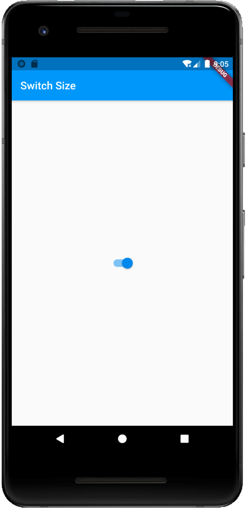
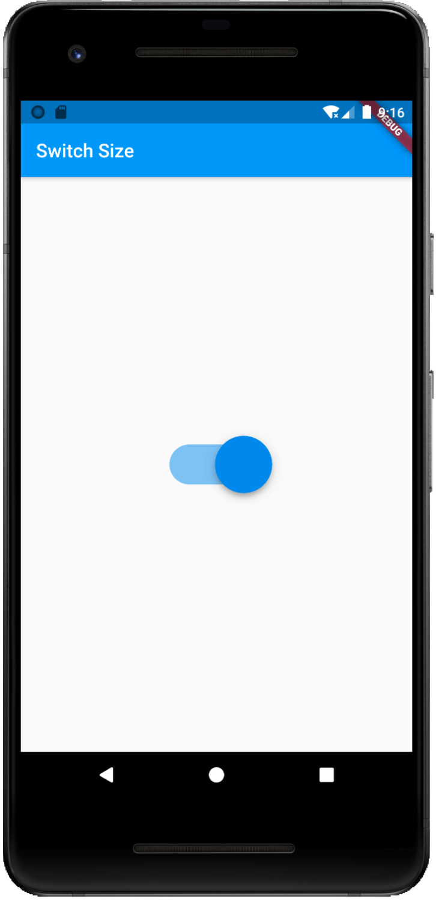

默认的Switch组件并没有提供类似`Size`或者`Height`,`Weight`等参数。本篇文章就来记录下Flutter如何调整Switch组件尺寸。

## 实战开始

### 普通的Switch

通常，我们声明一个Switch组件会这样写。运行以下代码：

    ` import 'package:flutter/material.dart';  void main() => runApp(MyApp());  class MyApp extends StatelessWidget {   @override   Widget build(BuildContext context) {     return MaterialApp(       title: 'Switch Size',       home: MyHomePage(),     );   } }  class MyHomePage extends StatefulWidget {   MyHomePage({Key key}) : super(key: key);    @override   _MyHomePageState createState() => _MyHomePageState(); }  class _MyHomePageState extends State {   bool _enabled = true;    @override   Widget build(BuildContext context) {     return Scaffold(         appBar: AppBar(           title: Text('Switch Size'),         ),         body: Center(           child: Column(             mainAxisAlignment: MainAxisAlignment.center,             children: [               Switch(                   value: _enabled,                   onChanged: (bool) {                     _enabled = bool;                     setState(() {});                   }),             ],           ),         ));   } }`

🟢 运行项目, 可以看到一个朴实无华的Switch：

<figure>

<figcaption>

普通Switch

</figcaption>

</figure>

### 使用Transform

接下来就是干货了。我们来让它变大！

替换：

    ` Switch(     value: _enabled,     onChanged: (bool) {       _enabled = bool;       setState(() {});     }),`

为：

    ` Transform.scale(   scale: 3.0,   child: Switch(       value: _enabled,       onChanged: (bool) {         _enabled = bool;         setState(() {});       }), )`

> 我们为Switch套上了一层`Transform.scale`，并指定其`scale`属性为3.0。也就是我们将其尺寸扩大3倍。
> 
> 💡 代码解析

🟢 运行项目，可以看到一个很大的Switch出现在屏幕上了！

\[epcl\_box type="success"\]至此，我们成功的放大了Switch组件！\[/epcl\_box\]
