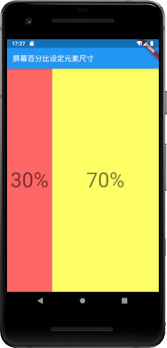
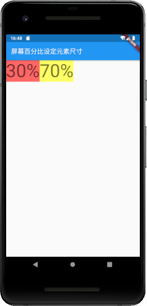
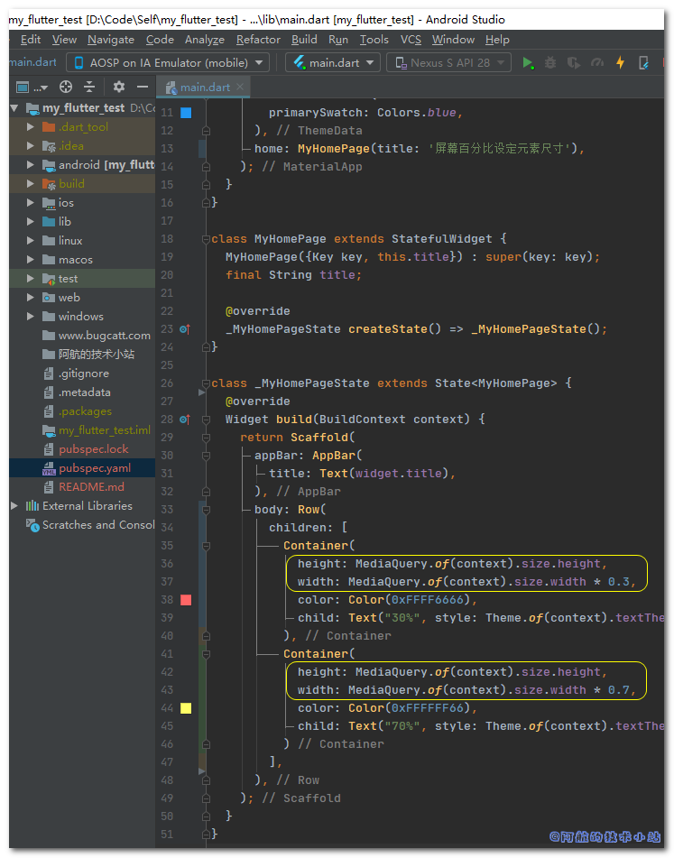
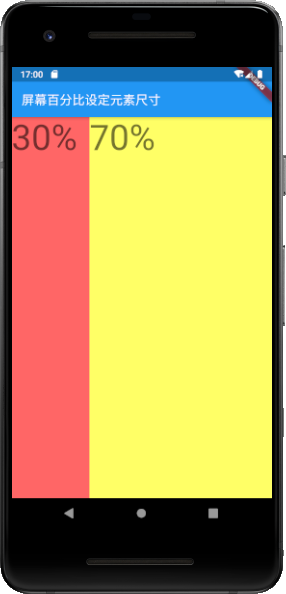
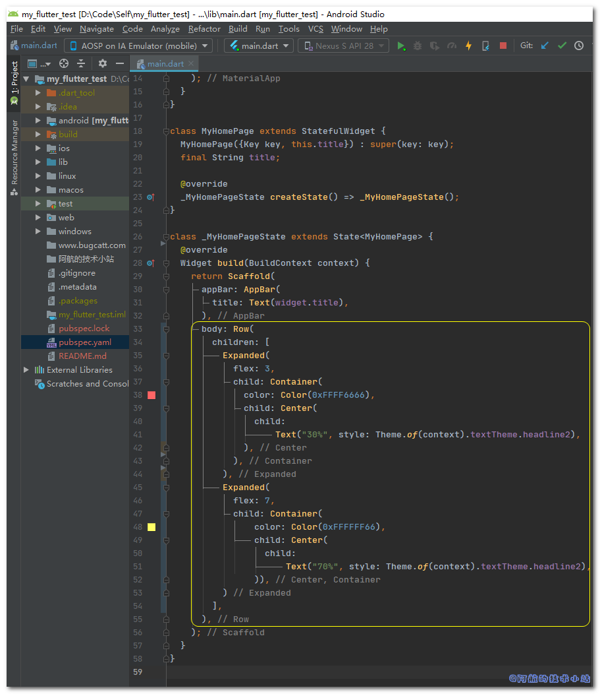

最让前端开发人员头疼的问题之一就是屏幕尺寸兼容性问题了. Web端开发人员经常会对测试人员说: "换个浏览器试一下".😂 虽然现在的主流的屏幕大小非常相似, 但是我们也要事先处理好. 本篇文章就来记录Flutter如何根据屏幕尺寸(宽度/高度)的百分比设定元素(小部件/组件/Widget)尺寸.

## 效果

有图有真相, 先来看一下效果:

## 需具备的条件

- 你掌握Flutter基础.
- 你了解基础的Flutter布局.

本篇文章的开发环境:

<table class=""><tbody><tr><td>操作系统</td><td>Windows 10.0.18362.900</td></tr><tr><td>Flutter</td><td>1.20.0-2.0.pre</td></tr></tbody></table>

\[epcl\_box type="information"\]老规矩, 速度快的同学直接看最下方的核心代码!\[/epcl\_box\]

## 实战开始

### 准备工作

创建一个Flutter项目, 替换`main.dart`为:

    `import 'package:flutter/material.dart';  void main() => runApp(MyApp());  class MyApp extends StatelessWidget {   @override   Widget build(BuildContext context) {     return MaterialApp(       title: 'Flutter Demo',       theme: ThemeData(         primarySwatch: Colors.blue,       ),       home: MyHomePage(title: '屏幕百分比设定元素尺寸'),     );   } }  class MyHomePage extends StatefulWidget {   MyHomePage({Key key, this.title}) : super(key: key);   final String title;    @override   _MyHomePageState createState() => _MyHomePageState(); }  class _MyHomePageState extends State<MyHomePage> {    @override   Widget build(BuildContext context) {     return Scaffold(       appBar: AppBar(         title: Text(widget.title),       ),       body: Row(         children: [           Container(             color: Color(0xFFFF6666),             child: Text("30%", style: Theme.of(context).textTheme.headline2,),           ),           Container(             color: Color(0xFFFFFF66),             child: Text("70%", style: Theme.of(context).textTheme.headline2,),           )         ],       ),     );   } }`

🟢 运行项目, 应该是这样的:

> 重点在`Row`内. 我们创建了两个`Container`, 并分别使用`30%`和`70%`文字进行标识. 我们的目标就是通过处理, 使两个Container各自的宽高占据正确的空间.
> 
> 💡 代码解析

### 方法一: 获取屏幕尺寸

在第一个`Container`内添加:

    `height: MediaQuery.of(context).size.height, width: MediaQuery.of(context).size.width * 0.3,`

在第二个`Container`内添加:

    `height: MediaQuery.of(context).size.height, width: MediaQuery.of(context).size.width * 0.7,`

<figure>

<figcaption>

代码截图

</figcaption>

</figure>

> 核心就是`MediaQuery._of_(context).size`我们通过该函数分别获取屏幕宽高, 并且乘以相应的比例. 并将计算出的数值赋给`Container`的宽高.
> 
> 💡 代码解析

🟢 运行项目, 效果应该是这样的:

\[epcl\_box type="success"\]很明显, 它们的高度均和屏幕高度一致. 它们的宽度变成了正确的比例. 成功搞定!\[/epcl\_box\]

### 方法二: 使用Expanded.Flex

如果你使用过其他方法, 请先恢复你的代码为**准备工作**步骤的代码.

替换整个body的入参为:

    `body: Row(   children: [     Expanded(       flex: 3,       child: Container(color: Color(0xFFFF6666), child: Center(child: Text("30%", style: Theme.of(context).textTheme.headline2,),),),     ),     Expanded(       flex: 7,       child: Container(color: Color(0xFFFFFF66), child: Center(child: Text("70%", style: Theme.of(context).textTheme.headline2,),)),     )   ], ),`

> 这里的核心就是使用了`Expanded` 的`flex`属性进行分块. 在同一`Row`内传入多个`Expanded`并指定它们的`flex`属性, Flutter将自动设置它们的宽/高.
> 
> 💡 代码解析

<figure>

<figcaption>

代码截图

</figcaption>

</figure>

🟢 运行项目, 查看效果:

\[epcl\_box type="success"\]这个方案虽然代码较多, 但是我们只需要传入相应的比例即可. 方便维护.\[/epcl\_box\]

### 其他方案

使用`FractionallySizedBox`同样可以实现类似的效果. 但是阿航测试后, 发现代码较多, 并非一个良好的解决方案. 所以这里就不记录demo了. 感兴趣的同学可以自行研究.

## 感谢

[Sizing elements to percentage of screen width/height](https://stackoverflow.com/questions/43122113/sizing-elements-to-percentage-of-screen-width-height)
